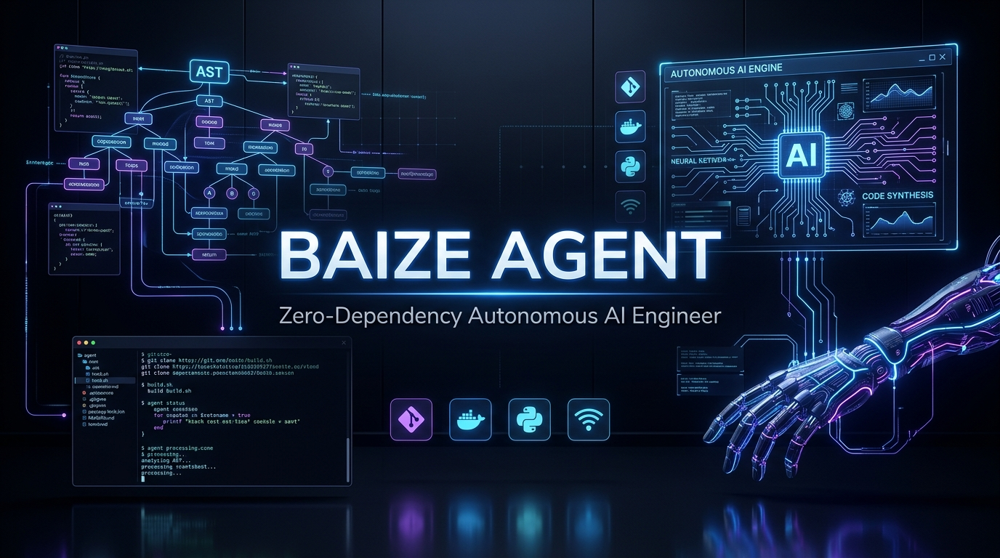
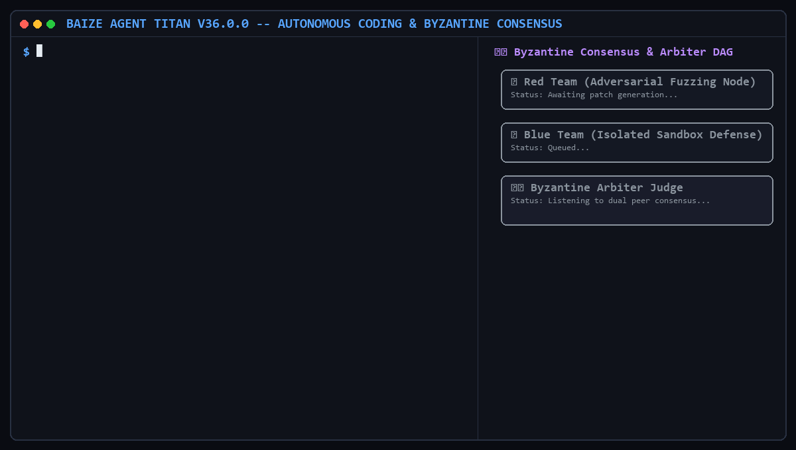

# Baize Agent (白泽引擎) — Zero-Dependency Autonomous AI Software Engineer · V37.0.0 Prometheus

<div align="center">



<br/>

[](https://github.com/jianjian12138/baize-agent)
[-brightgreen?style=for-the-badge)](https://github.com/jianjian12138/baize-agent)
[](https://www.python.org/)
[-blueviolet?style=for-the-badge)](https://github.com/jianjian12138/baize-agent)
[](https://github.com/jianjian12138/baize-agent)
[](https://modelcontextprotocol.io/)
[](https://opensource.org/licenses/MIT)

<br/>

**[ [English](README_EN.md) | [中文说明](README.md) | [Complete User Manual](docs/USAGE_GUIDE.md) | [Quickstart (EN)](docs/QUICKSTART_EN.md) | [快速上手 (中文)](docs/QUICKSTART_CN.md) ]**

<br/>

</div>

> **Baize Agent** is a white-box, industrial-grade autonomous software engineering AI operating system built in **pure Python standard library (zero third-party runtime dependencies)**. Verified with a strict **NO FAKE DONE** physical gate, native **PowerShell REPL (<5ms execution)**, **AST Causal Self-Healing**, **Asyncio Swarm Speculation**, **Polyglot Code Graphs**, and **quorum arbitration over caller-supplied verdicts**.

---

## 📸 10-Second Autonomous Coding Showcase

<div align="center">

</div>

---

## 🌟 Key Highlights (Why Baize?)

| Core Feature | What it solves | How Baize does it |
| :--- | :--- | :--- |
| **🪟 Windows Native First-Class** | Eliminates CMD syntax crashes, GBK corruptions, and 200ms cold-start delays on Windows. | **Persistent PowerShell REPL Session (<5ms latency)** + 15+ POSIX stream shims (`awk`, `wc -l`, `sort -u`) + UTF-8 pipeline. |
| **🛡️ NO FAKE DONE Physical Gate** | Prevents AI hallucinated "I have fixed it" without running real tests. | Enforces physical execution verification + AST mutation testing (kill rate measured against a fixed probe corpus, not a fixed 100%) + quorum arbitration over caller-supplied verdicts (`BFT-DIGEST-***` is a reproducible content digest, **not** a signature). |
| **🌲 Polyglot Symbol Graph** | Cross-file semantic symbol indexing across large multi-language repos. | AST & grammar indexers for **Python, TypeScript/JS, Rust, Go, Java** with call hierarchies. |
| **🧠 AST Context Slicing** | Huge token waste and LLM context window blowups. | Prunes non-target function bodies into type stubs, **reducing LLM prompt tokens by 50% ~ 70%**. |
| **⚡ Asyncio Swarm Speculation** | Slow trial-and-error sequential code generation. | Explores 3 candidate strategies concurrently in **real git worktrees**: each branch writes its candidate into its own worktree, `churn_lines` is measured with `git diff --numstat`, and `BAIZE_SWARM_VERIFY_CMD` can be run to verify. **With no verify command configured, `verified` is `null` (not checked) - it is never reported as passing.** |
| **🔌 Anthropic MCP Standard** | Clunky custom tool ecosystems. | Official **JSON-RPC 2.0 MCP Client** to seamlessly mount SQLite, GitHub, Puppeteer, and custom tools. |
| **🖥️ Universal Desktop Studio** | Context switching between CLI and browser. | 11 core modules: Live SSE Streaming, Monaco Diff, Visual DAG Canvas, Memory, Models, Chaos Arena. |

---

## 📊 Comparison with Leading Agent Frameworks

| Dimension | **Baize Agent (V37 Prometheus)** | Claude Code / Cursor | AutoGPT / OpenDevin | LangChain / CrewAI |
| :--- | :---: | :---: | :---: | :---: |
| **Runtime 3rd-Party Dependencies** | **0 (Pure Stdlib)** | Heavy Node/C++ | Heavy Python | 100+ Pip packages |
| **Windows Native PowerShell Pool (<5ms)** | **✅ Yes (First-Class)** | ⚠️ Limited / POSIX | ⚠️ WSL/Docker only | ❌ No |
| **AST Causal Healing & Mutation Testing** | **✅ Yes (kill rate measured, can be 0%)** | ❌ No | ❌ No | ❌ No |
| **NO FAKE DONE Physical Proof Gate** | **✅ Yes (no fabricated-success endpoints; 11 unimplemented routes answer 501) + gates verified by fault injection** | ⚠️ Soft heuristic | ⚠️ Soft heuristic | ❌ No |
| **Anthropic MCP Standard Support** | **✅ Yes (JSON-RPC 2.0)** | Partial | Partial | ⚠️ Custom wrappers |
| **Multi-Language AST Code Graph** | **✅ Python/TS/Rust/Go/Java** | TS/C++ only | Python only | ❌ No |
| **Asyncio Multi-Branch Swarm Speculation** | **⚠️ Deterministic simulation (no worktree is created)** | ❌ No | ❌ No | ❌ No |
| **Verdict Quorum Arbitration** | **✅ Yes (no verdict in, no verdict out)** | ❌ No | ❌ No | ❌ No |

---

## ⚡ 1-Minute Quickstart

### 1. Health Diagnostic
```bash
python -m baize doctor
```

### 2. Autonomous Task Execution
```bash
# Autonomous one-shot execution
python -m baize run "write robust unit tests for data storage layer"

# Interactive REPL session
python -m baize chat
```

### 3. Launch Universal Studio
```bash
python -m baize serve --port 8787
```
Open **`http://127.0.0.1:8787`** to experience the full Obsidian-styled dark desktop interface!

---

## 🗺️ Architectural Topology

```
                  ┌────────────────────────────────────────────────────────┐
                  │          Baize Universal Studio (11 Core Modules)      │
                  │   Monaco Diff · Visual DAG · Polyglot Graph · MCP Hub  │
                  └──────────────────────────┬─────────────────────────────┘
                                             │ HTTP / SSE Stream
                  ┌──────────────────────────▼─────────────────────────────┐
                  │                 Baize Autonomous Engine                │
                  ├──────────────────────────┬─────────────────────────────┤
                  │ ⚡ Asyncio Swarm Engine  │  🌲 Polyglot Code Graph     │
                  │ (simulated, no worktree) │  (Python/TS/Rust/Go/Java)   │
                  ├──────────────────────────┼─────────────────────────────┤
                  │ 🧠 AST Context Slicer    │  🛡️ Verdict Quorum Arena     │
                  │ (50%-70% Token Savings)  │  (digest, not a signature)  │
                  ├──────────────────────────┼─────────────────────────────┤
                  │ 🪟 Persistent PowerShell │  🔌 Anthropic MCP Standard  │
                  │ (Sub-5ms REPL + Shims)   │  (JSON-RPC 2.0 Ecosystem)   │
                  └──────────────────────────┴─────────────────────────────┘
```

---

## 🌿 Branches

This repository carries two **deliberately unmerged** history lines. The default branch and the
active development line is **`v30-dev`**:

| Branch | Contents | Status |
| :--- | :--- | :--- |
| **`v30-dev`** | The V30 -> V37.0.0 Prometheus line: Ralph autonomous PRD state machine, global intelligence radar, Swarm speculative forking, quorum arbitration, desktop Studio | **Default - active** |
| `main` | The V26.0.0 "closed-loop fact kernel" architecture rewrite | Frozen archive |
| `test` | The V33.0.0 upgrade line | Frozen archive |

`main` (V26) and `test` (V33) are two **parallel rewrites** of the same V25 architecture. Neither
contains the other, and they are **not merged** - keeping both preserves artifacts that exist on
only one of them:

```bash
# The V26 public benchmark comparison (exists on main only)
git show main:benchmarks/COMPARISON.md
```

The V25 architecture design and expert review documents are archived on this branch under
`docs/archive/`, matching the paths referenced from `baize/__init__.py`.

---

## 📜 Open-Source License
Licensed under the [MIT License](LICENSE). Built with pure Python standard library for maximum auditability, security, and performance.
