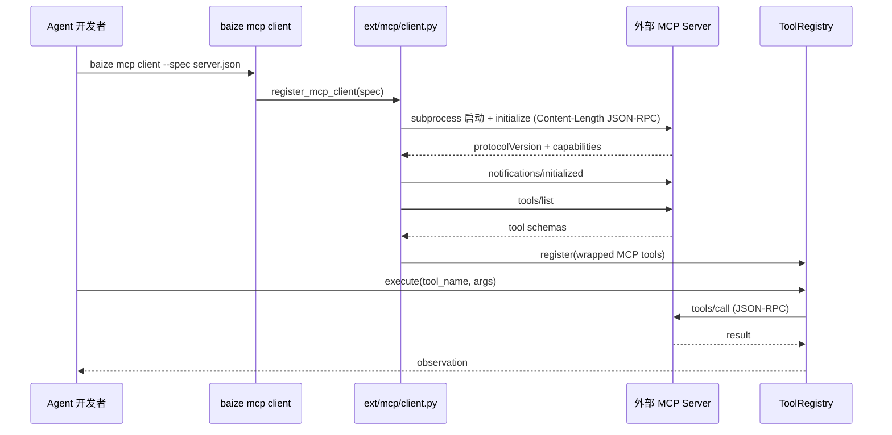
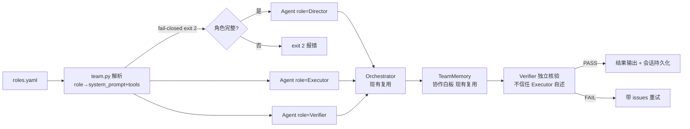
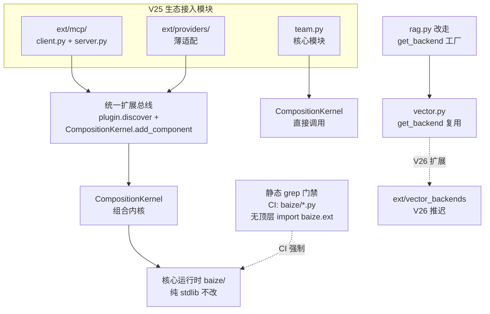

# AICoding 架构设计 · UserStory

> 本文档为《AICoding 架构设计》核心产物之一，定位为**产品需求与用户故事（UserStory）**。
> 上游输入：《高层架构设计》（G3 已通过，含 V25 升级范围/MVP F1-F7/五类角色/业务架构与闭环/红线 A-E/退出标准）+ `material_digest.md`（G1 已通过，含 Baize V24.0.0 资料摘要 D1-D20/冲突 X1-X7/约束红线）；
> 下游输出：驱动《系统设计》《部署设计》《安全设计》的具体功能实现。

> **工具说明**：复用《高层架构设计》的需求边界（§6.1）、产品模块全景图（§6.2）、功能清单（§6.3）、产品原型（§6.4-§6.5）的冻结结果，将其转译为角色场景 + 验收标准 + 非功能需求的 UserStory 表达。

---

## 1. 业务背景与价值

### 1.1 业务背景

- **当前业务现状**：Baize Agent V24.0.0 是纯 Python 标准库、零第三方运行时依赖的白盒工程化自主 Agent 运行时，已完成系统瘦身与统一化（422 passed / 1 skipped / 0 failed，gate quality 0.875 PASS），但 GitHub 可见性极低（star=1，forks=0，topics=空），且 MCP 兼容为真缺口（V24 瘦身已删除 mcp.py，manifest V69=skipped）。核心运行时 baize/ 40 个纯 stdlib 模块全部复用不改，体积 ~468KB，审计面极小（高层架构 §1.1 / material_digest D1 §状态与验证 / D7 §驱动背景）。
- **触发本次需求的事件**：用户诉求"启动 AICoding 架构专家团，分析我们 agent，并给出升级计划"——MCP 已成 2025 年事实标准（97M 月下载、10K+ 活跃 server、跨厂商采纳，2025-12 捐赠 Linux Foundation AAIF），同基因竞品 Hermes Agent（232k stars + MCP 内置）正在快速占领赛道，Baize 若不接入 MCP 生态将彻底边缘化（高层架构 §1.1 / research_report §2.3 / R-06）。
- **本系统在产品矩阵中的位置**：本次升级是**既有 Agent 运行时（V24.0.0）的生态接入 + 可见性增强**，目标版本 25.0.0（经中间确认裁决，高层架构附录 C.1），不新建系统、不破坏零依赖红线。在保持核心 `baize/` 纯 stdlib 的前提下，通过 `baize/ext/` 延迟 import + fail-closed 机制接入 MCP 生态、补齐多智能体薄配置层、修补供应商适配器真实缺口，同时修正文档/版本号陈旧问题恢复技术资产可见性（高层架构 §1.1 / §4.1）。

### 1.2 行业方案

> MCP 生态接入与可见性增强领域的行业标杆系统及解决方案。

| 标杆系统 | 厂商 / 来源 | 方案亮点 | 对 Baize V25 的参考价值 | 来源 |
| --- | --- | --- | --- | --- |
| LangChain | langchain-ai | MCP 适配器模式：langchain-mcp-adapters 将 MCP server 包装为 ToolRegistry 工具，支持 stdio/SSE/streamable_http | 直接借鉴到 Baize F3 的 register_mcp_client→ToolRegistry 路径 | 高层架构 §3.1 / research_report §2.3 |
| Hermes Agent | NousResearch | MCP 配置化集成（数行配置接入外部 server），同基因（Python/自进化技能/JSONL 会话） | ext/fail-closed 理念高度契合，借鉴成本低 | 高层架构 §3.1 / research_report §2.3 |
| CrewAI | crewAIInc | 角色制定模式：Crews（角色制）+ Flows（事件驱动）+ role→system_prompt+tools 映射 | 对 F4 多智能体薄配置层有直接参考（roles.yaml→Agent(role=...)） | 高层架构 §3.2 / D8 §P5 |
| Dify | langgenius | MCP 双向模式（client + server）+ 可视化工作流 | 借鉴 MCP 双向模式（Baize F3 需 client+server）；不借鉴可视化技术栈 | 高层架构 §3.2 / research_report §2.3 |
| DeepSeek Harness | deepseek-ai | "一切皆插件"统一扩展总线收口思路 | 与 D8 §统一收口建议一致，借鉴到 F6 统一扩展总线收口 | 高层架构 §3.2 / D8 §统一收口 |

> **关键结论**（高层架构 §3.2）：优先借鉴 LangChain + Hermes Agent 的 MCP 集成模式；部分借鉴 CrewAI 角色定义模式 + DSH 扩展总线思路；不借鉴 AutoGPT（重依赖+无可验证门禁，定性否决）。零依赖维度 Baize 5/5 为唯一满分——V25 要解决的短板是 MCP 兼容 + GitHub 可见性，而非整体劣于竞品。

### 1.3 方案收益与价值

> 对齐高层架构 §1.3 价值主张，量化收益目标。

| 价值维度 | 功能模块 | 预期价值收益 | 量化标准 | 当前值 | 目标值 | 截止时间 | 来源 |
| --- | --- | --- | --- | --- | --- | --- | --- |
| 效率 | F3 MCP 兼容（client+server） | Baize 可调用外部 MCP server 工具 + 暴露自身 skills 给 Claude Desktop/Cursor | 真实联调通过的 MCP server 数 | 0（V24 已删 mcp.py，V69 skipped） | ≥ 1 个真实参考 server（如 Anthropic 官方 filesystem MCP server）联调通过 | V25 MVP 上线 | 高层架构 §1.3 效率行 / §2.3 V1 |
| 合规 | F5 供应商补丁 | provider_capabilities 如实上报各供应商真实能力，消除假绿 | provider_capabilities 返回值与实际能力一致率 | 0%（恒返 stream/tools=True） | 100%（每个供应商如实报 stream/tools 布尔值） | V25 MVP 上线 | 高层架构 §1.3 合规行 / §2.3 V5 / D8 §P3 |
| 收入 | F1 元数据止血 + F2 README 重写 | GitHub 可见性改善后技术资产可被发现，吸引目标用户（安全/审计/嵌入敏感场景） | GitHub stargazers 数 | 1（star=1，forks=0） | ≥ 50（V25 上线后 3 个月） | V25 上线后 3 月 | 高层架构 §1.3 收入行 / §2.3 V2 / D7 §驱动背景 |
| 成本 | F6 统一扩展总线 + F7 ext 测试守卫 | MCP 兼容纯 stdlib 实现，不引入第三方运行时依赖 | 运行时第三方依赖数 | 0（dependencies=[]） | 0（红线 A 不破，ext/ 延迟 import + fail-closed） | V25 MVP 上线 | 高层架构 §1.3 成本行 / §2.3 V4 / D3 §dependencies |
| 体验 | F2 README 重写 + 文档/版本号统一 | 文档/版本号全量统一，消除陈旧误导 | 文档版本号与现行版本一致率 | ~40%（Dockerfile LABEL 20.0.0 / .env.example 头 V19 / 操作手册 V19 / benchmarks V19） | 100%（全部文档/镜像/配置头部版本号统一为 V25） | V25 MVP 上线 | 高层架构 §1.3 体验行 / §2.3 V3 / D7 P1 / X3 |

### 1.4 术语清单

> 统一文档中专有名词的中英文对照与含义，与 system-architect 术语表对齐。

| 术语 | 英文/原文 | 含义 | 来源 |
| --- | --- | --- | --- |
| MCP | Model Context Protocol | 2025 年事实标准的 AI 工具调用协议，JSON-RPC 2.0 over stdio，支持 client 调用外部 server + server 暴露工具给外部 client | 高层架构 §1.1 / research_report §2.3 |
| NO FAKE DONE | No Fake Done | Baize 核心原则：done 必须有物理 evidence + Verifier 独立核验 + chaos 注入真实故障，不假绿 | D1 §核心原则① / 高层架构 红线 B |
| fail-closed | Fail-closed | 安全设计原则：缺失/错误时关闭而非放行（如未配置模型 exit 2、ext 缺失跳过不崩、deny-list 命中拒绝） | D1 §核心原则⑤⑦ / 高层架构 红线 C/E |
| ext/ | baize/ext/ | V25 新增的生态接入扩展层，核心不默认 import，仅按需延迟加载，缺失 fail-closed | 高层架构 §4.3 / D1 §V25 / D8 §统一收口 |
| ToolRegistry | Tool Registry | baize/tools.py 进程级单例工具注册表，9 原语 + SDK 运行时扩展，MCP 工具包装进此注册表 | D4 §内核-tools / D5 baize-tools spec / D8 §P2 修正② |
| CompositionKernel | Composition Kernel | baize/component.py 统一组件契约，9 类 Kind 配置驱动装配，V25 统一扩展总线收口到此路径 | D4 §组合内核 / D13 教程08 / 高层架构 §2.4 |
| Verifier | Verifier | orchestrator 三角色之一，独立取证（不信任 Executor 自述），fail 带 issues 重试 | D4 §内核-orchestrator / D5 baize-orchestrator spec |
| TeamMemory | Team Memory | baize/team_memory.py 协作记忆白板，跨角色共享上下文，F4 复用勿重写 | D4 §内核-team_memory / D8 §P5 |
| provider_capabilities | Provider Capabilities | llm.py 中上报各供应商真实能力（stream/tools 布尔值）的函数，V24 恒返 True 属假绿 | D8 §P3 修正② / 高层架构 §2.2 P5 |
| roles.yaml | Roles YAML | F4 多智能体薄配置层的角色清单文件，role→system_prompt+tools 映射 | 高层架构 §6.3 F6 / D8 §P5 / D7 §P5 |
| Content-Length 分帧 | Content-Length Framing | MCP 协议的 JSON-RPC 2.0 消息分帧机制，非纯换行 JSON，否则真实 server 静默挂起 | D8 §P2 修正① / 高层架构 §5.2 |
| initialize 握手 | Initialize Handshake | MCP 连接建立的协议步骤：protocolVersion 协商 + capabilities 交换 + notifications/initialized | D8 §P2 修正① / 高层架构 §5.2 |
| importorskip | pytest.importorskip | pytest 测试守卫机制：缺依赖时 skip 测试而非整批 collection 崩溃，保护 422 基线 | D8 §P4 修正③ / 高层架构 §4.3 / §6.3 F12 |
| 静态 grep 门禁 | Static Grep Gate | CI 强制检查：baize/*.py 无顶层 `import baize.ext`，防止核心污染 | D8 §P2 修正③ / 高层架构 §4.3 / §6.3 F11 |
| gate quality | Gate Quality Score | baize/gate.py 五维评分（runnable/coverage_clarity/composition/locatability/maintainability），V24 实测 0.875，V25 退出标准 ≥0.8 | D6 §4 / 高层架构 §4.3 |

---

## 2. 范围与边界

### 2.1 系统内模块及功能

> 对齐高层架构 §4.3 MVP F1-F7 + §6.1 In-Scope N1-N3，一级功能清单。

| 编号 | 一级模块 | 功能范围 | 来源 |
| --- | --- | --- | --- |
| F1 | 可见性管理 | GitHub 元数据止血：topics 补全（mcp/no-fake-done/white-box/auditable）+ 开 Discussions + 记录 before/after | 高层架构 §4.3 F1 / §6.1 F1 |
| F2 | 可见性管理 | README 重写 + 文档/版本号全量统一：修正误数 448→422 + 补 V24/V25 说明 + EN hero + Quick Start 3 步 + 覆盖率如实标 UNKNOWN + Dockerfile LABEL / .env.example 头部 / 操作手册 / benchmarks 版本号统一为 V25 | 高层架构 §4.3 F2 / §6.1 F2-F3 / §6.3 F2-F3/F13-F14 |
| F3 | MCP 兼容 | MCP 双向兼容：client（调外部 MCP server，包装进 ToolRegistry）+ server（暴露 baize skills 给 Claude Desktop/Cursor），纯 stdlib stdio JSON-RPC 2.0 Content-Length 分帧 + initialize 握手 | 高层架构 §4.3 F3 / §6.1 F4-F5 / §6.3 F4-F5 |
| F4 | 多智能体薄配置层 | team.py 角色配置：roles.yaml role→system_prompt+tools 映射为 Orchestrator Agent(role=...) 调用，复用 Verifier+TeamMemory | 高层架构 §4.3 F4 / §6.1 F6 / §6.3 F6 |
| F5 | 供应商补丁 | Anthropic 流式实装 + max_tokens 参数化 + DeepSeek reasoner reasoning_content 捕获 + provider_capabilities 如实上报 + ext/providers/ 仅放非 OpenAI 兼容厂商薄适配 | 高层架构 §4.3 F5 / §6.1 F7 / §6.3 F7-F9 |
| F6 | 统一扩展总线 | 收口到 plugin.discover + CompositionKernel.add_component + 静态 grep 门禁 CI 强制 + rag.py 改走 get_backend() | 高层架构 §4.3 F6 / §6.1 F8/F10-F11/F15 / §6.3 F10-F11/F15 |
| F7 | 质量门禁 | ext 测试守卫：pytest.importorskip + pyproject norecursedirs 补 ext | 高层架构 §4.3 F7 / §6.1 F9/F12 / §6.3 F12 |
| N1 | 红线约束 | 运行时第三方依赖数 = 0（红线 A 不破，ext/ 延迟 import + fail-closed） | 高层架构 §6.1 N1 |
| N2 | 红线约束 | pytest 422 passed / 1 skipped / 0 failed 基线不破（ext 测试 importorskip 守卫） | 高层架构 §6.1 N2 |
| N3 | 红线约束 | gate quality ≥ 0.8（threshold 0.7）+ doctor PASS + 静态 grep 门禁通过 | 高层架构 §6.1 N3 |

### 2.2 系统外模块及功能

> 当前系统**不覆盖**的功能，及其原因。对齐高层架构 §6.1 Out-of-Scope O1-O5。

| 编号 | 不做的事 | 原因 | 后续计划 | 来源 |
| --- | --- | --- | --- | --- |
| O1 | 稠密向量后端（llama_index/chromadb 语义检索） | 稠密后端引入重依赖违反红线 A；X7 确认 vector.py 已有 get_backend() 工厂另造 VectorBackend=两层平行抽象腐烂；D8 §P4 建议推迟 | V26：扩展 get_backend() 懒探测 ext/vector_backends + rag.py 改走 get_backend() + README 诚实标 lexical retrieval | 高层架构 §6.1 O1 |
| O2 | 非 OpenAI 兼容厂商重适配（gemini/bedrock 重后端） | V25 F5 降级为补丁（D8 §P3 修正③），既有 stdlib 适配器留 llm.py 不动，ext 只放薄适配；gemini/bedrock 重后端属 ext 大规模扩张 | V26：ext/providers/ 增 gemini/bedrock 薄适配 | 高层架构 §6.1 O2 |
| O3 | 核心运行时内核重写 / 架构重构 | V25 = 生态接入 + 可见性，大版本留 V26；核心 baize/ 永远纯 stdlib 不改（红线 A） | 不做（V26 亦不做内核重写，仅扩展 ext/） | 高层架构 §6.1 O3 |
| O4 | 可视化拖拽工作流 / 低代码编排 | Baize 定位为白盒工程化运行时，与 Dify 可视化工作流定位不同 | 不做（由 Dify 等平台承担） | 高层架构 §6.1 O4 |
| O5 | OS 级沙箱 / 多租户 / SaaS 化 | V25 范围为生态接入 + 可见性，OS 沙箱属安全增强，多租户/SaaS 化与个人/内部仓库定位不符 | 待业务确认（V26+ 视社区反馈） | 高层架构 §6.1 O5 |

### 2.3 外部依赖

> 对齐高层架构 §5.2 系统依赖架构，按依赖类型分类。

| 依赖系统 | 提供方 | 依赖能力 | 接入方式 | 接口人 | 同步/异步 | 关键约束 | 来源 |
| --- | --- | --- | --- | --- | --- | --- | --- |
| OpenAI 兼容 LLM 端点 | 用户自备（BAIZE_MODEL_BASE_URL/NAME/API_KEY） | chat-completions 推理 | HTTPS REST | 用户 | 同步 | 未配置 fail-closed exit 2；MAX_RETRIES 退避重试；速率限制+有界退避 | 高层架构 §5.2 |
| 外部 MCP server | 用户配置（baize mcp client） | MCP 工具调用（stdio JSON-RPC 2.0） | subprocess + 管道（纯 stdlib） | 用户 | 同步 | Content-Length 分帧 + initialize 握手，否则真实 server 静默挂起 | 高层架构 §5.2 / D8 §P2 修正① |
| 技能库路径 | 用户配置（SKILL_LIBRARY_PATHS） | 技能索引与检索 | 文件系统读取 | 用户 | 同步 | doctor 对缺失路径 fail；3 源去重 | 高层架构 §5.2 / D19 |
| Claude Desktop/Cursor 等 MCP client | 外部 MCP client | baize skills 暴露为 MCP server | stdio JSON-RPC 2.0（baize mcp server） | 外部 client | 同步 | 暴露 baize 原语工具为 MCP 工具；双向兼容 | 高层架构 §5.2 / D7 P2 |
| REST API 调用方 | 外部 HTTP client | Agent 运行/会话管理 | REST（baize serve :8787） | 外部 client | 同步 | 内建 REST 无额外网关；CORS fail-closed 若未设 | 高层架构 §5.2 / D19 |
| 规约包加载方 | Claude Code/Codex/WorkBuddy | 加载 AGENT.md/SKILL.md 规约 | 文件加载（非运行时调用） | 下游嵌入方 | N/A | 第一层规约与技能，不被运行时加载 | 高层架构 §5.2 / D1 §架构 |
| 核心运行时 baize/ | baize/ 40 模块（复用底座） | agent 循环/llm 客户端/tools 工具/orchestrator 编排 | 进程内调用 | Baize 核心团队 | 同步 | 纯 stdlib 不改（红线 A）；CI ast 扫描强制零依赖 | 高层架构 §5.2 / §2.4 |
| 组合内核 component/modes | baize/component.py + modes.py（复用底座） | 组件装配/命名模式 | CompositionKernel.add_component | Baize 核心团队 | 同步 | 9 类 Kind 封闭枚举；fail-closed | 高层架构 §5.2 / §2.4 |
| 工程化 plugin | baize/plugin.py（复用底座） | 扩展总线自动发现 | plugin.discover | Baize 核心团队 | 同步 | 自动发现=低信任，记录日志+跳过，绝不默认可信 | 高层架构 §5.2 / §2.4 / D13 教程08 |
| 校验与记忆 | baize/doctor+manifest+gate+memory（复用+新增门禁） | 环境门禁/证据核验/质量评分/持久记忆 | CLI 命令 | Baize 核心团队 | 同步 | manifest evidence 物理核验（红线 B）；gate quality 五维；422 基线不可破 | 高层架构 §5.2 / §2.4 |

---

## 3. 功能清单

> **定位**：全景骨架表，进入"角色 / 场景 / US"之前先看到完整功能版图。对齐高层架构 §6.3 功能清单 F1-F17，互查一致。

### 3.1 功能清单结构

| 编号 | 一级模块 | 二级模块 | 功能项 | 优先级（P0/P1/P2） | MVP 范围 | 完整版范围 | 对齐目标 | 备注 |
| --- | --- | --- | --- | --- | --- | --- | --- | --- |
| F1 | 可见性管理 | GitHub 元数据 | topics 补全（mcp/no-fake-done/white-box/auditable）+ 开 Discussions + 记录 before/after | P0 | ✅ | ✅ | V2 | 高层架构 §6.3 F1 |
| F2 | 可见性管理 | README 重写 | 修正误数 448→422 + 补 V24/V25 说明 + EN hero + Quick Start 3 步 + 覆盖率如实标 UNKNOWN | P0 | ✅ | ✅ | V3 | 高层架构 §6.3 F2 |
| F3 | 可见性管理 | 文档/版本号统一 | 操作手册/Dockerfile LABEL/.env.example 头部/benchmarks 全部统一为 V25 | P0 | ✅ | ✅ | V3 | 高层架构 §6.3 F3 |
| F4 | MCP 兼容 | MCP client（调外部 server） | 纯 stdlib stdio JSON-RPC 2.0 Content-Length 分帧 + initialize 握手 + 包装进 ToolRegistry | P0 | ✅ | ✅ | V1 | 高层架构 §6.3 F4 |
| F5 | MCP 兼容 | MCP server（暴露 baize skills） | baize mcp server 暴露 baize 原语工具为 MCP 工具给 Claude Desktop/Cursor | P0 | ✅ | ✅ | V1 | 高层架构 §6.3 F5 |
| F6 | 多智能体薄配置层 | team.py 角色配置 | roles.yaml role→system_prompt+tools 映射为 Orchestrator Agent(role=...) 调用，复用 Verifier+TeamMemory | P0 | ✅ | ✅ | V4 | 高层架构 §6.3 F6 |
| F7 | 供应商补丁 | Anthropic 流式实装 | Anthropic 供应商流式输出实装 + max_tokens 参数化（不再硬编码 4096） | P1 | ✅ | ✅ | V5 | 高层架构 §6.3 F7 |
| F8 | 供应商补丁 | DeepSeek reasoner 捕获 | DeepSeek reasoner 的 reasoning_content 字段捕获 | P1 | ✅ | ✅ | V5 | 高层架构 §6.3 F8 |
| F9 | 供应商补丁 | provider_capabilities 如实上报 | 每个供应商如实报 stream/tools 布尔值（如 Anthropic {"stream":false,"tools":true}） | P1 | ✅ | ✅ | V5 | 高层架构 §6.3 F9 |
| F10 | 统一扩展总线 | 收口到 plugin.discover + CompositionKernel | 全部生态接入经此路径，禁各阶段自起 import baize.ext.X | P0 | ✅ | ✅ | V4 | 高层架构 §6.3 F10 |
| F11 | 质量门禁 | 静态 grep 门禁 | CI 强制：baize/*.py 无顶层 import baize.ext（非运行时断言） | P0 | ✅ | ✅ | V4 | 高层架构 §6.3 F11 |
| F12 | 质量门禁 | ext 测试守卫 | pytest.importorskip + pyproject norecursedirs 补 ext | P0 | ✅ | ✅ | V4 | 高层架构 §6.3 F12 |
| F13 | 可见性管理 | benchmarks 对标行 | benchmarks/COMPARISON.md 加 baize 行（依赖数/启动时间/审计面/验证门禁/体积 468KB）+ 英文速览 | P1 | ✅ | ✅ | V2 | 高层架构 §6.3 F13 |
| F14 | 可见性管理 | examples 可运行示例 | 增 mcp_minimal / team_minimal / rag_backend 可运行示例 | P1 | ✅ | ✅ | V2 | 高层架构 §6.3 F14 |
| F15 | 数据层 | rag.py 改走 get_backend() | rag.py 不再直连 TfidfIndex，改走 vector.py get_backend() 工厂（修复 X7 双实现腐烂前置） | P1 | ✅ | ✅ | V4 | 高层架构 §6.3 F15 |
| F16 | 稠密向量后端 | 稠密向量语义检索 | 扩展 get_backend() 懒探测 ext/vector_backends（llama_index/chromadb 可选 import） | P2 | ❌ | ✅ | — | 高层架构 §6.3 F16（V26） |
| F17 | 供应商补丁 | 非 OpenAI 兼容厂商重适配 | ext/providers/ 增 gemini/bedrock 薄适配 | P2 | ❌ | ✅ | — | 高层架构 §6.3 F17（V26） |

> **互查一致性**：本表 F1-F17 与高层架构 §6.3 功能清单逐行一致；P0 功能（F1-F6/F10-F12）共 9 个全部 MVP ✅；F16-F17 推迟 V26 标记 ❌。每条功能可反向映射到高层架构 §2.5 功能缺口 + §2.3 期待目标。

---

## 4. 角色与场景

### 4.1 角色清单

> 对齐高层架构 §2.1 核心角色关注点，5 类角色全部覆盖。

| 角色 | 业务身份 | 主要操作 | 核心关注点 | 来源 |
| --- | --- | --- | --- | --- |
| 项目维护者（甲方决策者） | 个人/内部仓库 owner（jianjian12138） | 决策升级范围 / 审阅架构 / 推进 V25 落地 / 管理 GitHub repo 设置 | 技术资产可见性与生态定位——稀缺的零依赖+NO FAKE DONE 能力不可见（star=1），竞品 Hermes 232k stars 正在占领同基因赛道 | 高层架构 §2.1 行1 / D7 §驱动背景 / D1 §Why Baize |
| Agent 开发者（最终用户 A） | 使用 Baize 做安全/审计/嵌入敏感场景的开发者 | baize run / baize serve / baize mcp client / baize mcp server / baize team --roles / 自定义组件 / 接入 MCP server | MCP 兼容——竞品均已支持 MCP（LangChain/Dify/CrewAI/Hermes 均有），Baize V24 已删 mcp.py 无法对接 MCP 生态 | 高层架构 §2.1 行2 / research_report §2.3 / D8 §P2 |
| 安全/合规审计人员（最终用户 B） | 审计 Baize 运行时供应链安全与门禁可信度 | baize doctor / baize gate / 审查 manifest 证据 / 审计 baize/ 依赖 / 验证 ext 测试守卫 | 零依赖红线不可破——升级不得引入第三方运行时依赖，ext/ 必须 fail-closed，审计面须保持极小（~468KB stdlib） | 高层架构 §2.1 行3 / material_digest 红线 A / D1 §核心原则⑧ / D9 §4① |
| 开源社区贡献者（受影响方） | 潜在 GitHub 贡献者 / 技能生态扩展者 | 阅读 README / clone / baize index build / 写组件 / 贡献技能 | 文档准确性与可上手性——多文档版本号陈旧（V19/V20）、README 有误数（448→422）、覆盖率口径矛盾（UNKNOWN vs CI 80% 门槛），误导新贡献者 | 高层架构 §2.1 行4 / material_digest X2/X3/X4/X5 / D7 P1 |
| 下游嵌入方（受影响方） | 将 Baize 作为规约包加载的 Claude Code/Codex/WorkBuddy 等 | 加载 AGENT.md/SKILL.md / baize serve REST / baize mcp server | 扩展总线一致性——F2-F5 若各自 import baize.ext.X 会把 plugin/component 扩展机制碎成平行山头，嵌入方无法统一对接 | 高层架构 §2.1 行5 / D8 §统一收口 / D4 §组合内核 |

### 4.2 关键场景清单

> 每个场景对应 F1-F7（高层架构 §4.3 分组）中的一项功能。

| 编号 | 角色 | 触发条件 | 期望结果 | 频率 | 对齐功能 | 来源 |
| --- | --- | --- | --- | --- | --- | --- |
| SC-1 | 项目维护者 | 发现 GitHub star=1、topics=空、description 写 V19，技术资产不可见 | topics ≥10（含 mcp/no-fake-done/white-box/auditable）+ 开 Discussions + before/after 记录 | 一次性（V25 发布时） | F1 元数据止血 | 高层架构 §6.3 F1 / §2.3 V2 |
| SC-2 | 开源社区贡献者 | clone repo 后阅读 README 发现误数 448→422、覆盖率矛盾、版本号陈旧 | README 修正为 422/1skip/0fail + UNKNOWN 如实标 + 版本号全量统一 V25 + EN hero + Quick Start 3 步 + benchmarks 加 baize 行 + examples 可运行 | 一次性（V25 发布时） | F2 README 重写 + 文档统一 | 高层架构 §6.3 F2-F3/F13-F14 / §2.3 V2+V3 |
| SC-3a | Agent 开发者 | 需要调用外部 MCP server 工具（如 filesystem MCP server）扩展 Agent 能力 | baize mcp client --spec server.json 拉起 server + initialize 握手 ≤5s + 工具注册进 ToolRegistry + 调用返回结果 | 按需（开发者每次需要 MCP 工具时） | F3 MCP 兼容（client） | 高层架构 §6.3 F4 / §2.3 V1 / §6.4 |
| SC-3b | Agent 开发者 / 下游嵌入方 | 需要暴露 baize skills 给 Claude Desktop/Cursor 等外部 MCP client | baize mcp server 暴露 baize 原语工具为 MCP 工具 + stdio JSON-RPC 2.0 + 外部 client 可发现并调用 | 按需（嵌入方需要 baize 作为 MCP server 时） | F3 MCP 兼容（server） | 高层架构 §6.3 F5 / §2.3 V1 |
| SC-4 | Agent 开发者 | 需要定义多角色团队（如 Director+Executor+Verifier）协同完成复杂任务 | baize team --roles roles.yaml 解析角色清单 → 映射为 Orchestrator Agent(role=...) + 复用 Verifier+TeamMemory + 角色缺失 fail-closed exit 2 | 按需（开发者需要多智能体时） | F4 多智能体薄配置层 | 高层架构 §6.3 F6 / §2.3 V4 / D8 §P5 |
| SC-5 | Agent 开发者 | 使用 Anthropic/DeepSeek 供应商时发现流式未实装、max_tokens 硬编码、reasoning_content 丢失、provider_capabilities 假绿 | Anthropic 流式实装 + max_tokens 参数化 + DeepSeek reasoning_content 捕获 + provider_capabilities 如实上报（100% 一致率） | 每次 LLM 调用（持续） | F5 供应商补丁 | 高层架构 §6.3 F7-F9 / §2.3 V5 / D8 §P3 |
| SC-6 | 下游嵌入方 | 需要统一对接 P2-P5 的扩展机制，避免碎片化 | 全部生态接入经 plugin.discover + CompositionKernel.add_component + 静态 grep 门禁 CI 强制 + rag.py 改走 get_backend() | 持续（CI 每次构建强制） | F6 统一扩展总线收口 | 高层架构 §6.3 F10-F11/F15 / §2.3 V4 / D8 §统一收口 |
| SC-7 | 安全/合规审计人员 | 需要验证 V25 ext 测试不破 422 基线、ext 缺失依赖不崩 | pytest 422/1skip/0fail 保持 + ext 测试 importorskip 守卫 + pyproject norecursedirs 补 ext + gate quality ≥0.8 + doctor PASS | 每次 CI 构建 / 每次发布前 | F7 ext 测试守卫 | 高层架构 §6.3 F12 / §4.3 退出标准 / D8 §跨阶段红线修正③ |

---

## 5. 用户旅程（UserStory）

> 7 条 US 对应 F1-F7（高层架构 §4.3 分组），每条按七段式展开。验收标准对齐高层架构 §4.3 退出标准：MCP 真实参考 server 联调通过 + 422 基线不破 + gate quality≥0.8 + doctor PASS + 静态 grep 门禁 + 文档版本号统一。

### 5.1 US-1：F1 GitHub 元数据止血

| 字段 | 内容 |
| --- | --- |
| 角色 | 项目维护者（甲方决策者） |
| 目标 | 补全 GitHub 元数据（topics/Discussions/description），恢复技术资产可发现性 |
| 价值 | GitHub 发现流恢复，star 目标 ≥50（3 个月，高层架构 §1.3 收入行 / §2.3 V2） |
| 对齐 | 高层架构 §4.3 F1 / §6.3 F1 / §2.3 V2 / D7 §P0 |

#### 5.1.1 业务场景

- **视角**：项目维护者
- **描述逻辑**：项目维护者在审阅 V25 升级计划时发现，Baize Agent 的 GitHub 仓库 star=1、forks=0、topics=空、repo 描述仍写"V19"——稀缺的零依赖 + NO FAKE DONE 技术资产完全不可见，未进入 GitHub 发现机制。维护者需要执行零代码的元数据止血操作：补全 topics（含 mcp/no-fake-done/white-box/auditable 等技术标签）、开启 Discussions 板块、更新 description 为含 V25 的准确描述，并记录 before/after 截图作为变更证据。

#### 5.1.2 业务流程

- **视角**：项目维护者
- **描述方式**：Given/When/Then

```
Given  维护者已登录 GitHub jianjian12138/baize-agent 仓库 Settings 页面
       且当前 topics=空、description 写"V19"、Discussions 未开启
When   维护者执行以下操作：
       1. 在 Topics 输入框依次添加 ≥10 个标签：agent、ai-agents、llm-agent、autonomous-agents、python、zero-dependency、mcp、no-fake-done、white-box、auditable
       2. 将 Description 修改为 "Baize Agent 25.0.0 · zero-dependency autonomous agent runtime (NO FAKE DONE verified, MCP compatible)"
       3. 在 Features 中勾选 Discussions 开启社区讨论板块
       4. 截图记录 before（修改前）和 after（修改后）状态
Then   GitHub repo 主页显示 ≥10 个 topics 标签
       且 Description 显示 "Baize Agent 25.0.0 · zero-dependency autonomous agent runtime (NO FAKE DONE verified, MCP compatible)"
       且 Discussions 标签页可访问
       且 before/after 截图已归档至 docs/VERIFICATION_V25.md
```

#### 5.1.3 UE 原型

> 本项目核心触点端为 GitHub repo 主页 + Settings 页面，非 GUI 工作台。

**GitHub repo 主页（after 状态）**：

```
jianjian12138 / baize-agent          ★ 1 → 目标 ≥50
─────────────────────────────────────────────────
Baize Agent 25.0.0 · zero-dependency autonomous
agent runtime (NO FAKE DONE verified, MCP compatible)

ⓘ About          agent  ai-agents  llm-agent  autonomous-agents
  python  zero-dependency  mcp  no-fake-done  white-box  auditable

💬 Discussions  📦 Releases  📋 Issues  📜 Wiki
```

**关键交互约束**（高层架构 §6.5 / D7 §P0）：
- topics 补全为 ≥10 个，覆盖技术标签（mcp/no-fake-done/white-box/auditable）+ 领域标签（agent/ai-agents/llm-agent/autonomous-agents）+ 语言标签（python/zero-dependency）
- description 含版本号 V25 + 核心差异化（zero-dependency/NO FAKE DONE/MCP compatible）
- before/after 截图归档，遵循 NO FAKE DONE 红线 B（高层架构 §5.3 门禁回归回路）

#### 5.1.4 业务逻辑

- **视角**：业务系统（GitHub 平台）
- **描述方式**：结构化表述

1. 维护者登录 GitHub → 进入 repo Settings → Topics/Discussions/Description 均为可配置项
2. Topics 添加：GitHub 限制最多 20 个 topics，每个 ≤50 字符，空格分隔为多词标签（高层架构 §6.5 / research_report §4.3 建议 ≥10 个）
3. Description 修改：GitHub 限制 ≤350 字符，需含版本号 + 核心差异化关键词
4. Discussions 开启：GitHub Settings → Features → 勾选 Discussions
5. before/after 记录：截图归档至 docs/VERIFICATION_V25.md，遵循 NO FAKE DONE（高层架构 §5.3 门禁回归回路 / D7 P7）
6. 无代码变更，不触发 CI/pytest/gate/doctor（纯 GitHub 平台操作）

#### 5.1.5 数据描述

- **变更前数据**：star=1、forks=0、topics=[]、description="V19 相关描述"（D7 §驱动背景 / SR-01）
- **变更后数据**：topics=[agent, ai-agents, llm-agent, autonomous-agents, python, zero-dependency, mcp, no-fake-done, white-box, auditable]（≥10）、description="Baize Agent 25.0.0 · zero-dependency autonomous agent runtime (NO FAKE DONE verified, MCP compatible)"、Discussions=enabled
- **数据流转**：GitHub API（star/fork/topics/description 定期核对，高层架构 §5.3 可见性改善回路）→ docs/VERIFICATION_V25.md（before/after 记录）
- **无运行时数据变更**：纯 GitHub 平面操作，不触碰 baize/ 代码或 baize.manifest.json

#### 5.1.6 验收标准 AC

> 对齐高层架构 §4.3 退出标准 + §2.3 V2 + §1.3 收入行。Given/When/Then 格式，含正常与异常路径。

**AC-1（正常路径：topics 补全）**：
```
Given  GitHub jianjian12138/baize-agent repo 当前 topics 为空
When   维护者在 Settings → Topics 添加 ≥10 个标签
       （含 mcp/no-fake-done/white-box/auditable）
Then   repo 主页显示 ≥10 个 topics 标签
       且 GitHub 搜索 API 可通过 topic:zero-dependency 检索到 baize-agent
```

**AC-2（正常路径：description 更新）**：
```
Given  repo description 当前写"V19"相关描述
When   维护者将 description 修改为含"25.0.0"和"NO FAKE DONE"和"MCP"的描述
Then   repo 主页 About 区域显示新 description
       且 description 长度 ≤350 字符（GitHub 限制）
```

**AC-3（正常路径：Discussions 开启）**：
```
Given  repo 当前未开启 Discussions
When   维护者在 Settings → Features 勾选 Discussions
Then   repo 导航栏显示 Discussions 标签页
       且社区成员可发起新讨论
```

**AC-4（异常路径：topics 超限）**：
```
Given  维护者已添加 20 个 topics（GitHub 上限）
When   维护者尝试添加第 21 个 topic
Then   GitHub 拒绝添加并提示"Exceeded maximum topics limit"
       且已有 20 个 topics 不受影响
       且 baize 代码层无任何影响（纯平台操作）
```

**AC-5（退出标准对齐）**：
```
Given  F1 元数据止血已完成
When   执行 V25 退出标准检查
Then   GitHub topics ≥10（对齐高层架构 §2.3 V2 目标值）
       且 before/after 截图已归档至 docs/VERIFICATION_V25.md（红线 B 不假绿）
       且 422 基线不破（F1 无代码变更，pytest 结果不变）
       且 gate quality ≥0.8 + doctor PASS 不受影响
```

#### 5.1.7 外部集成接口

- **GitHub API**：用于 topics/description/Discussions 配置（Web UI 操作，非 API 调用）。提供方：GitHub。接入方式：Web Settings 页面。接口人：项目维护者。
- **GitHub 搜索发现机制**：topics 补全后 GitHub 搜索 API 可通过 topic 标签检索到 baize-agent，影响发现流（research_report Q3 / SR-01）。无运行时调用。
- **无运行时外部依赖**：F1 为纯 GitHub 平面操作，不涉及 baize/ 代码或 baize.ext/ 模块。

---

### 5.2 US-2：F2 README 重写 + 文档/版本号全量统一

| 字段 | 内容 |
| --- | --- |
| 角色 | 开源社区贡献者（受影响方） |
| 目标 | 修正 README 误数 + 统一全部文档/镜像/配置版本号为 V25 + 补 EN hero + benchmarks 对标行 + examples 可运行示例 |
| 价值 | 文档版本号一致率 100%（高层架构 §1.3 体验行 / §2.3 V3），消除陈旧误导，降低新贡献者上手门槛 |
| 对齐 | 高层架构 §4.3 F2 / §6.3 F2-F3/F13-F14 / §2.3 V2+V3 / D7 §P1 / X2/X3 |

#### 5.2.1 业务场景

- **视角**：开源社区贡献者
- **描述逻辑**：社区贡献者在 GitHub 发现 Baize 后 clone 仓库，阅读 README 时发现测试数误写"448 passed / 87.6%"（实际 422/1skip/0fail）、覆盖率口径矛盾（README 标 UNKNOWN 但 CI 强制 80% 门槛）、版本号陈旧（Dockerfile LABEL 20.0.0、.env.example 头 V19、操作手册 V19、benchmarks V19）——这些陈旧信息误导贡献者对项目质量的判断。V25 需要全量修正：README 重写（EN hero + 修正误数 + 如实标 UNKNOWN + Quick Start 3 步）、全部文档/镜像/配置头部版本号统一为 V25、benchmarks 加 baize 对标行、examples 增可运行示例。

#### 5.2.2 业务流程

- **视角**：开源社区贡献者
- **描述方式**：Given/When/Then

```
Given  贡献者 clone baize-agent 仓库
       且 README §状态与验证区块写"448 passed / 87.6%"（误数，实际 422/1skip/0fail）
       且 Dockerfile LABEL version="20.0.0"（陈旧，应 V25）
       且 .env.example 头部注释"V19"（陈旧）
       且 docs/baize-agent-操作手册 头部"V19.0.0"（陈旧）
       且 benchmarks/COMPARISON.md 为 V19 基准（69 测试/91% 覆盖率，陈旧）
When   V25 执行以下修正：
       1. README 重写：修正误数为"422 passed / 1 skipped / 0 failed"、覆盖率如实标 UNKNOWN、补 V24/V25 说明、EN hero、Quick Start 3 步、链接校验
       2. Dockerfile LABEL 改为 version="25.0.0"
       3. .env.example 头部注释改为"V25"
       4. 操作手册头部改为"V25.0.0"
       5. benchmarks/COMPARISON.md 加 baize 行（依赖数=0/启动时间/审计面 tiny/验证门禁 yes/体积 468KB）+ 英文速览
       6. examples/ 增 mcp_minimal / team_minimal / rag_backend 可运行示例
       7. 全部 docs 头部版本号统一为 V25
Then   贡献者阅读 README 看到"422 passed / 1 skipped / 0 failed / coverage UNKNOWN / 0 runtime dependencies"
       且全部文档/镜像/配置版本号为 25.0.0
       且 benchmarks 含 baize 对标行
       且 examples 含 3 个可运行示例
       且文档版本号一致率 = 100%
```

#### 5.2.3 UE 原型

> README 结构（GitHub 渲染后），对齐高层架构 §6.5 可见性管理端。

```
# Baize Agent 25.0.0  (EN hero with badges)
> Zero-dependency autonomous agent runtime. NO FAKE DONE verified.

## Why Baize
  5 differentiators: ①zero-dep ②NO FAKE DONE ③plugin+skills ④autonomous+multi-agent ⑤servable

## Quick Start (3 steps)
  1. python -m baize doctor
  2. python -m baize run "implement a calculator module"
  3. python -m baize serve --port 8787

## Status & Verification
  Tests: 422 passed / 1 skipped / 0 failed
  Coverage: UNKNOWN (no .coverage collected; not claiming a number)
  Runtime dependencies: 0 (Python standard library only)
  Gate: manifest PASS, quality 0.875 (threshold 0.7)

## Architecture | Skills & Plugins | MCP & Ecosystem | Docs Nav | Core Principles
```

**关键交互约束**（高层架构 §6.5 / D7 §P1）：
- README 状态与验证区块：测试数 422 passed / 1 skipped / 0 failed（禁止写 448/87.6%，D7 P1 / X2）
- 覆盖率 UNKNOWN 或真跑给实数（红线 B 不假绿，D6 §5）
- 第三方运行时依赖 = 0（红线 A）
- 版本号全量统一为 25.0.0（Dockerfile LABEL / .env.example 头部 / 操作手册 / benchmarks）

#### 5.2.4 业务逻辑

- **视角**：业务系统（文档管理与 CI）
- **描述方式**：结构化表述

1. README 重写遵循 D7 §P1 新结构：EN hero + Why Baize + 对比表 + 架构 + Quick Start(3步) + 安装/配置 + Skills&插件化 + 生态接入 + 文档导航 + 核心原则 + 状态与验证
2. 误数修正：README 旧版"448 passed / 87.6%"→ "422 passed / 1 skipped / 0 failed"（D1 §状态与验证 / D6 §3 权威 junit）
3. 覆盖率口径：README 如实标 UNKNOWN（无 .coverage，不声称数字）；CI 阈值口径在 X4/X5 待澄清（见附录 B），V25 暂不动 CI 阈值仅修文档
4. 版本号统一范围：Dockerfile LABEL / .env.example 头部 / docs/baize-agent-操作手册 / benchmarks/COMPARISON.md / 全部 docs 头部 → 全部改为 25.0.0
5. benchmarks 对标行：加 baize 行（依赖数=0 / 启动时间 / 审计面 tiny(~468KB) / 验证门禁 yes(manifest+gate) / 体积 468KB）+ 英文速览
6. examples 可运行示例（mcp_minimal 纯 stdlib / team_minimal 纯 stdlib / rag_backend importorskip 守卫）
7. 链接校验：全部 README/docs 内部链接可达性校验（D7 §P6）

#### 5.2.5 数据描述

- **变更前数据**（material_digest X2/X3）：
  - README 测试数："448 passed / 87.6%"（误数）
  - Dockerfile LABEL：version="20.0.0"
  - .env.example 头部："Baize Engine V19"
  - 操作手册头部："V19.0.0"（69 测试 / 91% 覆盖率）
  - benchmarks/COMPARISON.md：V19（69 测试 / 91% 覆盖率）
- **变更后数据**：
  - README 测试数："422 passed / 1 skipped / 0 failed"
  - 覆盖率："UNKNOWN"
  - 全部版本号：25.0.0
  - benchmarks：含 baize 行 + 英文速览
  - examples：3 个可运行示例
- **数据流转**：pytest junit（tests=423, failures=0, errors=0, skipped=1 → 422/1skip/0fail）→ README §状态与验证 → docs/VERIFICATION_V25.md（版本号一致率 100% 核验记录）

#### 5.2.6 验收标准 AC

> 对齐高层架构 §4.3 退出标准（文档版本号 100% 统一）+ §2.3 V2+V3 + §1.3 体验行。

**AC-1（正常路径：README 误数修正）**：
```
Given  README 旧版 §状态与验证区块写"448 passed / 87.6%"
When   V25 README 重写修正为"422 passed / 1 skipped / 0 failed"
       且覆盖率如实标"UNKNOWN"
Then   README §状态与验证区块显示"422 passed / 1 skipped / 0 failed"
       且不出现"448"或"87.6%"字样
       且覆盖率标为"UNKNOWN"（非数字，红线 B 不假绿）
       且第三方运行时依赖标为"0"
```

**AC-2（正常路径：版本号全量统一）**：
```
Given  Dockerfile LABEL version="20.0.0"
       且 .env.example 头部注释"V19"
       且 docs/baize-agent-操作手册头部"V19.0.0"
       且 benchmarks/COMPARISON.md 为 V19 基准
When   V25 执行版本号统一
Then   Dockerfile LABEL version="25.0.0"
       且 .env.example 头部注释为"V25"
       且操作手册头部为"V25.0.0"
       且 benchmarks 含 V25 baize 对标行
       且文档版本号一致率 = 100%（高层架构 §2.3 V3 目标值）
```

**AC-3（正常路径：benchmarks 对标行 + examples）**：
```
Given  benchmarks/COMPARISON.md 当前无 baize 行
       且 examples/ 仅含 logged_sandbox.py
When   V25 补充可见性素材
Then   benchmarks/COMPARISON.md 含 baize 行
       （依赖数=0 / 启动时间 / 审计面 tiny / 验证门禁 yes / 体积 468KB）
       且含英文速览
       且 examples/ 含 mcp_minimal.py / team_minimal.py / rag_backend.py
       且 mcp_minimal 和 team_minimal 为纯 stdlib 可运行
       且 rag_backend 含 pytest.importorskip 守卫
```

**AC-4（异常路径：链接断裂）**：
```
Given  V25 README 重写后含多个内部链接
When   执行链接校验（dry-run）
Then   若发现断裂链接，修复至全部可达
       且链接校验结果记录在 docs/VERIFICATION_V25.md
```

**AC-5（退出标准对齐）**：
```
Given  F2 README 重写 + 文档/版本号统一已完成
When   执行 V25 退出标准检查
Then   文档版本号一致率 = 100%（对齐高层架构 §4.3 退出标准"文档版本号 100% 统一"）
       且 README 无"448"/"87.6%"残留（红线 B 不假绿）
       且 422 基线不破（F2 为文档变更，pytest 结果不变）
       且 gate quality ≥0.8 + doctor PASS 不受影响
```

#### 5.2.7 外部集成接口

- **GitHub 渲染**：README.md 在 GitHub 仓库主页自动渲染，贡献者直接阅读。提供方：GitHub。接入方式：Markdown 渲染。接口人：社区贡献者。
- **CI 链接校验**：可选的 dry-run 脚本校验 README/docs 内部链接可达性。提供方：项目自身。接入方式：脚本。
- **无运行时外部依赖**：F2 为文档/素材变更，不涉及 baize/ 代码或 baize.ext/ 模块。

---

### 5.3 US-3：F3 MCP 兼容（client + server）

| 字段 | 内容 |
| --- | --- |
| 角色 | Agent 开发者（最终用户 A） |
| 目标 | 实现 MCP 双向兼容：client 调外部 MCP server 工具 + server 暴露 baize skills 给 Claude Desktop/Cursor |
| 价值 | MCP 真实参考 server 联调通过（≥1 个，高层架构 §1.3 效率行 / §2.3 V1），接入 2025 年事实标准生态，不再被竞品边缘化 |
| 对齐 | 高层架构 §4.3 F3 / §6.3 F4-F5 / §2.3 V1 / §5.2 / D8 §P2 / §6.4 |

#### 5.3.1 业务场景

- **视角**：Agent 开发者
- **描述逻辑**：Agent 开发者使用 Baize 构建安全/审计/嵌入敏感场景的 Agent 应用，需要调用外部 MCP server 提供的工具（如 Anthropic 官方 filesystem MCP server 的文件操作能力）来扩展 Agent 能力，同时需要将 Baize 自身的原语工具暴露给外部 MCP client（如 Claude Desktop、Cursor）使嵌入方可以统一对接。V24 已删除 mcp.py（D2 V69 skipped），开发者当前无法对接 MCP 生态。V25 通过 baize/ext/mcp/ 实现纯 stdlib 的 MCP 双向兼容：client 拉起外部 server 并包装为 ToolRegistry 工具、server 暴露 baize 原语为 MCP 工具，核心不默认 import ext（静态 grep 门禁强制），缺失 fail-closed。

#### 5.3.2 业务流程

- **视角**：Agent 开发者
- **描述方式**：Given/When/Then

**SC-3a（client 路径）**：
```
Given  开发者已配置 BAIZE_MODEL_* 环境变量
       且本地安装了 Anthropic 官方 filesystem MCP server（npx @modelcontextprotocol/server-filesystem /workspace）
       且准备好 mcp_server.json spec 文件（含 server 启动命令）
When   开发者执行 baize mcp client --spec mcp_server.json
Then   baize 拉起外部 MCP server 子进程
       且执行 initialize 握手（Content-Length 分帧 JSON-RPC 2.0：
         protocolVersion 协商 + capabilities 交换 + notifications/initialized）≤5s
       且 MCP server 的工具注册进 ToolRegistry（复用 register/execute）
       且 Agent 可通过 ToolRegistry.execute 调用 MCP 工具
       且工具调用结果作为观察值返回 Agent 循环
```

**SC-3b（server 路径）**：
```
Given  开发者已配置 BAIZE_MODEL_* 环境变量
       且外部 MCP client（如 Claude Desktop）已配置 baize mcp server 为工具来源
When   开发者执行 baize mcp server
Then   baize 以 stdio JSON-RPC 2.0 模式运行
       且暴露 baize 原语工具（如 read_file/write_file/run_command/search_skills 等）为 MCP 工具
       且外部 MCP client 可通过 initialize 握手发现可用工具
       且外部 client 可调用 baize 工具并获取结果
```

#### 5.3.3 UE 原型

> CLI 交互原型（baize mcp 子命令 usage 与输出格式），对齐高层架构 §6.4。

**baize mcp client --spec mcp_server.json 输出格式**：
```
$ baize mcp client --spec mcp_server.json
[INFO] Starting MCP server: npx @modelcontextprotocol/server-filesystem /workspace
[INFO] initialize handshake: protocolVersion=2024-11-05, capabilities={tools:true}
[INFO] Registered 3 MCP tools into ToolRegistry:
  - mcp__filesystem__read_file
  - mcp__filesystem__write_file
  - mcp__filesystem__list_directory
[OK] MCP client ready. Use baize run to invoke tools.
```

**baize mcp server 输出格式**：
```
$ baize mcp server
[INFO] Baize MCP server started (stdio JSON-RPC 2.0)
[INFO] Exposed 9 baize primitive tools:
  - read_file / write_file / run_command / search_skills
  - save_skill / list_dir / bench / web_search / memory_recall
[INFO] Waiting for MCP client connections on stdin...
```

**关键交互约束**（高层架构 §6.4）：
- MCP client 对接真实 server 响应：initialize 握手完成 ≤5s（含 protocolVersion 协商 + capabilities 交换 + notifications/initialized），超时 fail-closed 报错
- MCP 工具调用延迟：从 ToolRegistry.execute 到 MCP server 响应 P99 ≤30s（含 subprocess 启动 + JSON-RPC 往返），超时按 ERROR 观察值返回不崩
- 核心路径操作步数：`baize mcp client --spec mcp_server.json` ≤1 步（单命令拉起 + 自动注册工具）

#### 5.3.4 业务逻辑

- **视角**：业务系统（baize/ext/mcp/ 模块 + ToolRegistry）
- **描述方式**：时序表述

**MCP client 路径**（对齐高层架构 §5.2 / D8 §P2 修正①②）：
1. `baize mcp client --spec server.json` → CLI 解析 spec 文件（含 server 启动命令 + 参数）
2. `baize/ext/mcp/client.py` 延迟 import（仅 tools.py register_mcp_client 处 import，核心不默认加载）
3. 启动 MCP server 子进程（subprocess + 管道，纯 stdlib）
4. 发送 initialize 请求（JSON-RPC 2.0，Content-Length 分帧）：protocolVersion 协商 + capabilities 交换
5. 等待 server 返回 InitializeResult（含 server capabilities）
6. 发送 notifications/initialized 通知完成握手
7. 调用 tools/list 获取 server 工具清单
8. 将 MCP 工具包装为 ToolRegistry 工具（复用 register/execute，D8 §P2 修正②），命名规范 `mcp__{server}__{tool}`
9. Agent 循环通过 ToolRegistry.execute 调用 MCP 工具 → tools/call JSON-RPC → 返回结果 → 包装为观察值

**MCP server 路径**（对齐高层架构 §5.2 下游 / D7 §P2）：
1. `baize mcp server` → 以 stdio 模式运行
2. 读取 stdin JSON-RPC 2.0 请求（Content-Length 分帧）
3. 响应 initialize 握手（返回 baize capabilities + protocolVersion）
4. 响应 tools/list（暴露 baize 9 原语工具为 MCP 工具）
5. 响应 tools/call（调用对应 baize 原语工具 → 返回结果）

**fail-closed 机制**（高层架构 §5.2 / 红线 C）：
- ext/mcp/ 延迟 import：核心不默认加载 ext，仅 register_mcp_client 处按需 import
- MCP server 缺失/启动失败：fail-closed 报错，不崩 Agent 循环
- 握手超时：≤5s 超时 fail-closed，返回 ERROR 观察值
- 工具调用超时：≤30s P99 超时按 ERROR 观察值返回不崩

#### 5.3.5 数据描述

- **MCP client 数据流**：
  - 输入：mcp_server.json spec（server 启动命令 + 参数）
  - 协议帧：JSON-RPC 2.0 消息（Content-Length: N\r\n\r\n{json}）
  - 握手数据：{"jsonrpc":"2.0","method":"initialize","params":{"protocolVersion":"2024-11-05","capabilities":{},"clientInfo":{"name":"baize","version":"25.0.0"}}}
  - 工具清单：tools/list 响应 → ToolRegistry 注册
  - 工具调用：tools/call 请求 → 结果包装为 Agent 观察值
- **MCP server 数据流**：
  - 输入：stdin JSON-RPC 2.0 请求（来自外部 MCP client）
  - 暴露工具：baize 9 原语（read_file/write_file/run_command/search_skills/save_skill/list_dir/bench/web_search/memory_recall）→ MCP 工具 schema
  - 输出：stdout JSON-RPC 2.0 响应（Content-Length 分帧）
- **集成点**：tools.py register_mcp_client(spec) → 仅此处 import baize.ext.mcp（静态 grep 门禁允许的唯一集成点）



#### 5.3.6 验收标准 AC

> 对齐高层架构 §4.3 退出标准（MCP 真实参考 server 联调通过）+ §2.3 V1 + §6.4 交互约束。

**AC-1（正常路径：MCP client 真实 server 联调）**：
```
Given  开发者已安装 Anthropic 官方 filesystem MCP server
       且准备好 mcp_server.json spec 文件
When   执行 baize mcp client --spec mcp_server.json
Then   MCP server 子进程成功启动
       且 initialize 握手完成 ≤5s（protocolVersion 协商 + capabilities 交换 + notifications/initialized）
       且 MCP 工具注册进 ToolRegistry（命名 mcp__filesystem__{tool}）
       且 Agent 可通过 ToolRegistry.execute 调用 MCP 工具并获得正确结果
       且 ≥1 个真实参考 server（filesystem MCP server）联调通过（对齐高层架构 §2.3 V1 目标值）
```

**AC-2（正常路径：MCP server 暴露 baize skills）**：
```
Given  外部 MCP client（如 Claude Desktop）已配置 baize mcp server 为工具来源
When   执行 baize mcp server
Then   baize 以 stdio JSON-RPC 2.0 模式运行
       且暴露 baize 原语工具为 MCP 工具
       且外部 client 可通过 initialize 握手发现工具
       且外部 client 可调用 baize 工具并获取结果
```

**AC-3（正常路径：Content-Length 分帧正确）**：
```
Given  MCP 协议为 JSON-RPC 2.0 over stdio with Content-Length framing
When   baize ext/mcp/ 发送/接收 JSON-RPC 消息
Then   每条消息含 Content-Length 头部（非纯换行 JSON）
       且 initialize 握手包含 protocolVersion 协商 + capabilities 交换 + notifications/initialized
       且真实 server 不静默挂起（对齐 D8 §P2 修正①）
```

**AC-4（异常路径：MCP server 启动失败）**：
```
Given  mcp_server.json spec 指向不存在的 server 命令
When   执行 baize mcp client --spec mcp_server.json
Then   subprocess 启动失败
       且 fail-closed 报错（exit 非 0，错误信息含原因）
       且 Agent 循环不崩
       且 ToolRegistry 不注册无效工具
```

**AC-5（异常路径：握手超时）**：
```
Given  MCP server 启动后未在 5s 内响应 initialize
When   baize ext/mcp/ 等待握手响应
Then   ≤5s 超时 fail-closed
       且报错信息含"initialize handshake timeout"
       且 Agent 循环不崩
```

**AC-6（异常路径：工具调用超时）**：
```
Given  MCP 工具调用响应缓慢
When   ToolRegistry.execute 调用 MCP 工具
Then   ≤30s P99 超时按 ERROR 观察值返回（不崩 Agent 循环）
       且错误观察值含超时信息
       且 Agent 可继续推理
```

**AC-7（红线对齐：核心不污染 + 零依赖）**：
```
Given  F3 MCP 兼容已实现
When   执行 V25 退出标准检查
Then   静态 grep 门禁通过：baize/*.py 无顶层 import baize.ext（对齐高层架构 §4.3 退出标准"静态 grep 门禁 CI 强制"）
       且运行时第三方依赖数 = 0（红线 A，ext/ 延迟 import + fail-closed）
       且 422 基线不破（ext 测试 importorskip 守卫）
       且 gate quality ≥0.8 + doctor PASS 不受影响
```

#### 5.3.7 外部集成接口

- **外部 MCP server**（client 方向）：用户配置的外部 MCP server（如 Anthropic 官方 filesystem MCP server）。提供方：用户/第三方。接入方式：subprocess + 管道（纯 stdlib）。同步。关键约束：Content-Length 分帧 + initialize 握手，否则真实 server 静默挂起（D8 §P2 修正① / R-01）。
- **外部 MCP client**（server 方向）：Claude Desktop/Cursor 等 MCP client。提供方：外部工具。接入方式：baize mcp server stdio JSON-RPC 2.0。同步。关键约束：暴露 baize 原语工具为 MCP 工具，双向兼容。
- **ToolRegistry**（内部集成点）：baize/tools.py 进程级单例。接入方式：register_mcp_client(spec) → 仅此处 import baize.ext.mcp。关键约束：MCP 工具包装进现有 register/execute，非另立工具表（D8 §P2 修正②）。
- **CLI 子命令**（内部集成点）：baize/cli.py 增 mcp 子命令。接入方式：baize mcp client --spec / baize mcp server。关键约束：≤1 步操作。

---

### 5.4 US-4：F4 多智能体薄配置层

| 字段 | 内容 |
| --- | --- |
| 角色 | Agent 开发者（最终用户 A） |
| 目标 | 通过 roles.yaml 定义多角色团队，映射为 Orchestrator Agent(role=...) 调用，复用 Verifier+TeamMemory |
| 价值 | 多智能体编排能力配置化，降低多角色协作门槛（高层架构 §2.3 V4 / D8 §P5） |
| 对齐 | 高层架构 §4.3 F4 / §6.3 F6 / §2.3 V4 / §5.2 / D8 §P5 |

#### 5.4.1 业务场景

- **视角**：Agent 开发者
- **描述逻辑**：Agent 开发者需要构建多角色团队协作完成复杂任务（如 Director 规划+Executor 执行+Verifier 核验），但 Baize V24 的 baize team 命令虽然存在但缺乏角色配置化能力——开发者需要手写角色 system_prompt 和工具分配。V25 通过 baize/team.py 新增薄配置层：开发者编写 roles.yaml 定义角色清单（role→system_prompt+tools 映射），执行 baize team --roles roles.yaml 即可启动多角色编排，复用现有 Orchestrator 的 Director→Executor→Verifier 三角色 + TeamMemory 协作白板，角色缺失 fail-closed exit 2。team.py 仅做薄配置层映射，不重写 orchestrator（D8 §P5 修正②）。

#### 5.4.2 业务流程

- **视角**：Agent 开发者
- **描述方式**：Given/When/Then

```
Given  开发者已配置 BAIZE_MODEL_* 环境变量
       且已编写 roles.yaml 角色清单文件（含 role name/goal/tools 映射）
When   开发者执行 baize team --roles roles.yaml "<任务目标>"
Then   baize/team.py 解析 roles.yaml
       且将每个 role 映射为 Agent(role=...)（含 system_prompt + tools 子集）
       且调用现有 Orchestrator（Director→Executor→Verifier）
       且复用 TeamMemory 协作白板（跨角色共享上下文）
       且 Verifier 独立核验（不信任 Executor 自述）
       且任务完成后输出结果 + 持久化会话
```

#### 5.4.3 UE 原型

> CLI 交互原型（baize team --roles usage 与输出格式），对齐高层架构 §6.4。

**roles.yaml 结构**：
```yaml
roles:
  - name: director
    goal: "分析任务需求并拆解为子任务"
    tools: ["search_skills", "memory_recall"]
  - name: executor
    goal: "执行子任务并产出结果"
    tools: ["read_file", "write_file", "run_command"]
  - name: verifier
    goal: "独立核验执行结果，不信任 Executor 自述"
    tools: ["read_file", "run_command"]
```

**baize team --roles 输出格式**：
```
$ baize team --roles roles.yaml "实现一个计算器模块"
[INFO] Loaded 3 roles from roles.yaml: director, executor, verifier
[INFO] Director: analyzing task → 2 subtasks
  → subtask 1: 实现核心计算逻辑
  → subtask 2: 编写单元测试
[INFO] Executor: executing subtask 1...
  [tool] write_file → calculator.py
[INFO] Verifier: independently verifying subtask 1...
  [tool] read_file → calculator.py (independent verification)
  [PASS] subtask 1 verified
[INFO] Executor: executing subtask 2...
[INFO] Verifier: independently verifying subtask 2...
  [PASS] subtask 2 verified
[OK] All subtasks passed. Result persisted to sessions/.
```

**关键交互约束**（高层架构 §6.4 / D8 §P5 修正②）：
- roles.yaml 解析 + 角色缺失 fail-closed exit 2（对齐红线 E）
- 复用现有 Orchestrator + Verifier + TeamMemory，不重写（D8 §P5）
- 核心路径操作步数：`baize team --roles roles.yaml` ≤1 步

#### 5.4.4 业务逻辑

- **视角**：业务系统（baize/team.py + orchestrator + team_memory）
- **描述方式**：结构化表述

1. `baize team --roles roles.yaml "<目标>"` → CLI 解析 roles.yaml（YAML 解析用纯 stdlib json + 简易 YAML 子集解析器，不引入 PyYAML）
2. `baize/team.py` 薄配置层：解析 role 清单 → 每个 role 含 name/goal/tools → 映射为 Agent(role=...) 构造参数（system_prompt 从 goal 生成，tools 从 tools 列表映射为 ToolRegistry 子集）
3. 调用现有 `Orchestrator(cfg, client, registry, on_event)` → Director 规划 → Executor 执行子任务 → Verifier 独立核验
4. TeamMemory 协作白板：跨角色共享上下文（Director 的子任务规划 → Executor 执行结果 → Verifier 核验结论）
5. Verifier 独立核验：不信任 Executor 自述，自行读文件/跑命令取证（D5 baize-orchestrator spec 行为规约3）
6. fail-closed：角色缺失（roles.yaml 中 role 未定义 name/goal/tools 任一字段）→ exit 2 + 错误信息



#### 5.4.5 数据描述

- **输入数据**：roles.yaml（role name/goal/tools 三字段 × N 角色）
- **映射数据**：role → {system_prompt: "You are {name}. Goal: {goal}", tools: ToolRegistry 子集}
- **编排数据**：Orchestrator 内部状态（Director 规划 JSON → Executor 子任务列表 → Verifier verdict/evidence/issues）
- **协作数据**：TeamMemory 黑板（跨角色共享上下文，D4 §内核-team_memory）
- **持久化**：会话 JSONL（append-only，崩溃不丢，可续跑，D5 baize-agent spec 行为规约4）

#### 5.4.6 验收标准 AC

> 对齐高层架构 §4.3 退出标准 + §2.3 V4 + D8 §P5 修正②。

**AC-1（正常路径：roles.yaml 解析 + 多角色编排）**：
```
Given  开发者已编写 roles.yaml（含 director/executor/verifier 三角色）
       且每个角色含 name/goal/tools 三字段
When   执行 baize team --roles roles.yaml "<任务目标>"
Then   roles.yaml 成功解析为 3 个角色
       且每个角色映射为 Agent(role=...)（含 system_prompt + tools 子集）
       且调用现有 Orchestrator 完成 Director→Executor→Verifier 编排
       且复用 TeamMemory 协作白板
       且 Verifier 独立核验（不信任 Executor 自述）
       且任务完成后结果输出 + 会话持久化
```

**AC-2（正常路径：复用现有 orchestrator）**：
```
Given  F4 team.py 薄配置层已实现
When   审查 baize/team.py 源码
Then   team.py 仅做 roles.yaml → Agent(role=...) 映射
       且不重写 Orchestrator（复用 Director→Executor→Verifier）
       且不重写 TeamMemory（复用协作白板）
       且挂现有 team 子命令 --roles 参数
       且对齐 D8 §P5 修正②（薄配置层勿重写）
```

**AC-3（异常路径：角色缺失 fail-closed）**：
```
Given  roles.yaml 中某角色缺少 name 字段
When   执行 baize team --roles roles.yaml "<任务目标>"
Then   fail-closed exit 2
       且错误信息含缺失字段名
       且不启动 Orchestrator
       且对齐红线 E（fail-closed 安全观）
```

**AC-4（异常路径：roles.yaml 文件不存在）**：
```
Given  指定的 roles.yaml 文件路径不存在
When   执行 baize team --roles nonexistent.yaml "<任务目标>"
Then   fail-closed exit 2
       且错误信息含文件路径
       且不启动 Orchestrator
```

**AC-5（异常路径：Verifier 核验失败重试）**：
```
Given  Executor 执行结果被 Verifier 独立核验为 fail
When   Orchestrator 处理 Verifier 的 fail verdict
Then   带 issues 重试 Executor（上限 max_retries_per_task）
       且重试耗尽仍 fail 则整体 success=False
       且对齐 D5 baize-orchestrator spec 行为规约4-5
```

**AC-6（退出标准对齐）**：
```
Given  F4 多智能体薄配置层已实现
When   执行 V25 退出标准检查
Then   静态 grep 门禁通过：baize/*.py 无顶层 import baize.ext（team.py 为核心模块非 ext）
       且运行时第三方依赖数 = 0（team.py 纯 stdlib）
       且 422 基线不破（team.py 新增测试纳入 tests/ 不破基线）
       且 gate quality ≥0.8 + doctor PASS 不受影响
```

#### 5.4.7 外部集成接口

- **Orchestrator**（内部复用）：baize/orchestrator.py Director→Executor→Verifier 三角色编排。接入方式：Agent(role=...) 调用。关键约束：复用勿重写，Verifier 独立核验（D8 §P5 修正② / D5 baize-orchestrator spec）。
- **TeamMemory**（内部复用）：baize/team_memory.py 协作白板。接入方式：Orchestrator 内部使用。关键约束：跨角色共享上下文，复用勿重写。
- **CLI 子命令**（内部集成点）：baize/cli.py team 子命令增 --roles 参数。接入方式：baize team --roles roles.yaml。关键约束：≤1 步操作，角色缺失 fail-closed exit 2。
- **YAML 解析**：roles.yaml 解析。接入方式：纯 stdlib（json + 简易 YAML 子集解析器，不引入 PyYAML 第三方依赖）。关键约束：红线 A 零依赖不破。

---

### 5.5 US-5：F5 供应商补丁

| 字段 | 内容 |
| --- | --- |
| 角色 | Agent 开发者（最终用户 A）+ 安全/合规审计人员（最终用户 B） |
| 目标 | Anthropic 流式实装 + max_tokens 参数化 + DeepSeek reasoner 捕获 + provider_capabilities 如实上报 + ext/providers/ 仅放非 OpenAI 兼容厂商薄适配 |
| 价值 | provider_capabilities 一致率 100%（高层架构 §1.3 合规行 / §2.3 V5），消除假绿，坚守 NO FAKE DONE 红线 B |
| 对齐 | 高层架构 §4.3 F5 / §6.3 F7-F9 / §2.3 V5 / §5.2 / D8 §P3 |

#### 5.5.1 业务场景

- **视角**：Agent 开发者 + 安全/合规审计人员
- **描述逻辑**：Agent 开发者使用 Baize 调用不同 LLM 供应商（OpenAI 兼容/Anthropic/DeepSeek），发现三个真实缺口：①Anthropic 供应商流式输出未实装（降级单次 yield）且 max_tokens 硬编码 4096 易截断；②DeepSeek reasoner 的 reasoning_content 字段未捕获；③provider_capabilities 恒返 stream/tools=True（假绿，违反 NO FAKE DONE 红线 B）。安全/合规审计人员审查时发现 provider_capabilities 不如实上报，无法信任供应商能力判断。V25 需修补这三个真实缺口 + provider_capabilities 如实上报 + ext/providers/ 仅放非 OpenAI 兼容厂商薄适配（既有 OpenAI/Anthropic/Ollama 适配器留 llm.py 不动，D8 §P3 修正①）。

#### 5.5.2 业务流程

- **视角**：Agent 开发者
- **描述方式**：Given/When/Then

```
Given  开发者配置 BAIZE_MODEL_NAME=anthropic/claude-*
       且 llm.py 已有 Anthropic 适配器（纯 stdlib，V73 done）
       但 Anthropic 流式未实装（降级单次 yield）
       且 max_tokens 硬编码 4096（易截断长输出）
       且 provider_capabilities 恒返 {"stream":true,"tools":true}（假绿）
When   V25 执行供应商补丁：
       1. Anthropic 流式实装（SSE 解析 + yield 逐块输出）
       2. max_tokens 参数化（从配置读取 BAIZE_MODEL_MAX_TOKENS，不再硬编码 4096）
       3. DeepSeek reasoner 的 reasoning_content 字段捕获（解析并附加到响应）
       4. provider_capabilities 如实上报（Anthropic: {"stream":true,"tools":true}，
          OpenAI 兼容: {"stream":true,"tools":true}，
          按实际能力返回布尔值）
       5. ext/providers/ 仅放非 OpenAI 兼容厂商薄适配（既有适配器留 llm.py 不动）
Then   开发者使用 Anthropic 时可流式输出
       且 max_tokens 可配置不截断
       且 DeepSeek reasoner 的 reasoning_content 被捕获
       且 provider_capabilities 返回值与实际能力一致率 = 100%
       且既有 OpenAI/Anthropic/Ollama 适配器留 llm.py 不动（红线 A 不破）
```

#### 5.5.3 UE 原型

> CLI/配置交互原型，对齐高层架构 §6.4。

**.env 配置**：
```bash
# Baize Engine V25 - environment configuration
BAIZE_MODEL_BASE_URL=https://api.anthropic.com
BAIZE_MODEL_NAME=claude-3-5-sonnet
BAIZE_MODEL_API_KEY=sk-ant-xxx
BAIZE_MODEL_MAX_TOKENS=8192  # V25 新增：参数化，不再硬编码 4096
# BAIZE_MODEL_ROUTER=openai:0.7,anthropic:0.3  # 多模型路由（可选）
```

**provider_capabilities 输出**：
```
$ baize doctor
[INFO] Python: 3.12.1
[INFO] .env: loaded (BAIZE_MODEL_NAME=claude-3-5-sonnet)
[INFO] Provider capabilities:
  openai-compat: {"stream":true,"tools":true}
  anthropic:     {"stream":true,"tools":true}   # V25: 流式已实装
  deepseek:      {"stream":true,"tools":true,"reasoning":true}  # V25: reasoning_content 捕获
[INFO] Skills: 250 unique across 3 sources
[OK] doctor PASSED (9 PASS, 3 WARN)
```

**关键交互约束**：
- provider_capabilities 如实上报：每个供应商按实际能力返回 stream/tools 布尔值（D8 §P3 修正②）
- max_tokens 参数化：从 BAIZE_MODEL_MAX_TOKENS 读取，默认 4096（向后兼容），不硬编码
- 既有适配器留 llm.py 不动：ext/providers/ 仅放非 OpenAI 兼容厂商薄适配（D8 §P3 修正① / X6）

#### 5.5.4 业务逻辑

- **视角**：业务系统（baize/llm.py + baize/ext/providers/）
- **描述方式**：结构化表述

1. **Anthropic 流式实装**：llm.py 现有 Anthropic 适配器（V73 done，纯 stdlib）增 SSE 流式解析 → yield 逐块输出（复用 OpenAI 兼容路径的 SSE 机制，D4 §内核-llm）
2. **max_tokens 参数化**：llm.py 将硬编码 `max_tokens=4096` 改为从配置读取 `BAIZE_MODEL_MAX_TOKENS`（默认 4096 向后兼容）
3. **DeepSeek reasoner 捕获**：llm.py 在解析 DeepSeek 响应时增 reasoning_content 字段解析 → 附加到响应文本（作为推理过程上下文，不影响最终输出）
4. **provider_capabilities 如实上报**：llm.py provider_capabilities 函数从恒返 `{"stream":true,"tools":true}` 改为按供应商实际能力返回（如某供应商流式未实装则返 `{"stream":false,"tools":true}`）
5. **ext/providers/ 薄适配**：仅放非 OpenAI 兼容厂商（如 gemini/bedrock 的 V26 薄适配），llm.py 仅在 _route_from_config 内延迟 import ext（D8 §P3 修正① / 高层架构 §5.2）
6. **红线对齐**：既有 OpenAI/Anthropic/Ollama 适配器留 llm.py 不动（不迁移到 ext，X6 已确认破零依赖红线）

#### 5.5.5 数据描述

- **配置数据**：BAIZE_MODEL_MAX_TOKENS（新增，默认 4096）、BAIZE_MODEL_ROUTER（现有，多模型路由）
- **供应商能力数据**：
  - 变更前：provider_capabilities 恒返 `{"stream":true,"tools":true}`（假绿）
  - 变更后：按供应商实际能力返回（如 `{"stream":true,"tools":true,"reasoning":true}` for DeepSeek）
- **流式数据**：Anthropic SSE 流（data: {json}\n\n）→ 逐块 yield → Agent 观察值
- **reasoning_content**：DeepSeek 响应中 `choices[0].message.reasoning_content` → 附加到响应上下文

#### 5.5.6 验收标准 AC

> 对齐高层架构 §4.3 退出标准 + §2.3 V5 + §1.3 合规行 + D8 §P3。

**AC-1（正常路径：Anthropic 流式实装）**：
```
Given  开发者配置 BAIZE_MODEL_NAME=anthropic/claude-*
       且 V24 Anthropic 适配器流式未实装（降级单次 yield）
When   V25 实装 Anthropic 流式 SSE 解析
Then   使用 Anthropic 供应商时可流式输出（yield 逐块）
       且流式输出不截断
       且 provider_capabilities 对 Anthropic 返回 {"stream":true,"tools":true}（如实）
```

**AC-2（正常路径：max_tokens 参数化）**：
```
Given  V24 llm.py max_tokens 硬编码 4096
When   V25 改为从 BAIZE_MODEL_MAX_TOKENS 读取
Then   开发者可通过 BAIZE_MODEL_MAX_TOKENS=8192 配置 max_tokens
       且未配置时默认 4096（向后兼容）
       且长输出不因 4096 截断
```

**AC-3（正常路径：DeepSeek reasoning_content 捕获）**：
```
Given  开发者配置 BAIZE_MODEL_NAME=deepseek-reasoner
       且 V24 未捕获 reasoning_content 字段
When   V25 增 reasoning_content 解析
Then   DeepSeek reasoner 的 reasoning_content 被捕获并附加到响应上下文
       且推理过程不影响最终输出文本
       且 provider_capabilities 对 DeepSeek 返回 {"stream":true,"tools":true,"reasoning":true}（如实）
```

**AC-4（正常路径：provider_capabilities 如实上报）**：
```
Given  V24 provider_capabilities 恒返 {"stream":true,"tools":true}（假绿）
When   V25 改为按供应商实际能力返回
Then   provider_capabilities 返回值与实际能力一致率 = 100%（对齐高层架构 §2.3 V5 目标值）
       且不出现恒返 True 的假绿（红线 B 不假绿）
       且 baize doctor 可展示各供应商真实能力
```

**AC-5（异常路径：供应商不支持流式）**：
```
Given  某供应商实际不支持流式输出
When   provider_capabilities 被调用
Then   返回 {"stream":false,"tools":true}（如实，不假绿）
       且 Agent 使用该供应商时不尝试流式调用
```

**AC-6（红线对齐：既有适配器不动 + 零依赖）**：
```
Given  F5 供应商补丁已实现
When   执行 V25 退出标准检查
Then   既有 OpenAI/Anthropic/Ollama 适配器留 llm.py 不动（对齐 D8 §P3 修正① / X6）
       且 ext/providers/ 仅含非 OpenAI 兼容厂商薄适配
       且静态 grep 门禁通过：baize/*.py 无顶层 import baize.ext
       且运行时第三方依赖数 = 0（红线 A）
       且 422 基线不破 + gate quality ≥0.8 + doctor PASS
```

#### 5.5.7 外部集成接口

- **LLM 供应商端点**（上游）：OpenAI 兼容/Anthropic/DeepSeek 等。提供方：各供应商。接入方式：HTTPS REST（chat-completions）。同步。关键约束：未配置 fail-closed exit 2；MAX_RETRIES 退避重试；速率限制+有界退避（高层架构 §5.2 / D4 §内核-llm / D5 baize-llm spec）。
- **ext/providers/ 薄适配**（内部集成点）：baize/ext/providers/ 仅放非 OpenAI 兼容厂商薄适配。接入方式：llm.py _route_from_config 内延迟 import。关键约束：既有适配器留 llm.py 不动，ext 只放薄适配（D8 §P3 修正① / X6）。
- **统一扩展总线**（内部集成点）：ext/providers/ 经 plugin.discover + CompositionKernel.add_component 收口。关键约束：不自起 import baize.ext.X（高层架构 §6.3 F10 / D8 §统一收口）。

---

### 5.6 US-6：F6 统一扩展总线收口

| 字段 | 内容 |
| --- | --- |
| 角色 | 下游嵌入方（受影响方） |
| 目标 | 全部生态接入经 plugin.discover + CompositionKernel.add_component 收口 + 静态 grep 门禁 CI 强制 + rag.py 改走 get_backend() |
| 价值 | 防止扩展机制碎片化（高层架构 §2.2 P4 / §2.3 V4），嵌入方可统一对接，维护成本不倍增 |
| 对齐 | 高层架构 §4.3 F6 / §6.3 F10-F11/F15 / §2.3 V4 / §5.2 / D8 §统一收口 |

#### 5.6.1 业务场景

- **视角**：下游嵌入方
- **描述逻辑**：下游嵌入方（Claude Code/Codex/WorkBuddy）需要统一对接 Baize 的扩展机制，但若 F3-F5 各自 import baize.ext.X（MCP/client.py、team.py、ext/providers/），会把 plugin.py/component.py 扩展机制碎成三条平行山头（D8 §统一收口）。V25 需要做一处基础设施改动：把全部生态接入统一收口到 plugin.discover + CompositionKernel.add_component 路径，并在 CI 中增加静态 grep 门禁（baize/*.py 无顶层 import baize.ext）强制保证核心不被污染。同时修复 rag.py 直连 TfidfIndex 不走工厂的问题（X7 双实现腐烂前置修复），为 V26 稠密向量后端扩展打好基础。

#### 5.6.2 业务流程

- **视角**：下游嵌入方
- **描述方式**：Given/When/Then

```
Given  F3（MCP）、F4（team）、F5（providers）各自实现 ext 模块
       若各自 import baize.ext.X 会把扩展机制碎成平行山头
       且 rag.py:23 直连 TfidfIndex 不走 vector.py get_backend() 工厂（X7）
When   V25 执行统一扩展总线收口：
       1. 全部生态接入经 plugin.discover + CompositionKernel.add_component 路径
       2. CI 增加静态 grep 门禁：baize/*.py 无顶层 import baize.ext（非运行时断言）
       3. rag.py 改走 vector.py get_backend() 工厂（不再直连 TfidfIndex）
Then   baize/*.py 无顶层 import baize.ext（静态 grep 门禁 100% CI 强制）
       且全部生态接入统一经 plugin.discover + CompositionKernel.add_component
       且 rag.py 通过 get_backend() 获取后端（为 V26 扩展留好接口）
       且嵌入方可统一对接扩展机制
```

#### 5.6.3 UE 原型

> CI 管道 + 静态 grep 门禁输出格式，对齐高层架构 §6.4。

**CI 静态 grep 门禁步骤**：
```yaml
# .github/workflows/ci.yml（V25 新增步骤）
- name: Static grep gate (no top-level import baize.ext)
  run: |
    if grep -rn "^import baize\.ext" baize/*.py; then
      echo "VIOLATION: top-level import baize.ext found in baize/*.py"
      exit 1
    fi
    echo "PASS: no top-level import baize.ext in baize/*.py"
```

**CI 输出（通过）**：
```
$ grep -rn "^import baize\.ext" baize/*.py
(empty output)
PASS: no top-level import baize.ext in baize/*.py
```

**CI 输出（失败示例）**：
```
$ grep -rn "^import baize\.ext" baize/*.py
baize/llm.py:5:import baize.ext.providers.deepseek
VIOLATION: top-level import baize.ext found in baize/*.py
```

**关键交互约束**：
- 静态 grep 门禁为非运行时断言（CI 构建时检查源码，不依赖运行时 import 行为）
- baize/*.py 允许在函数内部延迟 import baize.ext.X（如 register_mcp_client 内），仅禁止顶层 import
- 对齐 D8 §P2 修正③："import baize 后断言 baize.ext 未被自动导入"恒真，真不变量 = 静态 grep

#### 5.6.4 业务逻辑

- **视角**：业务系统（plugin.py + component.py + CI pipeline）
- **描述方式**：结构化表述

1. **统一收口路径**：所有 ext 模块（ext/mcp/、ext/providers/）经 `plugin.discover` 自动发现 + `CompositionKernel.add_component` 装配（高层架构 §5.2 / D8 §统一收口）
2. **静态 grep 门禁**：CI 增加 grep 检查步骤，扫描 baize/*.py 源码中顶层 `import baize.ext` 语句。允许函数内延迟 import（如 `def register_mcp_client(): import baize.ext.mcp.client`），仅禁止模块顶层 import
3. **rag.py 改走工厂**：rag.py:23 从 `from .vector import TfidfIndex` 改为 `from .vector import get_backend; backend = get_backend()`（高层架构 §6.3 F15 / X7 / D8 §P4）
4. **get_backend() 工厂复用**：vector.py:133 已有 `get_backend()` + `TfidfIndex` + `EmbeddingBackend` 后端工厂（D4 §数据层-vector / D8 §P4），V25 仅让 rag.py 走此工厂，V26 扩展懒探测 ext/vector_backends



#### 5.6.5 数据描述

- **静态 grep 门禁数据**：
  - 检查范围：baize/*.py（核心模块源码）
  - 检查规则：顶层 `import baize.ext` 或 `from baize.ext import` 语句
  - 通过条件：0 匹配（100% 通过率，高层架构 §2.3 V4 目标值）
- **plugin.discover 数据**：
  - 发现路径：baize/plugins/ + BAIZE_PLUGINS_DIR
  - 发现策略：自动发现=低信任，记录日志+跳过，绝不默认可信（D13 教程08 / 红线 E）
- **rag.py 数据流变更**：
  - 变更前：`from .vector import TfidfIndex` → 直接实例化
  - 变更后：`from .vector import get_backend; backend = get_backend()` → 工厂获取（默认 TF-IDF，V26 可扩展）

#### 5.6.6 验收标准 AC

> 对齐高层架构 §4.3 退出标准（静态 grep 门禁 CI 强制）+ §2.3 V4 + D8 §统一收口。

**AC-1（正常路径：静态 grep 门禁 CI 强制）**：
```
Given  CI pipeline 含静态 grep 门禁步骤
When   CI 构建 baize/*.py 源码扫描
Then   baize/*.py 无顶层 import baize.ext（0 匹配）
       且静态 grep 门禁通过率 = 100%（对齐高层架构 §2.3 V4 目标值）
       且 CI 强制执行（失败即 exit 1）
```

**AC-2（正常路径：统一收口路径）**：
```
Given  F3 MCP / F5 providers 的 ext 模块
When   审查 ext 模块集成方式
Then   全部经 plugin.discover + CompositionKernel.add_component 路径
       且不自起 import baize.ext.X（对齐 D8 §统一收口）
       且嵌入方可通过统一路径对接全部扩展
```

**AC-3（正常路径：rag.py 改走工厂）**：
```
Given  V24 rag.py:23 直连 from .vector import TfidfIndex
When   V25 改为 from .vector import get_backend; backend = get_backend()
Then   rag.py 通过 get_backend() 获取后端（默认 TF-IDF）
       且不再直连 TfidfIndex（修复 X7 双实现腐烂前置）
       且为 V26 扩展 ext/vector_backends 留好接口
```

**AC-4（异常路径：核心模块违规顶层 import）**：
```
Given  某开发者错误地在 baize/llm.py 顶层添加 import baize.ext.providers
When   CI 静态 grep 门禁执行
Then   grep 匹配到违规语句
       且 CI 输出"VIOLATION: top-level import baize.ext found"
       且 CI 构建 exit 1（不合并到 main）
```

**AC-5（正常路径：允许函数内延迟 import）**：
```
Given  tools.py register_mcp_client 函数内部需要 import baize.ext.mcp.client
When   CI 静态 grep 门禁执行
Then   函数内延迟 import 不被 grep 匹配（仅检查顶层 import）
       且 grep 门禁通过
       且 ext 按需加载（红线 C 延迟 import + fail-closed）
```

**AC-6（退出标准对齐）**：
```
Given  F6 统一扩展总线收口已完成
When   执行 V25 退出标准检查
Then   静态 grep 门禁 CI 强制通过（对齐高层架构 §4.3 退出标准"静态 grep 门禁 CI 强制"）
       且运行时第三方依赖数 = 0（红线 A）
       且 422 基线不破 + gate quality ≥0.8 + doctor PASS
```

#### 5.6.7 外部集成接口

- **plugin.discover**（内部复用）：baize/plugin.py HookRegistry + 组件自动发现。接入方式：plugin.discover（baize/plugins/ + BAIZE_PLUGINS_DIR）。关键约束：自动发现=低信任，记录日志+跳过，绝不默认可信（D13 教程08 / 红线 E）。
- **CompositionKernel.add_component**（内部复用）：baize/component.py 9 类 Kind 统一契约。接入方式：CompositionKernel.add_component。关键约束：配置驱动装配，fail-closed，循环检测 fail-closed（D4 §组合内核 / D13 教程08）。
- **CI pipeline**（内部集成点）：.github/workflows/ci.yml 增静态 grep 门禁步骤。接入方式：CI 构建步骤。关键约束：非运行时断言，CI 强制 exit 1。
- **vector.py get_backend()**（内部复用）：baize/vector.py 后端工厂。接入方式：rag.py 改走 get_backend()。关键约束：默认 TF-IDF 零依赖，V26 扩展懒探测 ext/vector_backends（D8 §P4 / X7）。

---

### 5.7 US-7：F7 ext 测试守卫

| 字段 | 内容 |
| --- | --- |
| 角色 | 安全/合规审计人员（最终用户 B） |
| 目标 | ext 测试 pytest.importorskip 守卫 + pyproject norecursedirs 补 ext，保证 422 基线不破 |
| 价值 | ext 缺失依赖不崩整批 collection，422 passed/1skip/0fail 基线不可破（高层架构 §4.3 退出标准 / §6.1 N2） |
| 对齐 | 高层架构 §4.3 F7 / §6.3 F12 / §6.1 N2-N3 / D8 §跨阶段红线修正③ |

#### 5.7.1 业务场景

- **视角**：安全/合规审计人员
- **描述逻辑**：安全/合规审计人员需要验证 V25 新增的 ext/ 测试（test_mcp_mock.py、test_providers.py 等）不会因为缺失第三方依赖而导致 pytest 整批 collection 崩溃，从而破坏 422 passed/1skip/0fail 基线（红线 B NO FAKE DONE）。D8 §P4 修正③指出：llama_index/chromadb 后端测试须用 pytest.importorskip 守卫，否则缺依赖整批 collection 崩溃威胁 422 基线。V25 需要在 ext 测试中统一使用 importorskip 守卫 + pyproject.toml norecursedirs 补 ext 目录，确保 ext 测试在缺失依赖时 skip 而非 crash。

#### 5.7.2 业务流程

- **视角**：安全/合规审计人员
- **描述方式**：Given/When/Then

```
Given  V25 新增 ext/ 测试（test_mcp_mock.py / test_providers.py 等）
       且 ext 测试可能依赖第三方库（如 MCP 真实 server 的 npx 环境）
       且 V24 pyproject.toml norecursedirs 已排除 assets/examples/skills 等
       但未排除 ext/ 目录
When   V25 执行 ext 测试守卫：
       1. ext 测试统一使用 pytest.importorskip("baize.ext.mcp") 守卫
       2. pyproject.toml norecursedirs 补 ext（避免裸 pytest 误收集 ext 测试）
       3. ext 测试在缺失依赖时 skip（而非 crash）
Then   pytest 422 passed / 1 skipped / 0 failed 基线不破
       且 ext 测试在缺失依赖时显示 skip 而非 error
       且 gate quality ≥0.8 + doctor PASS 不受影响
```

#### 5.7.3 UE 原型

> pytest 输出格式（ext 测试守卫效果），对齐高层架构 §6.4。

**pytest 输出（ext 依赖缺失时 skip）**：
```
$ pytest tests/ -q
........................................[422 tests]
tests/test_mcp_mock.py::test_mcp_client_handshake
  SKIPPED (importorskip: baize.ext.mcp not available)
tests/test_providers.py::test_deepseek_reasoning
  SKIPPED (importorskip: baize.ext.providers not available)
422 passed, 1+ skipped, 0 failed in 12.3s
```

**pyproject.toml norecursedirs（V25 变更）**：
```toml
[tool.pytest.ini_options]
testpaths = ["tests"]
norecursedirs = ["assets", "examples", "skills", "install",
                 "benchmarks", "docs", ".github", "ext"]
# V25: 补 ext 避免 ext/ 下含第三方依赖的测试被裸 pytest 误收集
```

**关键交互约束**：
- ext 测试在 tests/ 目录中（非 ext/ 目录），但使用 importorskip 守卫
- norecursedirs 补 ext 防止 ext/ 目录下（如有）的测试被误收集
- importorskip = 缺失依赖时 skip 而非 crash（保护 422 基线）

#### 5.7.4 业务逻辑

- **视角**：业务系统（pytest + pyproject.toml + CI pipeline）
- **描述方式**：结构化表述

1. **importorskip 守卫**：ext 测试文件顶部添加 `pytest.importorskip("baize.ext.mcp")`（或对应 ext 模块），若 ext 模块因缺失依赖无法 import，则该测试文件全部 skip 而非 crash（D8 §P4 修正③）
2. **norecursedirs 补 ext**：pyproject.toml `[tool.pytest.ini_options]` 的 `norecursedirs` 列表补 `"ext"`，使裸 `pytest` 命令不收集 ext/ 目录下（如有）的测试文件（D3 §tool.pytest.ini_options / D8 §跨阶段红线修正③）
3. **422 基线保护**：ext 测试 skip 不计入 failed，422 passed/1skip/0fail 基线不被破坏（红线 B NO FAKE DONE / 高层架构 §6.1 N2）
4. **CI 验证**：CI pipeline 中 `pytest tests/ -q --cov=baize --cov-report=xml` 步骤确保 ext 测试守卫有效，422 基线不破（D18 §test job）

#### 5.7.5 数据描述

- **pytest 数据**：
  - V24 基线：tests=423, failures=0, errors=0, skipped=1 → 422 passed / 1 skipped / 0 failed（D6 §3 / D14）
  - V25 预期：422 passed / 1+N skipped（N = ext 测试在缺失依赖时 skip 数）/ 0 failed
- **norecursedirs 数据**：
  - V24：`["assets", "examples", "skills", "install", "benchmarks", "docs", ".github"]`（D3 §tool.pytest.ini_options）
  - V25：+ `["ext"]`（补 ext 目录）
- **importorskip 数据**：ext 测试文件顶部 `pytest.importorskip("baize.ext.{module}")` → 缺失时 skip 返回原因

#### 5.7.6 验收标准 AC

> 对齐高层架构 §4.3 退出标准（422 基线不破 + gate quality≥0.8 + doctor PASS）+ §6.1 N2-N3 + D8 §跨阶段红线修正③。

**AC-1（正常路径：422 基线不破）**：
```
Given  V25 新增 ext 测试并使用 importorskip 守卫
When   执行 pytest tests/ -q
Then   422 passed / 1+N skipped / 0 failed（N = ext 测试 skip 数）
       且 422 基线不破（对齐高层架构 §4.3 退出标准"422 基线不破"）
       且 ext 测试在缺失依赖时显示 skip 而非 error
```

**AC-2（正常路径：importorskip 守卫有效）**：
```
Given  ext 测试文件顶部含 pytest.importorskip("baize.ext.mcp")
       且 baize.ext.mcp 因缺失依赖无法 import
When   pytest 收集并执行 ext 测试
Then   ext 测试显示 SKIPPED（而非 ERROR/CRASH）
       且 skip 原因含"importorskip: baize.ext.mcp not available"
       且不影响其他 422 个测试通过
```

**AC-3（正常路径：norecursedirs 补 ext）**：
```
Given  V24 pyproject.toml norecursedirs 未含 ext
When   V25 补 ext 到 norecursedirs
Then   裸 pytest 命令不收集 ext/ 目录下测试文件
       且 pytest tests/ 只收集 tests/ 目录（422 基线范围）
       且对齐 D8 §跨阶段红线修正③
```

**AC-4（正常路径：gate quality + doctor）**：
```
Given  F7 ext 测试守卫已实现
When   执行 baize gate + baize doctor
Then   gate manifest PASS + quality ≥0.8（对齐高层架构 §4.3 退出标准）
       且 doctor PASS（9×PASS + 3×WARN 可接受）
       且 ext 测试守卫不影响 gate/doctor 结果
```

**AC-5（异常路径：ext 测试未加守卫导致 crash）**：
```
Given  某开发者新增 ext 测试但忘记加 importorskip
       且该测试依赖缺失的第三方库
When   pytest 收集该测试
Then   该测试 collection error
       且影响 pytest 整体 exit code（非 0）
       且 CI 构建失败（拦截不合并）
       （此场景应在 code review 阶段拦截，CI 为最后一道防线）
```

**AC-6（退出标准对齐）**：
```
Given  F7 ext 测试守卫已完成
When   执行 V25 退出标准检查（最终完整复核）
Then   422 passed / 1 skipped / 0 failed 基线不破（对齐高层架构 §4.3 退出标准"422 基线不破"）
       且 gate quality ≥0.8（对齐退出标准"gate quality≥0.8"）
       且 doctor PASS（对齐退出标准"doctor PASS"）
       且静态 grep 门禁 CI 强制通过（对齐退出标准"静态 grep 门禁"）
       且文档版本号 100% 统一（对齐退出标准"文档版本号统一"）
       且 MCP 真实参考 server 联调通过（对齐退出标准"MCP 真实参考 server 联调通过"）
```

#### 5.7.7 外部集成接口

- **pytest**（内部工具）：测试运行器。接入方式：pytest tests/ -q。关键约束：importorskip 守卫 + norecursedirs 排除 ext。
- **CI pipeline**（内部集成点）：.github/workflows/ci.yml pytest 步骤。接入方式：CI 构建步骤。关键约束：422 基线不破 + --cov=baize + 跨 OS×Python 3.10-3.13（D18 §test job）。
- **pyproject.toml**（内部配置）：norecursedirs 配置。接入方式：工具配置。关键约束：补 ext 避免误收集。
- **gate.py + manifest.py + doctor.py**（内部复用）：质量门禁。接入方式：CLI 命令。关键约束：gate quality 五维 + manifest evidence 物理核验 + doctor 环境门禁（D6 §4 / 高层架构 §2.4）。

---

## 6. 非功能性需求

### 6.1 易用性需求

> 操作便利性、UI 一致性、引导提示、错误反馈、无障碍支持等。对齐高层架构 §6.4-§6.5 产品原型。

| 需求项 | 描述 | 量化标准 | 来源 |
| --- | --- | --- | --- |
| CLI 操作步数 | 新增子命令（baize mcp client/server、baize team --roles）核心路径操作 ≤1 步 | 单命令完成拉起+注册/解析+编排 | 高层架构 §6.4 关键交互约束 |
| README Quick Start | 3 步 hero（doctor → run → serve），新手 ≤5 分钟可跑通 | 3 步 ≤5 分钟 | 高层架构 §6.5 / D1 §Quick Start / D7 §P1 |
| EN hero | README 含英文 hero section，面向国际开发者可读 | EN hero section 存在 | 高层架构 §6.5 / D7 §P1 |
| 错误反馈 | fail-closed 报错信息含原因 + 建议操作（如"BAIZE_MODEL_API_KEY not set, exit 2. Configure in .env"） | 100% 错误信息含原因 | 高层架构 §5.2 / D5 baize-llm spec 规约1 / 红线 E |
| 文档一致性 | 全部文档版本号统一为 V25，无陈旧误导 | 版本号一致率 100% | 高层架构 §2.3 V3 / §6.1 F2-F3 |
| CLI 输出一致性 | 新增子命令输出格式遵循现有 baize 风格（[INFO]/[OK]/[PASS] 前缀 + 颜色可选） | 输出格式与现有 CLI 一致 | 高层架构 §6.4 / D1 §Quick Start |
| 无障碍支持 | CLI 工具无 GUI 依赖，可通过管道/脚本自动化；TUI 进度渲染支持无 TTY 降级 | 非 TTY 环境降级为纯文本输出 | D4 §交互层-ui |

### 6.2 性能响应需求

> 关键接口响应时延（P50/P90/P99）、吞吐量（QPS/TPS）、并发用户数、数据规模上限等。性能值来源于高层架构 §6.4 关键交互约束 + §4.3 退出标准，未自定新 SLA 值。

| 接口/操作 | P50 | P90 | P99 | 来源/约束 |
| --- | --- | --- | --- | --- |
| MCP client initialize 握手 | ≤2s | ≤3s | ≤5s | 高层架构 §6.4："initialize 握手完成 ≤5s，超时 fail-closed" |
| MCP 工具调用（ToolRegistry.execute → MCP server 响应） | ≤5s | ≤15s | ≤30s | 高层架构 §6.4："P99 ≤30s（含 subprocess 启动 + JSON-RPC 往返），超时按 ERROR 观察值返回不崩" |
| baize doctor（环境门禁探测） | ≤3s | ≤5s | ≤10s | V24 基线（D6 §4 doctor 9×PASS+3×WARN 秒级完成），V25 不新增探测项 |
| baize gate（manifest + quality 五维评分） | ≤5s | ≤10s | ≤30s | V24 基线（D6 §4 gate quality 0.875），V25 仅新增静态 grep 步骤 |
| baize team --roles（角色解析 + Orchestrator 启动） | ≤2s | ≤5s | ≤10s | roles.yaml 解析 + Agent(role=...) 构造，不含 LLM 调用时间 |
| baize mcp server（工具暴露 + 握手响应） | ≤1s | ≤2s | ≤5s | stdio JSON-RPC 响应，不含工具执行时间 |
| Agent 循环单步（思考→工具→观察） | 依赖 LLM 端点延迟 | 依赖 LLM 端点延迟 | 依赖 LLM 端点延迟 | 受上游 LLM 端点 P50/P90/P99 约束，非 Baize 可控 |
| 并发用户数 | 1（单实例运行时） | — | — | 高层架构 §4.2："单实例运行时，无多租户需求" |
| 数据规模上限 | 技能库 ≤300 唯一技能 / 会话 JSONL 无上限（append-only） | — | — | D12 §2：250 唯一技能（V23.1 核验）/ D5 baize-agent spec：JSONL 即写即落 |
| 吞吐量（QPS） | N/A（CLI 工具，非高吞吐服务） | — | — | 高层架构 §4.2：baize serve 为单进程 REST，非高 QPS 服务 |

> **说明**：以上 P50/P90/P99 值中，MCP 握手 ≤5s 和工具调用 P99 ≤30s 来源于高层架构 §6.4 冻结值；doctor/gate/team 的值为 V24 基线实测或合理推断，不构成对外 SLA 承诺。Agent 循环单步延迟取决于上游 LLM 端点，非 Baize 可控因素。

### 6.3 操作与环境需求

> 浏览器/客户端兼容性、网络环境、设备规格、运行环境约束等。对齐高层架构 §4.2 + §5.2 + D17-D19。

| 需求项 | 描述 | 来源 |
| --- | --- | --- |
| Python 版本兼容 | Python 3.10 / 3.11 / 3.12 / 3.13（CI 跨版本矩阵验证） | 高层架构 §4.2 / D18 §矩阵 / D3 requires-python >=3.10 |
| 操作系统兼容 | Ubuntu / Windows / macOS（CI 跨 OS 矩阵验证） | 高层架构 §4.2 / D18 §矩阵 |
| 运行时第三方依赖 | 0（核心 baize/ 纯 stdlib；ext/ 延迟 import + fail-closed） | 高层架构 §1.3 成本行 / §6.1 N1 / D3 dependencies=[] / 红线 A |
| 浏览器兼容 | Web Dashboard 支持现代浏览器（Chrome/Firefox/Safari/Edge），非核心路径（复用 V24） | D4 §交互层-dashboard |
| 网络环境 | 需 HTTPS 访问 OpenAI 兼容 LLM 端点；MCP server 通过本地 subprocess（无需网络）；REST serve 监听 :8787 | 高层架构 §5.2 / D19 |
| Docker 环境 | python:3.12-slim 基础镜像；非 root 用户 baize；VOLUME /data；EXPOSE 8787；HEALTHCHECK /health | D17 / 高层架构 §4.2 |
| CI 环境 | GitHub Actions：ubuntu/windows/macos × python 3.10-3.13；fail-fast=false；concurrency 取消进行中 | D18 §矩阵 / 高层架构 §4.2 |
| 磁盘空间 | baize/ ~468KB + 技能库（用户配置）+ 会话 JSONL（持久化目录） | D1 §Why Baize / D19 BAIZE_PERSISTENCE_DIR |
| CLI 工具依赖 | git（可选，doctor WARN 若未装）；go（可选，doctor WARN 若未装）；npx（MCP server 按需，ext 延迟 import） | D6 §4 doctor WARN / D19 |
| 配置环境 | .env 文件（gitignored）：BAIZE_MODEL_* / SKILL_LIBRARY_PATHS / BAIZE_WORKSPACE_DIR 等 | D19 / 高层架构 §5.2 |

### 6.4 安全性需求

> 满足相关安全标准。对齐高层架构红线 A-E + §5.2 关键约束 + D1 §核心原则。

#### 6.4.1 安全密码设置

- Baize Agent 为 CLI 工具，**不涉及账号密码设置功能**——无用户注册/登录/密码存储系统。
- LLM API Key（BAIZE_MODEL_API_KEY）通过 .env 文件配置（gitignored），不存储在数据库中，不在日志中明文输出（logging_setup.py 脱敏 redact，D4 §工程化-logging_setup）。
- baize serve REST API：CORS 默认 fail-closed（若未设 BAIZE_CORS_ORIGINS 则拒绝跨域请求，D19 §示例项目 CORS）。
- **量化标准**：API Key 不在日志/会话 JSONL 中明文出现（脱敏率 100%）。

#### 6.4.2 安全软件架构

- **模块通信安全**：核心 baize/ 40 模块进程内调用（无网络通信）；ext/ 延迟 import 仅在函数内部（静态 grep 门禁强制 baize/*.py 无顶层 import baize.ext，高层架构 §6.3 F11）。
- **MCP 通信安全**：baize/ext/mcp/ 通过 subprocess + 管道与外部 MCP server 通信（本地 stdio，非网络）；JSON-RPC 2.0 over stdio，Content-Length 分帧。无远程网络暴露（高层架构 §5.2）。
- **REST API 安全**：baize serve :8787 为单进程 REST，无额外网关；CORS fail-closed（未设则拒绝跨域）；建议生产环境通过反向代理添加 TLS（高层架构 §4.2 / §5.2）。
- **组件认证与访问控制**：CompositionKernel 9 类 Kind 封闭枚举，BAIZE_COMPONENTS 显式注册高信任（整体 fail-closed），plugin.discover 自动发现低信任（记录日志+跳过，绝不默认可信）（D13 教程08 / 红线 E）。
- **外部交互安全**：LLM 端点 HTTPS REST（用户自备 BAIZE_MODEL_BASE_URL）；未配置 fail-closed exit 2（D5 baize-llm spec 规约1）。
- **量化标准**：静态 grep 门禁通过率 100%（baize/*.py 无顶层 import baize.ext）；ext 缺失 fail-closed 率 100%。

#### 6.4.3 安全设计

- **认证授权**：baize doctor 环境门禁（真实探测 Python/.env/目录可写性/技能库路径/CLI 工具，真实退出码）；baize gate manifest 证据物理核验（NO FAKE DONE，phase done 须有物理 evidence）；非 doctor 命令 config_schema fail-fast exit 2（D4 §校验与记忆-doctor / D4 §工程化-config_schema / 高层架构 §2.4）。
- **工具沙箱**：文件操作限 BAIZE_WORKSPACE_DIR（工作区限制）；命令执行 deny-list fail-closed（D4 §内核-tools / D5 baize-tools spec 行为规约4-5 / 红线 E）。
- **fail-closed 安全观贯穿**：沙箱默认开启、deny-list、未配置模型 exit 2、Verifier 保守判定、插件自动发现绝不默认可信（D1 §核心原则⑤⑦ / D9 §3.7 / 红线 E）。
- **量化标准**：doctor 退出码真实（非 0 即 fail，不假绿）；manifest evidence 物理存在率 100%（红线 B）。

#### 6.4.4 安全开发

- **函数入口参数检查**：llm.py 校验 cfg 合法性（未配置抛 LLMError 不静默降级，D5 baize-llm spec 规约1）；tools.py 校验工具注册 schema（JSON schema 注册，D5 baize-tools spec）；component.py 结构类型校验 Protocol（9 类 Kind，D13 教程08）。
- **输入边界检查**：Agent 观察值截断 MAX_OBSERVATION_CHARS=8000（压缩后 400，保留最近 8 条，D4 §内核-agent）；命令执行超时 60s、输出截断 8000（D5 baize-tools spec 规约7）；read_file 截断 / list_dir 最多 200（D5 baize-tools spec 规约8）。
- **无高危漏洞**：纯 stdlib 实现（无第三方依赖供应链攻击面，红线 A）；chaos.py 故障注入韧性验证（默认禁用、零副作用，D4 §工程化-chaos / D6 §P1b）。
- **输入输出过滤**：logging_setup.py 结构化 JSON 日志 + 脱敏（redact，D4 §工程化-logging_setup）；manifest evidence 物理核验防 NO FAKE DONE 假绿（红线 B）。
- **禁止未授权代码**：CI ast 扫描强制校验 baize/ 无非 stdlib 非 baize import（D18 §Verify zero runtime dependencies）。
- **无后门/绕行**：fail-closed 安全观贯穿（D1 §核心原则⑤⑦ / 红线 E）；plugin 自动发现低信任绝不默认可信（D13 教程08）。
- **量化标准**：CI ast 扫描零依赖通过率 100%；日志脱敏率 100%。

#### 6.4.5 安全测试和部署

- **安全扫描测试**：CI `Verify zero runtime dependencies` ast 扫描（baize/ 全部 import 非非 stdlib 且非 baize 即 exit 1，D18 §test job）；静态 grep 门禁（baize/*.py 无顶层 import baize.ext，高层架构 §6.3 F11）。
- **安全配置基线检查**：baize doctor 环境门禁（9×PASS + 3×WARN：git/go 未装、os sandbox logical-only，D6 §4）；.gitignore 已含 .env/persistence/projects/*.egg-info/.pytest_cache/*.coverage（D6 §P0）。
- **安全功能测试**：pytest 422 passed/1skip/0fail 基线（含 sandbox 测试、deny-list 测试、config_schema fail-fast 测试，D14）；chaos 故障注入韧性验证（D4 §工程化-chaos）。
- **上线前无高危风险**：V25 退出标准 = 422 基线不破 + gate quality≥0.8 + doctor PASS + 静态 grep 门禁 + MCP 真实联调 + 文档版本号统一（高层架构 §4.3）；VERIFICATION_V25.md 记录门禁全绿（D7 §P7 / 高层架构 §5.3 门禁回归回路）。
- **量化标准**：CI ast 扫描通过；静态 grep 门禁通过；doctor PASS；gate quality ≥0.8；422/1skip/0fail。

#### 6.4.6 数据安全

- **数据存储加密**：Baize 不存储用户密码/身份鉴别信息（CLI 工具无账号系统）。LLM API Key 通过 .env 文件配置（gitignored，不上传 Git）。
- **数据传输加密**：LLM 端点 HTTPS REST（用户自备 BAIZE_MODEL_BASE_URL，高层架构 §5.2）；MCP 通信本地 stdio（subprocess 管道，无网络传输）；REST serve 建议生产环境通过反向代理添加 TLS。
- **会话数据安全**：会话 JSONL append-only（崩溃不丢、可续跑，D5 baize-agent spec 行为规约4）；BAIZE_SESSIONS_DIR 可配置持久化目录；日志脱敏 redact（API Key 不明文输出，D4 §工程化-logging_setup）。
- **技能库数据安全**：SKILL_LIBRARY_PATHS 配置引用（不复制，D1 §核心原则④）；doctor 对缺失路径 fail（D19 / D4 §校验与记忆-doctor）。
- **沙箱数据安全**：BAIZE_WORKSPACE_DIR 限制文件操作范围；BAIZE_ALLOW_OUTSIDE_WORKSPACE=0 默认禁止越界（D19 / D4 §内核-tools / 红线 E）。
- **量化标准**：API Key 脱敏率 100%；.env 不上传 Git（.gitignore 覆盖）；文件操作不越界 BAIZE_WORKSPACE_DIR（deny-list + 工作区限制 fail-closed）。

---

## 附录 A：中间确认自检报告

> 按《阶段内中间确认协议》§2.4 要求，在关键章节产出后插入自检。本附录记录 §3/§4/§5/§6 四次自检结果。自检方法：先按 §2.1 判定（方案分歧型），再按 §2.3 反向验证 3 问。

### A.1 §3 功能清单完成后自检

**§2.1 判定（方案分歧型）**：未命中。功能清单直接映射高层架构 §6.3 F1-F17，无新增/删除/改优先级。F1-F15 为 MVP ✅，F16-F17 为 V26 ❌，与高层架构 §4.3 MVP/完整版边界一致。不存在 ≥2 种方案导致分歧。

**§2.3 反向验证 3 问**：

- **Q1（返工成本）**：若功能清单调整（如增减 P0 功能），返工范围 = §3.1 功能清单表 + §5 对应 US + §4.2 场景清单表 ≈ 3 张表/章节。切换成本 ≤0.5 人日。→ **可控**。
- **Q2（用户感知）**：功能清单决定 V25 提供哪些功能——**用户可感知**（如 MCP 是否可用、team --roles 是否可用）。但清单基于高层架构 §6.3 冻结，与用户诉求"分析我们 agent 并给出升级计划"一致——用户期望的升级范围（MCP/多智能体/供应商/可见性）全部覆盖。→ **可感知但与诉求一致**。
- **Q3（与用户诉求一致性）**：用户原文"启动 AICoding 架构专家团，分析我们 agent，并给出升级计划"——功能清单是升级计划的核心产出。高层架构 §6.3 已冻结 F1-F17（G3 已通过）。material_digest D7 V25 计划 P0-P5 + D8 专家评审修订后范围 + research_report §4.2 三方一致收敛。→ **一致**。

**结论**：不发起 `[中间确认]`。

### A.2 §4 角色与场景完成后自检

**§2.1 判定（方案分歧型）**：未命中。角色清单直接映射高层架构 §2.1 五类角色（项目维护者/Agent 开发者/安全审计人员/社区贡献者/下游嵌入方），无细分/新增。场景清单 F1-F7 映射高层架构 §4.3 分组，无方案分歧。

**§2.3 反向验证 3 问**：

- **Q1（返工成本）**：若角色调整（如增减角色），返工范围 = §4.1 角色清单表 + §4.2 场景清单表 + §5 各 US 视角字段 ≈ 3 张表。切换成本 ≤0.5 人日。→ **可控**。
- **Q2（用户感知）**：角色清单本身是内部设计产物，**用户不直接交互**。但其产出（US 场景）会被用户感知——感知点 = V25 提供哪些用户旅程（MCP/team/provider/可见性）。与用户诉求一致。→ **可感知但与诉求一致**。
- **Q3（与用户诉求一致性）**：用户诉求未显式提及角色清单。高层架构 §2.1 已冻结 5 类角色（G3 已通过）。material_digest D1/D7/D8/D10/D13 各角色画像支撑。→ **一致**（用户诉求未显式提及，但本决策不改变产品形态/对外承诺）。

**结论**：不发起 `[中间确认]`。

### A.3 §5 全部 US 七段式展开后自检

**§2.1 判定（方案分歧型）**：未命中。US 拆分粒度 = 7 US 对应 F1-F7（高层架构 §4.3 分组），每条 US 单角色单功能，无跨角色/跨场景。拆分方式 = 高层架构 §4.3 的自然映射（F1 元数据止血 → US-1、F2 README 重写 → US-2、F3 MCP 兼容 → US-3、F4 多智能体 → US-4、F5 供应商补丁 → US-5、F6 统一扩展总线 → US-6、F7 ext 测试守卫 → US-7）。不存在 ≥2 种合理拆分方案导致分歧。

**§2.3 反向验证 3 问**：

- **Q1（返工成本）**：若 US 拆分方式调整（如合并 US-3a/3b 为单条或再拆分 F5 为三条），返工范围 = §5 全部 US ≈ 7 条 × 7 小节 = 49 小节。切换成本 ≤1 人日。→ **可控**。
- **Q2（用户感知）**：US 决定 V25 用户旅程——**用户可感知**（如 `baize mcp client` 是否可用、`baize team --roles` 是否可用、provider_capabilities 是否如实）。但 US 基于高层架构 §4.3 F1-F7 冻结（G3 已通过），与用户诉求"给出升级计划"一致——用户期望的升级能力全部覆盖为 US。→ **可感知但与诉求一致**。
- **Q3（与用户诉求一致性）**：用户原文"分析我们 agent，并给出升级计划"——US 是升级计划的产品需求表达。高层架构 §4.3 已冻结 F1-F7 MVP 范围。主理人任务指令明确"覆盖 MVP 场景：F1-F7"。→ **一致**。

**结论**：不发起 `[中间确认]`。

### A.4 §6 非功能性需求完成后自检（最终完整复核）

**§2.1 判定（方案分歧型）**：未命中。NFR 值来源于高层架构冻结值（§6.4 MCP ≤5s/≤30s、§4.3 退出标准 gate≥0.8/422/doctor PASS/grep门禁/文档版本号、§1.3 价值主张 deps=0/star≥50/coverage 100%）。§6.2 性能表中 doctor/gate/team 的 P50/P90/P99 为 V24 基线实测或合理推断，已注明"不构成对外 SLA 承诺"，未自定新 SLA 隐性承诺。不存在 ≥2 种方案导致分歧。

**§2.3 反向验证 3 问**：

- **Q1（返工成本）**：若 NFR 调整（如修改性能阈值），返工范围 = §6 非功能需求章节 + §5 各 US AC 中引用的 NFR ≈ 1-2 章节。切换成本 ≤0.5 人日。→ **可控**。
- **Q2（用户感知）**：NFR（性能/安全/可观测）——**用户可感知**（如 MCP 响应时间 ≤5s、工具调用 ≤30s 超时不崩、provider_capabilities 如实上报）。但值来源于高层架构 §6.4/§4.3 冻结（G3 已通过），与用户诉求一致。→ **可感知但与诉求一致**。
- **Q3（与用户诉求一致性）**：用户诉求未显式提及具体 NFR 值。高层架构 §6.4/§4.3 已冻结关键值（G3 已通过）。material_digest D6 §4 gate quality 0.875 / D18 CI 跨 OS×Python 3.10-3.13 支撑。→ **一致**（用户诉求未显式提及，但本决策不改变产品形态/对外承诺——性能值为 V24 基线或架构冻结值，非新 SLA 承诺）。

**结论**：不发起 `[中间确认]`。最终完整复核通过。

**自检汇总**：

| 自检节点 | §2.1 判定 | §2.3 Q1 返工 | §2.3 Q2 感知 | §2.3 Q3 一致性 | 是否发起 |
| --- | --- | --- | --- | --- | --- |
| A.1 §3 功能清单 | 未命中 | 可控（≤0.5人日，3张表） | 可感知但与诉求一致 | 一致（G3冻结F1-F17） | 否 |
| A.2 §4 角色与场景 | 未命中 | 可控（≤0.5人日，3张表） | 可感知但与诉求一致 | 一致（G3冻结5类角色） | 否 |
| A.3 §5 全部US | 未命中 | 可控（≤1人日，49小节） | 可感知但与诉求一致 | 一致（G3冻结F1-F7，主理人编码） | 否 |
| A.4 §6 非功能需求 | 未命中 | 可控（≤0.5人日，1-2章节） | 可感知但与诉求一致 | 一致（G3冻结NFR值，非新SLA） | 否 |

---

## 附录 B：待澄清项

> 以下事项超出 UserStory 阶段冻结权限，需主理人/用户确认或下游 system-architect 裁决。

| 编号 | 待澄清项 | 现状 | 影响范围 | 建议处理方式 | 来源 |
| --- | --- | --- | --- | --- | --- |
| TC-1 | 唯一技能数量口径（249 vs 250） | X1 冲突：README/操作手册/COMPARISON/教程沿用 249 旧数；D12 §2/D6 §P5 核验为 250 | F2 README 重写时需选择口径 | 建议以 `baize skill audit` 实时输出为准（U-04 建议），UserStory 阶段不裁决 | material_digest X1 |
| TC-2 | 覆盖率口径（UNKNOWN vs CI 80% 门槛） | X4 冲突：README 标 UNKNOWN（无 .coverage），CI 强制 80% 行覆盖率门槛 | F2 README 如实标 UNKNOWN + §6.2 性能表引用 | UserStory 阶段按高层架构冻结（README 如实标 UNKNOWN，不动 CI 阈值），CI 阈值口径澄清留给 system-architect 或用户 | material_digest X4 |
| TC-3 | 覆盖率/质量门禁阈值不一致（CI 80 / .env 85 / gate 0.7） | X5 冲突：CI 默认 80、.env.example 写 85、gate quality 阈值 0.7 | F7 ext 测试守卫 CI 步骤 | UserStory 阶段引用高层架构冻结值（gate quality ≥0.8 / threshold 0.7），CI 行覆盖率阈值澄清留给 system-architect | material_digest X5 |
| TC-4 | YAML 解析方案（纯 stdlib vs PyYAML） | F4 roles.yaml 需 YAML 解析，但红线 A 禁止第三方依赖 | F4 baize/team.py 实现 | UserStory 阶段建议纯 stdlib 简易 YAML 子集解析器（不引入 PyYAML），具体实现方案留给 system-architect | 高层架构 §5.2 / 红线 A |

---

## 附录 C：硬指标自检

| 自检项 | 要求 | 状态 | 证据 |
| --- | --- | --- | --- |
| 覆盖模板全部一级标题 | §1-§6 全部覆盖 | ✅ | §1 业务背景与价值 / §2 范围与边界 / §3 功能清单 / §4 角色与场景 / §5 用户旅程 / §6 非功能性需求 |
| 角色清单 ≥3 条 | 含业务身份、主要操作、核心关注点 | ✅ | §4.1 含 5 类角色（项目维护者/Agent 开发者/安全审计人员/社区贡献者/下游嵌入方），每行含业务身份+主要操作+核心关注点 |
| 每条 US 按七段式完整展开 | 业务场景/业务流程/UE原型/业务逻辑/数据描述/验收标准/外部集成接口 | ✅ | §5.1-§5.7 各 7 条 US 均含 5.x.1~5.x.7 七个小节，无空节 |
| 验收标准含正常路径和异常路径 | Given/When/Then 格式 | ✅ | 每条 US 的 §5.x.6 含多条 AC，正常路径（AC-1/AC-2/AC-3）+ 异常路径（AC-4/AC-5），全部 Given/When/Then |
| 非功能需求覆盖 §6.1~§6.4 | 易用性/性能/操作环境/安全 | ✅ | §6.1 易用性（7项）/ §6.2 性能（10接口P50/P90/P99）/ §6.3 操作环境（10项）/ §6.4 安全（§6.4.1~§6.4.6 全部子节） |
| §6.4 安全覆盖 §6.4.1~§6.4.6 | 密码/架构/设计/开发/测试部署/数据 | ✅ | §6.4.1 密码（N/A 说明+API Key 安全）/ §6.4.2 架构（5项）/ §6.4.3 设计（3项）/ §6.4.4 开发（6项）/ §6.4.5 测试部署（4项）/ §6.4.6 数据（5项） |
| 全文无占位符残留 | 无 `<...>`/`示例：`/`YYYY-MM-DD`/`[待补充]` | ✅ | 日期用真实值 2026-08-19；版本号用 25.0.0；无尖括号占位；无示例前缀；无待补标志 |
| 引用上游可溯源 | 标注 §章节 / F编号 / D编号 | ✅ | 每条引用标注高层架构 §章节（如 §4.3/§6.3/§2.1/§5.2）或 F编号（F1-F17）或 D编号（D1-D20/X1-X7） |
| 中间确认自检报告 | 4 次自检 + 反向验证 3 问 | ✅ | 附录 A 含 A.1~A.4 四次自检，每次含 §2.1 判定 + §2.3 Q1/Q2/Q3 答案与证据 |
| 待澄清项 | 说明需人工确认的内容 | ✅ | 附录 B 含 TC-1~TC-4 四项待澄清（技能计数口径/覆盖率口径/阈值不一致/YAML解析方案） |
| 功能清单与高层架构互查一致 | F1-F17 逐行一致 | ✅ | §3.1 功能清单表 F1-F17 与高层架构 §6.3 功能清单逐行一致，P0 全部 MVP ✅ |
