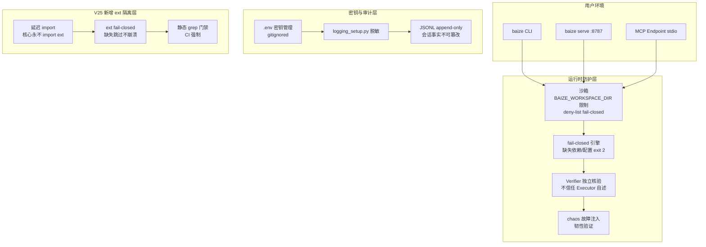

# AICoding 架构设计 · 安全设计

> 本文档为《AICoding 架构设计》核心产物之一，对应**安全架构设计**。
> 上游输入：《系统设计》§7 安全设计、《高层架构设计》§4.3 演进纪律与红线、《material_digest》§2④ 约束红线 A-E / D1 §核心原则 / D5 baize-tools spec / D8 §跨阶段红线修正；
> 下游输出：威胁模型、密钥管理、运行时防护、审计与应急等可落地的安全交付物。

> **裁剪说明**：模板原含大量云安全章节（DDoS/WAF/云防火墙/堡垒机/SOC/KMS 白盒/CAM 策略等）。Baize 为纯 stdlib 单进程本地/Docker 运行时，无公网入口暴露、无数据库、无多用户系统、无云资源。不适用的章节已整章删除，保留并深化适用的安全机制：沙箱 deny-list、fail-closed、密钥管理（.env）、审计日志（JSONL）、MCP subprocess 安全、ext 模块隔离。

---

## 0. 元信息

```yaml
标题: Baize Agent V25.0.0 - 安全设计 v0.1
版本: v0.1
状态: Draft（G5 结构检查 + 等价合规检查 + 人工审核待执行）
创建日期: 2026-08-20
编写人: security-architect（严守正）经主理人（齐构成）整合上游产出
审核人:
  - 齐构成（team-lead，G5 人工审核待执行）

上游依赖:
  - 系统设计.md §7 安全设计（核心结论已锁定）
  - 高层架构设计.md §4.3 演进纪律与红线（A-E）
  - material_digest.md §2④ 约束红线 / D1 §核心原则 / D5 baize-tools spec / D8 §跨阶段红线修正

适用范围: Baize Agent 是纯 Python 标准库、零第三方运行时依赖的单进程 CLI/库 + Docker 运行时。本文档聚焦本地/Docker 运行时安全，裁剪了不适用的云安全章节。
```

| 版本 | 日期 | 作者 | 变更内容 |
| --- | --- | --- | --- |
| v0.1 | 2026-08-20 | security-architect（严守正） | 初稿：基于系统设计 §7 安全结论扩展，裁剪不适用的云安全章节，深化沙箱/fail-closed/密钥/MCP/ext 隔离 |

---

## 1. 安全总体架构

### 1.1 安全总体架构图



> Baize 安全架构为**纵深防御 + fail-closed 优先**，非云安全产品堆叠。核心安全机制全部由纯 stdlib 在进程内实现（红线 A）。

### 1.2 威胁模型（STRIDE）

| 威胁类别（STRIDE） | 典型示例 | 缓解措施 | 缓解章节 |
| --- | --- | --- | --- |
| 仿冒（Spoofing） | LLM API Key 泄露、MCP server 伪造 | .env 密钥管理（gitignored）+ fail-closed exit 2；MCP server subprocess 在用户权限下运行 | §3.1 / §3.3 |
| 篡改（Tampering） | 会话 JSONL 篡改、配置文件篡改、ext 模块注入恶意代码 | JSONL append-only 不可篡改；config_schema.py 强校验 fail-fast；ext 延迟 import + fail-closed + 静态 grep 门禁 | §3.2 / §4.1 / §5.1 |
| 否认（Repudiation） | 缺少操作审计、Agent 操作不可追溯 | JSONL 会话即事实（崩溃不丢、可续跑）；logging_setup.py 结构化 JSON + 脱敏；manifest 证据物理核验 | §3.4 |
| 信息泄露（Information Disclosure） | API Key 落日志、会话内容泄露、ext 模块泄露核心数据 | logging_setup.py redact 脱敏；.env gitignored；ext 隔离层（核心永不 import ext）；沙箱 BAIZE_WORKSPACE_DIR 限制 | §3.1 / §3.3 / §5.1 |
| 拒绝服务（DoS） | LLM 速率限制耗尽、MCP server 阻塞、磁盘满 | LLM 速率限制 + 退避（llm.py 现有）；MCP initialize 超时 5s fail-closed；磁盘红线水位拒绝新会话 | §4.2 / §4.3 |
| 权限提升（Elevation of Privilege） | 工具越权访问文件、MCP subprocess 权限过大、容器逃逸 | 沙箱 deny-list fail-closed；MCP subprocess 在用户权限下运行（非 root）；Docker 非 root 用户 baize | §3.3 / §4.1 / §5.2 |

> 每条威胁均对应到 §2-§5 的具体缓解措施，形成"威胁—缓解措施映射表"。

---

## 2. 身份与访问管理（IAM）

### 2.1 身份认证

> **裁剪说明**：模板原含用户登录/密码策略/会话管理/MFA 等多用户认证章节。Baize 为单进程 CLI/库，无用户系统、无登录、无密码。本节仅保留 API Key 认证。

| 维度 | 取值 | 说明 |
| --- | --- | --- |
| 账号体系 | 无多用户认证 | 单进程 CLI/库，无用户系统（系统设计 §7.2.1） |
| 登录方式 | 不适用 | CLI 直接运行，无登录 |
| API Key 认证 | BAIZE_MODEL_API_KEY 环境变量 | 未配置 fail-closed exit 2（D5 baize-llm spec 规约1） |
| CORS | fail-closed 若未设 | .env.example CORS 配置（D19） |

### 2.2 授权与权限控制

| 维度 | 取值 | 说明 |
| --- | --- | --- |
| 权限模型 | 不适用（无多用户） | 单进程 CLI/库，无多用户权限模型 |
| 工具沙箱 | deny-list fail-closed | 文件操作限 BAIZE_WORKSPACE_DIR；命令 deny-list 命中拒绝（D1 §核心原则⑤ / D5 baize-tools spec 规约3/5） |
| 多租户隔离 | 不适用 | 单实例运行时，无多租户（高层架构 §4.2） |
| 接口级权限 | 无鉴权（本地 :8787） | baize serve REST API 无鉴权，本地运行；CORS fail-closed |

### 2.3 云账号与云资源访问

> 不适用。Baize 无云账号、无云资源访问。

---

## 3. 数据安全

### 3.1 数据分级与密钥管理

| 等级 | 类别 | 示例 | 处理策略 |
| --- | --- | --- | --- |
| L1 | 公开 | README、公开文档、源码 | 无特殊管控 |
| L2 | 内部 | 会话 JSONL、LLM 响应、技能库 | 本地文件明文存储，用户自行管理 |
| L3 | 敏感 | API Key（BAIZE_MODEL_API_KEY） | .env 存储（gitignored），logging_setup.py 脱敏，禁止导出 |

### 3.2 数据传输安全

| 维度 | 取值 | 说明 |
| --- | --- | --- |
| LLM 调用 | 强制 HTTPS | BAIZE_MODEL_BASE_URL 须为 https:// |
| 内部通信 | 不适用 | 单进程，进程内 Python 调用 |
| MCP 通信 | stdio 管道（本地） | 无网络传输，subprocess 管道 |
| 接口签名 | 不适用 | 本地 CLI/库，无接口签名需求 |

### 3.3 数据存储安全

| 维度 | 取值 | 说明 |
| --- | --- | --- |
| 存储加密 | 不启用 | 本地文件明文存储，由用户环境磁盘加密保障 |
| 敏感字段 | API Key：.env（gitignored）+ redact 脱敏 | 禁止入代码/Git/日志 |
| 会话存储 | JSONL append-only | 不可篡改（不修改历史行，D1 §核心原则⑥） |
| 数据库安全 | 不适用 | 无数据库 |

**敏感字段处理策略表**：

| 字段 | 分级 | 存储策略 | 展示策略（脱敏） | 导出策略 |
| --- | --- | --- | --- | --- |
| API Key（BAIZE_MODEL_API_KEY） | L3 | .env（gitignored），不入代码 | logging_setup.py redact 脱敏（中间屏蔽） | 禁止导出 |
| 会话内容（JSONL） | L2 | 本地文件明文 | 完整展示（用户本地） | 用户自行管理 |
| LLM 响应内容 | L2 | 进程内 + JSONL 会话 | 完整展示 | 用户自行管理 |

### 3.4 审计日志

| 维度 | 取值 | 说明 |
| --- | --- | --- |
| 启用日志类型 | 应用日志（JSON + 脱敏）/ 会话日志（JSONL）/ CI 日志（GitHub Actions） | 三类日志全覆盖 |
| 审计内容 | 何时/哪个命令/做了什么/结果 | CLI 操作 + Agent 循环 + MCP 调用（V25 新增） |
| 不可篡改保障 | JSONL append-only + Git 版本控制 | 不修改历史行；源码/配置变更可追溯 |
| 保留期 | 会话 JSONL 用户管理（建议 ≥ 30 天）；CI 日志 90 天 | GitHub 默认 |
| manifest 证据 | phase done 须有物理 evidence 文件 | NO FAKE DONE 门禁（D2 / D6 §4） |

### 3.5 数据备份与容灾

| 存储类型 | 备份策略 | 说明 |
| --- | --- | --- |
| 会话 JSONL | 用户自行备份（git/文件复制） | append-only，向后兼容 |
| 持久记忆 | 用户自行备份 | memory.py 跨会话持久 |
| 技能库 | Git 版本控制 | assets/skills/ + skills/ + user_skills/ |
| 源码 | Git 版本控制（GitHub） | 99.9% SLA |

> RPO ≤ 0 min（JSONL append-only 即写即落）；RTO ≤ 5 min（git clone + baize doctor + 恢复会话目录）。

### 3.6 隐私合规

> Baize 为个人/内部仓库，不涉及个人信息采集。若用户在会话中输入敏感信息，由用户自行负责（本地存储，不上传第三方）。LLM 调用通过用户自备的 OpenAI 兼容端点，数据出境合规由用户端点方负责。

---

## 4. 应用安全

### 4.1 输入安全（工具沙箱）

> Baize 工具系统为 9 原语工具 + ToolRegistry（D4 §内核-tools / D5 baize-tools spec）。安全核心 = 沙箱 + deny-list fail-closed。

| 风险 | 防护措施 | 规约来源 |
| --- | --- | --- |
| 命令注入 | bash deny-list fail-closed（危险命令拒绝）；bash 超时 60s；输出截 8000 字 | D5 baize-tools spec 规约5/7 |
| 文件越权 | 文件操作限 BAIZE_WORKSPACE_DIR；越界 PermissionError 转 ERROR 观察值 | D5 baize-tools spec 规约3 |
| 未注册工具 | 返 ERROR 观察值不崩 | D5 baize-tools spec 规约1 |
| 工具异常 | 异常转 ERROR 观察值（不崩） | D5 baize-tools spec 规约2 |
| save_skill 注入 | 写 user_skills/ 安全名称 + 即时重建索引 | D5 baize-tools spec 规约8 / V23.2 |
| **MCP 工具注入**（V25 新增） | MCP 工具包装进 ToolRegistry（复用 register/execute），不另立工具表；MCP subprocess 在用户权限下运行 | D8 §P2 修正② / 系统设计 M1 |

### 4.2 输出安全

| 维度 | 取值 | 说明 |
| --- | --- | --- |
| 统一异常处理 | 错误转 ERROR 观察值，不暴露堆栈 | D5 baize-tools spec 规约2 |
| 调试信息 | 生产环境不输出 debug/stacktrace | logging_setup.py 级别控制 |
| API Key 脱敏 | logging_setup.py redact（中间屏蔽） | 禁止打印明文 API Key |

### 4.3 业务逻辑安全

| 维度 | 取值 | 说明 |
| --- | --- | --- |
| 越权防护 | 文件操作限 BAIZE_WORKSPACE_DIR；命令 deny-list | D1 §核心原则⑤ |
| 防刷 | LLM 速率限制 + 有界退避（llm.py 现有） | D4 §内核-llm |
| 幂等性 | JSONL append-only 天然幂等 | 会话即事实 |
| Agent 失败重试 | Verifier fail 带 issues 重试（上限 max_retries）；重试耗尽仍 fail 整体 success=False | D5 baize-orchestrator spec 规约4/5 |
| **MCP fail-closed**（V25 新增） | MCP server 不可达 → fail-closed 报错（BD-01），核心 Agent 循环不受影响 | 系统设计 M1 / BD-01 |
| **ext fail-closed**（V25 新增） | ext 模块依赖缺失 → 延迟 import 失败 → fail-closed 跳过，记录日志 | 系统设计 M4 / BD-05 |

### 4.4 第三方与供应链安全

| 维度 | 取值 | 说明 |
| --- | --- | --- |
| 运行时第三方依赖 | **0**（红线 A） | dependencies = []（D3 pyproject.toml） |
| CI 零依赖校验 | ast 扫描 baize/ 全部 import，非 stdlib 且非 baize 即 exit 1 | D18 ci.yml |
| **静态 grep 门禁**（V25 新增） | baize/*.py 无顶层 `import baize.ext` | 红线 A：核心永不 import ext（D8 §P2 修正③） |
| 测试期依赖 | 仅 pytest/pytest-cov | 不入运行时 |
| ext 模块依赖 | ext/ 内可依赖第三方库，但延迟 import + fail-closed | 红线 C：缺失不崩溃 |
| 开源协议 | MIT | pyproject.toml license |

---

## 5. 运行时安全：监控、审计、应急

> **裁剪说明**：模板原含网络分区/流量管控/主机安全/容器安全/中间件安全/密钥分级（KMS 白盒/CAM 策略）等云安全章节。Baize 无公网入口、无数据库/缓存/MQ、无云资源。本节聚焦运行时安全机制。

### 5.1 ext 模块隔离（V25 新增核心安全机制）

| 机制 | 说明 | 红线 |
| --- | --- | --- |
| 延迟 import | ext 模块仅在函数体内 import，非顶层 | 红线 A：核心 baize/ 永不 import ext |
| fail-closed | ext 依赖缺失 → 跳过该 ext 模块，记录日志，不崩溃 | 红线 C：缺失不影响核心 |
| 静态 grep 门禁 | CI 强制：baize/*.py 无顶层 `import baize.ext` | 红线 A：CI 强制校验 |
| importorskip 守卫 | ext 测试用 pytest.importorskip，缺失依赖 skip 不阻断 | 护 422 基线 |
| norecursedirs 补 ext | pyproject.toml norecursedirs 补 ext，避免裸 pytest 误收集 ext 导致 collection 崩溃 | 护 422 基线 |
| 统一扩展总线 | 全部经 plugin.discover + CompositionKernel.add_component 接入，禁各阶段自起 import | D8 §统一收口 |

### 5.2 容器安全

| 维度 | 取值 | 说明 |
| --- | --- | --- |
| 非 root 用户 | Dockerfile USER baize | D17 现有 |
| /data 可写 | VOLUME /data | 仅持久化目录可写 |
| HEALTHCHECK | GET /health | 容器健康检查 |
| 镜像漏洞扫描 | 用户自行（可选） | 个人/内部仓库，无强制 |
| 不打包密钥 | .env 不入镜像 | gitignored，运行时挂载 |

### 5.3 密钥与凭证管理

| 密钥类型 | 存储/管理方式 | 说明 |
| --- | --- | --- |
| BAIZE_MODEL_API_KEY | .env 文件（gitignored）+ 环境变量 | L3 敏感，redact 脱敏 |
| GitHub PAT（如有推送需求） | 用户内存（不落盘） | 推送后立即撤销轮换 |
| 用户密码 | 不适用 | 无用户系统 |
| 服务间通信密钥 | 不适用 | 单进程 |

**密钥使用红线**：
- **严禁** API Key / Token 出现在源码、Git 仓库、日志、错误堆栈、URL、配置明文（.env.example 仅含占位符）
- **禁止**跨环境共用密钥
- CI ast 扫描强制零依赖（D18）+ 静态 grep 门禁（V25 新增）
- .gitignore 已含 .env（D6 §P0 安全止血）
- API Key 一旦疑似泄露，立即在 .env 轮换 + 检查日志确认影响面

### 5.4 安全事件监控

| 监控项 | 触发条件 | 级别 | 处置 |
| --- | --- | --- | --- |
| 静态 grep 门禁失败 | baize/*.py 含顶层 import baize.ext | P1 | 立即回滚（红线 A 破坏） |
| ext 大面积 fail-closed | ext 模块跳过率 > 50% | P3 | 排查 ext 依赖 |
| LLM API Key 失效 | LLM 调用 401/403 | P2 | 轮换 API Key |
| Docker HEALTHCHECK 失败 | /health 连续 3 次失败 | P1 | 重启容器 / 检查 .env |
| pytest 基线不通过 | 422 基线破坏 | P1 | 回滚 + 修复 |

### 5.5 应急响应

| 场景 | 应急预案 | RTO |
| --- | --- | --- |
| 红线 A 破坏（核心 import ext） | 立即回滚 → 修正违规 import → 重跑 CI | ≤ 30 min |
| API Key 泄露 | .env 轮换 → 检查日志 → 通告用户 | ≤ 15 min |
| pytest 基线破坏 | 回滚上一 tag → 定位失败用例 → 修复 | ≤ 1 h |
| Docker 容器崩溃 | docker restart → 检查日志 → 修复 | ≤ 5 min |
| MCP server 不可达 | fail-closed 报错（核心循环不受影响）→ 排查 MCP server | 取决于 MCP server |

---

## 附录 A：生成流程

### 流程总览

| 步骤 | 动作 | 落入章节 |
| --- | --- | --- |
| Step 0 | 读取模板 + 上游（系统设计 §7、高层架构 §4.3、material_digest §2④/D1/D5/D8） | — |
| Step 1 | 裁剪不适用的云安全章节（DDoS/WAF/云防火墙/堡垒机/SOC/KMS 白盒/CAM/网络分区/中间件安全等） | — |
| Step 2 | 基于 STRIDE 构建威胁模型，每条威胁对应缓解措施 | §1.2 |
| Step 3 | 基于 D5 baize-tools spec + D1 §核心原则⑤ 深化沙箱/deny-list/fail-closed | §4.1 |
| Step 4 | 基于 D8 §跨阶段红线修正 + 系统设计 M4 深化 ext 模块隔离 | §5.1 |
| Step 5 | 基于 D17 Dockerfile + D18 ci.yml 深化容器安全与密钥管理 | §5.2/§5.3 |
| Step 6 | 硬指标自检 | 附录 B |

### 整理原则

1. **裁剪优先**：Baize 为单进程本地/Docker 运行时，模板中云安全章节不适用，整章删除。
2. **上游一致**：所有安全结论与系统设计 §7 保持一致，引用时标注 §章节 / D编号。
3. **V25 增量标注**：V25 新增安全机制（ext 隔离、静态 grep 门禁、MCP fail-closed）明确标注。
4. **红线贯穿**：红线 A-E（零依赖/NO FAKE DONE/ext fail-closed/外科手术/fail-closed 安全）贯穿全文。

---

## 附录 B：硬指标清单

| 章节 | 硬指标 | 状态 |
| --- | --- | --- |
| 模板 | 覆盖模板全部一级标题（1-7 + 附录） | ✅ 已覆盖（不适用的云安全章节已裁剪并说明） |
| §1 | 安全总体架构图 + 威胁模型（STRIDE） | ✅ mermaid 图 + 6 类威胁 × 缓解措施映射 |
| §2 | IAM：身份认证 + 授权 + 云账号 | ✅ API Key 认证 + 沙箱 deny-list（云账号不适用已说明） |
| §3 | 数据安全：分级 + 传输 + 存储 + 审计 + 备份 + 隐私 | ✅ 6 节全覆盖（L1-L3 分级 + JSONL 不可篡改 + manifest 证据） |
| §4 | 应用安全：输入 + 输出 + 业务逻辑 + 第三方 | ✅ 4 节全覆盖（沙箱 + fail-closed + ext 隔离 + 零依赖） |
| §5 | 运行时安全：ext 隔离 + 容器 + 密钥 + 监控 + 应急 | ✅ 5 节全覆盖（V25 新增 ext 隔离详写） |
| 全文 | 无残留模板占位符 | ✅ 无 `<...>`/`示例：`/`YYYY-MM-DD`/`[待补充]` 残留 |
| 全文 | 引用上游可溯源 | ✅ 标注系统设计 §章节 / material_digest D编号 / D8 §章节 |
| 全文 | 红线 A-E 贯穿 | ✅ A 零依赖 / B NO FAKE DONE / C ext fail-closed / D 外科手术 / E fail-closed 安全 |
