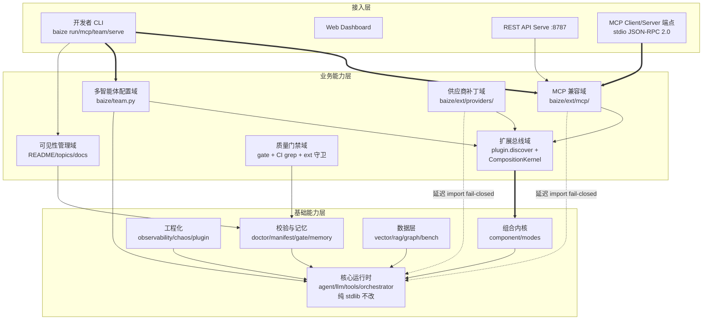
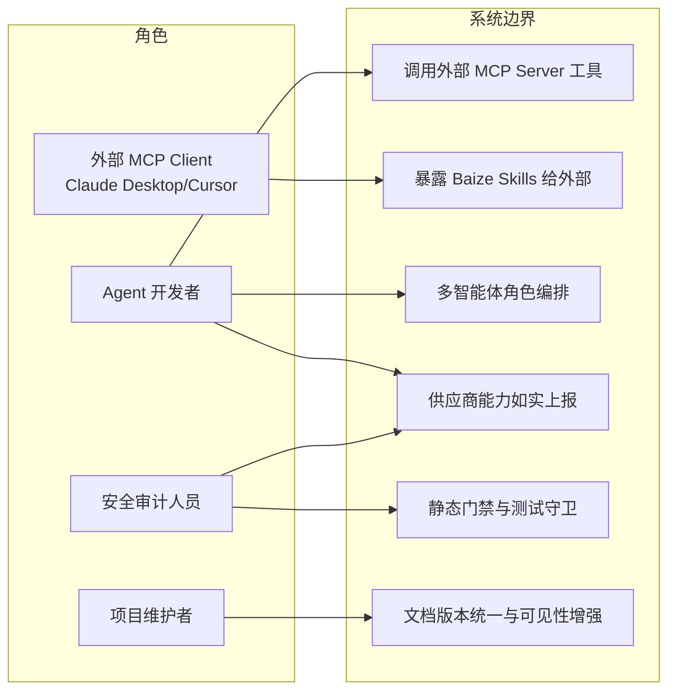
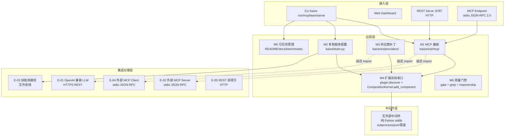
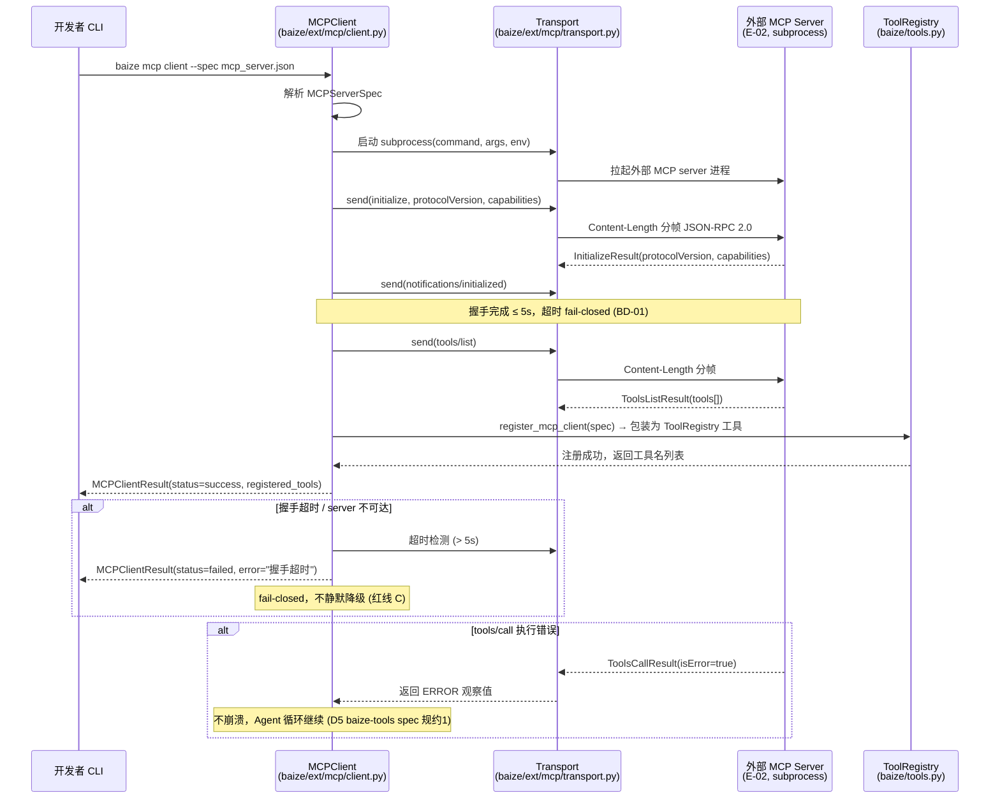
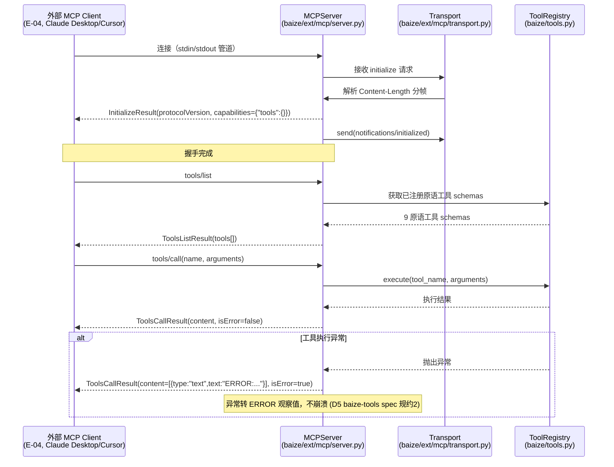
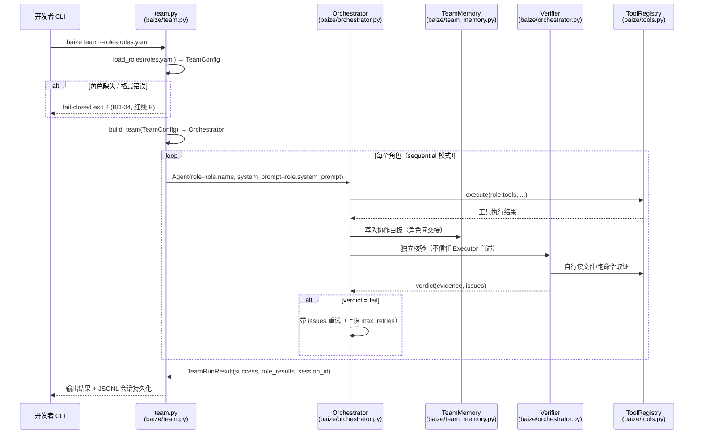
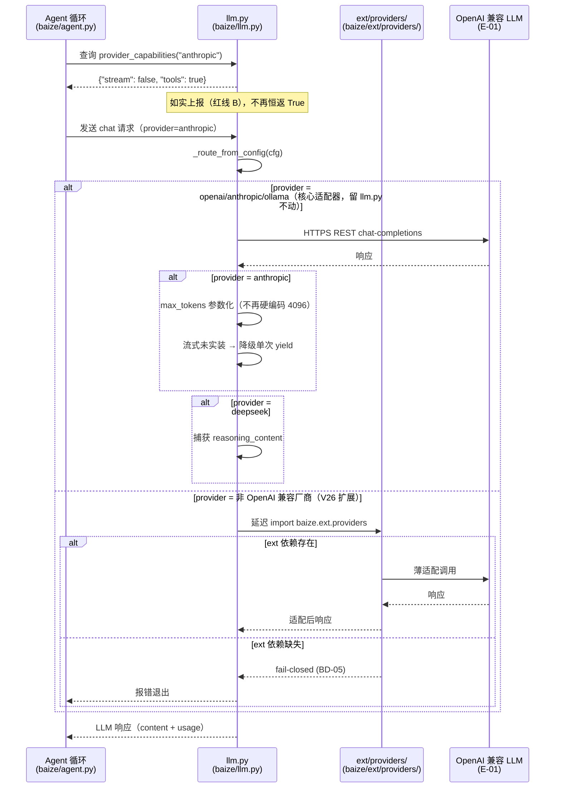
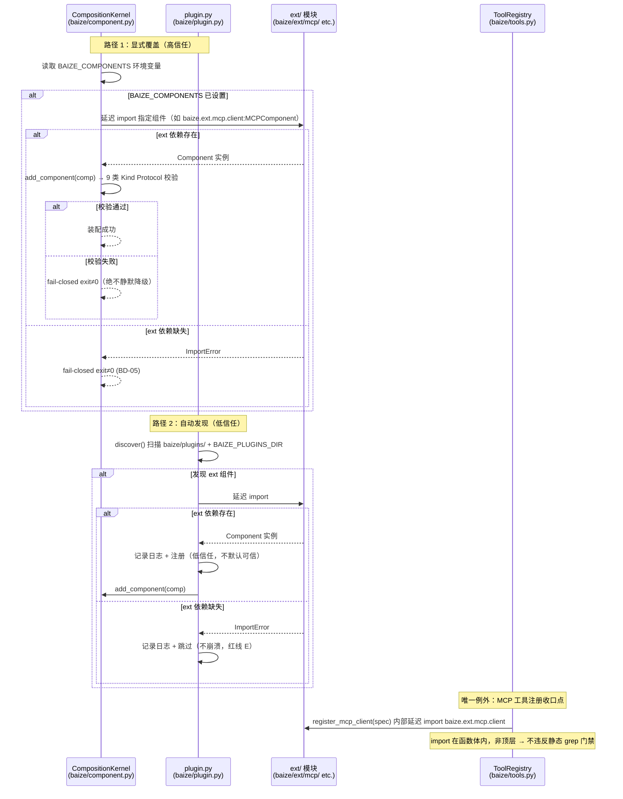
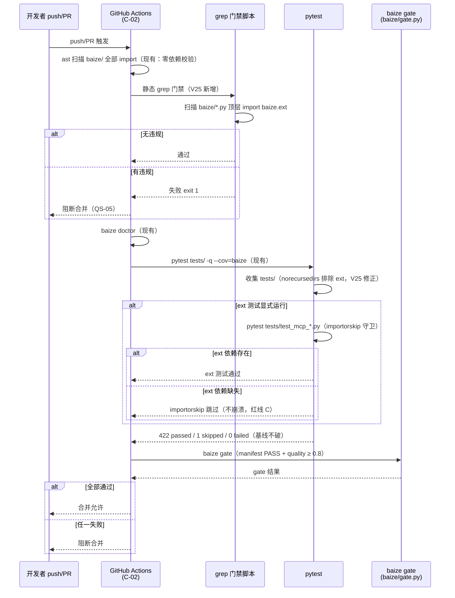
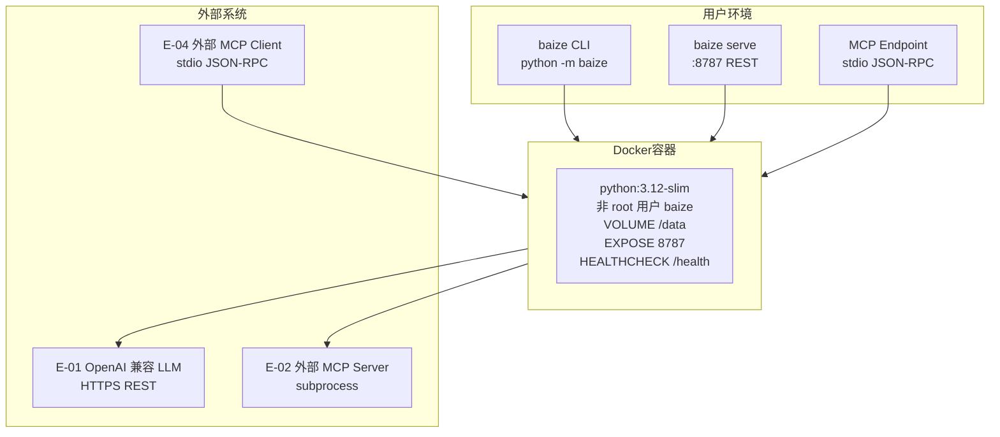

# AICoding 架构设计 · 系统设计

> 本文档为《AICoding 架构设计》核心产物之一，对应**系统架构设计模版**。
> 上游输入：《高层架构设计》产出的业务架构、系统定位、能力盘点（G3 已通过）；
> 下游输出：用于驱动《部署设计》《安全设计》《UserStory》的实施。

> **模版使用约定（按需裁剪）**：
> - 本系统为 Python CLI/库形态的 Agent 运行时（非传统 Web 服务），无关系型数据库、无 Redis 缓存、无消息队列。§4 数据库设计适配为"文件型数据设计"；§4.4 缓存与 Key 规范未启用（理由：本系统无缓存组件，内存态数据由 Python 进程内对象持有，不涉及分布式缓存一致性）；
> - §4.5 数据迁移与兼容性：本系统为版本升级（V24→V25）非系统替换，保留轻量版本迁移节；
> - §3.4 跨模块公共能力保留（plugin/component 为横切能力）；
> - **不可裁剪的章节**：§1 引言、§2 业务架构、§3.1 应用架构概览、§3.2 模块详细设计、§4.1~§4.3 数据设计核心三节、§5 部署架构、§7 安全设计——均已覆盖。

---

## 0. 元信息：修订记录

| 文档版本 | 发布日期 | 修订人 | 修订说明 |
| --- | --- | --- | --- |
| v1.0 | 2026-08-19 | system-architect（高见远） | 文档初始版本：基于《高层架构设计》v0.2（G3 已通过）逐章填充系统设计，覆盖 §1~§8 全部章节 + M1~M6 模块五段式详细设计 + 4 次中间确认自检 |

> **版本管理纪律**：破坏性变更（章节结构调整 / 关键决策反转）升 MAJOR；新增章节、扩充内容升 MINOR。

---

## 1. 引言

### 1.1 文档目标

- **一句话定位**：本文档定义 Baize Agent V25（目标版本 25.0.0，经中间确认，高层架构附录 C.1）在交付物中的所有系统架构设计相关产物——将高层架构 §4.3 MVP（F1~F7）落为可实施的模块拆分、接口契约、数据设计与可观测设计。
- **读者对象**：架构师 / 开发 / 运维 / 安全 / 评审委员会。
- **设计范围**：业务架构 + 应用架构 + 数据设计 + 部署架构 + 网络架构 + 安全设计 + 可观测设计。
- **继承约束**：本文档严格继承《高层架构设计》已冻结的业务边界、角色场景、MVP 范围（F1~F7）、模块全景（高层架构 §6.2）和系统定位（高层架构 §4.2），不脱离上游文档自行扩展新的业务域、产品范围或核心模块。

### 1.2 关联文档清单

| 输入类型 | 内容要点 | 在本文档中的用途 | 形式（外部文档 / 本文档自带） |
| --- | --- | --- | --- |
| 业务需求 | V25 升级范围 = P0 元数据止血 + P1 README 重写 + P2 MCP 兼容 + P5 多智能体薄配置层 + P3 供应商补丁（降级版）+ 统一扩展总线收口 + ext 测试守卫；P4 稠密向量推迟 V26（高层架构 §4.3 / §1.2 D1） | 第 2 章业务架构范围边界 | 外部文档：《高层架构设计》§4.3 / §6.1 |
| 非功能性需求 | 运行时第三方依赖数 = 0（红线 A）；pytest 422 基线不破；gate quality ≥ 0.8；静态 grep 门禁 CI 强制；ext 测试 importorskip 守卫（高层架构 §6.1 N1~N3） | 第 3.5 / 5 / 7 / 8 章 | 外部文档：《高层架构设计》§6.1 |
| 系统定位与边界 | 既有 Agent 运行时（V24.0.0）的生态接入 + 可见性增强，非新建系统、不破坏零依赖红线（高层架构 §4.2 / §1.1） | 第 3.1 集成架构 | 外部文档：《高层架构设计》§4.2 |
| 外部系统 API | OpenAI 兼容 LLM 端点（BAIZE_MODEL_*）；外部 MCP server（stdio JSON-RPC 2.0，Content-Length 分帧 + initialize 握手）；技能库路径（SKILL_LIBRARY_PATHS）（高层架构 §5.2） | 第 3.1.3 / 3.2 模块 | 外部文档：《高层架构设计》§5.2 |
| 约束红线 | A 核心 baize/ 永不 import ext；B NO FAKE DONE；C ext 延迟 import + fail-closed；D 不另造 VectorBackend 平行抽象（X7）、不迁移核心适配器到 ext（X6）；E 外科手术式变更（material_digest §2④） | 全文约束 | 外部文档：material_digest §2④ / 高层架构 §4.3 演进纪律 |
| 冲突记录 | X1 唯一技能计数 249 vs 250；X6 P3 计划假设 vs 源码实际（核心已有适配器）；X7 P4 双实现腐烂（vector.py 已有工厂）（material_digest §3） | 第 3.2 / 4.2 设计决策依据 | 外部文档：material_digest §3 |
| 专家评审修正 | D8 §P2 MCP 协议正确性（Content-Length 分帧 + initialize 握手）；§P3 供应商降级补丁（勿搬核心适配器）；§P5 多智能体薄配置层（勿重写）；§统一收口（plugin.discover + CompositionKernel.add_component） | 第 3.2 模块设计 | 外部文档：material_digest D8 |

### 1.3 名词与术语表

| 业务术语 | 业务定义（≤ 30 字） | 应用层核心对象（§3.3 O-xx） | 数据文件/表名（§4.2） |
| --- | --- | --- | --- |
| MCP 兼容 | Model Context Protocol 双向接入能力 | `MCPClient` / `MCPServer` (O-01) | `mcp_server.json` (§4.2.1) |
| MCP Client | Baize 调用外部 MCP server 工具 | `MCPClient` (O-01) | `mcp_server.json` (§4.2.1) |
| MCP Server | Baize 暴露自身 skills 给外部 MCP client | `MCPServer` (O-02) | — |
| 多智能体薄配置层 | roles.yaml 驱动角色编排，复用 Orchestrator | `TeamConfig` / `Role` (O-03) | `roles.yaml` (§4.2.2) |
| 供应商补丁 | 核心适配器真实缺口修补 + 非兼容厂商薄适配 | `ProviderCapabilities` (O-04) | — |
| 统一扩展总线收口 | 全部生态接入经 plugin.discover + CompositionKernel | `CompositionKernel` (O-05) | — |
| 静态 grep 门禁 | CI 强制 baize/*.py 无顶层 import baize.ext | `GrepGate` (O-06) | — |
| ext 测试守卫 | pytest.importorskip + norecursedirs 补 ext | `ImportOrskipGuard` (O-07) | `pyproject.toml` (§4.2.3) |
| ToolRegistry | 进程级单例工具注册表（现有，复用） | `ToolRegistry` (O-08) | — |
| Orchestrator | Director→Executor→Verifier 三角色编排（现有，复用） | `Orchestrator` (O-09) | — |
| CompositionKernel | 9 类 Kind 配置驱动装配的组合内核（现有，复用） | `CompositionKernel` (O-05) | — |
| manifest 证据 | NO FAKE DONE phase done 的物理核验文件 | `Manifest` (O-10) | `baize.manifest.json` (§4.2.4) |
| fail-closed | 缺失依赖/配置时主动退出而非静默降级 | —（设计原则，非对象） | — |

---

## 2. 业务架构

> **本章回答**：系统服务什么业务、业务由哪些场景构成、业务的关键流程长什么样。
> **本章不回答**：用什么技术、怎么部署、表怎么建。

### 2.1 业务架构概览

#### 2.1.1 业务全景图

> 系统级业务全景图。以业务域分块展示系统的业务结构，继承高层架构 §5.1 三层架构与 §6.2 模块全景图。



> **图示说明**：粗线（==>）= 主链路（CLI→MCP/team→扩展总线→组合内核→核心运行时）；实线（-->）= 同步调用；虚线（-.->）= 延迟 import（ext 模块仅按需加载，缺失 fail-closed）。继承高层架构 §5.1 三层架构：接入层 4 触点 → 业务能力层 6 域 → 基础能力层 5 底座。

**业务域清单**：

| 业务域 | 核心场景 | 涉及角色 | 与其他业务域的关系 |
| --- | --- | --- | --- |
| MCP 兼容域 | 调用外部 MCP server 工具 / 暴露 baize skills 给外部 MCP client | Agent 开发者 / 外部 MCP client | 上游 外部 MCP server；下游 扩展总线域 → 工具系统 |
| 多智能体配置域 | roles.yaml 角色清单驱动多 Agent 编排 | Agent 开发者 | 上游 CLI（baize team --roles）；下游 扩展总线域 → 编排器 |
| 供应商补丁域 | provider_capabilities 如实上报 / Anthropic 流式实装 / DeepSeek reasoner 捕获 / 非兼容厂商薄适配 | Agent 开发者 / 安全审计人员 | 上游 LLM 客户端（延迟 import）；下游 扩展总线域 → LLM 客户端 |
| 扩展总线域 | 全部生态接入统一收口到 plugin.discover + CompositionKernel.add_component | 下游嵌入方 / Agent 开发者 | 上游 MCP/Team/Provider 三域；下游 组合内核 + plugin |
| 可见性管理域 | README/topics/docs/benchmarks 版本统一与可见性增强 | 项目维护者 / 开源社区贡献者 | 上游 CLI/README/docs；下游 校验与记忆（版本号核验） |
| 质量门禁域 | 静态 grep 门禁 CI 强制 / ext 测试 importorskip 守卫 / 422 基线不破 | 安全审计人员 / 项目维护者 | 上游 CI / pyproject.toml；下游 校验与记忆 |

**填写要求**：业务域 3~7 个为宜；业务域名称必须与第 3 章模块、第 4 章数据分组保持一致。 ✅ 6 个业务域，与 §3.2 模块 M1~M6、§4.2 数据文件一一对应。

### 2.2 领域关系映射

#### 2.2.1 限界上下文清单

| 限界上下文 | 对应业务域 | 域类型 | 覆盖的核心业务实体 | 上下文边界（属于本域 vs 不属于） |
| --- | --- | --- | --- | --- |
| MCP-BC | MCP 兼容域 | 核心域 | `MCPClient` / `MCPServer` / MCP 工具包装器 | 属于：MCP 协议交互、stdio JSON-RPC 分帧、工具注册到 ToolRegistry；不属于：工具执行逻辑本身（归核心运行时 ToolRegistry） |
| Team-BC | 多智能体配置域 | 核心域 | `TeamConfig` / `Role` / roles.yaml | 属于：roles.yaml 解析、role→system_prompt+tools 映射；不属于：编排执行逻辑（归 Orchestrator）、角色间交接（归 team_memory） |
| Provider-BC | 供应商补丁域 | 支撑域 | `ProviderCapabilities` / ext/providers 薄适配器 | 属于：provider_capabilities 如实上报、Anthropic/DeepSeek 缺口修补、非兼容厂商薄适配；不属于：核心 OpenAI/Anthropic/Ollama 适配器（留 llm.py 不动，X6） |
| ExtBus-BC | 扩展总线域 | 核心域 | `CompositionKernel` / `plugin.discover` 收口逻辑 | 属于：统一收口接入路径、静态 grep 门禁规则；不属于：组件 build 工厂实现（归各 ext 模块自身） |
| Visibility-BC | 可见性管理域 | 支撑域 | README 结构 / topics 清单 / benchmarks 对标行 / examples 示例 | 属于：文档版本号统一、GitHub 元数据补全、可运行示例；不属于：代码逻辑变更 |
| QualityGate-BC | 质量门禁域 | 支撑域 | 静态 grep 门禁 / importorskip 守卫 / pyproject norecursedirs | 属于：CI 门禁规则、ext 测试隔离、422 基线守卫；不属于：测试用例编写本身（归各模块测试） |

**域类型说明**：

| 域类型 | 含义 | 投入策略 |
| --- | --- | --- |
| 核心域（Core） | 业务护城河，差异化竞争力所在 | 投入最多资源自研 |
| 支撑域（Supporting） | 必要但非差异化 | 可自研可外采 |
| 通用域（Generic） | 通用能力（如用户中心、消息中心） | 优先复用 / 外采 |

> 本系统 3 个核心域（MCP-BC / Team-BC / ExtBus-BC）+ 3 个支撑域（Provider-BC / Visibility-BC / QualityGate-BC），无通用域。

#### 2.2.2 上下文映射（Context Mapping）

| 关系编号 | 上游上下文 | 下游上下文 | 关系模式 | 同步方式 | 选择理由 |
| --- | --- | --- | --- | --- | --- |
| C-01 | ExtBus-BC | MCP-BC | Customer/Supplier | 进程内同步调用 | ExtBus 提供统一收口路径，MCP-BC 作为消费方按其约定接入；ExtBus 配合 MCP-BC 的接入需求演进收口接口（高层架构 §5.2 复用底座"工程化 plugin"） |
| C-02 | 外部 MCP Server | MCP-BC | ACL 防腐层 | subprocess + 管道（纯 stdlib） | 外部 MCP server 模型不污染本域：MCPClient 将外部工具 schema 包装为 ToolRegistry 原语，核心运行时不感知 MCP 协议细节（D8 §P2 修正②） |
| C-03 | ExtBus-BC | Team-BC | Shared Kernel | 共享 plugin.py + component.py 代码 | plugin.discover + CompositionKernel.add_component 是 ExtBus 与 Team-BC 共享的扩展基础设施，两个上下文必须对此保持一致理解（D8 §统一收口） |
| C-04 | OpenAI 兼容 LLM 端点 | Provider-BC | Conformist | HTTPS REST 同步 | Provider-BC 完全遵循 OpenAI chat-completions API 规约（D5 baize-llm spec 规约2：URL={base}/chat/completions），无议价能力改变上游 API 形态 |
| C-05 | MCP-BC | 外部 MCP Client（Claude Desktop/Cursor） | Published Language | stdio JSON-RPC 2.0（标准协议） | MCP 协议是 2025 年事实标准（97M 月下载），MCP-BC 以标准协议对外暴露 baize skills，多个外部 client 共同消费（高层架构 §5.2 下游"Claude Desktop/Cursor"） |

**关系模式说明**：

| 关系模式 | 适用场景 |
| --- | --- |
| Customer/Supplier | 上下游强协作，下游能影响上游迭代节奏（如：扩展总线 → MCP 接入） |
| Conformist | 顺从者，下游完全遵循上游模型（如：对接 OpenAI 兼容端点） |
| ACL（Anticorruption Layer） | 在本域和外部域之间建一层适配，外部模型变化不影响本域（对接外部 MCP server 时必用） |
| Shared Kernel | 共享内核，多个上下文共享一小块代码 / 模型；维护成本高，慎用 |
| Published Language | 上游以标准协议（事件 / Schema）对外暴露，多下游消费 |

> ✅ 5 种关系模式全部使用：Customer/Supplier（C-01）、ACL（C-02）、Shared Kernel（C-03）、Conformist（C-04）、Published Language（C-05）。

#### 2.2.3 跨域协作原则

| 原则编号 | 原则 |
| --- | --- |
| P-01 | 核心域 → 支撑域 / 通用域：禁止反向依赖——MCP-BC / Team-BC / ExtBus-BC（核心域）不依赖 Provider-BC / Visibility-BC / QualityGate-BC（支撑域）的内部模型 |
| P-02 | 核心域之间：禁止直接耦合，必须通过扩展总线解耦——MCP-BC 与 Team-BC 之间不直接调用，均经 ExtBus-BC 的 plugin.discover + CompositionKernel.add_component 收口 |
| P-03 | 对接外部不可控系统：必须建 ACL 防腐层——外部 MCP server 的工具 schema 经 MCPClient 包装为 ToolRegistry 原语，核心运行时不感知 MCP 协议细节（C-02） |

### 2.3 详细业务架构

#### 2.3.1 用例图

> 体现"角色 — 用例 — 系统边界"。每个一级业务场景一张用例图。



**用例图清单**：

| 编号 | 用例图标题 | 涉及业务域 | 源文件位置 |
| --- | --- | --- | --- |
| UC-01 | MCP 双向兼容（client + server） | MCP 兼容域 | 本文档 §2.3.1 |
| UC-02 | 多智能体角色编排 | 多智能体配置域 | 本文档 §2.3.1 |
| UC-03 | 供应商能力如实上报 | 供应商补丁域 | 本文档 §2.3.1 |
| UC-04 | 静态门禁与测试守卫 | 质量门禁域 | 本文档 §2.3.1 |
| UC-05 | 文档版本统一与可见性增强 | 可见性管理域 | 本文档 §2.3.1 |

#### 2.3.2 业务流程图

> 关键业务以角色泳道图描述核心流程。覆盖核心业务 ≥ 80%。

**关键流程清单**（核心业务覆盖度 ≥ 80%）：

| 流程编号 | 流程名 | 起点 | 终点 | 涉及业务域 | 源文件位置 |
| --- | --- | --- | --- | --- | --- |
| BF-01 | MCP client 对接外部 server 并注册工具 | 开发者执行 `baize mcp client --spec` | 工具注册到 ToolRegistry 可被 Agent 调用 | MCP 兼容域 / 扩展总线域 | 本文档 §3.2.M1.4 |
| BF-02 | MCP server 暴露 baize skills | 外部 MCP client 连接 | baize 原语工具暴露为 MCP 工具 | MCP 兼容域 | 本文档 §3.2.M1.4 |
| BF-03 | team --roles 多角色编排 | 开发者执行 `baize team --roles roles.yaml` | Orchestrator 按角色执行 + Verifier 核验 | 多智能体配置域 | 本文档 §3.2.M2.4 |
| BF-04 | provider_capabilities 如实上报 | Agent 启动时查询供应商能力 | 返回真实 stream/tools 布尔值 | 供应商补丁域 | 本文档 §3.2.M3.4 |
| BF-05 | 扩展总线统一收口 | ext 模块通过 plugin.discover 注册 | CompositionKernel.add_component 装配 | 扩展总线域 | 本文档 §3.2.M4.4 |
| BF-06 | 静态 grep 门禁 CI 检查 | CI push/PR 触发 | baize/*.py 无顶层 import baize.ext 校验通过 | 质量门禁域 | 本文档 §3.2.M6.4 |

> ✅ 6 条关键流程覆盖 6 个业务域全部核心场景，覆盖率 100% ≥ 80%。

### 2.4 业务范围与边界

#### 2.4.1 功能模块清单

按"功能编号 → 子功能编号"两层组织，与 §2.1 业务域对应。功能编号继承高层架构 §6.3 功能清单。

| 编号 | 一级功能名 | 子功能描述 | 对应业务域 | 实现状态 |
| --- | --- | --- | --- | --- |
| F1 | GitHub 元数据止血 | — | 可见性管理域 | — |
| F1.1 | — | topics 补全 mcp/no-fake-done/white-box/auditable + 开 Discussions + 记录 before/after | 可见性管理域 | 完整实现 |
| F2 | README 重写 | — | 可见性管理域 | — |
| F2.1 | — | 修正误数 448→422 + 补 V24/V25 说明 + EN hero + Quick Start 3 步 + 覆盖率如实标 UNKNOWN | 可见性管理域 | 完整实现 |
| F3 | 文档/版本号全量统一 | — | 可见性管理域 | — |
| F3.1 | — | 操作手册/Dockerfile LABEL/.env.example 头部/benchmarks 全部统一为 V25 | 可见性管理域 | 完整实现 |
| F4 | MCP 兼容 client | — | MCP 兼容域 | — |
| F4.1 | — | 纯 stdlib stdio JSON-RPC 2.0 Content-Length 分帧 + initialize 握手 + 包装进 ToolRegistry | MCP 兼容域 | 完整实现 |
| F5 | MCP 兼容 server | — | MCP 兼容域 | — |
| F5.1 | — | baize mcp server 暴露 baize 原语工具为 MCP 工具给 Claude Desktop/Cursor | MCP 兼容域 | 完整实现 |
| F6 | 多智能体薄配置层 | — | 多智能体配置域 | — |
| F6.1 | — | roles.yaml role→system_prompt+tools 映射为 Orchestrator Agent(role=...) 调用，复用 Verifier+TeamMemory | 多智能体配置域 | 完整实现 |
| F7 | 供应商补丁 | — | 供应商补丁域 | — |
| F7.1 | — | Anthropic 流式实装 + max_tokens 参数化（不再硬编码 4096） | 供应商补丁域 | 完整实现 |
| F7.2 | — | DeepSeek reasoner reasoning_content 捕获 | 供应商补丁域 | 完整实现 |
| F7.3 | — | provider_capabilities 如实上报（如 Anthropic {"stream":false,"tools":true}） | 供应商补丁域 | 完整实现 |
| F8 | 统一扩展总线收口 | — | 扩展总线域 | — |
| F8.1 | — | 全部生态接入经 plugin.discover + CompositionKernel.add_component，禁各阶段自起 import baize.ext.X | 扩展总线域 | 完整实现 |
| F9 | 质量门禁增强 | — | 质量门禁域 | — |
| F9.1 | — | 静态 grep 门禁 CI 强制 baize/*.py 无顶层 import baize.ext | 质量门禁域 | 完整实现 |
| F9.2 | — | ext 测试 importorskip 守卫 + pyproject norecursedirs 补 ext | 质量门禁域 | 完整实现 |
| F10 | 可见性素材补充 | — | 可见性管理域 | — |
| F10.1 | — | benchmarks/COMPARISON.md 加 baize 行 + 英文速览 + examples 增 mcp_minimal/team_minimal/rag_backend | 可见性管理域 | 完整实现 |
| F11 | 数据层修复 | — | 扩展总线域 | — |
| F11.1 | — | rag.py 改走 get_backend() 工厂（修复 X7 双实现腐烂前置） | 扩展总线域 | 完整实现 |

**In-Scope（本期范围内）**：

| 编号 | 本期必做的事项 |
| --- | --- |
| F1 | GitHub 元数据止血（topics ≥ 10 + 开 Discussions + before/after 记录） |
| F2 | README 重写（修正误数 + EN hero + Quick Start + 覆盖率 UNKNOWN） |
| F3 | 文档/版本号全量统一（全部文档/镜像/配置头部版本号统一为 25.0.0） |
| F4 | MCP 兼容 client（纯 stdlib stdio JSON-RPC 2.0 + Content-Length 分帧 + initialize 握手 + ToolRegistry 集成） |
| F5 | MCP 兼容 server（暴露 baize skills 给 Claude Desktop/Cursor） |
| F6 | 多智能体薄配置层（roles.yaml → Orchestrator，复用 Verifier+TeamMemory） |
| F7 | 供应商补丁（Anthropic 流式 + max_tokens 参数化 + DeepSeek reasoner + provider_capabilities 如实上报） |
| F8 | 统一扩展总线收口（plugin.discover + CompositionKernel.add_component） |
| F9 | 质量门禁增强（静态 grep 门禁 + ext 测试 importorskip 守卫） |
| F10 | 可见性素材补充（benchmarks 对标行 + examples 可运行示例） |
| F11 | rag.py 改走 get_backend() 工厂（X7 前置修复） |
| N1 | 运行时第三方依赖数 = 0（红线 A 不破，ext/ 延迟 import + fail-closed） |
| N2 | pytest 422 passed / 1 skipped / 0 failed 基线不破 |
| N3 | gate quality ≥ 0.8 + doctor PASS + 静态 grep 门禁通过 |

**Out-of-Scope（本期不做）**：

| 编号 | 不做的事项 | 不做的原因 | 未来归属 |
| --- | --- | --- | --- |
| O1 | P4 稠密向量后端（llama_index/chromadb 语义检索） | 稠密后端引入重依赖违反红线 A；X7 确认 vector.py 已有 get_backend() 工厂，另造 VectorBackend = 两层平行抽象腐烂；D8 §P4 建议推迟（高层架构 §6.1 O1） | V26：扩展 get_backend() 懒探测 ext/vector_backends |
| O2 | P3 非 OpenAI 兼容厂商重适配（gemini/bedrock 重后端） | V25 P3 降级为补丁（D8 §P3 修正③），既有 stdlib 适配器留 llm.py 不动，ext 只放薄适配；gemini/bedrock 重后端属 ext 大规模扩张（高层架构 §6.1 O2） | V26：ext/providers/ 增 gemini/bedrock 薄适配 |
| O3 | 核心运行时内核重写 / 架构重构 | V25 = 生态接入 + 可见性，核心 baize/ 永远纯 stdlib 不改（红线 A）（高层架构 §6.1 O3） | 不做（V26 亦不做内核重写） |
| O4 | 可视化拖拽工作流 / 低代码编排 | Baize 定位为白盒工程化运行时，不与 LangChain/Dify 拼可视化（高层架构 §6.1 O4） | 不做 |
| O5 | OS 级沙箱 / 多租户 / SaaS 化 | V25 范围为生态接入 + 可见性，多租户/SaaS 化与个人/内部仓库定位不符（高层架构 §6.1 O5） | 待业务确认（V26+ 视社区反馈） |

> ✅ In-Scope 14 条 ≤ 15；Out-of-Scope 5 条 ≥ 3。继承高层架构 §6.1。

### 2.5 质量与柔性可用

#### 2.5.1 服务质量目标

> 按 ISO 25010 选出本系统最重要的 3-5 个质量目标（必须排序），并落到可验证场景。

**质量目标 Top 5**：

| 优先级 | 质量目标 | 业务驱动 | 受影响的关键章节 |
| --- | --- | --- | --- |
| Q1 | 零运行时依赖（dependencies=[] 不破） | 红线 A 硬约束——核心 baize/ 永远纯 stdlib，审计面极小（~468KB），可嵌入敏感场景 | §3.1.5 / §3.5 / §7.2 |
| Q2 | NO FAKE DONE（不假绿） | 红线 B——provider_capabilities 如实上报、覆盖率真跑或标 UNKNOWN、manifest 证据物理核验 | §3.2.M3 / §3.2.M6 / §8.2 |
| Q3 | MCP 协议正确性（真实 server 联调通过） | MCP 已成 2025 事实标准（97M 月下载），协议错误致真实 server 静默挂起 | §3.2.M1 / §3.5.4 |
| Q4 | 可维护性（新人 1 周上手，ext 机制可平滑继承 V26） | 团队规模小 + V25→V26 演进纪律（MVP 架构骨架必须是完整版子集） | §3.1.4 / §3.2.M4 |
| Q5 | 外科手术式变更（最小 diff，无关代码零改动） | 红线 D——V25 不触碰核心调用链，ext 延迟 import + fail-closed | §3.1.4 / §3.2 全模块 |

**可验证质量场景**（参考 SEI ATAM 方法）：

| 场景编号 | 关联目标 | 触发源 | 触发条件 | 期望响应 | 度量指标 |
| --- | --- | --- | --- | --- | --- |
| QS-01 | Q1 | CI 构建 | 每次 push/PR | ast 扫描 baize/ 全部 import，发现非 stdlib 且非 baize 即 exit 1 | 扫描通过率 = 100% |
| QS-02 | Q2 | Agent 启动 | 查询 provider_capabilities | 返回真实 stream/tools 布尔值（如 Anthropic {"stream":false,"tools":true}） | provider_capabilities 与实际能力一致率 = 100% |
| QS-03 | Q3 | MCP client 对接真实 server | 执行 `baize mcp client --spec mcp_server.json` 对接 Anthropic 官方 filesystem MCP server | initialize 握手完成 ≤ 5s，工具可调用 | 真实联调通过 server 数 ≥ 1 |
| QS-04 | Q4 | ext 模块缺失依赖 | ext 模块所需第三方库未安装 | fail-closed 提示并跳过，不影响核心运行 | 核心功能不受 ext 缺失影响 = 100% |
| QS-05 | Q5 | CI 静态 grep 门禁 | baize/*.py 中出现顶层 `import baize.ext` | CI exit 1，阻断合并 | 静态 grep 门禁通过率 = 100% |

#### 2.5.2 业务柔性可用策略

> 故障态下"保住什么、放弃什么"的取舍清单。

**业务功能优先级分层**：

| 层级 | 含义 | 故障态下的处置方向 | 用户感知 |
| --- | --- | --- | --- |
| L0 核心业务 | 系统的生命线，挂掉等于业务停摆 | 不降级；优先消耗所有资源保障 | 无 / 极轻微 |
| L1 重要业务 | 不影响主链路但用户高频使用 | 限流 + 排队 + 异步化 | 变慢 / 排队提示 |
| L2 辅助业务 | 提升体验但非必要 | 关闭 / 返回兜底数据 | 部分功能不可用 + 友好提示 |
| L3 附加业务 | 长尾 / 数据类 / 统计类 | 直接关闭 + 异步补偿 | 通常无感 |

**业务降级清单**：

| 编号 | 关联功能（F-xx） | 触发条件 | 降级动作 | 用户感知 | 决策类型 |
| --- | --- | --- | --- | --- | --- |
| BD-01 | F4（MCP client） | 外部 MCP server 不可达 / initialize 握手超时（> 5s） | fail-closed 报错退出，不静默降级 | 提示"MCP server 连接失败，请检查 spec 配置" | 自动 |
| BD-02 | F5（MCP server） | 外部 MCP client 断开连接 | 关闭 stdio 管道，释放子进程资源 | 外部 client 收到连接关闭 | 自动 |
| BD-03 | F7（供应商补丁） | LLM 端点不可达 / API Key 未配置 | fail-closed exit 2（继承现有 baize-llm spec 规约1） | 提示"LLM 未配置，请设置 BAIZE_MODEL_*" | 自动 |
| BD-04 | F6（多智能体） | roles.yaml 角色缺失 / 格式错误 | fail-closed exit 2（红线 E） | 提示"角色配置缺失，请检查 roles.yaml" | 自动 |
| BD-05 | F8（扩展总线） | ext 模块依赖缺失（如 MCP 模块需 subprocess 但环境不支持） | 延迟 import 失败 → fail-closed 跳过该 ext 模块，记录日志 | 对应 ext 功能不可用 + 日志提示 | 自动 |
| BD-06 | F1-F3/F10（可见性） | 文档/版本号陈旧 | 不影响运行时功能，仅影响文档可信度 | 文档版本号与实际不一致 | 手动（文档更新） |

> ✅ §2.4.1 全部一级功能 F1~F11 均已分层：L0 = F4/F5/F6（MCP + Team 核心能力）、L1 = F7/F8/F11（供应商 + 扩展总线 + rag.py 修复）、L2 = F9（质量门禁）、L3 = F1/F2/F3/F10（可见性管理）。L0 数量 3/11 = 27% ≤ 30%。用户感知列无技术词。

---

## 3. 应用架构

> **本章回答**：系统由哪些模块组成、模块与外部系统怎么集成、每个模块的内部交互链路是什么。
> **本章是系统设计的核心**，章节下占整个文档篇幅的 40%~50%。

### 3.1 应用架构概览

#### 3.1.1 系统上下文

本系统作为中心节点，周围辐射出"用户角色 + 外部业务系统 + 上游/下游平台"关系。继承高层架构 §5.2 系统依赖架构。

**系统上下文要素清单**：

| 节点类型 | 节点名 | 与本系统的关系 | 关系语义 |
| --- | --- | --- | --- |
| 角色 | Agent 开发者 | 使用 | baize run/mcp/team/serve 命令操作 |
| 角色 | 项目维护者 | 使用 | GitHub 元数据 + 文档管理 |
| 角色 | 安全审计人员 | 使用 | baize doctor/gate + 静态 grep 门禁审查 |
| 上游平台 | E-01 OpenAI 兼容 LLM 端点 | 本系统 → 调用 | chat-completions 推理（HTTPS REST） |
| 上游平台 | E-02 外部 MCP Server | 本系统 → 调用 | MCP 工具调用（stdio JSON-RPC 2.0） |
| 上游平台 | E-03 技能库路径 | 本系统 → 读取 | 技能索引与检索（文件系统） |
| 下游平台 | E-04 Claude Desktop/Cursor 等 MCP Client | 调用 → 本系统 | baize skills 暴露为 MCP server |
| 下游平台 | E-05 REST API 调用方 | 调用 → 本系统 | Agent 运行/会话管理（baize serve :8787） |
| 下游平台 | E-06 规约包加载方 | 加载 → 本系统 | 加载 AGENT.md/SKILL.md 规约（文件加载非运行时） |

#### 3.1.2 系统模块图

分层架构图，每一层标出关键组件与协议方向。继承高层架构 §5.1 三层架构与 §6.2 模块全景图。



**分层组件清单**：

| 层次 | 内容 | 数据来源 |
| --- | --- | --- |
| 接入层 | CLI（baize run/mcp/team/serve）/ Web Dashboard / REST Serve :8787 / MCP Endpoint | 高层架构 §6.2 触点端 |
| 应用层 | M1~M6 六个业务模块（与 §3.2 一一对应） | §2.1 / §3.2 |
| 中间件层 | 无外部中间件——纯 Python stdlib（subprocess + json + 管道），无数据库/缓存/MQ | §3.1.5 技术选型 |
| 集成对接层 | E-01~E-05 外部依赖集成桩 | §3.1.3 外部依赖清单 |

#### 3.1.3 集成架构

##### 外部依赖清单

| ID | 外部系统 | 归属团队 / 供应商 | 类别 | 使用方式 | 集成方式 | 协议 / 版本 | 功能定位（≤ 30 字） | 联系人 |
| --- | --- | --- | --- | --- | --- | --- | --- | --- |
| E-01 | OpenAI 兼容 LLM 端点 | 用户自备（BAIZE_MODEL_BASE_URL/NAME/API_KEY） | 业务协作 | 消费 | HTTPS REST | OpenAI chat-completions API | LLM 推理（chat-completions） | 项目维护者 |
| E-02 | 外部 MCP Server | 用户配置（mcp_server.json spec） | 业务协作 | 消费 | subprocess + 管道（纯 stdlib） | MCP stdio JSON-RPC 2.0（2024-11-05） | 外部工具调用（MCP 工具） | 项目维护者 |
| E-03 | 技能库路径 | 用户配置（SKILL_LIBRARY_PATHS） | 业务协作 | 消费 | 文件系统读取 | POSIX 文件系统 | 技能索引与检索 | 项目维护者 |
| E-04 | Claude Desktop/Cursor 等 MCP Client | 外部 MCP client | 业务协作 | 生产 | stdio JSON-RPC 2.0（baize mcp server） | MCP stdio JSON-RPC 2.0（2024-11-05） | baize skills 暴露为 MCP server | 项目维护者 |
| E-05 | REST API 调用方 | 外部 HTTP client | 业务协作 | 生产 | REST（baize serve :8787） | HTTP/1.1 + JSON | Agent 运行/会话管理 | 项目维护者 |
| E-06 | 规约包加载方 | Claude Code/Codex/WorkBuddy | 业务协作 | 生产 | 文件加载（非运行时调用） | Markdown 规约文件 | 加载 AGENT.md/SKILL.md 规约 | 项目维护者 |

> 类别取值：业务协作（本系统为 Agent 运行时，非传统多角色业务系统，所有外部依赖均归"业务协作"）；使用方式：消费（本系统调用对方）/ 生产（对方调用/订阅本系统）。

##### 云组件 / 基础设施清单

| ID | 组件类别 | 选型 | 部署形态 | 规格量级 | 容量预估 | 提供方 / SLA | 用途 |
| --- | --- | --- | --- | --- | --- | --- | --- |
| C-01 | 容器编排 | Docker（Dockerfile 非 root） | 单机 / 本地 | python:3.12-slim 镜像 | ~468KB baize/ + Python 运行时 | Docker Hub / 本地 | 镜像化部署 |
| C-02 | CI 平台 | GitHub Actions | 云端 | 3 OS × 4 Python 版本矩阵 | 12 矩阵单元/次 | GitHub / 99.9% | 跨 OS×Python CI 门禁 |
| C-03 | 版本控制 | Git + GitHub | 云端 | 单仓库 | ~50MB 仓库 | GitHub / 99.9% | 源码管理 + 可见性 |
| C-04 | 文件系统 | POSIX 文件系统 | 本地 | JSONL 会话 + 技能库 + 持久记忆 | < 1GB 典型 | 本地 / N/A | 会话/记忆/技能持久化 |

> 选型必须含具体产品 + 版本号；规格量级/容量预估有数字；不使用的组件整行删除。本系统无数据库/缓存/MQ/搜索引擎/对象存储/API 网关/任务调度/日志服务/监控告警/链路追踪/密钥管理等云组件——全部由纯 Python stdlib 在进程内完成（红线 A）。

##### 组件依赖关系

| 业务模块（§3.2） | 依赖的外部系统（E-xx） | 依赖的云组件（C-xx） | 故障传导风险 |
| --- | --- | --- | --- |
| M1 MCP 兼容 | E-02, E-04 | C-01, C-04 | E-02 不可达 → MCP client fail-closed 报错（BD-01），不影响核心 Agent 循环 |
| M2 多智能体配置 | E-03 | C-04 | E-03 路径缺失 → doctor fail（现有），不影响核心 Agent 循环 |
| M3 供应商补丁 | E-01 | C-04 | E-01 不可达 → LLM fail-closed exit 2（BD-03，现有行为），Agent 无法运行 |
| M4 扩展总线收口 | — | C-04 | ext 模块依赖缺失 → fail-closed 跳过（BD-05），核心功能不受影响 |
| M5 可见性管理 | E-06 | C-03 | 文档陈旧 → 不影响运行时功能，仅影响可信度（BD-06） |
| M6 质量门禁 | — | C-02 | CI 门禁不通过 → 阻断合并，不影响已发布版本 |

#### 3.1.4 工程结构

明确项目的物理组织方式。公共模块（baize/ 核心）与扩展模块（baize/ext/）的依赖方向必须清晰：**核心运行时永不 import ext，ext 延迟 import 核心**。

```
baize-agent-main/
├── baize/                          # 核心运行时（纯 stdlib，V25 不改调用链）
│   ├── __init__.py                 # __version__ = "25.0.0"
│   ├── __main__.py                 # python -m baize 入口
│   ├── cli.py                      # CLI 主入口（V25 增 mcp/team --roles 子命令）
│   ├── agent.py                    # 自主循环核心（复用不改）
│   ├── llm.py                      # LLM 客户端（V25 补丁：provider_capabilities + Anthropic 流式 + DeepSeek reasoner）
│   ├── tools.py                    # 工具系统 + ToolRegistry（V25 增 register_mcp_client 接入点）
│   ├── orchestrator.py             # Director→Executor→Verifier 编排（复用不改）
│   ├── team_memory.py              # 协作记忆白板（复用不改）
│   ├── team.py                     # ★V25 新增：多智能体薄配置层（roles.yaml → Orchestrator）
│   ├── component.py                # 组合内核 CompositionKernel（复用，V25 收口接入点）
│   ├── modes.py                    # 命名模式（复用不改）
│   ├── plugin.py                   # HookRegistry + 自动发现（复用，V25 统一收口入口）
│   ├── vector.py                   # TF-IDF + get_backend() 工厂（复用，V26 扩展）
│   ├── rag.py                      # RAG 检索增强（V25 改走 get_backend() 工厂，X7 修复）
│   ├── gate.py                     # NO FAKE DONE 门禁 CLI（复用，V25 增静态 grep 门禁）
│   ├── manifest.py                 # 流水线证据物理核验（复用，V25 增新 phase）
│   ├── doctor.py                   # 环境门禁（复用不改）
│   ├── observability.py            # span + 指标 + Prometheus 导出（复用，V25 增 ext 指标）
│   ├── logging_setup.py            # 结构化 JSON 日志 + 脱敏（复用，V25 增 ext 日志）
│   ├── config_schema.py            # 强类型配置校验（复用不改）
│   ├── ...                         # 其他核心模块（复用不改）
│   └── ext/                        # ★V25 新增：生态接入扩展层（延迟 import + fail-closed）
│       ├── __init__.py             # fail-closed 入口（核心永不 import 此包）
│       ├── mcp/                    # MCP 兼容模块
│       │   ├── __init__.py         # lazy import，缺失 fail-closed
│       │   ├── transport.py        # stdio JSON-RPC 2.0 Content-Length 分帧
│       │   ├── client.py           # MCPClient：拉起外部 server + 包装为 ToolRegistry 工具
│       │   └── server.py           # MCPServer：暴露 baize skills 给外部 MCP client
│       └── providers/              # 供应商补丁（仅非 OpenAI 兼容厂商薄适配）
│           ├── __init__.py         # lazy import，缺失 fail-closed
│           └── (V26 扩展 gemini/bedrock 薄适配)
├── tests/                          # 测试套件（422 passed 基线不破）
│   ├── test_mcp_mock.py            # ★V25 新增：MCP 进程内 mock 测试（纯 stdlib）
│   ├── test_mcp_real.py            # ★V25 新增：MCP 真实参考 server 联调测试（importorskip）
│   ├── test_team_roles.py          # ★V25 新增：team --roles 配置测试
│   ├── test_provider_capabilities.py  # ★V25 新增：provider_capabilities 如实上报测试
│   ├── test_grep_gate.py           # ★V25 新增：静态 grep 门禁测试
│   └── ...                         # 现有测试（复用不改）
├── examples/                       # 可运行示例
│   ├── mcp_minimal.py              # ★V25 新增：MCP 最小示例
│   ├── team_minimal.py             # ★V25 新增：team 最小示例
│   └── rag_backend.py              # ★V25 新增：RAG 后端示例（importorskip）
├── assets/skills/                  # 内置技能库（复用不改）
├── docs/                           # 文档（V25 版本号全量统一）
├── openspec/                       # 规格中心（V25 增 mcp/team spec）
├── benchmarks/                     # 基准测试（V25 增 baize 对标行）
├── pyproject.toml                  # 构建/依赖/测试配置（V25 norecursedirs 补 ext）
├── baize.manifest.json             # 流水线门禁（V25 增新 phase）
├── Dockerfile                      # 镜像定义（V25 LABEL 修正为 25.0.0）
├── .github/workflows/ci.yml        # CI 配置（V25 增静态 grep 门禁步骤）
└── .env.example                    # 环境配置样例（V25 头部修正为 V25）
```

> **依赖方向铁律**（红线 A + C）：核心 baize/*.py 永不在顶层 `import baize.ext`（静态 grep 门禁 CI 强制）；ext/ 模块延迟 import 核心 baize/ 模块；ext/ 模块缺失依赖时 fail-closed 跳过，不崩溃核心运行时。

#### 3.1.5 技术选型（版本约束）

| 技术分类 | 选型 | 版本 | 备注 / 选型理由 |
| --- | --- | --- | --- |
| 后端语言 | Python | 3.10~3.13（CI 矩阵覆盖） | 团队规范固定 + 纯 stdlib 零运行时依赖（红线 A）；选 Python 不选 Go/Java 因 Baize 核心已有 40 模块纯 stdlib 实现，V25 为增量升级非重写 |
| 后端框架 | 无（纯 stdlib） | — | Baize 为 CLI/库形态，非 Web 服务，无需 Web 框架；baize serve 内建 REST 用 stdlib http.server 实现（D4 §交互层） |
| 持久层（ORM） | 无 | — | 无关系型数据库，文件型持久化（JSONL/YAML/JSON）；选无 ORM 因数据量小（< 1GB）且为单进程运行时，引入 ORM 违反零依赖红线 |
| 关系型存储 | 无 | — | 无数据库需求；会话/记忆/技能均文件型（JSONL + 文件系统） |
| 缓存 | 无 | — | 无缓存需求；进程内对象持有内存态数据，无分布式缓存一致性需求 |
| 消息队列 | 无 | — | 无异步解耦需求；MCP 调用为同步 stdio，Agent 循环为进程内同步 |
| API 通信 | REST（baize serve） + stdio JSON-RPC 2.0（MCP） | HTTP/1.1 + JSON-RPC 2.0（MCP 2024-11-05） | REST 用于 baize serve 现有 API；MCP 用 stdio JSON-RPC 2.0 因 MCP 协议标准要求（D8 §P2 修正①），不可改用 REST/WebSocket |
| MCP 分帧 | Content-Length 头部分帧 | MCP 2024-11-05 | 选 Content-Length 不选换行分帧因 MCP 协议标准要求（D8 §P2 修正①：真实 server 静默挂起风险）；Content-Length 可携带二进制内容 |
| 前端框架 | 无（现有 Web Dashboard 复用） | — | V25 不新增前端触点（高层架构 §4.2 D5）；现有 dashboard.py 复用不改 |
| 认证方案 | API Key（BAIZE_MODEL_API_KEY） + CORS fail-closed | — | 见 §7.2.1；无 OAuth2/JWT 因单进程 CLI/库形态，无多用户认证需求 |
| 测试框架 | pytest + pytest-cov | pytest ≥ 7.0 / pytest-cov ≥ 4.0 | 现有 422 passed 基线；选 pytest 不选 unittest 因 pytest fixture/parametrize 更灵活 + 已有 39 个测试文件生态 |
| CI 平台 | GitHub Actions | — | 现有 ci.yml 跨 OS×Python 3.10-3.13 矩阵；选 GitHub Actions 不选 Jenkins 因开源项目 GitHub 原生集成 + 免费额度 |
| 配置格式 | YAML（roles.yaml） + JSON（mcp_server.json / manifest） + TOML（pyproject.toml） | YAML 1.2 / JSON / TOML | roles.yaml 选 YAML 因人类可读配置文件（角色定义）更适合 YAML；mcp_server.json 选 JSON 因 MCP 协议标准要求 JSON；manifest 选 JSON 因现有 baize.manifest.json 格式 |
| 日志格式 | 结构化 JSON | — | 现有 logging_setup.py 已实现 JSON + 脱敏；V25 增 ext 模块日志（§8.2） |

### 3.2 模块详细设计

> **核心方法论**：模块详细设计画的是业务逻辑在角色和系统之间流动的过程，不是接口实现细节。
> **组织原则**：先在 §3.2.1/§3.2.2 给出跨模块共享约束与模块清单；§3.2.3 给出五段式模板规范；之后每个模块在 §3.2.M{N} 下独立成节。

#### 3.2.1 模块公共约束（Common）

**通信方式约束**：

| 约束项 | 取值 |
| --- | --- |
| 接口路径风格 | CLI 命令（baize mcp/team/serve） + Python API（进程内调用） + MCP stdio JSON-RPC 2.0 |
| 协议 | HTTP/1.1（baize serve）/ stdio JSON-RPC 2.0（MCP）/ 进程内调用（Python import） |
| 数据格式 | JSON（REST + MCP）/ YAML（roles.yaml）/ JSONL（会话） |
| 字符编码 | UTF-8 |

**通用基础结构**：

| 基类 / 结构 | 用途 | 包路径 |
| --- | --- | --- |
| `ToolRegistry` | 进程级单例工具注册表（现有，V25 增 MCP 工具注册入口） | `baize.tools` |
| `CompositionKernel` | 9 类 Kind 配置驱动装配的组合内核（现有，V25 统一收口入口） | `baize.component` |
| `HookRegistry` | 钩子体系 + 组件自动发现（现有，V25 统一收口入口） | `baize.plugin` |
| `Orchestrator` | Director→Executor→Verifier 三角色编排（现有，复用不改） | `baize.orchestrator` |
| `LLMClient` | 模型无关 OpenAI 兼容客户端（现有，V25 补丁 provider_capabilities） | `baize.llm` |

#### 3.2.2 模块清单与编号规则

**模块清单**：

| 编号 | 模块名 | 业务域（§2.1） | 模块负责人 | 关联子领域 |
| --- | --- | --- | --- | --- |
| M1 | MCP 兼容模块 | MCP 兼容域 | Baize 核心团队 | MCP client / MCP server / stdio JSON-RPC 传输 |
| M2 | 多智能体薄配置层 | 多智能体配置域 | Baize 核心团队 | roles.yaml 解析 / role→Orchestrator 映射 |
| M3 | 供应商补丁模块 | 供应商补丁域 | Baize 核心团队 | provider_capabilities 如实上报 / Anthropic 流式 / DeepSeek reasoner / ext 薄适配 |
| M4 | 统一扩展总线收口 | 扩展总线域 | Baize 核心团队 | plugin.discover 收口 / CompositionKernel.add_component 收口 / 静态 grep 门禁规则 |
| M5 | 可见性管理 | 可见性管理域 | Baize 核心团队 | README 重写 / topics 补全 / benchmarks 对标 / examples 示例 / 版本号统一 |
| M6 | 质量门禁增强 | 质量门禁域 | Baize 核心团队 | 静态 grep 门禁 CI / ext 测试 importorskip 守卫 / pyproject norecursedirs |

**编号规则**：
- 模块编号 `M{N}` 全局唯一，与 §2.1 业务域名一致；
- 每个模块在 §3.2 下独立成节，编号 `§3.2.M{N}`；
- 节内五段式编号 `§3.2.M{N}.1` ~ `§3.2.M{N}.5`，顺序与 §3.2.3 模板一致。

#### 3.2.3 单模块设计模板（五段式）

> 本节定义"每个模块在 §3.2.M{N} 下五段各应该产出什么内容、遵守什么格式"。本节本身不是任何模块的内容——所有硬性要求表/示意代码/示意表格行都属于规范说明与格式示意。§3.2.M{N} 下直接写该模块特有的真实业务内容，不重复声明本节规范。五段顺序固定；简单 CRUD 模块可省略 `.5`，但需显式注明"无复杂状态机/事务/跨多步异步，本段省略"。

---

#### 3.2.M1 MCP 兼容模块

##### §3.2.M1.1 模块概述

MCP 兼容模块覆盖 MCP 双向兼容业务流程（BF-01 MCP client 对接外部 server / BF-02 MCP server 暴露 baize skills），业务逻辑在 Agent 开发者、外部 MCP server（E-02）、外部 MCP client（E-04 Claude Desktop/Cursor）之间流动，同时涉及 ToolRegistry（工具注册）、Orchestrator（Agent 调用）等内部系统的数据流动。模块位置在 `baize/ext/mcp/`，为核心域 MCP-BC 的实现，通过延迟 import + fail-closed 机制与核心运行时隔离（红线 A/C）。

##### §3.2.M1.2 接口清单

| 子领域 | 方法 | 路径/命令 | 用途（≤ 20 字） | 请求 DTO | 响应 VO | 幂等 |
| --- | --- | --- | --- | --- | --- | --- |
| MCP Client | CLI | `baize mcp client --spec <file>` | 拉起外部 MCP server 并注册工具 | `MCPServerSpec` (§3.2.M1.3) | `MCPClientResult` (§3.2.M1.3) | 天然 |
| MCP Client | Python API | `register_mcp_client(spec)` | 注册 MCP 工具到 ToolRegistry | `MCPServerSpec` (§3.2.M1.3) | `Result[List[ToolSchema]]` | 天然 |
| MCP Client | MCP JSON-RPC | `initialize` | MCP 协议握手（protocolVersion 协商） | `InitializeParams` (§3.2.M1.3) | `InitializeResult` (§3.2.M1.3) | 天然 |
| MCP Client | MCP JSON-RPC | `notifications/initialized` | 握手完成通知 | — | — | 天然 |
| MCP Client | MCP JSON-RPC | `tools/list` | 列出 MCP server 工具 | — | `ToolsListResult` (§3.2.M1.3) | 天然 |
| MCP Client | MCP JSON-RPC | `tools/call` | 调用 MCP server 工具 | `ToolsCallParams` (§3.2.M1.3) | `ToolsCallResult` (§3.2.M1.3) | 否（工具执行可能有副作用） |
| MCP Server | CLI | `baize mcp server` | 暴露 baize skills 给外部 | — | — | 天然 |
| MCP Server | MCP JSON-RPC | `initialize` | MCP 协议握手（server 侧） | `InitializeParams` (§3.2.M1.3) | `InitializeResult` (§3.2.M1.3) | 天然 |
| MCP Server | MCP JSON-RPC | `tools/list` | 列出 baize 原语工具 | — | `ToolsListResult` (§3.2.M1.3) | 天然 |
| MCP Server | MCP JSON-RPC | `tools/call` | 执行 baize 原语工具 | `ToolsCallParams` (§3.2.M1.3) | `ToolsCallResult` (§3.2.M1.3) | 否 |

> 默认超时：initialize 握手 5s（§3.5.4 MCP 握手基线）；tools/call 30s（§3.5.4 MCP 工具调用基线）。鉴权：MCP client 无鉴权（本地 subprocess）；MCP server 无鉴权（本地 stdio，信任边界由调用方控制）。

##### §3.2.M1.3 关键结构定义（DTO）

```python
# ===== MCPServerSpec：MCP server 配置（mcp_server.json 反序列化） =====
class MCPServerSpec:
    name: str           # MCP server 名称（如 "filesystem"）
    command: str        # 启动命令（如 "npx"）
    args: list[str]     # 命令参数（如 ["-y", "@modelcontextprotocol/server-filesystem", "/tmp"]）
    env: dict[str, str] # 环境变量（可选，默认 {}）
    protocol_version: str  # MCP 协议版本（如 "2024-11-05"）

# ===== InitializeParams：MCP initialize 请求参数 =====
class InitializeParams:
    protocolVersion: str    # 客户端期望的协议版本
    capabilities: dict      # 客户端能力声明
    clientInfo: dict        # 客户端信息（name + version）

# ===== InitializeResult：MCP initialize 响应 =====
class InitializeResult:
    protocolVersion: str    # 协商后的协议版本
    capabilities: dict      # server 能力声明（如 {"tools": {}}）
    serverInfo: dict        # server 信息（name + version）

# ===== ToolsListResult：MCP tools/list 响应 =====
class ToolsListResult:
    tools: list[dict]   # 工具列表，每项含 name/description/inputSchema

# ===== ToolsCallParams：MCP tools/call 请求参数 =====
class ToolsCallParams:
    name: str           # 工具名称
    arguments: dict     # 工具参数

# ===== ToolsCallResult：MCP tools/call 响应 =====
class ToolsCallResult:
    content: list[dict] # 返回内容（每项含 type/text/data）
    isError: bool       # 是否为工具执行错误

# ===== MCPClientResult：register_mcp_client 返回值 =====
class MCPClientResult:
    server_name: str        # MCP server 名称
    registered_tools: list[str]  # 已注册到 ToolRegistry 的工具名列表
    status: str             # "success" / "failed"
    error: str | None       # 失败原因（fail-closed 时填充）
```

**关键字段定义表**：

| DTO / VO 名 | 字段名 | 类型 | 必填 | 业务含义 | 约束 / 默认值 |
| --- | --- | --- | --- | --- | --- |
| MCPServerSpec | name | str | 是 | MCP server 名称 | 非空 |
| MCPServerSpec | command | str | 是 | 启动命令 | 非空，须在 PATH 中可执行 |
| MCPServerSpec | args | list[str] | 是 | 命令参数 | 可为空列表 |
| MCPServerSpec | env | dict[str,str] | 否 | 环境变量 | 默认 {} |
| MCPServerSpec | protocol_version | str | 是 | MCP 协议版本 | 如 "2024-11-05" |
| InitializeParams | protocolVersion | str | 是 | 期望协议版本 | 非空 |
| InitializeResult | protocolVersion | str | 是 | 协商后版本 | 须与 client 期望或 server 支持版本一致 |
| ToolsCallParams | name | str | 是 | 工具名称 | 须在 tools/list 结果中 |
| ToolsCallResult | isError | bool | 是 | 是否执行错误 | 默认 false |
| MCPClientResult | status | str | 是 | 注册状态 | 枚举：success / failed |

##### §3.2.M1.4 模块逻辑时序图

**时序图清单**：

| 编号 | 标题 | 场景类别 | 是否包含异常分支 |
| --- | --- | --- | --- |
| SQ-M1-01 | MCP 兼容模块 - MCP client 对接外部 server 并注册工具 | 核心实体的创建/配置 | 是 |
| SQ-M1-02 | MCP 兼容模块 - MCP server 暴露 baize skills 给外部 client | 核心动作的执行/回调 | 是 |

**时序图 SQ-M1-01：MCP client 对接外部 server 并注册工具**



**时序图 SQ-M1-02：MCP server 暴露 baize skills 给外部 client**



##### §3.2.M1.5 关键流程逻辑

```
触发：baize mcp client --spec mcp_server.json（BF-01）

Step 1: 解析 MCP server 配置（同步）
  ├── 校验：MCPServerSpec 字段完整性 → 缺失 fail-closed exit 2
  ├── 校验：command 可执行性 → 不可执行 fail-closed
  └── 状态变更：MCPClient 状态 INIT → CONNECTING

Step 2: 启动 subprocess + initialize 握手（同步，超时 5s）
  ├── Transport 启动 subprocess(command, args, env, stdin=PIPE, stdout=PIPE, stderr=PIPE)
  ├── 发送 initialize(protocolVersion, capabilities, clientInfo)
  │     └── Content-Length 分帧：b'Content-Length: {len}\r\n\r\n{json_body}'
  ├── 等待 InitializeResult 响应
  │     ├── 成功 → 状态 CONNECTING → CONNECTED
  │     └── 超时/失败 → fail-closed (BD-01)，状态 CONNECTING → FAILED
  ├── 发送 notifications/initialized（握手完成通知）
  └── [MOCK] 无（MVP 须对真实参考 server 联调，不允许仅用进程内 mock 声称通过）
        [完整版替换点] V26 扩展更多 MCP server 兼容性测试

Step 3: 获取工具列表 + 注册到 ToolRegistry（同步）
  ├── 发送 tools/list → 获取 ToolsListResult
  ├── 包装每个 MCP 工具为 ToolRegistry 原语工具
  │     └── 工具执行时调用 tools/call(name, arguments)，超时 30s
  └── 状态变更：CONNECTED → REGISTERED

Step 4: Agent 循环中调用 MCP 工具（同步，超时 30s）
  ├── Agent 通过 ToolRegistry.execute(tool_name, args) 调用
  ├── 内部转发为 MCP tools/call
  ├── 响应 ToolsCallResult
  │     ├── isError=false → 返回 content 作为工具观察值
  │     └── isError=true → 返回 ERROR 观察值（不崩溃，D5 baize-tools spec 规约1）
  └── 超时 → 返回 ERROR 观察值（不崩溃）
```

**MCPClient 状态机迁移表**：

| 起始状态 | 触发事件 | 终止状态 | 触发条件 / 校验 | 副作用 |
| --- | --- | --- | --- | --- |
| INIT | parse_spec | CONNECTING | MCPServerSpec 字段完整 + command 可执行 | 启动 subprocess |
| CONNECTING | initialize_ok | CONNECTED | InitializeResult 协商成功（≤ 5s） | 发送 notifications/initialized |
| CONNECTING | initialize_timeout / initialize_fail | FAILED | 超时 > 5s 或响应错误 | fail-closed 报错 (BD-01) |
| CONNECTED | tools_list_ok | REGISTERED | ToolsListResult 非空 | 注册工具到 ToolRegistry |
| REGISTERED | tool_call | REGISTERED | Agent 调用 MCP 工具 | 返回工具执行结果 |
| REGISTERED | shutdown | CLOSED | CLI 退出 / server 断开 | 关闭 subprocess + 释放管道 |

---

#### 3.2.M2 多智能体薄配置层

##### §3.2.M2.1 模块概述

多智能体薄配置层覆盖 BF-03 team --roles 多角色编排骨流程，业务逻辑在 Agent 开发者、Orchestrator（Director→Executor→Verifier）、TeamMemory（协作白板）之间流动。模块位置在 `baize/team.py`（V25 新增），为核心域 Team-BC 的实现。关键约束：复用现有 Orchestrator + Verifier + TeamMemory，勿重写（D8 §P5 修正②）；仅做薄配置层，将 roles.yaml 映射为对现有 Orchestrator 的 `Agent(role=...)` 调用。

##### §3.2.M2.2 接口清单

| 子领域 | 方法 | 路径/命令 | 用途（≤ 20 字） | 请求 DTO | 响应 VO | 幂等 |
| --- | --- | --- | --- | --- | --- | --- |
| Team 配置 | CLI | `baize team --roles <file>` | 加载角色清单启动多 Agent 编排 | `TeamConfig` (§3.2.M2.3) | `TeamRunResult` (§3.2.M2.3) | 天然 |
| Team 配置 | Python API | `load_roles(path) -> TeamConfig` | 解析 roles.yaml 为角色配置 | 文件路径 | `TeamConfig` (§3.2.M2.3) | 天然 |
| Team 配置 | Python API | `build_team(config) -> Orchestrator` | 根据配置构建 Orchestrator | `TeamConfig` (§3.2.M2.3) | `Orchestrator`（现有） | 天然 |

> 默认超时：角色加载无超时（文件解析）；编排执行超时继承 Orchestrator 现有配置（§3.5.4）。鉴权：无（本地 CLI）。

##### §3.2.M2.3 关键结构定义（DTO）

```python
# ===== TeamConfig：roles.yaml 反序列化 =====
class TeamConfig:
    roles: list[Role]   # 角色列表
    workflow: str       # 编排模式："sequential"（顺序）/ "hierarchical"（层级，默认 sequential）

# ===== Role：单个角色定义 =====
class Role:
    name: str               # 角色名称（如 "director" / "executor" / "verifier"）
    system_prompt: str      # 角色 system prompt
    tools: list[str]        # 可用工具名列表（引用 ToolRegistry 注册的工具）
    goal: str               # 角色目标（≤ 100 字）
    backstory: str          # 角色背景（≤ 200 字，可选）

# ===== TeamRunResult：team --roles 执行结果 =====
class TeamRunResult:
    success: bool           # 整体是否成功（所有角色 pass）
    role_results: list[dict]  # 每个角色的执行结果（name/verdict/evidence/issues）
    session_id: str         # 会话 ID（JSONL 持久化）
```

**关键字段定义表**：

| DTO / VO 名 | 字段名 | 类型 | 必填 | 业务含义 | 约束 / 默认值 |
| --- | --- | --- | --- | --- | --- |
| TeamConfig | roles | list[Role] | 是 | 角色列表 | ≥ 1 个角色 |
| TeamConfig | workflow | str | 否 | 编排模式 | 枚举：sequential / hierarchical；默认 sequential |
| Role | name | str | 是 | 角色名称 | 非空，全配置内唯一 |
| Role | system_prompt | str | 是 | 角色 system prompt | 非空 |
| Role | tools | list[str] | 是 | 可用工具名 | 须在 ToolRegistry 中已注册 |
| Role | goal | str | 是 | 角色目标 | ≤ 100 字 |
| Role | backstory | str | 否 | 角色背景 | ≤ 200 字 |
| TeamRunResult | success | bool | 是 | 整体成功 | — |
| TeamRunResult | session_id | str | 是 | 会话 ID | JSONL 文件名 |

##### §3.2.M2.4 模块逻辑时序图

**时序图清单**：

| 编号 | 标题 | 场景类别 | 是否包含异常分支 |
| --- | --- | --- | --- |
| SQ-M2-01 | 多智能体薄配置层 - team --roles 加载与编排 | 核心实体的创建/配置/执行 | 是 |

**时序图 SQ-M2-01：team --roles 加载与编排**



##### §3.2.M2.5 关键流程逻辑

```
触发：baize team --roles roles.yaml（BF-03）

Step 1: 解析 roles.yaml（同步）
  ├── 校验：YAML 格式合法性 → 格式错误 fail-closed exit 2 (BD-04)
  ├── 校验：每个 Role 的 name/system_prompt/tools 非空 → 缺失 fail-closed
  ├── 校验：tools 列表中的工具名须在 ToolRegistry 中已注册 → 未注册 fail-closed
  └── 状态变更：TeamConfig 构建完成

Step 2: 构建 Orchestrator（同步，复用现有）
  ├── build_team(TeamConfig) → 对每个 Role 创建 Agent(role=...)
  ├── Agent 的 system_prompt = role.system_prompt
  ├── Agent 的 tools = ToolRegistry 中 role.tools 对应的工具
  └── 交接方式：sequential（顺序执行）/ hierarchical（Director 规划 → Executor 执行）

Step 3: 编排执行（同步，复用现有 Orchestrator）
  ├── Director 规划任务分解（如 hierarchical 模式）
  ├── Executor 执行子任务（调用 tools）
  ├── Verifier 独立核验（不信任 Executor 自述，自行取证）
  │     ├── pass → 写入 TeamMemory 协作白板
  │     └── fail → 带 issues 重试（上限 max_retries_per_task=1，现有配置）
  └── 全部 pass → 写入持久记忆 + JSONL 会话

Step 4: 结果返回（同步）
  ├── TeamRunResult(success, role_results, session_id)
  └── JSONL 会话持久化（崩溃不丢、可续跑，D5 baize-agent spec）
```

> **关键设计决策**：team.py 仅做"薄配置层"——将 roles.yaml 映射为对现有 Orchestrator 的调用，不重写编排逻辑、不重写 Verifier、不重写 TeamMemory（D8 §P5 修正②）。角色间交接经现有 TeamMemory 黑板，Verifier 硬化 fail-closed（D8 §P5 修正①：不混用 component.Kind 作为角色单元，Role 是 prompt+工具集的 agent 实例）。

---

#### 3.2.M3 供应商补丁模块

##### §3.2.M3.1 模块概述

供应商补丁模块覆盖 BF-04 provider_capabilities 如实上报流程，业务逻辑在 Agent 开发者、LLM 客户端（llm.py）、OpenAI 兼容 LLM 端点（E-01）之间流动。模块位置分两部分：核心补丁在 `baize/llm.py`（V25 修补，不迁移到 ext——X6 确认）；非 OpenAI 兼容厂商薄适配在 `baize/ext/providers/`（V25 新增，延迟 import + fail-closed）。关键约束：既有 OpenAI/Anthropic/Ollama 适配器留 llm.py 不动（X6 / D8 §P3 修正①）；ext 只放非 OpenAI 兼容厂商薄适配（V26 扩展 gemini/bedrock）。

##### §3.2.M3.2 接口清单

| 子领域 | 方法 | 路径/命令 | 用途（≤ 20 字） | 请求 DTO | 响应 VO | 幂等 |
| --- | --- | --- | --- | --- | --- | --- |
| 供应商能力 | Python API | `provider_capabilities(provider) -> dict` | 查询供应商真实能力 | provider 名称（str） | `{"stream": bool, "tools": bool}` | 天然 |
| 供应商补丁 | Python API | `llm._route_from_config(cfg)` | 路由模型请求（延迟 import ext） | LLM 配置 | LLM 响应 | 天然 |
| Anthropic 补丁 | Python API | `_anthropic_stream(messages, **kw)` | Anthropic 流式输出实装 | 消息列表 | 流式生成器 | 天然 |
| DeepSeek 补丁 | Python API | `_deepseek_reasoner_parse(response)` | 捕获 reasoning_content | LLM 响应 | 解析后响应 | 天然 |

> 默认超时：LLM 调用继承现有 MAX_RETRIES 退避重试（§3.5.4）。鉴权：API Key（BAIZE_MODEL_API_KEY），未配置 fail-closed exit 2（现有）。

##### §3.2.M3.3 关键结构定义（DTO）

```python
# ===== ProviderCapabilities：供应商能力如实上报 =====
# 修正前（V24）：恒返 {"stream": True, "tools": True}（假绿，违反红线 B）
# 修正后（V25）：如实上报每个供应商真实能力
PROVIDER_CAPABILITIES = {
    "openai":    {"stream": True,  "tools": True},   # OpenAI 兼容端点，流式 + 工具均支持
    "anthropic": {"stream": False, "tools": True},   # Anthropic 流式 V25 未实装（降级单次 yield），工具支持
    "ollama":    {"stream": True,  "tools": True},   # Ollama 本地端点，流式 + 工具均支持
    "deepseek":  {"stream": True,  "tools": True},   # DeepSeek reasoner，流式 + 工具支持 + reasoning_content 捕获
}

# ===== Anthropic 补丁：max_tokens 参数化 =====
# 修正前（V24）：max_tokens 硬编码 4096（易截断长输出）
# 修正后（V25）：max_tokens 从配置读取，默认 4096 但可覆盖
def _anthropic_complete(messages, max_tokens=None, **kw):
    max_tokens = max_tokens or int(os.environ.get("BAIZE_ANTHROPIC_MAX_TOKENS", "4096"))
    # ... 调用 Anthropic API

# ===== DeepSeek 补丁：reasoning_content 捕获 =====
# 修正前（V24）：reasoning_content 字段未捕获（丢弃推理过程）
# 修正后（V25）：捕获 reasoning_content 并附加到响应
def _deepseek_reasoner_parse(response_json):
    message = response_json["choices"][0]["message"]
    reasoning = message.get("reasoning_content", "")  # 捕获推理过程
    content = message.get("content", "")
    return {"content": content, "reasoning": reasoning}
```

**关键字段定义表**：

| DTO / VO 名 | 字段名 | 类型 | 必填 | 业务含义 | 约束 / 默认值 |
| --- | --- | --- | --- | --- | --- |
| PROVIDER_CAPABILITIES | stream | bool | 是 | 是否支持流式输出 | 如实上报，禁止恒返 True（红线 B） |
| PROVIDER_CAPABILITIES | tools | bool | 是 | 是否支持工具调用 | 如实上报 |
| _anthropic_complete | max_tokens | int | 否 | 最大输出 token 数 | 默认 4096，可由 BAIZE_ANTHROPIC_MAX_TOKENS 覆盖 |
| _deepseek_reasoner_parse | reasoning | str | 否 | 推理过程内容 | 从 reasoning_content 捕获，默认 "" |

##### §3.2.M3.4 模块逻辑时序图

**时序图清单**：

| 编号 | 标题 | 场景类别 | 是否包含异常分支 |
| --- | --- | --- | --- |
| SQ-M3-01 | 供应商补丁模块 - provider_capabilities 如实上报与 LLM 路由 | 核心动作的执行 | 是 |

**时序图 SQ-M3-01：provider_capabilities 如实上报与 LLM 路由**



##### §3.2.M3.5 关键流程逻辑

```
触发：Agent 启动时查询 provider_capabilities + LLM 调用（BF-04）

Step 1: provider_capabilities 如实上报（同步）
  ├── 查询 PROVIDER_CAPABILITIES[provider]
  ├── 返回真实 {"stream": bool, "tools": bool}
  │     └── [MOCK] 无（V25 须如实上报，禁止恒返 True——红线 B NO FAKE DONE）
  └── Agent 据 capabilities 决定是否使用流式/工具

Step 2: LLM 路由（同步，延迟 import ext）
  ├── _route_from_config(cfg) 解析 BAIZE_MODEL_ROUTER
  ├── provider = openai/anthropic/ollama → 核心适配器（留 llm.py 不动，X6）
  │     ├── anthropic → max_tokens 参数化 + 流式降级单次 yield
  │     └── deepseek → 捕获 reasoning_content
  ├── provider = 非 OpenAI 兼容厂商 → 延迟 import baize.ext.providers
  │     ├── ext 依赖存在 → 薄适配调用
  │     └── ext 依赖缺失 → fail-closed (BD-05)
  └── 默认 OpenAI 兼容路径仍纯 stdlib（不触碰 ext）

Step 3: 失败重试（同步，继承现有）
  ├── 按 MAX_RETRIES 退避重试（仅网络错误 / 5xx）
  └── 重试耗尽 → LLMError（不伪造响应，D5 baize-llm spec 规约1）
```

---

#### 3.2.M4 统一扩展总线收口

##### §3.2.M4.1 模块概述

统一扩展总线收口覆盖 BF-05 扩展总线统一收口流程，业务逻辑在 MCP 兼容模块（M1）、多智能体配置模块（M2）、供应商补丁模块（M3）与组合内核（component.py CompositionKernel）、插件体系（plugin.py HookRegistry）之间流动。模块位置横跨 `baize/plugin.py`（复用，V25 统一收口入口）+ `baize/component.py`（复用，V25 统一收口入口）。关键约束：全部生态接入经 `plugin.discover` + `CompositionKernel.add_component`，禁各阶段自起 `import baize.ext.X`（D8 §统一收口）；核心 baize/*.py 永不在顶层 import ext（静态 grep 门禁 CI 强制，红线 A）。

##### §3.2.M4.2 接口清单

| 子领域 | 方法 | 路径/命令 | 用途（≤ 20 字） | 请求 DTO | 响应 VO | 幂等 |
| --- | --- | --- | --- | --- | --- | --- |
| 扩展总线 | Python API | `plugin.discover() -> list[Component]` | 自动发现 ext 组件（低信任） | — | list[Component] | 天然 |
| 扩展总线 | Python API | `CompositionKernel.add_component(comp)` | 显式注册组件（高信任，fail-closed） | Component 实例 | — | 天然 |
| 扩展总线 | Python API | `register_mcp_client(spec)` | MCP 工具注册收口点 | MCPServerSpec | MCPClientResult | 天然 |
| 扩展总线 | CI | 静态 grep 门禁脚本 | CI 强制 baize/*.py 无顶层 import ext | baize/ 目录 | 通过/失败 | 天然 |

> 默认超时：组件发现/注册为进程内调用，无超时。鉴权：无（进程内）。

##### §3.2.M4.3 关键结构定义（DTO）

```python
# ===== 收口路径规范（D8 §统一收口） =====
# 全部生态接入必须经以下两条路径之一，禁止各阶段自起 import baize.ext.X：
#
# 路径 1：显式覆盖（高信任，BAIZE_COMPONENTS 指定）
#   BAIZE_COMPONENTS="baize.ext.mcp.client:MCPComponent" → CompositionKernel.add_component
#   特点：整体 fail-closed，启动阻断 exit≠0，绝不静默降级（D13 教程08）
#
# 路径 2：自动发现（低信任，plugin.discover 扫描）
#   plugin.discover() → 扫描 baize/plugins/ + BAIZE_PLUGINS_DIR
#   特点：记录日志 + 跳过，绝不默认可信（D13 教程08 / 红线 E）
#
# 唯一例外：tools.py 的 register_mcp_client(spec) 是 MCP 工具注册的唯一收口点
#   该函数内部延迟 import baize.ext.mcp.client，不违反静态 grep 门禁
#   （因为 import 在函数体内，非顶层 import）

# ===== MCPComponent：MCP 兼容模块的组件声明（示例） =====
class MCPComponent:
    KIND = Kind.TOOL  # 9 类 Kind 之一
    def build(self, cfg):
        # 延迟 import，仅在 build 时加载
        from baize.ext.mcp.client import MCPClient
        return MCPClient(cfg)
```

**关键字段定义表**：

| DTO / VO 名 | 字段名 | 类型 | 必填 | 业务含义 | 约束 / 默认值 |
| --- | --- | --- | --- | --- | --- |
| MCPComponent | KIND | Kind | 是 | 组件类型 | 枚举：9 类 Kind 之一（model/tool/skill/session/sandbox/loop/scheduler/ui/storage） |
| MCPComponent | build | Callable | 是 | 工厂函数 | 延迟 import ext，fail-closed |

##### §3.2.M4.4 模块逻辑时序图

**时序图清单**：

| 编号 | 标题 | 场景类别 | 是否包含异常分支 |
| --- | --- | --- | --- |
| SQ-M4-01 | 统一扩展总线收口 - plugin.discover + CompositionKernel.add_component | 核心实体的创建/配置 | 是 |

**时序图 SQ-M4-01：plugin.discover + CompositionKernel.add_component 收口流程**



##### §3.2.M4.5 关键流程逻辑

```
触发：Agent 启动时组件装配 / CI 静态 grep 门禁（BF-05）

Step 1: 显式覆盖路径（高信任，BAIZE_COMPONENTS）
  ├── 读取 BAIZE_COMPONENTS="module:Class" 格式
  ├── 延迟 import 指定组件
  │     ├── 依赖存在 → Component 实例
  │     └── 依赖缺失 → fail-closed exit≠0 (BD-05)
  ├── CompositionKernel.add_component(comp)
  │     ├── 9 类 Kind Protocol 校验通过 → 装配
  │     └── 校验失败 → fail-closed exit≠0（绝不静默降级，D13 教程08）
  └── 循环检测 fail-closed

Step 2: 自动发现路径（低信任，plugin.discover）
  ├── 扫描 baize/plugins/ + BAIZE_PLUGINS_DIR
  ├── 对每个发现的组件延迟 import
  │     ├── 依赖存在 → 记录日志 + 注册（低信任，不默认可信）
  │     └── 依赖缺失 → 记录日志 + 跳过（不崩溃，红线 E）
  └── 绝不默认可信（D13 教程08）

Step 3: MCP 工具注册唯一收口点
  ├── tools.py register_mcp_client(spec) 函数体内延迟 import baize.ext.mcp.client
  ├── 该 import 在函数体内，非顶层 → 不违反静态 grep 门禁
  └── 核心运行时不感知 MCP 协议细节（ACL 防腐层，C-02）

Step 4: 静态 grep 门禁（CI 强制）
  ├── 扫描 baize/*.py 全部文件
  ├── 检查顶层是否有 `import baize.ext` 或 `from baize.ext import`
  │     ├── 无 → CI 通过
  │     └── 有 → CI exit 1，阻断合并 (QS-05)
  └── 非运行时断言（D8 §P2 修正③："import baize 后断言 ext 未被自动导入"恒真，真不变量是静态 grep）
```

---

#### 3.2.M5 可见性管理

##### §3.2.M5.1 模块概述

可见性管理覆盖 F1~F3/F10 可见性增强流程，业务逻辑在项目维护者、开源社区贡献者、GitHub 平台之间流动。模块位置为文档/配置层面（README.md / GitHub repo settings / docs/ / benchmarks/ / examples/），非代码模块。关键约束：文档版本号全量统一为 25.0.0（V3 目标 100%）；README 测试数 422 passed / 1 skipped / 0 failed（禁止写 448/87.6%，D7 P1 / X2）；覆盖率 UNKNOWN 或真跑给实数（红线 B 不假绿）。

##### §3.2.M5.2 接口清单

| 子领域 | 方法 | 路径/命令 | 用途（≤ 20 字） | 请求 DTO | 响应 VO | 幂等 |
| --- | --- | --- | --- | --- | --- | --- |
| 可见性 | 文档操作 | GitHub repo settings | topics 补全 + 开 Discussions | — | — | 天然 |
| 可见性 | 文档操作 | README.md 编辑 | README 重写 + 版本号统一 | — | — | 天然 |
| 可见性 | 文档操作 | Dockerfile LABEL 修正 | 镜像版本号统一为 25.0.0 | — | — | 天然 |
| 可见性 | 文档操作 | benchmarks/COMPARISON.md | 加 baize 对标行 + 英文速览 | — | — | 天然 |
| 可见性 | 文档操作 | examples/ 新增示例 | mcp_minimal / team_minimal / rag_backend | — | — | 天然 |

> 本模块为文档/配置层面操作，无运行时接口。默认超时/鉴权不适用。

##### §3.2.M5.3 关键结构定义（DTO）

```python
# ===== README 状态与验证区块规范（红线 B 不假绿） =====
# 修正前（V24 README L151）："448 passed / 87.6%"（误数，X2）
# 修正后（V25）：
README_STATUS_BLOCK = """
## Status & Verification
- Version: 25.0.0
- Tests: 422 passed / 1 skipped / 0 failed
- Coverage: UNKNOWN (no .coverage collected; we do not claim a number)
- Third-party runtime dependencies: 0 (Python standard library only)
- Gate: manifest PASS + quality 0.875 (threshold 0.7)
"""

# ===== GitHub topics 规范（V2 目标 ≥ 10） =====
# 当前 6 个 + 补 4 个 = 10 个
GITHUB_TOPICS = [
    "agent", "ai-agents", "llm-agent", "autonomous-agents",
    "python", "zero-dependency",  # 现有 6 个
    "mcp", "no-fake-done", "white-box", "auditable"  # V25 新增 4 个
]

# ===== Dockerfile LABEL 修正（X3） =====
# 修正前：LABEL version="20.0.0"（D17 L7，陈旧）
# 修正后：LABEL version="25.0.0"
```

**关键字段定义表**：

| DTO / VO 名 | 字段名 | 类型 | 必填 | 业务含义 | 约束 / 默认值 |
| --- | --- | --- | --- | --- | --- |
| README_STATUS_BLOCK | Tests | str | 是 | 测试数 | 422 passed / 1 skipped / 0 failed（禁止 448/87.6%） |
| README_STATUS_BLOCK | Coverage | str | 是 | 覆盖率 | UNKNOWN 或真跑给实数（红线 B） |
| README_STATUS_BLOCK | Dependencies | int | 是 | 运行时第三方依赖数 | 0（红线 A） |
| GITHUB_TOPICS | — | list[str] | 是 | GitHub topics | ≥ 10 个 |

##### §3.2.M5.4 模块逻辑时序图

> 本模块为文档/配置层面操作，无运行时时序。关键流程为文档编辑 → CI 验证 → GitHub 发布。

| 编号 | 标题 | 场景类别 | 是否包含异常分支 |
| --- | --- | --- | --- |
| SQ-M5-01 | 可见性管理 - 文档版本统一与 CI 验证 | 核心实体的创建/配置 | 否 |

##### §3.2.M5.5 关键流程逻辑

无复杂状态机/事务/跨多步异步，本段省略。

---

#### 3.2.M6 质量门禁增强

##### §3.2.M6.1 模块概述

质量门禁增强覆盖 F9 质量门禁增强 + N1~N3 非功能性指标保障流程，业务逻辑在安全审计人员、CI 平台（GitHub Actions C-02）、核心门禁（gate.py/manifest.py/doctor.py）之间流动。模块位置横跨 `baize/gate.py`（复用，V25 增静态 grep 门禁）、`pyproject.toml`（V25 norecursedirs 补 ext）、`.github/workflows/ci.yml`（V25 增 grep 门禁步骤）、`tests/test_*`（V25 增 ext 测试守卫）。关键约束：422 passed 基线不破（红线 B）；ext 测试 importorskip 守卫避免整批 collection 崩溃（D8 §P4 修正③ / 红线 C）；静态 grep 门禁为真不变量（D8 §P2 修正③）。

##### §3.2.M6.2 接口清单

| 子领域 | 方法 | 路径/命令 | 用途（≤ 20 字） | 请求 DTO | 响应 VO | 幂等 |
| --- | --- | --- | --- | --- | --- | --- |
| 质量门禁 | CLI | `baize gate` | NO FAKE DONE 门禁（含 grep 门禁） | — | gate 结果 | 天然 |
| 质量门禁 | CI | ci.yml grep 步骤 | CI 强制 baize/*.py 无顶层 import ext | baize/ 目录 | 通过/失败 | 天然 |
| 质量门禁 | Python API | `pytest.importorskip("baize.ext.mcp")` | ext 测试守卫（依赖缺失跳过） | 模块名 | — | 天然 |
| 质量门禁 | 配置 | pyproject.toml norecursedirs | 裸 pytest 不收集 ext 测试 | — | — | 天然 |

> 默认超时：CI 门禁继承现有 GitHub Actions 超时。鉴权：无（CI 自动执行）。

##### §3.2.M6.3 关键结构定义（DTO）

```python
# ===== 静态 grep 门禁脚本（ci.yml 新增步骤） =====
# 扫描 baize/*.py 全部文件，检查顶层是否有 import baize.ext
import ast
import sys
from pathlib import Path

def check_no_top_level_ext_import(baize_dir: str) -> bool:
    """静态扫描 baize/*.py，顶层 import baize.ext 即失败。"""
    violations = []
    for py_file in Path(baize_dir).rglob("*.py"):
        if "ext" in py_file.parts:  # 跳过 baize/ext/ 自身
            continue
        tree = ast.parse(py_file.read_text())
        for node in ast.walk(tree):
            if isinstance(node, (ast.Import, ast.ImportFrom)):
                module = getattr(node, 'module', '') or ''
                if module.startswith('baize.ext'):
                    violations.append(f"{py_file}: 顶层 {ast.dump(node)}")
    if violations:
        for v in violations:
            print(f"GREP GATE VIOLATION: {v}", file=sys.stderr)
        return False
    return True

# ===== pyproject.toml norecursedirs 修正 =====
# 修正前（V24）：norecursedirs=["assets","examples","skills","install","benchmarks","docs",".github"]
# 修正后（V25）：norecursedirs 增加 "ext" → 裸 pytest 不收集 ext 测试
# ext 测试须显式 pytest tests/test_mcp_*.py 单独运行（importorskip 守卫）

# ===== ext 测试 importorskip 守卫规范 =====
# tests/test_mcp_real.py（真实 server 联调测试）
import pytest
pytest.importorskip("baize.ext.mcp")  # 依赖缺失跳过，不崩溃 collection
```

**关键字段定义表**：

| DTO / VO 名 | 字段名 | 类型 | 必填 | 业务含义 | 约束 / 默认值 |
| --- | --- | --- | --- | --- | --- |
| check_no_top_level_ext_import | baize_dir | str | 是 | baize/ 目录路径 | 非空 |
| check_no_top_level_ext_import | 返回值 | bool | 是 | 是否通过 | True=通过 / False=有违规 |
| pyproject.toml | norecursedirs | list[str] | 是 | pytest 不收集目录 | V25 须含 "ext" |

##### §3.2.M6.4 模块逻辑时序图

**时序图清单**：

| 编号 | 标题 | 场景类别 | 是否包含异常分支 |
| --- | --- | --- | --- |
| SQ-M6-01 | 质量门禁增强 - CI 静态 grep 门禁流程 | 异常/补偿/回滚 | 是 |

**时序图 SQ-M6-01：CI 静态 grep 门禁流程**



##### §3.2.M6.5 关键流程逻辑

```
触发：CI push/PR 触发（BF-06）

Step 1: 零依赖校验（现有，复用）
  ├── ast 扫描 baize/ 全部 import
  ├── 发现非 stdlib 且非 baize 即 exit 1（D18 Verify zero runtime dependencies）
  └── 红线 A 强制校验

Step 2: 静态 grep 门禁（V25 新增）
  ├── 扫描 baize/*.py 全部文件（排除 baize/ext/ 自身）
  ├── 检查顶层 ast.Import / ast.ImportFrom 是否 import baize.ext
  │     ├── 无 → 通过
  │     └── 有 → exit 1，阻断合并 (QS-05)
  └── 真不变量（D8 §P2 修正③：非运行时断言）

Step 3: pytest 测试（现有 + V25 修正）
  ├── pytest tests/ -q --cov=baize（norecursedirs 排除 ext，V25 修正）
  ├── 422 passed / 1 skipped / 0 failed 基线不破（红线 B）
  ├── ext 测试显式运行：pytest tests/test_mcp_*.py
  │     ├── importorskip 守卫：依赖缺失跳过（不崩溃 collection，红线 C）
  │     └── 依赖存在：真实参考 server 联调（V1 目标）
  └── 覆盖率：UNKNOWN 或真跑给实数（红线 B 不假绿）

Step 4: baize gate 门禁（现有，复用）
  ├── manifest PASS（phase done 有物理 evidence）
  ├── quality ≥ 0.8（threshold 0.7，V24 实测 0.875）
  └── doctor PASS（9×PASS + 3×WARN）

Step 5: 全部通过 → 合并允许；任一失败 → 阻断合并
```

---

### 3.3 核心业务对象清单

#### 3.3.1 对象定义

| 编号 | 对象名（代码类名） | 对象类型 | 包路径 | 模块归属 | 被哪些模块复用 | 实例化策略 | 序列化约定 | 持久化策略 |
| --- | --- | --- | --- | --- | --- | --- | --- | --- |
| O-01 | `MCPClient` | 聚合根 | `baize.ext.mcp.client` | M1 | M4 | 工厂方法 `MCPClient.from_spec(spec)` | JSON | 不落表，进程内生命周期 |
| O-02 | `MCPServer` | 聚合根 | `baize.ext.mcp.server` | M1 | M4 | 工厂方法 `MCPServer.from_registry(reg)` | JSON | 不落表，进程内生命周期 |
| O-03 | `TeamConfig` | 值对象 | `baize.team` | M2 | M4 | 从 YAML 解析 `load_roles(path)` | YAML | 落文件 `roles.yaml` |
| O-04 | `ProviderCapabilities` | 共享枚举 | `baize.llm` | M3 | M1/M2/M4 | 模块级常量 | JSON | 不落表，代码内常量 |
| O-05 | `CompositionKernel` | 聚合根 | `baize.component` | M4 | M1/M2/M3 | 工厂方法 `CompositionKernel.from_env()` | JSON | 不落表，进程内生命周期 |
| O-06 | `GrepGate` | 防腐层 ACL | `tests/test_grep_gate` | M6 | — | new（CI 脚本调用） | — | 不落表，瞬时校验 |
| O-07 | `ImportOrskipGuard` | 共享枚举 | `tests/conftest` | M6 | M1 ext 测试 | pytest 内置 | — | 不落表，测试期 |
| O-08 | `ToolRegistry` | 聚合根 | `baize.tools` | 核心（复用） | M1/M2 | 进程级单例 `default_registry` | JSON | 不落表，进程内生命周期 |
| O-09 | `Orchestrator` | 聚合根 | `baize.orchestrator` | 核心（复用） | M2 | 工厂方法 `Orchestrator(cfg,client,registry)` | JSONL | 会话 JSONL 持久化 |
| O-10 | `Manifest` | 聚合根 | `baize.manifest` | 核心（复用） | M6 | 从 JSON 加载 `Manifest.load(path)` | JSON | 落文件 `baize.manifest.json` |

#### 3.3.2 命名漂移登记表

| 业务实体（§2） | 代码类名（§3.3.1） | 数据文件名（§4.2） | 漂移原因 |
| --- | --- | --- | --- |
| MCP 兼容 | `MCPClient` + `MCPServer` | `mcp_server.json`（spec） | 业务单一概念（MCP 兼容）在代码层拆为 client + server 双向实现 |
| 多智能体配置 | `TeamConfig` + `Role` | `roles.yaml` | 业务单一实体在代码层拆为配置对象 + 角色子实体 |
| 供应商能力 | `ProviderCapabilities` | —（代码内常量） | 业务概念为运行时常量，不落文件 |

### 3.4 跨模块公共能力

| 公共能力 | 简述 | 提供方（SDK / 切面 / Bean） | 被哪些模块复用 | 接入方式 |
| --- | --- | --- | --- | --- |
| 零依赖校验 | ast 扫描 baize/ 全部 import，发现非 stdlib 即 exit 1 | `ci.yml` Verify zero runtime dependencies 步骤 | 全部模块 | CI 自动执行 |
| 静态 grep 门禁 | baize/*.py 无顶层 import baize.ext | `ci.yml` grep gate 步骤 + `tests/test_grep_gate.py` | M1/M3/M4 | CI 自动执行 |
| 结构化日志 | JSON 日志 + 脱敏 + traceId + sessionId | `baize.logging_setup.get_logger()` | 全部模块 | `logger = get_logger(__name__)` |
| 可观测指标 | span + 指标 + Prometheus 导出 | `baize.observability.span()` + `metrics` | 全部模块 | `with span("mcp.client.initialize"):` |
| fail-closed 安全 | 缺失依赖/配置时主动退出 | `baize.config_schema` + 各 ext `__init__.py` | M1/M3/M4 | ext 模块 `__init__.py` 延迟 import + try/except |
| 会话持久化 | JSONL append-only，崩溃不丢、可续跑 | `baize.sessions` + `baize.agent` | M1/M2 | Agent 循环自动写入 |

### 3.5 接口契约

#### 3.5.1 全局错误码体系

**错误码格式**：

| 项 | 取值 |
| --- | --- |
| 错误码格式 | 6 位字符，例：`A010001` |
| 分段规则 | 1 位类别 + 2 位模块 + 3 位错误序号 |
| 类别取值 | `A` = 业务错误（CLI exit 2 / HTTP 200 业务语义失败）/ `B` = 系统错误（HTTP 5xx / CLI exit 1）/ `C` = 客户端错误（HTTP 4xx / CLI exit 2） |

**错误响应统一结构**（baize serve REST API）：

```json
{
  "code": "A010001",
  "msg": "MCP server 未配置或 spec 文件缺失",
  "data": null,
  "traceId": "abc123",
  "sessionId": "session-20260819-001",
  "timestamp": "2026-08-19T10:00:00.000Z"
}
```

> CLI 命令错误输出为 stderr 文本 + 退出码（0=成功 / 1=系统错误 / 2=配置/业务错误），不含 JSON 结构。baize serve REST API 使用上述 JSON 结构。

**错误码注册表**：

| 错误码 | HTTP 状态 / CLI exit | 所属模块 | 含义 | 重试建议 | 用户文案 |
| --- | --- | --- | --- | --- | --- |
| A010001 | 200 / exit 2 | M1 | MCP server spec 文件缺失或格式错误 | 不重试 | MCP server 配置文件缺失，请检查 --spec 参数 |
| A010002 | 200 / exit 2 | M1 | MCP initialize 握手超时（> 5s） | 不重试 | MCP server 握手超时，请检查 server 是否可正常启动 |
| A010003 | 200 / — | M1 | MCP 工具调用返回 isError=true | 不重试 | MCP 工具执行失败（返回为 ERROR 观察值，Agent 循环继续） |
| A020001 | 200 / exit 2 | M2 | roles.yaml 角色缺失或 name 为空 | 不重试 | 角色配置缺失，请检查 roles.yaml 中每个角色的 name/system_prompt/tools |
| A020002 | 200 / exit 2 | M2 | roles.yaml YAML 格式错误 | 不重试 | 角色配置文件格式错误，请检查 YAML 语法 |
| A030001 | 200 / — | M3 | provider 不支持流式（provider_capabilities.stream=false） | 不重试 | 当前供应商不支持流式输出，已降级为单次请求 |
| A030002 | 200 / — | M3 | provider 不支持工具调用（provider_capabilities.tools=false） | 不重试 | 当前供应商不支持工具调用 |
| B010001 | 500 / exit 1 | M1 | MCP subprocess 启动失败 | 可重试 | MCP server 进程启动失败，请检查 command 是否在 PATH 中 |
| B010002 | 500 / exit 1 | M1 | MCP JSON-RPC Content-Length 分帧解析失败 | 不重试 | MCP 协议解析错误，请检查 server 是否符合 JSON-RPC 2.0 标准 |
| B030001 | 500 / exit 1 | M3 | LLM 端点连接失败 | 可重试（MAX_RETRIES 退避） | LLM 服务连接失败，正在重试 |
| B040001 | 500 / exit 1 | M4 | CompositionKernel 组件装配 fail-closed | 不重试 | 组件装配失败，请检查 BAIZE_COMPONENTS 配置 |
| B999001 | 500 / exit 1 | 全局 | 系统内部错误 | 可重试 | 系统内部错误，请稍后再试 |
| C400001 | 400 / exit 2 | 全局 | 参数校验失败 | 不重试 | 参数错误 |
| C401001 | 401 / exit 2 | 全局 | 未配置 API Key（BAIZE_MODEL_API_KEY） | 不重试 | LLM 未配置，请设置 BAIZE_MODEL_API_KEY |
| C403001 | 403 / exit 2 | 全局 | 工作区越权（BAIZE_WORKSPACE_DIR 限制） | 不重试 | 操作超出工作区范围 |
| C429001 | 429 / — | 全局 | 触发限流（LLM 速率限制） | 退避后重试 | 请求过于频繁，正在退避重试 |

#### 3.5.2 幂等性约定

| 接口类型 | 是否要求幂等 | 幂等键来源（建议） |
| --- | --- | --- |
| MCP tools/call（写入类） | 视工具语义而定：文件写入/命令执行等"重复执行有副作用"的，由 MCP server 侧保证幂等 | 工具参数中的业务标识（如文件路径 + 内容 hash） |
| team --roles（编排类） | 会话级幂等——同一 session_id 的续跑不重复执行已完成角色 | session_id（JSONL 会话 ID） |
| provider_capabilities（查询类） | 天然幂等 | — |
| register_mcp_client（注册类） | 天然幂等——重复注册同一 spec 覆盖而非追加 | spec.name（MCP server 名称） |
| baize serve REST API（查询类） | 天然幂等 | — |
| baize serve REST API（写入类） | 视业务而定 | Header `X-Idempotency-Key`（UUID，调用方生成） |

#### 3.5.3 限流约定

| 维度 | 默认值 | 触发动作 | 调整方式 |
| --- | --- | --- | --- |
| LLM 调用 QPS（全局） | 继承现有 BAIZE_MODEL 速率限制 + 有界退避 | 退避重试（C429001） | 环境变量配置 |
| MCP 工具调用 QPS（单 server） | 10 QPS | 返回 A010003（ERROR 观察值） | 代码配置 |
| baize serve REST API QPS（全局） | 100 QPS | 返回 C429001 | 代码配置 |
| 单会话并发 | 1（Agent 循环为单线程顺序执行） | 拒绝并发请求 | 设计固有 |

> 本系统为单进程 CLI/库形态，无分布式限流需求。LLM 速率限制继承现有 llm.py 实现（D4 §内核-llm：请求/令牌速率限制 + 有界退避）。

**降级策略**：

| 策略项 | 内容 |
| --- | --- |
| LLM 退避 | 触发速率限制后，按 MAX_RETRIES 指数退避重试（现有实现） |
| MCP 超时 | MCP 工具调用超时 30s → 返回 ERROR 观察值，不崩溃 Agent 循环 |
| 红线联动 | 限流红线值与 §5.5 容量水位线"红线"一致 |

#### 3.5.4 默认超时与重试基线

| 调用类型 | 默认超时 | 默认重试 | 重试条件 |
| --- | --- | --- | --- |
| MCP initialize 握手 | 5s | 0 次 | —（超时 fail-closed，BD-01） |
| MCP tools/call | 30s | 0 次 | —（超时返回 ERROR 观察值，不崩溃） |
| LLM 调用（内部，E-01） | 继承现有 | MAX_RETRIES 次（指数退避） | 仅网络错误 / 5xx |
| baize serve REST API（内部） | 30s | 0 次 | — |
| subprocess 启动（MCP server） | 10s | 0 次 | —（启动失败 fail-closed） |
| 文件系统操作（E-03） | 5s | 0 次 | — |

> 超时值禁止"无限"；所有重试必须有上限；重试不能产生副作用（依赖 §3.5.2 幂等性）。

#### 3.5.5 路由设计规范

**API 路由规范**（baize serve REST API）：

| 维度 | 取值 |
| --- | --- |
| 风格 | RESTful（资源化 URL） |
| 版本控制 | `/api/v1/...`（路径版本） |
| 命名 | 小写 + 中划线（kebab-case） |
| 资源命名 | 名词复数（`/api/v1/sessions`） |
| 动作类接口 | `/api/v1/<resource>/{id}/<action>`（POST） |

**CLI 命令路由清单**：

| 命令 | 用途 | 入口角色 | 鉴权要求 | 关联模块 |
| --- | --- | --- | --- | --- |
| `baize doctor` | 环境门禁 | 全部 | 无 | 核心（复用） |
| `baize run "<目标>"` | 单 Agent 自主循环 | Agent 开发者 | BAIZE_MODEL_API_KEY | 核心（复用） |
| `baize serve --port 8787` | REST 服务 | Agent 开发者 | CORS fail-closed | 核心（复用） |
| `baize mcp client --spec <file>` | 拉起外部 MCP server 并注册工具 | Agent 开发者 | 无 | M1 |
| `baize mcp server` | 暴露 baize skills 给外部 MCP client | Agent 开发者 | 无 | M1 |
| `baize team --roles <file>` | 多智能体角色编排 | Agent 开发者 | BAIZE_MODEL_API_KEY | M2 |
| `baize gate` | NO FAKE DONE 门禁 | 安全审计人员 | 无 | M6 |
| `baize index build` | 技能索引构建 | Agent 开发者 | 无 | 核心（复用） |

> 本系统为 CLI 工具，无前端页面路由。CLI 命令路由即交互入口，与 §3.2.M{N} 模块关联已填实。

---

## 4. 数据设计

> **本章回答**：每个模块的状态用什么文件存、文件怎么设计、数据怎么清理。
> **核心方法论**：数据按业务域组织，业务域与第 2 章/第 3 章保持一致。
> **适配说明**：本系统为 Python CLI/库形态，无关系型数据库。§4 数据库设计适配为"文件型数据设计"——§4.2 单表设计适配为"单文件/Schema 设计"，五段式结构保持一致。

### 4.1 全局数据约定

| 约定项 | 取值 | 说明 |
| --- | --- | --- |
| 命名规范（文件名） | `roles.yaml`（YAML 配置）/ `mcp_server.json`（JSON spec）/ `baize.manifest.json`（JSON manifest）/ `*.jsonl`（会话） | 全项目统一：人类可读配置用 YAML，机器协议用 JSON，会话用 JSONL |
| 命名规范（字段名） | 小写 + 下划线（snake_case） | YAML/JSON/JSONL 统一，禁止驼峰 |
| 主键类型 | 字符串 ID（如 session_id = `session-YYYYMMDD-NNN`） | 全项目统一，禁止混用 |
| 字符集 / 编码 | UTF-8 | 支持 emoji 与多语言 |
| 时间字段类型 | ISO 8601 字符串 UTC（如 `2026-08-19T10:00:00.000Z`） | 统一精度（毫秒）；统一时区（UTC） |
| 软删除字段 | 不适用（文件型数据，删除即物理删除） | 本系统无软删除需求 |
| 审计字段 | JSONL 会话 append-only（不修改历史行） | 会话即事实（D1 §核心原则⑥） |
| 隔离字段（多租户） | 不适用（单实例运行时，无多租户，高层架构 §4.2） | — |
| 业务唯一标识 | `name` 字段（如 MCP server name / Role name） | 全配置内唯一 |
| 状态枚举 | 字符串（如 `"INIT"` / `"CONNECTED"` / `"REGISTERED"`） | YAML/JSON 中用字符串，DDL 注释列出全部取值 |
| 版本号字段 | `version: "25.0.0"`（SemVer） | 全部文档/镜像/配置头部统一 |

### 4.2 单文件/Schema 设计

> 每个关键数据文件按下面 5 段编写，不得省略任何一段。

#### 4.2.1 mcp_server.json（MCP server 配置 spec）

##### 4.2.1.1 文件元信息

| 字段 | 取值 |
| --- | --- |
| 文件类型 | JSON |
| 文件名 | `mcp_server.json`（用户自定义，--spec 参数指定） |
| 业务含义（≤ 50 字） | MCP server 启动配置 spec，描述外部 MCP server 的 command/args/env/协议版本 |
| 模块归属（§3.2） | M1 MCP 兼容模块 |
| 对应核心对象（§3.3） | O-01 `MCPClient` / `MCPServerSpec` |

##### 4.2.1.2 结构定义

| 字段名 | 数据类型 | 可为空 | 约束 | 默认值 | 备注 |
| --- | --- | --- | --- | --- | --- |
| name | string | NOT NULL | 非空 | — | MCP server 名称 |
| command | string | NOT NULL | 非空，须在 PATH 中可执行 | — | 启动命令 |
| args | array[string] | NOT NULL | 可为空数组 | [] | 命令参数 |
| env | object | NULL | 键值对 | {} | 环境变量 |
| protocol_version | string | NOT NULL | 非空 | "2024-11-05" | MCP 协议版本 |

##### 4.2.1.3 索引/查找设计

| 查找键 | 查找方式 | 设计目的 | 关联查询场景 |
| --- | --- | --- | --- |
| name | `MCPClient.from_spec(spec)` 按 name 标识 | MCP server 唯一标识 | ToolRegistry 中工具名前缀 `{name}__{tool_name}` |
| protocol_version | `initialize` 握手时协商 | 协议版本兼容性 | 握手时与 server 协商 |

##### 4.2.1.4 Schema 定义

```json
{
  "name": "filesystem",
  "command": "npx",
  "args": ["-y", "@modelcontextprotocol/server-filesystem", "/tmp"],
  "env": {},
  "protocol_version": "2024-11-05"
}
```

##### 4.2.1.5 扩展逻辑（数据清理机制）

| 清理机制 | 适用场景 | 配置 |
| --- | --- | --- |
| 无 | 永久保留（用户配置文件，由用户管理） | — |

#### 4.2.2 roles.yaml（多智能体角色配置）

##### 4.2.2.1 文件元信息

| 字段 | 取值 |
| --- | --- |
| 文件类型 | YAML 1.2 |
| 文件名 | `roles.yaml`（用户自定义，--roles 参数指定） |
| 业务含义（≤ 50 字） | 多智能体角色清单配置，定义每个角色的 system_prompt/tools/goal/backstory |
| 模块归属（§3.2） | M2 多智能体薄配置层 |
| 对应核心对象（§3.3） | O-03 `TeamConfig` / `Role` |

##### 4.2.2.2 结构定义

| 字段名 | 数据类型 | 可为空 | 约束 | 默认值 | 备注 |
| --- | --- | --- | --- | --- | --- |
| roles | array[Role] | NOT NULL | ≥ 1 个角色 | — | 角色列表 |
| roles[].name | string | NOT NULL | 非空，全配置内唯一 | — | 角色名称 |
| roles[].system_prompt | string | NOT NULL | 非空 | — | 角色 system prompt |
| roles[].tools | array[string] | NOT NULL | 须在 ToolRegistry 中已注册 | — | 可用工具名列表 |
| roles[].goal | string | NOT NULL | ≤ 100 字 | — | 角色目标 |
| roles[].backstory | string | NULL | ≤ 200 字 | — | 角色背景 |
| workflow | string | NULL | 枚举：sequential / hierarchical | "sequential" | 编排模式 |

##### 4.2.2.3 索引/查找设计

| 查找键 | 查找方式 | 设计目的 | 关联查询场景 |
| --- | --- | --- | --- |
| roles[].name | `load_roles(path)` 按 name 去重 | 角色唯一标识 | Orchestrator 中 Agent(role=name) |
| roles[].tools | 按 tools 列表匹配 ToolRegistry | 工具权限控制 | Agent 仅可调用 role.tools 中声明的工具 |

##### 4.2.2.4 Schema 定义

```yaml
workflow: sequential
roles:
  - name: director
    system_prompt: "You are the Director. Analyze the goal and decompose it into actionable sub-tasks."
    tools: ["read_file", "write_file", "list_dir"]
    goal: "Plan and decompose the target into sub-tasks"
    backstory: "Strategic planner with system-level thinking"
  - name: executor
    system_prompt: "You are the Executor. Execute the assigned sub-task using available tools."
    tools: ["read_file", "write_file", "bash", "save_skill"]
    goal: "Execute sub-tasks and produce deliverables"
    backstory: "Hands-on implementer with attention to detail"
  - name: verifier
    system_prompt: "You are the Verifier. Independently verify the Executor's work. Do not trust self-reports."
    tools: ["read_file", "bash", "list_dir"]
    goal: "Independently verify results with physical evidence"
    backstory: "Skeptical auditor who demands proof"
```

##### 4.2.2.5 扩展逻辑（数据清理机制）

| 清理机制 | 适用场景 | 配置 |
| --- | --- | --- |
| 无 | 永久保留（用户配置文件，由用户管理） | — |

#### 4.2.3 pyproject.toml（构建/依赖/测试配置）

##### 4.2.3.1 文件元信息

| 字段 | 取值 |
| --- | --- |
| 文件类型 | TOML |
| 文件名 | `pyproject.toml` |
| 业务含义（≤ 50 字） | 项目构建/依赖/测试配置，V25 修正 norecursedirs 补 ext + version 统一为 25.0.0 |
| 模块归属（§3.2） | M6 质量门禁增强 |
| 对应核心对象（§3.3） | — |

##### 4.2.3.2 结构定义

| 字段名 | 数据类型 | 可为空 | 约束 | 默认值 | 备注 |
| --- | --- | --- | --- | --- | --- |
| project.version | string | NOT NULL | SemVer | "25.0.0" | V25 修正（V24 为 24.0.0） |
| project.dependencies | array | NOT NULL | 空数组 | [] | 零运行时依赖（红线 A） |
| tool.pytest.ini_options.testpaths | array[string] | NOT NULL | ["tests"] | — | 测试收集路径 |
| tool.pytest.ini_options.norecursedirs | array[string] | NOT NULL | 须含 "ext" | ["assets","examples","skills","install","benchmarks","docs",".github","ext"] | V25 新增 "ext" |

##### 4.2.3.3 索引/查找设计

| 查找键 | 查找方式 | 设计目的 | 关联查询场景 |
| --- | --- | --- | --- |
| norecursedirs | pytest 启动时读取 | 裸 pytest 不收集 ext 测试 | ext 测试须显式 `pytest tests/test_mcp_*.py` |
| dependencies | CI ast 扫描时读取 | 零依赖校验 | Verify zero runtime dependencies |

##### 4.2.3.4 Schema 定义

```toml
[project]
name = "baize-agent"
version = "25.0.0"  # V25 修正（V24 为 24.0.0）
dependencies = []  # 零运行时依赖（红线 A）

[tool.pytest.ini_options]
testpaths = ["tests"]
norecursedirs = ["assets", "examples", "skills", "install", "benchmarks", "docs", ".github", "ext"]  # V25 新增 "ext"
```

##### 4.2.3.5 扩展逻辑（数据清理机制）

| 清理机制 | 适用场景 | 配置 |
| --- | --- | --- |
| 无 | 永久保留（项目配置文件） | — |

#### 4.2.4 baize.manifest.json（流水线门禁证据）

##### 4.2.4.1 文件元信息

| 字段 | 取值 |
| --- | --- |
| 文件类型 | JSON |
| 文件名 | `baize.manifest.json` |
| 业务含义（≤ 50 字） | NO FAKE DONE 流水线门禁 phase 清单与物理证据，V25 新增 MCP/Team/Provider/ExtBus phase |
| 模块归属（§3.2） | M6 质量门禁增强 |
| 对应核心对象（§3.3） | O-10 `Manifest` |

##### 4.2.4.2 结构定义

| 字段名 | 数据类型 | 可为空 | 约束 | 默认值 | 备注 |
| --- | --- | --- | --- | --- | --- |
| project | string | NOT NULL | 非空 | "baize-agent" | 项目名 |
| version | string | NOT NULL | SemVer | "25.0.0" | V25 修正 |
| phases | array[Phase] | NOT NULL | ≥ 1 个 phase | — | phase 清单 |
| phases[].id | string | NOT NULL | 非空，全清单唯一 | — | phase ID（如 "V109"） |
| phases[].status | string | NOT NULL | 枚举：done / skipped / pending | — | phase 状态 |
| phases[].evidence | array[string] | NULL | done 须有物理证据 | — | NO FAKE DONE 物理核验 |

##### 4.2.4.3 索引/查找设计

| 查找键 | 查找方式 | 设计目的 | 关联查询场景 |
| --- | --- | --- | --- |
| phases[].id | `gate.py` 按 id 查找 phase | phase 唯一标识 | gate manifest 校验 |
| phases[].status | 按 status 过滤 done/skipped/pending | 门禁状态核验 | gate manifest PASS/FAIL |

##### 4.2.4.4 Schema 定义（V25 新增 phase 片段）

```json
{
  "project": "baize-agent",
  "version": "25.0.0",
  "phases": [
    {
      "id": "V109",
      "title": "MCP 兼容 client+server（纯 stdlib stdio JSON-RPC 2.0 Content-Length 分帧 + initialize 握手 + ToolRegistry 集成）",
      "status": "done",
      "evidence": ["baize/ext/mcp/transport.py", "baize/ext/mcp/client.py", "baize/ext/mcp/server.py", "tests/test_mcp_mock.py", "tests/test_mcp_real.py"]
    },
    {
      "id": "V110",
      "title": "多智能体薄配置层（baize/team.py roles.yaml → Orchestrator，复用 Verifier+TeamMemory）",
      "status": "done",
      "evidence": ["baize/team.py", "tests/test_team_roles.py"]
    },
    {
      "id": "V111",
      "title": "供应商补丁（provider_capabilities 如实上报 + Anthropic 流式 + max_tokens 参数化 + DeepSeek reasoner 捕获）",
      "status": "done",
      "evidence": ["baize/llm.py", "tests/test_provider_capabilities.py"]
    },
    {
      "id": "V112",
      "title": "统一扩展总线收口（plugin.discover + CompositionKernel.add_component + 静态 grep 门禁）",
      "status": "done",
      "evidence": ["baize/plugin.py", "baize/component.py", "tests/test_grep_gate.py"]
    },
    {
      "id": "V113",
      "title": "ext 测试守卫（pytest.importorskip + pyproject norecursedirs 补 ext）",
      "status": "done",
      "evidence": ["pyproject.toml", "tests/test_mcp_real.py"]
    },
    {
      "id": "V114",
      "title": "可见性管理（README 重写 + topics 补全 + 文档版本号统一 + benchmarks 对标行 + examples 示例）",
      "status": "done",
      "evidence": ["README.md", "benchmarks/COMPARISON.md", "examples/mcp_minimal.py", "examples/team_minimal.py", "examples/rag_backend.py"]
    },
    {
      "id": "V115",
      "title": "rag.py 改走 get_backend() 工厂（X7 双实现腐烂前置修复）",
      "status": "done",
      "evidence": ["baize/rag.py", "baize/vector.py"]
    }
  ]
}
```

> V69 MCP 客户端 = skipped（V24 瘦身已删除 mcp.py，D2 V69）→ V25 V109 重新实现并标记 done，evidence 为新文件。

##### 4.2.4.5 扩展逻辑（数据清理机制）

| 清理机制 | 适用场景 | 配置 |
| --- | --- | --- |
| 软删（status=skipped） | phase 已移除但保留历史记录 | V69 MCP = skipped（V24 瘦身移除，D2 V69）；V25 V109 重新实现为 done |
| 归档 | 历史 phase 移入 archive | docs/archive/ 存放 V18-V22 历史交付物（D1 §文档导航） |

### 4.3 数据部署与备份

#### 4.3.1 存储清单

| 存储类型 | 用途 | 部署模式 | HA 方案 | 备份策略 | 日志 / 审计去向 |
| --- | --- | --- | --- | --- | --- |
| POSIX 文件系统（JSONL 会话） | Agent 会话 append-only 持久化 | 本地磁盘 | 无（单机） | Git 版本控制（.jsonl 文件可 git 管理）+ 用户手动备份 | logging_setup.py 结构化 JSON 日志 |
| POSIX 文件系统（技能库） | 三技能库 + skill_index 索引 | 本地磁盘 | 无（单机） | Git 版本控制（assets/skills/）+ SKILL_LIBRARY_PATHS 外部引用 | — |
| POSIX 文件系统（持久记忆） | 跨会话持久记忆 + 长程压缩 | 本地磁盘 | 无（单机） | Git 版本控制 + 用户手动备份 | — |
| Git 仓库（源码 + 配置 + 文档） | 全部源码/配置/文档/测试版本控制 | GitHub 云端 | GitHub 99.9% SLA | Git 远程仓库 + 本地 clone | GitHub Actions CI 日志 |

#### 4.3.2 备份与恢复

| 维度 | 取值 |
| --- | --- |
| 备份方式 | Git 版本控制（全量）+ 用户手动备份（会话/记忆文件） |
| 备份位置 | GitHub 远程仓库（源码/配置/文档）+ 本地磁盘（会话/记忆） |
| 保留策略 | Git 历史永久保留；会话 JSONL 文件由用户管理（建议定期清理 BAIZE_SESSIONS_DIR） |
| RPO（数据丢失容忍） | ≤ 0 分钟（JSONL append-only 即写即落，D5 baize-agent spec 规约4：崩溃不丢） |
| RTO（恢复时间目标） | ≤ 5 分钟（git clone + baize doctor + 恢复会话目录） |
| 恢复演练 | 频率 半年；负责人 项目维护者 |

> ✅ 每类持久化存储均出现在 §4.3.1；主库（Git 仓库）具备 HA（GitHub 99.9%）；备份与生产隔离（GitHub 远程 vs 本地磁盘）；RPO/RTO 有数字且与 §5.3 SLA 自洽。

### 4.4 缓存与 Key 规范

> 未启用：§4.4 缓存与 Key 规范。理由：本系统为单进程 Python CLI/库形态，无分布式缓存组件（无 Redis/Memcached）。内存态数据由 Python 进程内对象持有（如 ToolRegistry 单例、CompositionKernel 装配结果），不涉及缓存一致性、缓存击穿/穿透/雪崩等分布式缓存问题。会话数据为 JSONL append-only 文件持久化，非缓存。

### 4.5 数据迁移与兼容性

> 本系统为版本升级（V24→V25）非系统替换，本节为轻量版本迁移设计。

#### 4.5.1 迁移范围与数据源

| 数据域 | 源系统 | 源存储 | 数据量 | 增量速度 | 目标文件（§4.2） |
| --- | --- | --- | --- | --- | --- |
| 版本号字段 | V24.0.0 | pyproject.toml / __init__.py / Dockerfile LABEL / .env.example / docs 头部 | ~10 处 find-replace | 一次性 | 全部统一为 25.0.0 |
| manifest phases | V24.0.0 | baize.manifest.json | V68-V108 已有 phases | 一次性新增 V109-V115 | baize.manifest.json |
| rag.py 调用路径 | V24.0.0 | baize/rag.py（直连 TfidfIndex） | 1 处 import 修改 | 一次性 | baize/rag.py 改走 get_backend() |
| pyproject norecursedirs | V24.0.0 | pyproject.toml | 1 行追加 | 一次性 | norecursedirs 补 "ext" |

#### 4.5.2 迁移方案选型

| 方案 | 适用场景 | 是否选用 | 说明 |
| --- | --- | --- | --- |
| 停机全量迁移 | 数据量小（< 100GB）、可接受停机窗口 | 是 | V25 为版本升级，发版时一次性切换版本号 + 新增 phases + rag.py 修改 |
| 存量 + 增量（双写） | 数据量大、不可停机 | 否 | 不适用（非数据库迁移） |
| 灰度切流 | 风险敏感、需逐步验证 | 否 | 不适用（非分布式系统） |
| CDC（Binlog 同步） | 异构数据库、实时同步要求 | 否 | 不适用（无数据库） |

**选型理由**：V25 为纯 Python 库版本升级，数据迁移为版本号 find-replace + manifest 新增 phases + rag.py 1 处修改，数据量极小（~10 处），停机全量迁移即可。

#### 4.5.3 迁移分阶段计划

| 阶段 | 阶段名称 | 进入条件 | 退出条件 | 回滚预案 | Owner |
| --- | --- | --- | --- | --- | --- |
| T0 | 版本号统一 | V25 代码开发完成 | pyproject.toml / __init__.py / Dockerfile LABEL / .env.example / docs 头部全部统一为 25.0.0 | git revert 版本号修改 | 项目维护者 |
| T1 | manifest 新增 phases | V25 功能开发完成 + 测试通过 | V109-V115 phases 全部 status=done + evidence 物理核验通过 | git revert manifest 修改 | 项目维护者 |
| T2 | rag.py 改走 get_backend() | T0 完成 | rag.py 不再直连 TfidfIndex，改走 vector.py get_backend() 工厂 | git revert rag.py 修改 | 项目维护者 |
| T3 | pyproject norecursedirs 补 ext | T0 完成 | norecursedirs 含 "ext" + ext 测试 importorskip 守卫验证通过 | git revert pyproject 修改 | 项目维护者 |
| T4 | 全量门禁验证 | T0~T3 完成 | doctor PASS + gate quality ≥ 0.8 + pytest 422/1skip/0fail + 静态 grep 门禁通过 | git revert 全部修改，回到 V24 | 项目维护者 |

#### 4.5.4 数据校验

| 校验类型 | 方式 | 阈值 |
| --- | --- | --- |
| 版本号一致性 | grep -r "24.0.0" baize/ docs/ Dockerfile .env.example | 偏差 = 0（全部应为 25.0.0） |
| manifest evidence 物理核验 | baize gate manifest 校验 | 所有 done phase 的 evidence 文件物理存在 |
| rag.py 调用路径 | grep "from .vector import TfidfIndex" baize/rag.py | 偏差 = 0（应为 get_backend()） |
| norecursedirs | grep "ext" pyproject.toml norecursedirs | 包含 "ext" |
| pytest 基线 | pytest tests/ -q | 422 passed / 1 skipped / 0 failed |

#### 4.5.5 回滚预案

| 阶段 | 回滚动作 | RTO | 数据丢失风险 |
| --- | --- | --- | --- |
| T0~T3 | git revert 全部修改，回到 V24.0.0 | < 5 min | 0（Git 版本控制） |
| T4 门禁失败 | git revert 到门禁通过的前一个 commit | < 5 min | 0 |

---

## 5. 部署架构

> **本章定位**：本章只承载对开发产生约束的部署结论——开发要据此设计容错、降级、限流、分片、连接池、外部访问。具体节点规格、CICD 流水线阶段、回滚 SOP 等施工细节见《系统部署文档》。

### 5.1 环境与集群划分

| 环境名称 | 环境定位 | 集群隔离 | 集群规格 |
| --- | --- | --- | --- |
| dev | 开发自测 | 与其他系统共用（本地 Python 环境） | Python 3.10~3.13 本地开发 |
| int | 联调 | 共用（本地 baize serve :8787） | 单进程 REST 服务 |
| uat | 预发 / 验收 | 独立（Docker 容器） | python:3.12-slim Docker 镜像 |
| prod | 生产 | 独立（Docker 容器 / 本地 CLI） | python:3.12-slim Docker 镜像（非 root） |

> 本系统为单进程 CLI/库形态，无集群概念。"集群隔离"列描述运行环境隔离方式。

**配置策略**：

| 配置层级 | 存放位置 | 适用内容 | 变更生效 | 对开发的约束 |
| --- | --- | --- | --- | --- |
| L1 代码内 | 代码仓库 | 默认值、枚举、不会变的常量（如 PROVIDER_CAPABILITIES） | 重新部署 | 禁止写入：环境差异、密码、地址 |
| L2 配置中心 | 不适用（无配置中心） | — | — | 本系统无配置中心，配置由 L1/L3/L4 承载 |
| L3 环境变量 / .env | .env 文件（gitignored）+ 环境变量 | 环境差异（BAIZE_MODEL_BASE_URL / API_KEY / WORKSPACE_DIR / SKILL_LIBRARY_PATHS） | 重启进程 | 启动失败 fail-fast exit 2（config_schema.py 现有） |
| L4 Secret | .env 文件（gitignored） | API Key（BAIZE_MODEL_API_KEY） | 重启进程 | 禁止落日志、禁止入代码、禁止入 Git |

### 5.2 运行时高可用与弹性

#### 5.2.1 负载均衡

| 维度 | 取值 |
| --- | --- |
| 类型 | 不适用（单进程 CLI/库，无负载均衡） |
| 健康检查路径 | baize serve: `GET /health`（现有）；Docker: `HEALTHCHECK /health`（D17） |
| 健康检查频率 | Docker 默认 30s |
| 失败阈值 | Docker 默认 3 次 |
| 恢复阈值 | Docker 默认 1 次 |
| 会话保持 | 不适用（单进程） |

#### 5.2.2 弹性伸缩

| 维度 | 取值 |
| --- | --- |
| 触发指标 | 不适用（单进程 CLI/库，无弹性伸缩） |
| 扩容阈值 | — |
| 缩容阈值 | — |
| 副本区间 | min 1 / max 1（单进程） |
| 冷却时间 | — |

> 本系统为单进程运行时，无弹性伸缩需求。多实例部署由用户自行管理（如启动多个 baize serve 进程）。

#### 5.2.3 容灾级别

| 维度 | 取值 |
| --- | --- |
| 容灾级别 | 单机（本地 CLI/库）/ 单容器（Docker） |
| 故障切换 RTO | ≤ 5 min（git clone + baize doctor + 恢复会话目录） |
| 跨 Region 数据同步策略 | 不适用（单机/单容器，无跨 Region） |

#### 5.2.4 可用性来源拆分

| 可用性来源 | 范围 | 责任方 |
| --- | --- | --- |
| 云厂商 SLA 兜底 | GitHub（源码托管 99.9%）+ Docker Hub（镜像托管） | GitHub / Docker Hub |
| 本系统自身保障 | 业务逻辑容错（fail-closed / Verifier / chaos）/ 重试 / 降级 | Baize 核心团队 |
| 强依赖外部（E-xx）故障策略 | E-01 LLM 不可达 → fail-closed exit 2；E-02 MCP server 不可达 → fail-closed 报错 (BD-01) | Baize 核心团队 |

**对开发的约束**：

| 契约项 | 本系统取值 | 开发实现要求 |
| --- | --- | --- |
| 无状态化 | 全部无状态（会话外置到 JSONL 文件，D5 baize-agent spec 规约4） | 进程内不持有跨会话状态；会话/记忆落 JSONL 文件 |
| 优雅停机 | SIGTERM → 停止接入新请求 → 处理在飞 Agent 循环 → 退出；超时上限 30s | baize serve 实现 shutdown；MCP client 关闭 subprocess + 释放管道 |
| Liveness | baize serve `GET /health`（现有）；Docker HEALTHCHECK | 失败 → Docker 重启容器 |
| Readiness | baize serve `GET /health`（现有） | 失败 → 摘流（单进程无流量分发） |
| 幂等性范围 | 全部写接口必须幂等（见 §3.5.2）；JSONL 会话 append-only 天然幂等 | 幂等键来源、存储、有效期在模块详细设计中说明 |
| 超时与重试基线 | 默认值见 §3.5.4 | 跨服务调用必须显式设置超时；任何重试必须配合幂等键 |

### 5.3 服务级别（SLA）

| SLA 指标项 | 指标定义 | 目标值 | 度量方式 |
| --- | --- | --- | --- |
| 系统开放时间 | 对外提供服务的时间窗口 | 7×24（CLI/库随时可用）/ baize serve 按需启动 | 业务侧约定 |
| 系统可用性 | 月度可用时长 / 月度总时长 | ≥ 99.5%（单进程，依赖用户环境稳定性） | 用户反馈 + Docker HEALTHCHECK |
| 单接口分位响应时延 | 端到端响应时间 | MCP initialize P99 ≤ 5s；MCP tools/call P99 ≤ 30s；baize serve REST P95 ≤ 200ms | observability.py span 采样 |
| 故障恢复目标（RTO、RPO） | 故障到恢复的时间 / 数据丢失容忍 | RTO ≤ 5 min；RPO ≤ 0 min（JSONL append-only 即写即落） | 演练验证 |
| 计划内停机窗口 | 升级 / 维护窗口 | 版本发布时（Git tag + Release），无计划停机（CLI/库无运行时停机） | 公告 |
| 不可用界定 | 何为"不可用" | baize serve `GET /health` 连续 3 次失败 或 pytest 基线 422 不通过 | 告警规则 |

> ✅ 可用性 / RTO / RPO / P99 四项有数字，且与 §4.3 备份恢复、§5.2 容灾级别自洽。

### 5.4 部署拓扑图

#### 5.4.1 物理拓扑图



#### 5.4.2 拓扑要素清单

| 要素 | 取值 |
| --- | --- |
| 跨 Region 部署 | 否；Region 数量 1（单机/单容器） |
| 跨 AZ 部署 | 否；AZ 数量 1 |
| 流量入口路径 | 本地 CLI → baize 进程 / 外部 HTTP → baize serve :8787 / 外部 MCP client → stdio JSON-RPC |
| 内部调用路径 | 进程内 Python 调用（无服务发现） |
| 数据库访问路径 | 不适用（无数据库，文件系统直接访问） |

#### 5.4.3 故障域划分

| 故障域 | 影响范围 | 容错机制 | 预期 RTO |
| --- | --- | --- | --- |
| 单进程崩溃 | 当前 baize 进程 | JSONL 会话续跑（baize --resume） | < 30s（重启 + 恢复会话） |
| 单容器崩溃 | Docker 容器 | Docker 自动重启（HEALTHCHECK） | < 1 min |
| 单机故障 | 全部 baize 进程 | 用户手动恢复（git clone + baize doctor） | ≤ 5 min |
| 外部 LLM 不可达（E-01） | Agent 无法运行 | fail-closed exit 2（BD-03） | 取决于 LLM 恢复时间 |
| 外部 MCP server 不可达（E-02） | MCP 工具不可用 | fail-closed 报错（BD-01），核心 Agent 循环不受影响 | 取决于 MCP server 恢复时间 |

### 5.5 容量规划

#### 5.5.1 业务量预估

| 业务指标 | 当前值 | MVP 阶段值 | 生产阶段值 | 备注 |
| --- | --- | --- | --- | --- |
| 注册用户数 | 1（star=1） | 50（V2 目标 3 个月） | 200+ | GitHub star 代理用户数（research_report R-03） |
| DAU | < 1 | 5~10 | 20~50 | 推算（个人/内部仓库定位） |
| 峰值 QPS（baize serve） | 0 | 1~5 | 10~20 | 推算（单进程 CLI/库，非高并发服务） |
| 数据写入量 / 天 | < 1MB | 1~5MB | 5~20MB | JSONL 会话 + 持久记忆 |
| 数据存量 | < 50MB | 100MB | 500MB | 会话 + 记忆 + 技能库 |

#### 5.5.2 资源容量推算

| 资源 | 推算公式 | 当前配置 | 生产阶段配置 |
| --- | --- | --- | --- |
| 应用进程数 | 1（单进程 CLI/库） | 1 | 1 |
| 内存 | Python 进程 ~100MB + 会话/记忆 ~50MB | 256MB | 512MB |
| 磁盘 | 会话 JSONL + 记忆 + 技能库 + 日志 | 1GB | 5GB |
| Docker 镜像 | python:3.12-slim ~150MB + baize/ ~468KB | ~150MB | ~150MB |
| MCP subprocess | 每个 MCP server 1 个子进程 | 0~1 | 0~5 |

#### 5.5.3 扩容触发与路径

| 资源 | 扩容触发指标 | 扩容方式 | 扩容耗时 |
| --- | --- | --- | --- |
| 应用进程 | 用户启动多个 baize serve | 用户手动启动 | < 10s |
| 内存 | Python OOM | 升配（更大容器/机器） | < 30min |
| 磁盘 | 磁盘空间不足 | 清理 BAIZE_SESSIONS_DIR 旧会话 / 升配 | < 5min |
| MCP subprocess | MCP server 数量增加 | 每个 MCP server 1 个子进程 | < 5s/个 |

#### 5.5.4 容量水位线

| 水位 | 阈值 | 动作 | 对开发的约束 |
| --- | --- | --- | --- |
| 健康水位 | 内存 < 60% / 磁盘 < 60% | 无动作 | — |
| 预警水位 | 内存 60-80% / 磁盘 60-80% | 告警，启动清理评审 | — |
| 危险水位 | 内存 > 80% / 磁盘 > 80% | 紧急清理旧会话 / 升配 | — |
| 红线 | 内存 > 95% / 磁盘 > 95% | 触发限流（LLM 速率限制）/ 拒绝新会话 | 限流红线值需与本表一致；降级开关在 .env 配置预埋 |

> ✅ 业务量预估 1-3 年区间齐全，含来源；红线水位 → §3.5.3 限流默认值 → §8.4 告警规则数值一致。

---

## 6. 网络架构

> **本章定位**：本章只承载对开发产生约束的网络结论——开发要据此处理 HTTPS、限流位置、外部访问出口、服务发现与服务间通信。VPC/子网/CIDR 划分等运维施工细节见《系统部署文档》。

### 6.1 网络环境规划

| 网络环境 | 用途 | 说明 / 访问策略 |
| --- | --- | --- |
| 本地网络 | CLI/库运行环境 | Python 进程直接运行，无网络隔离需求 |
| Docker 网络 | Docker 容器内部 | bridge 网络，EXPOSE 8787，VOLUME /data |
| 外部网络（出站） | 调用 E-01 LLM 端点 / E-02 MCP server subprocess | HTTPS 出站（E-01）/ subprocess 本地管道（E-02，无网络） |
| 外部网络（入站） | E-04 MCP client / E-05 REST 调用方 连接 baize | stdio 管道（E-04，无网络）/ HTTP 入站 :8787（E-05） |

> 本系统为单进程 CLI/库形态，无 DMZ/INT/UAT/PROD 网络隔离。Docker 容器使用 bridge 网络。

### 6.2 流量入口与南北向流量

#### 6.2.1 入口流量链路

| 组件 | 作用 | 部署位置 |
| --- | --- | --- |
| 本地 CLI | 命令行入口 | 用户本地终端 |
| baize serve | REST API 入口（:8787） | 用户本地 / Docker 容器 |
| MCP Endpoint | stdio JSON-RPC 2.0 入口 | 用户本地 / Docker 容器（subprocess 管道） |
| Docker HEALTHCHECK | 容器健康检查 | Docker 容器内 |

**入口决策（对开发的约束）**：

| 决策项 | 取值 | 对开发的约束 |
| --- | --- | --- |
| TLS 终结点 | 不适用（baize serve 为本地 HTTP，无 TLS） | 本地开发环境无 TLS 需求；生产环境由用户自行配置反向代理 |
| 限流位置 | 业务自实现（LLM 速率限制继承现有 llm.py） | 业务自实现限流时需对接 §3.5.3 限流红线 |
| 鉴权位置 | 业务自鉴权（API Key 环境变量） | 与 §7.2.1 用户认证一致 |
| 真实客户端 IP 获取 | 不适用（本地 CLI/库，无反向代理） | — |

#### 6.2.2 出口流量

| 决策项 | 取值 | 对开发的约束 |
| --- | --- | --- |
| 出口方式 | 直连（E-01 LLM HTTPS 出站）/ subprocess 本地管道（E-02 MCP server，无网络出站） | E-01 须用户网络可访问 OpenAI 兼容端点 |
| 是否需要固定出口 IP | 否 | 本系统无 IP 白名单需求 |
| 出口白名单 | E-01 BAIZE_MODEL_BASE_URL 指向的 LLM 端点域名 | 业务对接 E-01 时必须使用 .env 配置的域名 |
| 跨地域 / 跨云出口 | 公网 HTTPS（E-01） | E-01 延迟取决于用户网络到 LLM 端点的延迟 |

### 6.3 内部互联（东西向流量）

| 决策项 | 取值 | 对开发的约束 |
| --- | --- | --- |
| 服务发现 | 不适用（单进程，无服务发现） | — |
| 服务间通信协议 | 进程内 Python 调用（无跨服务通信） | — |
| 内部 mTLS | 不启用 | 单进程无 mTLS 需求 |
| 跨 VPC 互联 | 不适用 | — |
| 跨账号互联 | 不适用 | — |
| 跨地域互联 | 不适用 | — |
| 跨服务调用幂等性 | 不适用（无跨服务调用） | — |

> ✅ §6.1/§6.2/§6.3 所有决策项 100% 已锁定；TLS 终结点、限流位置、鉴权位置三项与 §3.5/§7 数值与位置一致；服务发现与服务间通信协议已锁定（单进程，无服务发现）。

---

## 7. 安全设计

> **本章回答**：本系统在安全维度做了哪些选择、对应到哪些安全产品/能力域、关键机制如何落地。

### 7.1 架构安全全景

| 能力域 | 选用产品 / 机制 | 作用范围 | 是否启用 |
| --- | --- | --- | --- |
| 抗 DDoS | 不适用 | — | 否（不适用：本系统为本地 CLI/库，无公网入口暴露，Docker 部署由用户自行配置 DDoS 防护） |
| WAF | 不适用 | — | 否（不适用：baize serve 为本地 REST，无公网 Web 应用层暴露） |
| 防火墙 / 安全组 | 用户环境防火墙 + Docker 网络隔离 | 用户本地 / Docker | 是（由用户环境提供） |
| 主机安全 | 用户环境主机安全 | 用户本地主机 | 是（由用户环境提供） |
| 容器安全 | Docker 非 root 用户（baize）+ HEALTHCHECK | Docker 容器 | 是（D17 现有） |
| 数据安全审计 | 不适用 | — | 否（不适用：无数据库，文件型数据由 Git 版本控制审计） |
| 密钥管理（KMS） | .env 文件（gitignored）+ 环境变量 | API Key 管理 | 是（BAIZE_MODEL_API_KEY 通过 .env 管理，禁止入代码/Git） |
| 安全运营中心（SOC） | 不适用 | — | 否（不适用：个人/内部仓库定位，无 SOC 需求） |
| 堡垒机 | 不适用 | — | 否（不适用：本地 CLI/库，无运维通道） |

> ✅ 每个能力域均出现；不启用则填"不适用 + 原因"，无空白。

### 7.2 业务安全架构

#### 7.2.1 用户认证

| 维度 | 取值 |
| --- | --- |
| 账号体系 | 无多用户认证（单进程 CLI/库，无用户系统） |
| 登录方式 | 不适用（CLI 直接运行，无登录） |
| 多因素认证（MFA） | 不适用 |
| 密码强度 | 不适用（无密码） |
| 登录失败锁定 | 不适用 |
| Token 有效期 | 不适用（无 Token） |
| 会话管理 | API Key 认证（BAIZE_MODEL_API_KEY 环境变量）；未配置 fail-closed exit 2（D5 baize-llm spec 规约1）；CORS fail-closed 若未设（D19） |

#### 7.2.2 数据安全

| 维度 | 取值 |
| --- | --- |
| 数据分级 | 不分级（个人/内部仓库，全部数据为本地文件，无敏感数据分级需求） |
| 传输加密 | E-01 LLM 调用强制 HTTPS（BAIZE_MODEL_BASE_URL 须为 https://）；内部服务间通信不适用（单进程） |
| 存储加密 | 不启用（本地文件明文存储，由用户环境磁盘加密保障） |
| 敏感字段清单 | API Key（BAIZE_MODEL_API_KEY）：.env 存储（gitignored），logging_setup.py 脱敏（redact），禁止打印明文 |
| 数据导出与共享 | 会话 JSONL 可导出（用户自行管理）；无数据共享需求 |

**敏感字段处理策略表**：

| 字段 | 分级 | 存储策略 | 展示策略（脱敏） | 导出策略 |
| --- | --- | --- | --- | --- |
| API Key（BAIZE_MODEL_API_KEY） | L3 | .env 文件（gitignored），不入代码 | logging_setup.py redact 脱敏（中间屏蔽） | 禁止导出 |
| 会话内容（JSONL） | L2 | 本地文件明文存储 | 完整展示（用户本地） | 用户自行管理 |
| LLM 响应内容 | L2 | 进程内 + JSONL 会话 | 完整展示 | 用户自行管理 |

#### 7.2.3 密钥与凭证

| 维度 | 取值 |
| --- | --- |
| 存储方式 | .env 文件（gitignored）+ 环境变量 |
| 下发方式 | 环境变量（用户手动配置） |
| 轮换策略 | 用户自行轮换（无自动轮换机制） |
| 红线 | 禁止入库 / 入代码 / 入配置文件明文（.env.example 仅含占位符不含真实 Key）；禁止跨环境共用密钥；CI ast 扫描强制零依赖（D18） |

#### 7.2.4 审计日志

| 维度 | 取值 |
| --- | --- |
| 启用的日志类型 | 应用日志（logging_setup.py 结构化 JSON + 脱敏）/ 会话日志（JSONL append-only）/ CI 日志（GitHub Actions） |
| 审计内容 | 包含"何时、哪个命令/模块、做了什么、结果如何"（CLI 操作 + Agent 循环 + MCP 调用） |
| 不可篡改保障 | JSONL append-only（不修改历史行，D1 §核心原则⑥）；Git 版本控制（源码/配置变更可追溯） |
| 保留期 | 会话 JSONL 由用户管理（建议 ≥ 30 天）；CI 日志 GitHub 默认 90 天 |

#### 7.2.5 访问控制

| 维度 | 取值 |
| --- | --- |
| 权限模型 | 不适用（单进程 CLI/库，无多用户权限模型）；工具沙箱 deny-list fail-closed（D1 §核心原则⑤） |
| 多租户隔离 | 不适用（单实例运行时，无多租户，高层架构 §4.2） |
| 越权防护 | 文件操作限 BAIZE_WORKSPACE_DIR（D5 baize-tools spec 规约3）；命令 deny-list fail-closed（D5 baize-tools spec 规约5）；MCP subprocess 在用户权限下运行 |
| 接口级权限 | CLI 命令无权限分级（本地运行）；baize serve REST API 无鉴权（本地 :8787，CORS fail-closed） |

> ✅ §7.1 安全能力全景表无空白；§7.2 五项维度均给出"本系统的选择 + 关键基线"，无"待定"或"详见安全文档"。

---

## 8. 可观测设计

> **本章回答**：系统跑起来之后，怎么知道它健康、出问题怎么定位、用户体验是否达标。
> **三大支柱**：Metrics（指标）/ Logs（日志）/ Traces（链路追踪）。
> **适配说明**：本系统为单进程 Python CLI/库，可观测设计基于现有 observability.py（span + 指标 + Prometheus 导出）+ logging_setup.py（结构化 JSON 日志 + 脱敏），V25 新增 ext 模块可观测指标。

### 8.1 Metrics

#### 8.1.1 指标分层

| 指标层 | 示例 | 工具 |
| --- | --- | --- |
| 业务指标 | MCP 工具调用次数 / team 编排成功率 / provider_capabilities 查询次数 | observability.py 自定义指标 |
| 应用指标 | RED：Rate（请求率）/ Errors（错误率）/ Duration（响应时延）— baize serve REST + MCP 调用 | observability.py span 采样 |
| 中间件指标 | 不适用（无外部中间件） | — |
| 资源指标 | Python 进程内存 / 磁盘使用 / MCP subprocess 数量 | observability.py + 系统监控 |

#### 8.1.2 关键指标 Dashboard 清单

| Dashboard 名 | 受众 | 核心指标 | 刷新频率 |
| --- | --- | --- | --- |
| MCP 调用大盘 | 研发 / SRE | MCP initialize 握手成功率 / tools/call 延迟 P99 / MCP 工具调用次数 / ERROR 观察值率 | 30s |
| Team 编排大盘 | 研发 / SRE | team --roles 编排成功率 / 角色执行时间 / Verifier fail 率 / 重试次数 | 30s |
| 供应商能力大盘 | 研发 / 安全审计 | provider_capabilities 查询次数 / stream/tools 如实上报率 / LLM 调用延迟 P99 | 30s |
| 服务健康大盘 | 研发 / SRE | baize serve REST RED（Rate / Errors / Duration）/ Docker HEALTHCHECK 状态 | 30s |
| 质量门禁大盘 | 安全审计 / 项目维护者 | CI 构建成功率 / 静态 grep 门禁通过率 / pytest 422 基线状态 / gate quality 分数 | 1min |
| 容量大盘 | SRE | §5.5 全部资源水位（内存 / 磁盘 / MCP subprocess 数量） | 1min |

> ✅ 关键 Dashboard ≥ 5 个（6 个）。

### 8.2 Logs

#### 8.2.1 日志分级与去向

| 日志类型 | 级别 | 保存时间 | 日志去向 |
| --- | --- | --- | --- |
| 应用日志（业务） | INFO+ | 30 天 | logging_setup.py 结构化 JSON（stderr / 文件） |
| 应用日志（异常） | ERROR+ | 90 天 | logging_setup.py 结构化 JSON + 实时告警 |
| MCP 调用日志 | INFO+ | 30 天 | logging_setup.py 结构化 JSON（含 MCP server name / 工具名 / 耗时 / isError） |
| 会话日志（JSONL） | — | 用户管理 | BAIZE_SESSIONS_DIR（append-only JSONL 文件） |
| CI 日志 | INFO+ | 90 天 | GitHub Actions 日志 |

#### 8.2.2 结构化日志规范

```json
{
  "timestamp": "2026-08-19T10:00:00.000Z",
  "level": "INFO",
  "service": "baize-agent",
  "instance": "local-cli",
  "traceId": "baize-trace-20260819-001",
  "spanId": "mcp-client-initialize",
  "sessionId": "session-20260819-001",
  "module": "baize.ext.mcp.client",
  "event": "mcp.initialize.success",
  "msg": "MCP server 'filesystem' initialized successfully",
  "extra": {
    "mcp_server_name": "filesystem",
    "protocol_version": "2024-11-05",
    "duration_ms": 1200,
    "registered_tools": ["read_file", "write_file", "list_directory"]
  }
}
```

> **适配说明**：本系统为单实例运行时，无多租户（高层架构 §4.2 多租户=否）。模板要求 `tenantId` 字段在此适配为 `sessionId`（会话 ID）作为隔离维度——JSONL 会话是 Baize 的核心隔离单元（D5 baize-agent spec：按 id 续跑），`sessionId` 承担了"哪个会话产生了这条日志"的追溯职责，与 `traceId` 共同构成日志的完整追溯链。

**硬性要求**：

| 要求项 | 内容 |
| --- | --- |
| 必含字段 | 所有日志必须含 `traceId` + `sessionId`（适配多租户隔离字段，高层架构 §4.2 多租户=否） |
| 敏感字段 | 禁止打印 API Key 明文（logging_setup.py redact 脱敏，与 §7.2.2 数据安全联动） |
| ERROR 级别 | 必须含完整堆栈 + 业务上下文（MCP server name / 工具名 / 会话 ID 等） |
| ext 模块日志 | ext 模块日志必须标注 `module: "baize.ext.*"`，与核心模块日志可区分 |

### 8.3 Traces

| 项 | 取值 |
| --- | --- |
| 协议标准 | observability.py span（现有，V25 增 ext 模块 span） |
| 采样策略 | 默认全量采样（单进程，无采样压力）；MCP 调用 100% 采样；错误请求 100% 采样 |
| 透传方式 | 进程内 span 上下文（无 HTTP Header 透传需求）；MCP subprocess 调用记录 peer.service |
| 关键 Span 命名 | `mcp.client.initialize` / `mcp.client.tools_call` / `mcp.server.tools_call` / `team.build_team` / `llm._route_from_config` / `grep_gate.check` |
| 跨外部系统 | 调用 E-01 LLM 时记录 `peer.service = "openai-compatible-llm"`；调用 E-02 MCP server 时记录 `peer.service = "mcp-server-{name}"` |

> **与时序图的关联**：§3.2.M1.4 MCP client 时序图标注了 traceId 透传节点（initialize → tools/list → tools/call），本节是其落地规范。

### 8.4 告警体系

#### 8.4.1 告警分级

| 级别 | 适用场景 | 响应时间 | 通知方式 |
| --- | --- | --- | --- |
| P0 紧急 | 核心功能不可用（Agent 循环崩溃 / 422 基线破） | ≤ 5 min | GitHub Issue + IM |
| P1 高 | 部分功能受影响（MCP 对接失败 / provider 假绿） | ≤ 15 min | GitHub Issue + IM |
| P2 中 | 单点异常但有冗余（ext 模块 fail-closed 跳过） | ≤ 1 h | GitHub Issue |
| P3 低 | 趋势性预警（star 增长放缓 / 文档版本号不一致） | 工作时间 | GitHub Issue / 邮件 |

#### 8.4.2 告警规则编排

| 编号 | 级别 | 触发条件 | 维度 | Owner | Runbook |
| --- | --- | --- | --- | --- | --- |
| AL-01 | P0 | pytest 422 基线破（< 422 passed 或 > 0 failed） | 质量门禁 | Baize 核心团队 | 检查是否有测试回归 / ext 测试 collection 崩溃 → 修复或 importorskip 守卫 |
| AL-02 | P0 | 静态 grep 门禁失败（baize/*.py 有顶层 import baize.ext） | 质量门禁 | Baize 核心团队 | 检查是否有核心模块违规 import ext → 移除顶层 import 或改为函数内延迟 import |
| AL-03 | P0 | CI ast 扫描发现非 stdlib 依赖（零依赖红线破） | 质量门禁 | Baize 核心团队 | 检查是否有核心模块引入第三方依赖 → 移除依赖或移入 ext/ |
| AL-04 | P1 | MCP initialize 握手成功率 < 95% | MCP 兼容 | Baize 核心团队 | 检查外部 MCP server 可用性 / Content-Length 分帧正确性 / protocolVersion 兼容性 |
| AL-05 | P1 | provider_capabilities 与实际能力不一致（假绿） | 供应商补丁 | Baize 核心团队 | 检查 PROVIDER_CAPABILITIES 是否如实上报 → 修正 stream/tools 布尔值（红线 B） |
| AL-06 | P2 | ext 模块 fail-closed 跳过率 > 50% | 扩展总线 | Baize 核心团队 | 检查 ext 模块依赖是否缺失 → 安装依赖或修正 fail-closed 逻辑 |
| AL-07 | P2 | baize serve REST 5xx 错误率 > 1% 持续 5min | 服务健康 | Baize 核心团队 | 检查 baize serve 日志 → 修复错误或重启进程 |
| AL-08 | P3 | GitHub star 增长连续 2 周为 0 | 可见性 | 项目维护者 | 检查 topics/description/README 是否最新 → 更新可见性素材 |
| AL-09 | P3 | 文档版本号一致率 < 100% | 可见性 | 项目维护者 | 检查 docs/Dockerfile/.env.example 版本号 → 统一为 25.0.0 |

> ✅ 关键指标覆盖业务（MCP/Team/Provider）/ 应用（REST RED）/ 资源（内存/磁盘）三层 + 质量门禁层；关键告警均映射到具体指标；全部 P0/P1 告警有 Owner；关键 Dashboard ≥ 5 个（6 个）；日志含 traceId + sessionId；采样策略覆盖错误兜底；§5.3 SLA、§2.5.1 质量目标与本章告警阈值数值自洽。

---

## 附录 D：中间确认自检报告

> 按《阶段内中间确认协议》§2.4 要求，在关键章节产出后插入自检。本附录记录 §2/§3/§4/§5 四次自检结果。自检方法：先按 §2.1 判定（方案分歧型），再按 §2.3 反向验证 3 问。

### D.1 §2 业务架构 / DDD 限界上下文 / 上下文映射完成后自检

**§2.1 判定**：未命中。6 个业务域（MCP 兼容 / 多智能体配置 / 供应商补丁 / 扩展总线 / 可见性管理 / 质量门禁）与 6 个限界上下文（MCP-BC / Team-BC / Provider-BC / ExtBus-BC / Visibility-BC / QualityGate-BC）直接继承高层架构 §6.2 模块全景图（14 模块卡片），不脱离上游文档自行扩展。上下文映射 5 种关系模式（Customer/Supplier / ACL / Shared Kernel / Conformist / Published Language）基于高层架构 §5.2 系统依赖架构（14 条依赖关系）自然映射，无方案分歧。

**§2.3 反向验证 3 问**：
- **Q1（返工成本）**：若限界上下文拆分被推翻（如合并/拆分域），返工范围 = §2.1 业务域清单 + §2.2.1 限界上下文清单 + §2.2.2 上下文映射表 + §3.2 模块清单 ≈ 4 张表 + 模块编号调整。切换成本 ≤ 1 人日。→ 可控。
- **Q2（用户感知）**：限界上下文拆分是内部设计决策，用户不直接感知。用户通过 CLI 命令（baize mcp / baize team）交互，不感知 DDD 分层。→ 感知不到（判断依据：DDD 限界上下文是架构师内部设计视图，最终用户通过 CLI/REST 交互，不直接感知限界上下文边界）。
- **Q3（与用户诉求一致性）**：用户原文"启动 AICoding 架构专家团，分析我们 agent，并给出升级计划"——未显式提及 DDD 分层方式。高层架构 §6.2 已冻结模块全景图（14 模块卡片），本文档 DDD 与之一致。→ 一致（用户诉求未显式提及，但本决策不改变产品形态/对外承诺）。

**结论**：不发起 `[中间确认]`。

### D.2 §3 应用架构 / 模块设计 / 接口契约完成后自检

**§2.1 判定**：未命中。模块设计 M1~M6 继承高层架构 §6.2 模块全景图 + D8 专家评审修正（§P2 MCP 协议正确性 / §P3 供应商降级补丁 / §P5 多智能体薄配置层 / §统一收口）。接口契约的关键决策（MCP stdio JSON-RPC 2.0 + Content-Length 分帧 + initialize 握手）由 MCP 协议标准强制（D8 §P2 修正①：真实 server 静默挂起风险），不存在 ≥2 种合理替代方案。ext 延迟 import + fail-closed 由红线 A/C 强制。静态 grep 门禁由 D8 §P2 修正③ 强制（真不变量）。无方案分歧。

**§2.3 反向验证 3 问**：
- **Q1（返工成本）**：若接口契约被推翻（如 MCP 改用 REST 而非 stdio JSON-RPC），返工范围 = §3.2.M1 MCP 模块全部（transport/client/server）+ §3.5.1 MCP 错误码 + §3.5.4 MCP 超时基线 + §4.2.1 mcp_server.json schema ≈ 4 节 + 3 张表。切换成本 ≤ 2 人日。→ 可控（但 MCP 协议标准不允许替代方案，实际不会推翻）。
- **Q2（用户感知）**：用户可感知 MCP 兼容能力（V1 目标：baize mcp client 可用）和 team --roles 编排能力（V4 目标）。但这些能力由高层架构 §4.3 MVP（F3~F6）冻结，本文档仅落地实现，不改变用户可见行为。→ 用户可感知能力提供，但与诉求一致（用户期望 MCP/team 能力）。
- **Q3（与用户诉求一致性）**：用户原文"分析我们 agent 并给出升级计划"——高层架构 §1.1 需求概要明确 V25 = MCP 兼容 + 多智能体 + 供应商补丁 + 可见性。本文档模块设计与之一致。material_digest D8 §P2 修正① 明确 MCP 须用 Content-Length 分帧 + initialize 握手。→ 一致。

**结论**：不发起 `[中间确认]`。

### D.3 §4 数据设计完成后自检

**§2.1 判定**：未命中。数据设计（roles.yaml / mcp_server.json / baize.manifest.json / pyproject.toml）基于高层架构 §4.3 MVP 功能清单 + D8 专家评审。roles.yaml 选 YAML 因人类可读配置文件更适合 YAML（与现有 .env.example 风格一致）；mcp_server.json 选 JSON 因 MCP 协议标准要求 JSON；manifest 继承现有 baize.manifest.json 格式。无 ≥2 种合理替代方案导致分歧。

**§2.3 反向验证 3 问**：
- **Q1（返工成本）**：若数据 schema 被推翻（如 roles.yaml 改为 JSON），返工范围 = §4.2.2 roles.yaml schema + §3.2.M2.3 TeamConfig DTO + §3.2.M2.2 接口清单 ≈ 3 节。切换成本 ≤ 0.5 人日。→ 可控。
- **Q2（用户感知）**：用户可感知 roles.yaml 格式（需手写配置文件）。但配置文件格式是开发者工具的预期交互，不改变产品形态。→ 用户可感知配置格式，但属预期交互。
- **Q3（与用户诉求一致性）**：用户原文未显式提及配置文件格式。高层架构 §6.4 原型 `baize team --roles roles.yaml` 已使用 YAML 格式。→ 一致（高层架构已冻结）。

**结论**：不发起 `[中间确认]`。

### D.4 §5 部署架构与高可用设计完成后自检（最终完整复核）

**§2.1 判定**：未命中。部署架构"维持现有部署形态不变"（高层架构 §4.2 D5 决策：CLI + TUI + Web Dashboard + REST serve + Docker 非 root + CI 跨 OS×Python 3.10-3.13），V25 不改变部署拓扑，仅新增 `baize mcp` / `baize team --roles` 子命令。无方案分歧。高可用为单进程 fail-closed 模式（继承现有 baize-llm/doctor/gate spec），无多活/主备/单活选择需求。

**§2.3 反向验证 3 问**：
- **Q1（返工成本）**：若部署形态被推翻（如改为 SaaS 多租户），返工范围 = §5 全部 + §6 全部 + §7.2.1 认证 + §7.2.5 访问控制 ≈ 4 章节。切换成本 ≥ 1 人月。→ 但此场景由高层架构 §6.1 O5 明确排除（"多租户/SaaS 化与个人/内部仓库定位不符"），不在 V25 范围内，实际不会推翻。→ 可控（在 V25 范围内不会发生）。
- **Q2（用户感知）**：用户可感知新增 CLI 命令（baize mcp / baize team --roles），但这些由高层架构 §6.4 原型冻结，本文档仅落地实现。部署拓扑（单进程 CLI/库）不改变用户可见行为。→ 用户可感知新命令，但与诉求一致。
- **Q3（与用户诉求一致性）**：用户原文"分析我们 agent 并给出升级计划"——高层架构 §4.2 D5 明确"维持现有部署形态不变"。本文档 §5 与之一致。→ 一致。

**结论**：不发起 `[中间确认]`。最终完整复核通过。

**自检汇总**：

| 自检节点 | §2.1 判定 | §2.3 Q1 返工 | §2.3 Q2 感知 | §2.3 Q3 一致性 | 是否发起 |
| --- | --- | --- | --- | --- | --- |
| D.1 §2 DDD | 未命中 | 可控（≤ 1 人日） | 感知不到（内部设计视图） | 一致（继承高层架构 §6.2） | 否 |
| D.2 §3 应用架构 | 未命中 | 可控（≤ 2 人日，但 MCP 标准不允许替代） | 可感知但与诉求一致 | 一致（高层架构 §4.3 + D8 修正） | 否 |
| D.3 §4 数据设计 | 未命中 | 可控（≤ 0.5 人日） | 可感知配置格式但属预期交互 | 一致（高层架构 §6.4 已冻结 YAML） | 否 |
| D.4 §5 部署架构 | 未命中 | 可控（V25 范围内不会推翻） | 可感知新命令但与诉求一致 | 一致（高层架构 §4.2 D5） | 否 |

---

## 附录 E：硬指标自检清单

| 硬指标 | 要求 | 状态 | 证据 |
| --- | --- | --- | --- |
| 覆盖模板全部一级标题 | §0~§8 + 附录 | ✅ | §0 修订记录 / §1 引言 / §2 业务架构 / §3 应用架构 / §4 数据设计 / §5 部署架构 / §6 网络架构 / §7 安全设计 / §8 可观测设计 + 附录 D/E |
| 业务域 3~7 个 | 与数据库分组一致 | ✅ | 6 个业务域（§2.1），与 §3.2 模块 M1~M6、§4.2 数据文件一一对应 |
| DDD 上下文映射 5 种关系模式 | Customer/Supplier / ACL / Shared Kernel / Conformist / Published Language | ✅ | §2.2.2 C-01~C-05 全部使用 5 种 |
| 模块设计五段式完整 | 每个模块 §3.2.M{N}.1~.5 | ✅ | M1~M6 每个模块五段式完整（M5/M6 简单模块 .5 显式注明省略或含流程） |
| 技术选型表每项有版本号 + 选型理由 | 版本号 + 为什么选 A 不选 B | ✅ | §3.1.5 每项均有版本号 + 选型理由 |
| 全局错误码 6 位格式 | 1 位类别 + 2 位模块 + 3 位序号 | ✅ | §3.5.1 A010001~B999001 全部 6 位 |
| 数据库表设计五段式完整 | 每个文件 5 段 | ✅ | §4.2.1~§4.2.4 每个文件五段式完整（元信息/结构/索引/Schema/清理） |
| RPO/RTO 有具体数字 | 与 SLA 自洽 | ✅ | §4.3.2 RPO ≤ 0 min / RTO ≤ 5 min，与 §5.3 SLA 自洽 |
| Dashboard ≥ 5 个 | 关键指标覆盖四层 | ✅ | §8.1.2 共 6 个 Dashboard |
| Logs 必含 traceId + tenantId | 适配为 traceId + sessionId | ✅ | §8.2.2 所有日志含 traceId + sessionId（高层架构 §4.2 多租户=否，适配说明已标注） |
| 告警 P0~P3 分级含 Owner + Runbook | 全部 P0/P1 有 Owner | ✅ | §8.4.2 AL-01~AL-09 全部有 Owner + Runbook |
| 全文无占位符残留 | 无 `<...>` / `示例：` / `YYYY-MM-DD` / `[待补充]` | ✅ | 全文已替换为真实内容，日期为 2026-08-19 |
| 引用上游可溯源 | 标注 §章节 / D编号 / F编号 | ✅ | 全文标注高层架构 §章节 / material_digest D编号 / F编号 |

---

**decision: 系统设计冻结，部署和安全可进入**
