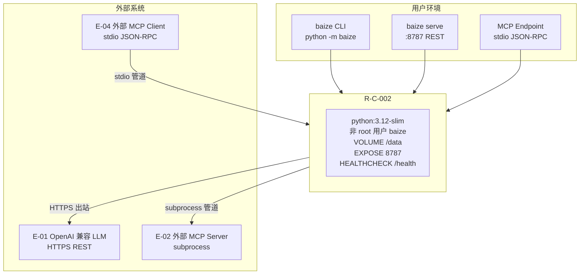

# AICoding 架构设计 · 部署设计

> 本文档为《AICoding 架构设计》核心产物之一，定位为**系统部署设计**。
> 上游输入：《系统设计》§5 部署架构 / §6 网络架构 / §7 安全设计、《高层架构设计》§4.2 系统名称与部署形态 / §5 业务架构、《material_digest》D17 Dockerfile / D18 ci.yml / D19 .env.example；
> 下游输出：环境与资源清单、CI/CD 流水线、监控告警、应急回滚等可落地的运维交付物。

---

## 0. 元信息

```yaml
标题: Baize Agent V25.0.0 - 部署设计 v0.1
版本: v0.1
状态: Draft（G5 结构检查 + 等价合规检查 + 人工审核待执行）
创建日期: 2026-08-20
编写人: platform-architect（毕落地）经主理人（齐构成）整合上游产出
审核人:
  - 齐构成（team-lead，G5 人工审核待执行）

上游依赖:
  - 高层架构设计.md §4.2（目标 25.0.0，部署形态维持现有 CLI+TUI+Web+REST+Docker+CI）/ §5 业务架构
  - 系统设计.md §5 部署架构 / §6 网络架构 / §7 安全设计（核心结论已锁定）
  - material_digest.md D17 Dockerfile / D18 ci.yml / D19 .env.example

适用范围: Baize Agent 是纯 Python 标准库、零第三方运行时依赖的单进程 CLI/库 + Docker 运行时。本文档裁剪了模板中不适用的云原生多服务章节（云资源清单的 CVM/MySQL/Redis/MQ 等），聚焦本地/Docker 部署、CI/CD 流水线、监控告警、回滚 SOP。
```

| 版本 | 日期 | 作者 | 变更内容 |
| --- | --- | --- | --- |
| v0.1 | 2026-08-20 | platform-architect（毕落地） | 初稿：基于系统设计 §5/§6/§7 核心结论扩展为可落地部署设计，裁剪不适用的云资源章节 |

---

## 1. 引言

### 1.1 适用范围与部署形态

**适用范围**：私有化（本地）/ Docker 容器化。Baize Agent 非公有云 SaaS，无云资源采购需求。

**目标部署形态**（V25 维持现有，高层架构 §4.2 D5 已锁定）：

| 形态 | 说明 | 适用场景 |
| --- | --- | --- |
| 本地 CLI/库 | `python -m baize run/serve/team` 直接运行 | 开发自测、单机使用、嵌入敏感场景 |
| Docker 容器 | `python:3.12-slim` 非 root 用户，VOLUME /data，EXPOSE 8787，HEALTHCHECK /health | 预发/生产、可移植部署、CI 冒烟 |
| REST serve | `baize serve --port 8787` 内建 HTTP | 本地服务化、被外部调用 |
| MCP Endpoint | stdio JSON-RPC 2.0（V25 新增） | 被 Claude Desktop/Cursor 等 MCP client 调用 |

> V25 不改变部署拓扑，仅新增 `baize mcp` / `baize team --roles` 子命令（高层架构 §4.2 D5）。

### 1.2 名词与缩写

| 名词 | 含义 |
| --- | --- |
| Baize | 白泽 Agent 运行时（纯 stdlib） |
| NO FAKE DONE | 诚实门禁：done 须有物理 evidence + Verifier 独立核验 |
| ext/ | 生态接入扩展层（延迟 import + fail-closed，核心永不 import） |
| MCP | Model Context Protocol（stdio JSON-RPC 2.0 + Content-Length 分帧） |
| JSONL | append-only 会话转录格式（崩溃不丢、可续跑） |
| fail-closed | 缺失依赖/配置时主动退出而非静默降级 |

---

## 2. 环境与资源清单

### 2.1 环境矩阵

| 环境 | 用途 | 集群隔离 | 数据 | 网络访问 |
| --- | --- | --- | --- | --- |
| dev | 开发自测 | 共享（本地 Python 3.10–3.13） | 模拟数据 | 内网 |
| int | 联调 | 共享（本地 baize serve :8787） | 模拟数据 | 内网 |
| uat | 预发/验收 | 独立（Docker 容器） | 仿生产 | 内网 |
| prod | 生产 | 独立（Docker 容器/本地 CLI） | 真实数据 | 公网出站（LLM）/ 内网入站 |

> 本系统为单进程 CLI/库形态，无集群概念。"集群隔离"列描述运行环境隔离方式（系统设计 §5.1）。

### 2.2 资源清单（本地/Docker，无云资源）

> **裁剪说明**：模板 §2.2 原含 CVM/MySQL/Redis/MQ/对象存储等云资源清单。Baize 为纯 stdlib 单进程运行时，无数据库/缓存/MQ/对象存储/API 网关——全部由 Python 标准库在进程内完成（红线 A）。本节仅保留实际涉及的资源类型。

#### 2.2.1 计算资源

| 资源编号 | 类型 | 规格 | 数量 | 环境 | 用途 |
| --- | --- | --- | --- | --- | --- |
| R-C-001 | 本地进程 | Python 3.10–3.13 | 1 | dev/int | CLI/库运行 |
| R-C-002 | Docker 容器 | python:3.12-slim，非 root，512MB | 1 | uat/prod | 容器化部署 |

#### 2.2.2 存储资源

| 资源编号 | 类型 | 容量 | 环境 | 用途 |
| --- | --- | --- | --- | --- |
| R-S-001 | 本地文件系统 | 1–5GB | dev/prod | JSONL 会话 + 持久记忆 + 技能库 + 日志 |
| R-S-002 | Docker VOLUME | /data | uat/prod | 容器持久化（会话/记忆） |

#### 2.2.3 网络资源

| 资源编号 | 类型 | 端口/协议 | 环境 | 用途 |
| --- | --- | --- | --- | --- |
| R-N-001 | 本地 HTTP | :8787 TCP | dev/int/prod | baize serve REST |
| R-N-002 | stdio 管道 | JSON-RPC 2.0 | dev/int/prod | MCP Endpoint（V25 新增） |
| R-N-003 | 出站 HTTPS | 443 TCP | prod | 调用 E-01 LLM 端点 |

#### 2.2.4 可观测资源

| 资源编号 | 类型 | 规格 | 环境 | 承载可观测维度 |
| --- | --- | --- | --- | --- |
| R-O-001 | 应用日志 | logging_setup.py 结构化 JSON + 脱敏 | 全部 | 应用运行日志 |
| R-O-002 | 会话日志 | JSONL append-only | 全部 | 会话事实转录（不可篡改） |
| R-O-003 | CI 日志 | GitHub Actions 默认 90 天 | GitHub | 构建测试日志 |
| R-O-004 | observability.py | span + 指标 + Prometheus 导出 | prod | 链路追踪 + 指标 |

#### 2.2.5 安全资源

| 资源编号 | 类型 | 规格 | 环境 | 用途 |
| --- | --- | --- | --- | --- |
| R-Sec-001 | .env 文件 | gitignored，API Key 管理 | 全部 | 密钥存储（BAIZE_MODEL_API_KEY） |
| R-Sec-002 | Docker 非 root | 用户 baize，/data 可写 | uat/prod | 容器权限隔离 |
| R-Sec-003 | 沙箱 | BAIZE_WORKSPACE_DIR 限制 + deny-list fail-closed | 全部 | 工具执行隔离 |

### 2.3 复用资源清单

> 无复用云资源。Baize 为独立项目，全部资源新建。

---

## 3. 部署拓扑与高可用设计

### 3.1 物理拓扑

#### 3.1.1 物理拓扑图



> 拓扑来源：系统设计 §5.4.1（已锁定）。

#### 3.1.2 拓扑要素清单

| 要素 | 取值 |
| --- | --- |
| 跨 Region 部署 | 否；Region 数量 1（单机/单容器） |
| 跨 AZ 部署 | 否；AZ 数量 1 |
| 流量入口路径 | 本地 CLI → baize 进程 / 外部 HTTP → baize serve :8787 / 外部 MCP client → stdio JSON-RPC |
| 内部调用路径 | 进程内 Python 调用（无服务发现） |
| 数据库访问路径 | 不适用（无数据库，文件系统直接访问） |

### 3.2 流量与网络链路（连通视图）

#### 3.2.1 流量入口链路

| 组件 (R-xx) | 协议 - 端口 | TLS 终结 | 作用 |
| --- | --- | --- | --- |
| baize serve (R-N-001) | HTTP - 8787 | 不适用（本地 HTTP，无 TLS） | REST API 入口 |
| MCP Endpoint (R-N-002) | stdio JSON-RPC 2.0 | 不适用（本地管道） | MCP 协议入口（V25 新增） |
| Docker HEALTHCHECK | HTTP - /health | 不适用 | 容器健康检查 |

> **TLS 决策**：baize serve 为本地 HTTP，无 TLS 需求。生产环境由用户自行配置反向代理（系统设计 §6.2.1 入口决策）。

#### 3.2.2 内部互联链路

| 项 | 说明 |
| --- | --- |
| 服务发现 | 不适用（单进程，无服务发现） |
| 服务间协议 | 进程内 Python 调用（无跨服务通信） |
| mTLS | 不启用（单进程无 mTLS 需求） |
| 数据库连接 | 不适用（无数据库） |
| 缓存连接 | 不适用（无缓存） |
| MQ 连接 | 不适用（无 MQ） |

#### 3.2.3 跨网络互联

> 不适用。单机/单容器部署，无跨 VPC/跨账号/跨 Region 互联。

### 3.3 高可用与故障容错

#### 3.3.1 故障域划分

| 故障域 | 影响范围 | 容错机制 | 预期 RTO |
| --- | --- | --- | --- |
| 单进程崩溃 | 当前 baize 进程 | JSONL 会话续跑（baize --resume） | < 30s |
| 单容器崩溃 | Docker 容器 | Docker 自动重启（HEALTHCHECK） | < 1 min |
| 单机故障 | 全部 baize 进程 | 用户手动恢复（git clone + baize doctor） | ≤ 5 min |
| 外部 LLM 不可达（E-01） | Agent 无法运行 | fail-closed exit 2（BD-03） | 取决于 LLM 恢复 |
| 外部 MCP server 不可达（E-02） | MCP 工具不可用 | fail-closed 报错（BD-01），核心循环不受影响 | 取决于 MCP server 恢复 |

> **可用性来源拆分**（系统设计 §5.2.4）：
> - 云厂商 SLA 兜底：GitHub（源码托管 99.9%）+ Docker Hub（镜像托管）
> - 本系统自身保障：业务逻辑容错（fail-closed / Verifier / chaos）/ 重试 / 降级
> - 强依赖外部故障策略：E-01 LLM 不可达 → fail-closed exit 2；E-02 MCP server 不可达 → fail-closed 报错

#### 3.3.2 负载均衡

> 不适用。单进程 CLI/库，无负载均衡。多实例部署由用户自行管理（如启动多个 baize serve 进程）。

#### 3.3.3 健康检查配置

| 项 | 取值 |
| --- | --- |
| 健康检查路径 | `GET /health`（baize serve 现有） |
| 频率 | Docker 默认 30s |
| 失败阈值 | Docker 默认 3 次 |
| 恢复阈值 | Docker 默认 1 次 |

#### 3.3.4 弹性伸缩配置

> 不适用。单进程 CLI/库，无弹性伸缩。副本区间 min 1 / max 1（系统设计 §5.2.2）。

#### 3.3.5 容灾切换配置

| 维度 | 取值 |
| --- | --- |
| 容灾级别 | 单机（本地 CLI/库）/ 单容器（Docker） |
| 故障切换 RTO | ≤ 5 min（git clone + baize doctor + 恢复会话目录） |
| 跨 Region 数据同步 | 不适用（单机/单容器，无跨 Region） |

---

## 4. 部署流程

### 4.1 代码仓库与分支

| 项 | 规范/值 | 说明 |
| --- | --- | --- |
| 代码仓库地址 | github.com/jianjian12138/baize-agent | pyproject.toml §project.urls |
| 分支管理 | main 为主干，feature 分支开发 | 个人/内部仓库，轻量分支策略 |
| 合并规范 | PR 合并到 main，CI 全绿后合并 | 跨 OS×Python 3.10–3.13 CI 必须通过 |
| 标签规范 | `v{major}.{minor}.{patch}`（如 v25.0.0） | 与 pyproject.toml version 一致 |

### 4.2 流水线（CI/CD）

> 现有 CI：`.github/workflows/ci.yml`（material_digest D18）。V25 在现有基础上新增静态 grep 门禁阶段。

| 阶段 | 触发条件 | 关键动作 | 失败处理 |
| --- | --- | --- | --- |
| 构建 | push/PR 自动触发 | checkout → setup-python（matrix 3.10–3.13） | 阻断后续 |
| **零依赖校验**（现有） | 构建后 | ast 扫描 baize/ 全部 import，发现非 stdlib 且非 baize 即 exit 1 | 阻断（红线 A） |
| **静态 grep 门禁**（V25 新增） | 构建后 | grep `^import baize\.ext` baize/*.py，命中即 exit 1 | 阻断（红线 A：核心永不 import ext） |
| Doctor | 零依赖校验后 | `python -m baize doctor` | 非 PASSED 阻断 |
| 单元测试 | Doctor 后 | `pytest tests/ -q --cov=baize --cov-report=xml` | 非全绿阻断 |
| 覆盖率门槛 | 测试后 | 解析 coverage.xml line-rate×100，低于阈值 exit 1 | 低于阈值阻断（详见 §4.5.4 待澄清 TC-2/TC-3） |
| 基准测试 | 测试后 | `baize bench` | 失败记录但不阻断（基准参考） |
| **ext 测试守卫**（V25 新增） | 测试后 | pytest ext/ 用 importorskip 守卫，缺失依赖 skip 不阻断 | 缺失依赖不阻断（fail-closed） |
| Docker 构建 | 测试通过 | docker build + docker run --version + doctor 冒烟 | 失败阻断 |
| 发布 | 人工触发（git tag） | GitHub Release + Docker Hub push | 失败重试 |

### 4.3 构建产物与制品管理

| 配置项 | 配置值/规则 | 说明 |
| --- | --- | --- |
| 产物类型 | Docker 镜像 + Python 源码包 | 无编译产物（纯 stdlib） |
| 镜像仓库 | Docker Hub（用户自行托管） | 个人/内部仓库 |
| 镜像命名 | `baize-agent:v{tag}`（如 v25.0.0） | 与 git tag 一致 |
| 镜像 LABEL | `version="25.0.0"`（V25 修正，X3） | Dockerfile LABEL 须统一 |
| 制品溯源 | 镜像 LABEL 含 version + git-commit + build-time | 便于反查源码 |
| 签名校验 | 不启用（个人/内部仓库） | 视社区反馈决定 |

### 4.4 配置管理

| 配置层级 | 存放位置 | 适用内容 | 变更生效 | 红线 |
| --- | --- | --- | --- | --- |
| L1 代码内 | 代码仓库 | 默认值、枚举、PROVIDER_CAPABILITIES | 重新部署 | 禁止写入环境差异/密码 |
| L3 环境变量/.env | .env（gitignored） | BAIZE_MODEL_BASE_URL/API_KEY/WORKSPACE_DIR/SKILL_LIBRARY_PATHS | 重启进程 | fail-fast exit 2（config_schema.py） |
| L4 Secret | .env（gitignored） | BAIZE_MODEL_API_KEY | 重启进程 | 禁止落日志/入代码/入 Git |

> 本系统无配置中心，配置由 L1/L3/L4 承载（系统设计 §5.1 配置策略）。

### 4.5 发布策略

#### 4.5.1 发布方式

| 模块 | 发布方式 | 说明 |
| --- | --- | --- |
| 全系统 | 滚动发布（git tag + Release） | 个人/内部仓库，无蓝绿/金丝雀需求 |

#### 4.5.2 发布标准流程

- **首次发布**：git clone → `pip install -e .`（或 docker build）→ 配置 .env → `baize doctor` → `baize run "目标"`
- **常规迭代**：git pull → `baize doctor` → `baize gate` → `pytest tests/` → 验证全绿 → 使用
- **资源变更**：修改 .env / Dockerfile → 重新构建镜像 → `baize doctor` 验证

#### 4.5.3 灰度路径与观测窗口

> 不适用。个人/内部仓库，无灰度需求。用户自行控制升级时机。

#### 4.5.4 发布门禁

| 门禁项 | 拦截条件 | 检查时机 |
| --- | --- | --- |
| 单元测试通过率 | 100%（422 passed / 1 skipped / 0 failed） | Build 阶段 |
| 零依赖校验 | baize/ 无非 stdlib import | Build 阶段（红线 A） |
| **静态 grep 门禁**（V25 新增） | baize/*.py 无顶层 `import baize.ext` | Build 阶段（红线 A） |
| Doctor 门禁 | PASSED | Build 阶段 |
| Gate 门禁 | manifest PASS + quality ≥ 0.8 | Build 阶段 |
| ext 测试守卫 | importorskip 守卫有效，缺失依赖 skip 不阻断 | Test 阶段 |
| 覆盖率门槛 | line-rate ≥ 阈值（TC-2/TC-3 待澄清） | Test 阶段 |
| Docker 冒烟 | --version + doctor 通过 | Docker 阶段 |
| 人工审批 | 至少 1 名 Owner | 生产发布前 |

> **待澄清（不阻塞 G5，实现期澄清）**：
> - **TC-2**：README 标 coverage UNKNOWN vs CI 强制 80% 行覆盖——口径张力（material_digest X4）
> - **TC-3**：CI 默认 80 / .env.example 85 / gate quality 0.7——三处阈值不一致（material_digest X5）

---

## 5. 监控告警接入

### 5.1 监控架构与数据流

```text
baize 进程 ──┬─► Metrics（observability.py span/指标）──► Prometheus 导出（用户自建）
             ├─► Logs（logging_setup.py JSON + 脱敏）──► 本地文件 / CLS（用户自建）
             └─► 会话（JSONL append-only）──────────────► 本地文件（R-S-001）
```

> 本系统为本地 CLI/库，无云监控接入。用户可自行对接 Prometheus/Grafana/CLS（observability.py 已支持 Prometheus 导出）。

### 5.2 关键 Dashboard 清单

| 大盘 | 用户 | 指标 |
| --- | --- | --- |
| 服务健康 | 维护者 | baize serve /health 状态、Docker HEALTHCHECK 状态 |
| Agent 循环 | 开发者 | max_steps 达成率、死循环检测触发次数、反思检查点触发次数 |
| LLM 调用 | 开发者 | LLM 请求 P50/P99 延迟、token 消耗、速率限制触发次数、fallback 触发次数 |
| MCP 调用（V25 新增） | 开发者 | MCP initialize P99 ≤ 5s、tools/call P99 ≤ 30s、fail-closed 触发次数 |
| ext 模块（V25 新增） | 维护者 | ext 模块加载成功率、fail-closed 跳过次数 |

### 5.3 告警规则清单

| 编号 | 级别 | 触发条件 | 关联资源 | Owner | Runbook |
| --- | --- | --- | --- | --- | --- |
| AL-01 | P1 | baize serve /health 连续 3 次失败 | R-C-002 | 维护者 | RB-01 |
| AL-02 | P1 | pytest 基线 422 不通过 | R-C-001 | 维护者 | RB-02 |
| AL-03 | P2 | LLM 请求 P99 > 10s 持续 5min | E-01 | 维护者 | RB-03 |
| AL-04 | P2 | MCP initialize P99 > 5s | E-02 | 维护者 | RB-04 |
| AL-05 | P3 | ext 模块 fail-closed 跳过率 > 50% | ext/ | 维护者 | RB-05 |
| AL-06 | P1 | 静态 grep 门禁失败（核心 import ext） | baize/ | 维护者 | RB-06 |

### 5.4 告警通道

| 级别 | 响应时间 | 通知方式 | 上升机制 |
| --- | --- | --- | --- |
| P1 | ≤ 30 min | GitHub Issue + IM | 1h 未响应升级至 Owner |
| P2 | ≤ 2 h | GitHub Issue | 4h 未响应升级至 Owner |
| P3 | ≤ 1 day | GitHub Issue | 次日处理 |

> 个人/内部仓库，无电话/短信告警通道。通过 GitHub Issue + 用户自建 IM 通知。

---

## 6. 应急与回滚

### 6.1 回滚机制

#### 6.1.1 回滚触发条件

- baize serve /health 连续失败（AL-01）
- pytest 基线 422 不通过（AL-02）
- 静态 grep 门禁失败（AL-06，红线 A 破坏）
- 用户反馈核心功能不可用

#### 6.1.2 回滚决策人

- 维护者可独立决定回滚
- 红线破坏（静态 grep 门禁失败）必须立即回滚

#### 6.1.3 回滚执行 SOP

| 对象 | 回滚方式 | 预计耗时 | 有损风险 |
| --- | --- | --- | --- |
| 应用版本 | git checkout 上一 tag → 重新构建 | ≤ 5 min | 无（JSONL 会话兼容） |
| 配置 | .env 恢复历史版本 | < 1 min | 无 |
| Docker 镜像 | docker pull 上一 tag → docker run | ≤ 5 min | 无 |
| 会话数据 | 不回滚（JSONL append-only，向后兼容） | — | 无 |

### 6.2 故障应急 Runbook

#### 6.2.1 Runbook 索引

| Runbook 编号 | 关联告警 | 故障场景 | Owner |
| --- | --- | --- | --- |
| RB-01 | AL-01 | baize serve 不可用 | 维护者 |
| RB-02 | AL-02 | pytest 基线不通过 | 维护者 |
| RB-03 | AL-03 | LLM 调用延迟过高 | 维护者 |
| RB-04 | AL-04 | MCP 握手超时 | 维护者 |
| RB-05 | AL-05 | ext 模块大面积 fail-closed | 维护者 |
| RB-06 | AL-06 | 静态 grep 门禁失败（红线 A 破坏） | 维护者 |

#### 6.2.2 RB-01：baize serve 不可用

- **症状**：/health 连续 3 次失败，Docker HEALTHCHECK 不通过
- **诊断**：
  1. `docker logs <container>` 查看应用日志
  2. `python -m baize doctor` 检查环境门禁
  3. 检查 .env 配置（BAIZE_MODEL_API_KEY 等）
- **缓解**：
  - 场景 A（配置错误）→ 修正 .env → 重启
  - 场景 B（进程崩溃）→ docker restart
  - 场景 C（磁盘满）→ 清理 BAIZE_SESSIONS_DIR 旧会话
- **升级**：30 min 未恢复 → GitHub Issue 通告

#### 6.2.3 RB-02：pytest 基线不通过

- **症状**：CI pytest 非 422/1skip/0fail
- **诊断**：
  1. 查看 CI 日志定位失败用例
  2. 本地复现 `pytest tests/test_<module>.py -v`
  3. 检查是否 ext 测试 collection 崩溃（norecursedirs 是否含 ext）
- **缓解**：
  - 场景 A（真实回归）→ git checkout 上一 tag 回滚
  - 场景 B（ext collection 崩溃）→ 补 importorskip 守卫
  - 场景 C（Windows 套接字抖动）→ 重跑确认（D6 §3 既有先例）
- **升级**：1h 未修复 → GitHub Issue + 暂停合并

#### 6.2.4 RB-06：静态 grep 门禁失败（红线 A 破坏）

- **症状**：CI 静态 grep 阶段 exit 1，baize/*.py 含顶层 `import baize.ext`
- **诊断**：
  1. 查看 CI 日志定位违规文件与行号
  2. 确认是否误写顶层 import（应为函数体内延迟 import）
- **缓解**：
  - 立即 git checkout 上一 tag 回滚
  - 修正违规 import 为函数体内延迟 import
  - 重跑 CI 确认门禁通过
- **升级**：红线破坏必须立即回滚，不得带病上线

---

## 7. 安全合规

### 7.1 上线前安全自检

| 编号 | 检查项 | 检查内容/标准 | 责任人 | 检查时机 | 是否通过 |
| --- | --- | --- | --- | --- | --- |
| 7.1.1 | 《安全设计》清单自检 | 安全设计 §1-§5 全覆盖 | 维护者 | 发布前 | 待检 |
| 7.1.2 | 零依赖校验 | ast 扫描 baize/ 无非 stdlib import | CI | Build | 自动 |
| 7.1.3 | 静态 grep 门禁 | baize/*.py 无顶层 import baize.ext | CI | Build | 自动 |
| 7.1.4 | Docker 非 root 校验 | Dockerfile USER baize（非 root） | 维护者 | 发布前 | 待检 |
| 7.1.5 | .env 不入 Git | .gitignore 含 .env | CI | Build | 自动 |
| 7.1.6 | 密钥扫描 | 源码/镜像无硬编码 API Key | 维护者 | 发布前 | 待检 |
| 7.1.7 | Dockerfile LABEL 版本 | LABEL version 与 pyproject.toml 一致 | 维护者 | 发布前 | 待检（X3 修正后） |

### 7.2 凭证与密钥清单

| 凭证编号 | 类型 | 存储方式 | 所有人 | 用途 |
| --- | --- | --- | --- | --- |
| CRED-01 | BAIZE_MODEL_API_KEY | .env（gitignored）+ 环境变量 | 维护者 | LLM 调用认证 |
| CRED-02 | GitHub PAT（如有推送需求） | 用户内存（不落盘） | 维护者 | 仓库元数据修改/推送 |

### 7.3 访问审计接入

| 审计源 | 去向 | 保留期 | 是否启用 |
| --- | --- | --- | --- |
| 应用日志（logging_setup.py） | 本地文件（R-S-001） | 用户管理（建议 ≥ 30 天） | 是 |
| 会话日志（JSONL） | 本地文件（R-S-001） | 用户管理 | 是 |
| CI 日志 | GitHub Actions | 90 天 | 是 |

---

## 8. 容量与成本

### 8.1 容量规划

#### 8.1.1 业务量预估

| 业务指标 | 当前值 | MVP 阶段值 | 生产阶段值 | 备注 |
| --- | --- | --- | --- | --- |
| GitHub star（代理用户数） | 1 | 50（3 个月目标） | 200+ | research_report R-03 |
| DAU | < 1 | 5–10 | 20–50 | 推算 |
| 峰值 QPS（baize serve） | 0 | 1–5 | 10–20 | 单进程 CLI/库 |
| 数据写入量/天 | < 1MB | 1–5MB | 5–20MB | JSONL 会话 + 记忆 |
| 数据存量 | < 50MB | 100MB | 500MB | 会话 + 记忆 + 技能库 |

#### 8.1.2 资源容量推算

| 资源 | 推算公式 | 当前配置 | 生产阶段配置 |
| --- | --- | --- | --- |
| 应用进程数 | 1（单进程） | 1 | 1 |
| 内存 | Python 进程 ~100MB + 会话/记忆 ~50MB | 256MB | 512MB |
| 磁盘 | 会话 JSONL + 记忆 + 技能库 + 日志 | 1GB | 5GB |
| Docker 镜像 | python:3.12-slim ~150MB + baize/ ~468KB | ~150MB | ~150MB |
| MCP subprocess | 每个 MCP server 1 个子进程 | 0–1 | 0–5 |

#### 8.1.3 扩容触发与路径

| 资源 | 扩容触发指标 | 扩容方式 | 扩容耗时 |
| --- | --- | --- | --- |
| 应用进程 | 用户启动多个 baize serve | 用户手动启动 | < 10s |
| 内存 | Python OOM | 升配（更大容器/机器） | < 30 min |
| 磁盘 | 磁盘空间不足 | 清理 BAIZE_SESSIONS_DIR 旧会话 / 升配 | < 5 min |
| MCP subprocess | MCP server 数量增加 | 每个 MCP server 1 个子进程 | < 5s/个 |

#### 8.1.4 容量水位线

| 资源 | 监控指标 | 健康 | 预警 | 危险 | 红线 |
| --- | --- | --- | --- | --- | --- |
| 内存 | 进程内存占用 | < 60% | 60–80% | > 80% | > 95% |
| 磁盘 | 磁盘使用率 | < 60% | 60–80% | > 80% | > 95% |

> 红线水位动作：触发限流（LLM 速率限制）/ 拒绝新会话（系统设计 §5.5.4）。

### 8.2 成本计算

| 资源 | 月度成本 | 年度成本 | 说明 |
| --- | --- | --- | --- |
| GitHub（源码托管） | 免费 | 免费 | 个人仓库 |
| Docker Hub（镜像托管） | 免费 | 免费 | 个人仓库 |
| 本地机器 | 用户自有 | 用户自有 | 本地运行 |
| LLM API 调用 | 按用量 | 按用量 | 用户自备 OpenAI 兼容端点 |

> Baize 本身零成本（纯 stdlib，无云资源采购）。唯一可变成本为 LLM API 调用费用（用户自备端点）。

---

## 附录 A：生成流程

### 流程总览

| 步骤 | 动作 | 落入章节 |
| --- | --- | --- |
| Step 0 | 读取模板 + 上游（系统设计 §5/§6/§7、高层架构 §4.2/§5、material_digest D17/D18/D19） | — |
| Step 1 | 裁剪不适用的云资源章节（CVM/MySQL/Redis/MQ 等），保留本地/Docker 资源 | §2 |
| Step 2 | 基于系统设计 §5.4 拓扑图与 §5.1 环境矩阵，扩展部署拓扑与高可用 | §3 |
| Step 3 | 基于现有 ci.yml + V25 新增门禁，扩展 CI/CD 流水线与发布策略 | §4 |
| Step 4 | 基于 observability.py + JSONL，扩展监控告警与应急回滚 | §5/§6 |
| Step 5 | 基于系统设计 §7 安全结论，扩展安全合规自检 | §7 |
| Step 6 | 基于系统设计 §5.5 容量规划，扩展容量与成本 | §8 |

### 整理原则

1. **裁剪优先**：Baize 为单进程 CLI/库，模板中云原生多服务章节（云资源清单的 CVM/MySQL/Redis/MQ、跨 VPC/跨 Region 互联、负载均衡、弹性伸缩等）不适用，整章/整节删除。
2. **上游一致**：所有部署结论与系统设计 §5/§6/§7 保持一致，引用时标注 §章节。
3. **V25 增量标注**：V25 新增内容（MCP Endpoint、静态 grep 门禁、ext 测试守卫）明确标注"V25 新增"。
4. **待澄清不阻塞**：TC-2/TC-3（覆盖率口径/阈值不一致）记录但不阻塞 G5，实现期澄清。

---

## 附录 B：硬指标清单

| 章节 | 硬指标 | 状态 |
| --- | --- | --- |
| 模板 | 覆盖模板全部一级标题（1-8 + 附录） | ✅ 已覆盖（不适用的云资源章节已裁剪并说明） |
| §1 | 适用范围与部署形态明确 | ✅ 4 种形态 + V25 不改变拓扑 |
| §2 | 环境矩阵 + 资源清单（计算/存储/网络/可观测/安全） | ✅ 5 类资源全覆盖 |
| §3 | 物理拓扑图 + 拓扑要素 + 故障域 + 高可用 | ✅ mermaid 图 + 故障域表 + RTO |
| §4 | 代码仓库 + CI/CD 流水线 + 构建产物 + 配置管理 + 发布策略 + 发布门禁 | ✅ 全覆盖，含 V25 新增门禁 |
| §5 | 监控架构 + Dashboard + 告警规则 + 告警通道 | ✅ 5 个 Dashboard + 6 条告警 + 3 级通道 |
| §6 | 回滚机制 + Runbook | ✅ 4 类回滚 + 6 条 Runbook（RB-01/02/06 详写） |
| §7 | 上线前安全自检 + 凭证清单 + 审计接入 | ✅ 7 项自检 + 2 凭证 + 3 审计源 |
| §8 | 容量规划 + 成本计算 | ✅ 业务量预估 + 资源推算 + 水位线 + 成本（零成本） |
| 全文 | 无残留模板占位符 | ✅ 无 `<...>`/`示例：`/`YYYY-MM-DD`/`[待补充]` 残留 |
| 全文 | 引用上游可溯源 | ✅ 标注系统设计 §章节 / 高层架构 §章节 / material_digest D编号 / X编号 |
