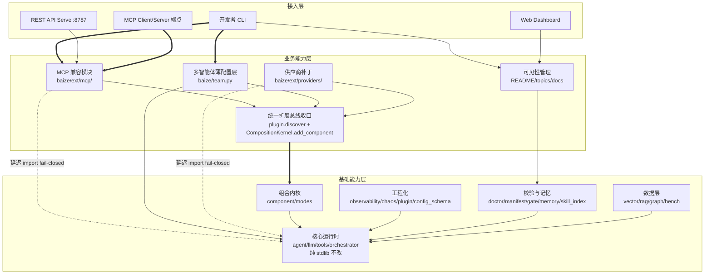
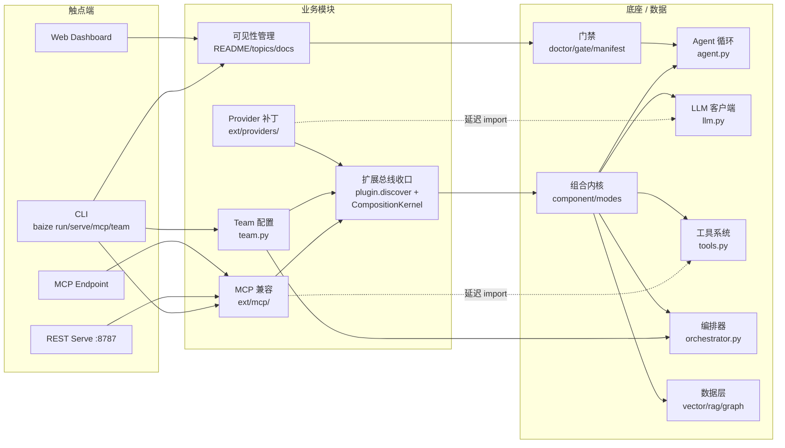

# AICoding 架构设计 · 高层架构设计

> 本文档为《AICoding 架构设计》核心产物之一，对应**高层架构设计模版**。
> 上游输入：业务原始诉求（"启动 AICoding 架构专家团，分析我们 agent，并给出升级计划"）+ 行业调研结论（research_report.md）+ 现有架构资料摘要（material_digest.md）；
> 下游输出：驱动《系统设计》《部署设计》《安全设计》《UserStory》四份文档的撰写。

---

## 0. 元信息：修订记录

> 记录文档版本、变更内容、修订人、修订时间，确保设计文档的可追溯。

```yaml
标题: Baize Agent V25 升级计划 - 高层架构设计 v0.2
版本: v0.2
状态: Draft   # Draft | Reviewing | Approved | Deprecated
创建日期: 2026-08-19
最后更新: 2026-08-19
作者: business-architect（许边界）
评审人:
  - 齐构成（team-lead，G3 人工审核待执行）

关联文档:
  上游输入:
    - 业务原始诉求: 「启动 AICoding 架构专家团，分析我们 agent，并给出升级计划」
    - 资料摘要: .workbuddy/output/material_digest.md（G1 已通过，含 Baize V24.0.0 现状能力/差异化护城河/已识别缺口/约束红线 A-E/冲突 X1-X7）
    - 行业调研报告: .workbuddy/output/research_report.md（G2 已通过，含 5 竞品加权评分/B0-B5 标杆/R-01~R-06 风险/U-01~U-04 待确认项）
  下游产出:
    - 系统设计: AICoding架构设计-2-系统设计.md
    - 部署设计: AICoding架构设计-3-部署设计.md
    - 安全设计: AICoding架构设计-4-安全设计.md
    - UserStory: AICoding架构设计-5-UserStory.md
```

| 版本 | 日期 | 作者 | 变更内容 | 评审状态 |
| --- | --- | --- | --- | --- |
| v0.1 | 2026-08-19 | business-architect（许边界） | 初稿：基于 material_digest（D1-D20）+ research_report（B0-B5/Q1-Q5/R-01~R-06）逐章填充高层架构设计，定义 V25 升级范围/MVP/业务闭环/约束红线 | Draft |
| v0.2 | 2026-08-19 | business-architect（许边界） | U-03 版本号经中间确认裁决定稿：用户裁决 bump 至 25.0.0（候选方案 B），全部版本字符串字段填充 25.0.0 并标注"经中间确认"，删除"待用户裁决"标注；§2/§3/§5/§6 内容不变 | Draft |

> **版本管理纪律**：破坏性变更（章节结构调整 / 关键决策反转）升 MAJOR；新增章节、扩充内容升 MINOR。
>
> **U-03 版本号裁决说明（经中间确认·已定稿）**：本文档中 V25 目标版本号定稿为 **25.0.0**。该决策经《中间确认协议》§2.1+§2.3 自检命中后向主理人发起 `[中间确认]`（详见附录 C.1），用户经 AskUserQuestion 单题弹窗裁决 = **bump 至 25.0.0（候选方案 B）**。裁决理由：①项目惯例 V{N}→{N}.0.0 映射（V22/V23/V24→24.0.0），V25→25.0.0 一致；②V25 引入 MCP 生态接入为显著功能增量，major bump 语义合理；③用户/主理人均以"V25"指代升级，版本号对齐避免认知割裂。该决策仅影响版本字符串字段（§0/§1.1/§4.2），不影响架构实质内容。本阶段不再就 U-03 论题再次发起 `[中间确认]`。

---

## 1. 需求概要

### 1.1 需求概要说明

> 一句话描述本期需求要解决的核心业务问题、覆盖的业务场景与服务对象。

**填写要点**（≤ 200 字，包含 3 个要素）：

1. **业务现状**：Baize Agent V24.0.0 是纯 Python 标准库、零第三方运行时依赖的白盒工程化自主 Agent 运行时，已完成系统瘦身与统一化（422 passed / 1 skipped / 0 failed），但 GitHub 可见性极低（star=1，与竞品差距 5 个数量级），且 MCP 兼容为真缺口（V24 瘦身已删除 mcp.py，manifest V69 skipped）（D1 §状态与验证 / D7 §驱动背景 / D8 §0）。
2. **触发事件**：用户诉求"启动 AICoding 架构专家团，分析我们 agent，并给出升级计划"——MCP 已成 2025 年事实标准（97M 月下载、10K+ 活跃 server、跨厂商采纳，2025-12 捐赠 Linux Foundation AAIF），同基因竞品 Hermes Agent（232k stars + MCP 内置）正在快速占领赛道，Baize 若不接入 MCP 生态将彻底边缘化（research_report §2.3 / R-06）。
3. **系统定位一句话**：本次升级是**既有 Agent 运行时（V24.0.0）的生态接入 + 可见性增强**，不新建系统、不破坏零依赖红线，在保持核心 `baize/` 纯 stdlib 的前提下，通过 `baize/ext/` 延迟 import + fail-closed 机制接入 MCP 生态、补齐多智能体薄配置层、修补供应商适配器真实缺口，同时修正文档/版本号陈旧问题恢复技术资产可见性。

### 1.2 关键决策摘要

> 列出本期最关键的 3 ~ 5 项设计决策（含范围决策、技术选型决策、MVP / 完整版边界决策）。

| 编号 | 决策类别 | 决策内容 | 关联章节 |
| --- | --- | --- | --- |
| D1 | 范围决策 | V25 范围 = P0 元数据止血 + P1 README 重写 + P2 MCP 兼容 + P5 多智能体薄配置层 + P3 供应商补丁（降级版）；P4 稠密向量后端推迟 V26。依据 research_report §4.2 + D8 §修订后范围（P2>P5>P3 降级>P4 推迟） | §6.1 需求边界 |
| D2 | 技术选型决策 | MCP 采用纯 stdlib 实现（subprocess + json + 管道，JSON-RPC 2.0 Content-Length 分帧 + initialize 握手），集成点复用现有 ToolRegistry；统一扩展总线收口到 plugin.discover + CompositionKernel.add_component，禁各阶段自起 import baize.ext.X | §3.2 / §4 / §5.2 |
| D3 | MVP / 完整版边界 | MVP（V25）= P0+P1+P2+P5+P3 补丁 + 统一扩展总线收口；完整版（V26）= + P4 稠密向量后端 + P3 非 OpenAI 兼容厂商重适配 + ext 大规模扩张。MVP 架构骨架是完整版子集，ext/ 延迟 import 机制可平滑继承 | §4.3 |
| D4 | 复用 vs 新建 | 核心运行时（baize/ 40 模块）全部复用不改；llm.py 既有 OpenAI/Anthropic/Ollama 适配器留原位不动；orchestrator+team_memory 复用仅加薄配置层；vector.py 既有 get_backend() 工厂扩展非新造。仅 MCP（V24 已删）为真新建 | §5.2 / §2.4 |
| D5 | 部署形态 | 维持现有部署形态不变（CLI + TUI + Web Dashboard + REST serve + Docker 非 root + CI 跨 OS×Python 3.10-3.13），V25 不改变部署拓扑，仅新增 `baize mcp` / `baize team --roles` 子命令 | §4.2 / 部署设计 |

**硬指标**：≥ 3 条，≤ 5 条；每条决策必须能映射到正文具体章节。 ✅ 5 条，每条已映射章节。

### 1.3 价值主张

> 明确本系统/本期需求对业务的核心价值贡献（效率、合规、收入、成本、体验等维度）。

| 价值维度 | 量化目标 | 度量指标 | 当前值 | 目标值 | 截止时间 |
| --- | --- | --- | --- | --- | --- |
| 效率 | MCP 生态接入后，Baize 可调用外部 MCP server 工具 + 暴露自身 skills 给 Claude Desktop/Cursor | 可对接的 MCP server 数量（经真实联调验证） | 0（V24 已删 mcp.py，D2 V69 skipped） | ≥ 1 个真实参考 server（如 Anthropic 官方 filesystem MCP server）联调通过 | V25 MVP 上线 |
| 合规 | provider_capabilities 如实上报各供应商真实能力，消除假绿 | provider_capabilities 返回值与实际能力一致率 | 0%（恒返 stream/tools=True，D8 §P3 修正②） | 100%（每个供应商如实报 stream/tools 布尔值） | V25 MVP 上线 |
| 收入 | GitHub 可见性改善后技术资产可被发现，吸引目标用户（安全/审计/嵌入敏感场景） | GitHub stargazers 数 | 1（D7 §驱动背景 / SR-01） | ≥ 50（V25 上线后 3 个月，research_report R-03 评估为持续改善非一蹴而就） | V25 上线后 3 月 |
| 成本 | MCP 兼容纯 stdlib 实现，不引入第三方运行时依赖 | 运行时第三方依赖数 | 0（D3 dependencies=[]） | 0（红线 A 不破，ext/ 延迟 import + fail-closed） | V25 MVP 上线 |
| 体验 | 文档/版本号全量统一，消除陈旧误导 | 文档版本号与现行版本一致率 | ~40%（D10 V19 / D17 LABEL 20.0.0 / D19 V19 / D20 V19 / README 误数 448→422，D7 P1 / X2 / X3） | 100%（全部文档/镜像/配置头部版本号统一为 V25） | V25 MVP 上线 |

**硬指标**：业务价值 ≥ 2 条 + 技术/成本价值 ≥ 1 条；每条必须可量化，禁止出现"提升 / 优化 / 加强 / 更好"等模糊词。 ✅ 5 条（效率/合规/收入/成本/体验各 1 条），全部可量化。

---

## 2. 需求分析 & 痛点解构

### 2.1 核心角色关注点

> 按"甲方决策者 / 最终用户 / 受影响方"维度盘点角色诉求。

| 角色 | 业务身份 | 主要操作 | Top1 关心点 | 来源 |
| --- | --- | --- | --- | --- |
| 甲方决策者：项目维护者 | 个人/内部仓库 owner（jianjian12138） | 决策升级范围 / 审阅架构 / 推进 V25 落地 | 技术资产可见性与生态定位——稀缺的零依赖+NO FAKE DONE 能力不可见（star=1），竞品 Hermes 232k stars 正在占领同基因赛道 | material_digest D7 §驱动背景 / D1 §Why Baize |
| 最终用户 A：Agent 开发者 | 使用 Baize 做安全/审计/嵌入敏感场景的开发者 | baize run / baize serve / 自定义组件 / 接入 MCP server | MCP 兼容——竞品均已支持 MCP（LangChain/Dify/CrewAI/Hermes 均有），Baize V24 已删 mcp.py 无法对接 MCP 生态 | research_report §2.3 MCP 维度 / D8 §P2 |
| 最终用户 B：安全/合规审计人员 | 审计 Baize 运行时供应链安全与门禁可信度 | baize doctor / baize gate / 审查 manifest 证据 / 审计 baize/ 依赖 | 零依赖红线不可破——升级不得引入第三方运行时依赖，ext/ 必须 fail-closed，审计面须保持极小（~468KB stdlib） | material_digest 红线 A / D1 §核心原则⑧ / D9 §4① |
| 受影响方：开源社区贡献者 | 潜在 GitHub 贡献者 / 技能生态扩展者 | 阅读 README / clone / baize index build / 写组件 / 贡献技能 | 文档准确性与可上手性——多文档版本号陈旧（V19/V20）、README 有误数（448→422）、覆盖率口径矛盾（UNKNOWN vs CI 80% 门槛），误导新贡献者 | material_digest X2/X3/X4/X5 / D7 P1 |
| 受影响方：下游嵌入方 | 将 Baize 作为规约包加载的 Claude Code/Codex/WorkBuddy 等 | 加载 AGENT.md/SKILL.md / baize serve REST / baize mcp server | 扩展总线一致性——P2-P5 若各自 import baize.ext.X 会把 plugin/component 扩展机制碎成平行山头，嵌入方无法统一对接 | material_digest D8 §统一收口 / D4 §组合内核 |

**硬指标**：≥ 3 类（甲方决策者 / 最终用户 / 受影响方各至少一行）；每行必须有"Top1 关心点"，禁止笼统写"使用方便"。 ✅ 5 类角色（甲方决策者 1 + 最终用户 2 + 受影响方 2），每行有具体 Top1 关心点。

### 2.2 核心痛点

> 以 P1 / P2 / P3 ... 的优先级编码，列出本期需要解决的关键痛点。

| 编号 | 痛点描述 | 现象 / 数据 | 影响角色 | 影响程度 | 优先级 |
| --- | --- | --- | --- | --- | --- |
| P1 | MCP 兼容为真缺口，Baize 无法接入 2025 年事实标准生态 | V24 瘦身已删除 mcp.py（D2 V69=skipped，真孤儿零接线）；竞品 LangChain/Dify/CrewAI/Hermes 均已支持 MCP（research_report §2.3）；MCP 月下载 97M、活跃 server 10K+、跨厂商采纳（SR-18/SR-19） | 最终用户 A / 甲方决策者 | 高（生态边缘化风险——Hermes 232k stars + MCP 内置正在占领同基因赛道，R-06） | P1 |
| P2 | GitHub 可见性极低，技术资产不可发现 | star=1、forks=0（D7 §驱动背景 / SR-01）；竞品 star 范围 57k-233k（research_report §2.3），差距 5 个数量级；topics 已设 6 个但 description/版本号已部分更新（U-01，P0 或已部分执行） | 甲方决策者 / 受影响方：社区贡献者 | 高（错失 GitHub 发现流与潜在贡献者，技术资产持续不可见） | P1 |
| P3 | 文档/版本号陈旧，多文档与现行 V24 严重错配 | 操作手册仍 V19.0.0（69 测试/91% 覆盖，D10）；Dockerfile LABEL 20.0.0（D17）；.env.example 头 V19（D19）；benchmarks V19（D20）；README 旧版有误数"448 passed/87.6%"→实际 422/1skip/0fail（D7 P1 / X2 / X3） | 受影响方：社区贡献者 / 最终用户 A | 中（误导读者，降低可信度，阻碍上手） | P2 |
| P4 | 扩展总线碎片化风险：P2-P5 各自接入将碎成平行山头 | D8 §统一收口指出：若 P2-P5 各自 import baize.ext.X，会把 plugin.py/component.py 扩展机制碎成三条平行山头；V25 须做一处基础设施改动统一收口 | 受影响方：下游嵌入方 / 最终用户 A | 高（维护成本倍增，扩展机制割裂，违反 D8 §统一收口建议） | P1 |
| P5 | provider_capabilities 假绿，违反 NO FAKE DONE 红线 B | llm.py provider_capabilities 恒返 stream/tools=True（D8 §P3 修正②）；实际 Anthropic 流式未实装且 max_tokens 硬编码 4096 易截断、DeepSeek reasoner reasoning_content 未捕获 | 最终用户 A / 最终用户 B | 中（用户误判供应商能力，违反红线 B 不假绿） | P2 |

**优先级标准**：
- **P1**：直接影响业务核心流程或合规底线，不解决无法上线。
- **P2**：影响用户体验或运营效率，可在 MVP 后迭代。
- **P3**：体验型 / 长尾问题，列入完整版或后续版本。

**硬指标**：每条痛点必须有"现象 / 数据"佐证；P1 ≥ 1 条且必须在 §2.3 有对应目标。 ✅ 5 条痛点全部有数据佐证；P1 共 3 条（P1 MCP 缺口 / P2 可见性 / P4 扩展总线碎片化），均在 §2.3 有对应目标。

### 2.3 期待目标

> 以 V1 / V2 / V3 ... 的形式列出可量化的业务目标，对齐核心痛点。

| 编号 | 目标描述 | 对齐痛点 | 度量指标 | 当前值 | 目标值 | 截止时间 |
| --- | --- | --- | --- | --- | --- | --- |
| V1 | MCP 双向兼容：可调外部 MCP server（client）+ 暴露 baize skills 给外部（server），经真实参考 server 联调验证 | P1 | 真实联调通过的 MCP server 数 | 0 | ≥ 1（Anthropic 官方 filesystem MCP server 联调通过） | V25 MVP 上线 |
| V2 | GitHub 可见性改善：topics 补全 + README 修正 + EN hero + benchmarks 对标行 | P2 | GitHub topics 数 / star 数 | topics=6 / star=1 | topics ≥ 10 / star ≥ 50 | V25 上线后 3 月 |
| V3 | 文档/版本号全量统一：全部文档/镜像/配置头部版本号一致，覆盖率如实标 UNKNOWN 或真跑给实数 | P3 | 文档版本号一致率 | ~40% | 100% | V25 MVP 上线 |
| V4 | 统一扩展总线收口：P2-P5 全部经 plugin.discover + CompositionKernel.add_component 接入，禁各阶段自起 import | P4 | 静态 grep 门禁：baize/*.py 无顶层 import baize.ext 的通过率 | 无此门禁 | 100%（CI 强制） | V25 MVP 上线 |
| V5 | provider_capabilities 如实上报 + 核心适配器真实缺口修补 | P5 | provider_capabilities 与实际能力一致率 | 0% | 100% | V25 MVP 上线 |

**硬指标**：每条目标必须**有数字 + 对齐至少 1 条痛点**；P1 痛点必须有对应 V 级目标。 ✅ 5 条目标全部有数字 + 对齐痛点；P1 痛点对应 V1/V4，P2 对应 V2，P3 对应 V3，P5 对应 V5。

### 2.4 基线复用

> 现有架构 / 现有能力中可直接复用的组件、平台、模型、数据资产。

| 复用类别 | 现有能力 | 复用方式 | 来源系统 | 备注 |
| --- | --- | --- | --- | --- |
| 核心运行时 | baize/ 40 个纯 stdlib 模块（agent/llm/tools/orchestrator/team_memory 等） | 全部复用不改，V25 不触碰核心调用链 | baize/（D4） | 红线 A：核心永远纯 stdlib；CI ast 扫描强制校验（D18） |
| LLM 客户端 | llm.py 已有 OpenAI/Anthropic/Ollama 纯 stdlib 适配器 + BAIZE_MODEL_ROUTER 多模型路由 | 复用不动，P3 仅补真实缺口（Anthropic 流式/DeepSeek reasoner/provider_capabilities 如实上报） | baize/llm.py（D4 §内核-llm / D2 V73 / D8 §P3） | X6 确认计划低估主干既有能力；既有适配器留 llm.py 不动，ext 只放非 OpenAI 兼容厂商薄适配 |
| 多智能体编排 | orchestrator Director→Executor→Verifier（独立核验）+ team_memory 协作白板 + baize team 已存在 | 复用 Verifier+TeamMemory，P5 仅加 baize/team.py 薄配置层（role→system_prompt+tools 映射） | baize/orchestrator.py + team_memory.py（D4 §内核 / D5 baize-orchestrator spec / D8 §P5） | D8 §P5 确认勿重写；team.py 挂现有 team 子命令 --roles |
| 向量检索 | vector.py 已有 get_backend() + TfidfIndex + EmbeddingBackend 后端工厂 | 复用工厂，P4（V26）扩展 get_backend() 懒探测 ext/vector_backends；V25 仅修 rag.py 走工厂 | baize/vector.py（D4 §数据层-vector / D8 §P4） | X7 确认另造 VectorBackend=两层平行抽象腐烂；默认 TF-IDF 是真词法检索非假 RAG |
| 组合内核 | component.py CompositionKernel（9 类 Kind 配置驱动装配 fail-closed）+ plugin.py HookRegistry（自动发现防御隔离） | 复用，V25 统一扩展总线收口到此路径 | baize/component.py + plugin.py（D4 §组合内核 / D13 教程08 / D8 §统一收口） | 全部生态接入经 plugin.discover + CompositionKernel.add_component，禁各阶段自起 import |
| 工程门禁 | manifest（NO FAKE DONE 证据物理核验）+ gate（quality 五维评分）+ doctor（环境门禁）+ pytest 422 基线 | 复用，V25 新增静态 grep 门禁 + ext 测试 importorskip 守卫 | baize/manifest.py + gate.py + doctor.py（D4 §校验与记忆 / D6 §4） | V24 gate quality 0.875 PASS（D6 §4）；422 passed 基线不可破（红线 B） |
| 技能生态 | 三技能库（assets/skills 23 + picasso-dev-skill 7 + skills/ 约220），skill_index 3 源去重，渐进披露 | 复用不改，V25 不动技能库结构 | assets/skills/ + skill_index.py（D12 / D15 / D4 §校验与记忆） | 唯一技能 249-250（X1 口径待统一，U-04 建议以 baize skill audit 实时输出为准） |
| 部署与 CI | CLI + TUI + Web Dashboard + REST serve + Docker 非 root + CI 跨 OS×Python 3.10-3.13 | 复用不改，V25 仅新增 baize mcp / baize team --roles 子命令 | Dockerfile + ci.yml + serve.py（D17 / D18 / D4 §交互层） | Dockerfile LABEL 20.0.0 须修正为 V25（X3） |
| 交互层 | TUI 进度渲染 + Web 仪表盘 + 内建 REST serve | 复用不改 | baize/ui.py + dashboard.py + serve.py（D4 §交互层） | V25 不新增触点端 |

**硬指标**：必须先盘点再决定新建；凡列入"功能缺口"的能力，必须先在本节确认基线无法覆盖。 ✅ 9 类基线已盘点；唯一新建项 = MCP（V24 已删 mcp.py，基线确实无法覆盖，见 §2.5）。

### 2.5 功能缺口

> 在现有基线之上仍需新建的功能能力（按业务阶段维度分组）。

| 阶段 | 功能缺口 | 必要性 | 优先级 | 对齐目标 |
| --- | --- | --- | --- | --- |
| 可见性止血阶段 | P0 GitHub 元数据补全（topics 补 mcp/no-fake-done/white-box/auditable + 开 Discussions + 记录 before/after） | 必须 | MVP | V2 |
| 可见性止血阶段 | P1 README 重写 + 文档/版本号全量统一（修正误数 448→422、补 V24 说明、Dockerfile/.env.example/benchmarks 版本号统一） | 必须 | MVP | V3 |
| 生态接入阶段 | P2 MCP 兼容（baize/ext/mcp/：纯 stdlib stdio JSON-RPC 2.0 Content-Length 分帧 + initialize 握手 + client/server 双向 + 集成到 ToolRegistry） | 必须 | MVP | V1 |
| 生态接入阶段 | P5 多智能体薄配置层（baize/team.py：roles.yaml role→system_prompt+tools 映射为 Orchestrator Agent(role=...) 调用，复用 Verifier+TeamMemory） | 必须 | MVP | V4 |
| 生态接入阶段 | P3 供应商补丁（Anthropic 流式实装 + DeepSeek reasoner reasoning_content 捕获 + provider_capabilities 如实上报 + ext/providers/ 仅放非 OpenAI 兼容厂商薄适配） | 必须 | MVP | V5 |
| 基础设施阶段 | 统一扩展总线收口（全部生态接入经 plugin.discover + CompositionKernel.add_component，静态 grep 门禁 baize/*.py 无顶层 import baize.ext） | 必须 | MVP | V4 |
| 质量保障阶段 | ext 测试守卫（pytest.importorskip + pyproject norecursedirs 补 ext） | 必须 | MVP | V4 |
| 推迟阶段 | P4 稠密向量后端（扩展 get_backend() 懒探测 ext/vector_backends，llama_index/chromadb 可选 import；rag.py 改走 get_backend()；README 诚实标 lexical retrieval） | 可延后 | V26 | — |
| 推迟阶段 | P3 非 OpenAI 兼容厂商重适配（gemini/bedrock 重后端） | 可延后 | V26 | — |

**硬指标**：每条缺口必须对齐 §2.3 至少一条目标；MVP 缺口必须在 §6.3 功能清单中对应有 MVP 范围标记。 ✅ MVP 缺口全部对齐目标（V1-V5）；P4/P3 重适配推迟 V26 在 §6.3 标记为完整版范围。

---

## 3. 行业调研

### 3.1 行业标杆系统分析

> 对标行业内代表性产品/系统，输出标签化清单（场景覆盖、技术亮点、商业模式等）。

| 标杆系统 | 厂商 / 来源 | 场景覆盖 | 技术亮点 | 商业模式 | 适用度 |
| --- | --- | --- | --- | --- | --- |
| LangChain | langchain-ai（公司） | 全场景 Agent 工程平台（生态最广） | 70+ 模型供应商 + 1000+ 集成 + LangGraph 编排 + MCP 适配器（langchain-mcp-adapters，MCP server→Tool，支持 stdio/SSE/streamable_http） | 开源 MIT + SaaS 订阅（LangSmith） | 高（MCP 适配器模式可借鉴） |
| Dify | langgenius（公司） | LLM 应用开发平台（可视化 + RAG + Agent） | 可视化工作流 + 原生 MCP 集成（client + server 双向）+ 50+ 模型供应商 + 内置 RAG 管道 | 开源（Other 许可）+ SaaS 订阅 | 中（MCP 双向模式可参考，技术栈不借鉴） |
| CrewAI | crewAIInc（公司） | 多智能体协作编排（角色制团队 + 事件驱动 Flow） | Crews（角色制）+ Flows（事件驱动）+ 原生 MCP server 支持（v1.10.x）+ 内置 Tracing | 开源 MIT + SaaS 订阅 | 高（角色定义模式对 P5 有直接参考） |
| Hermes Agent | NousResearch（实验室） | 自我进化 Agent（跨平台消息网关 + 技能自创建） | 闭环学习循环 + 三层记忆 + MCP 内置（配置文件数行接入）+ 19 平台网关 + RL 训练管线 | 开源 MIT | 高（同基因，MCP 配置化集成 + 技能 Curator 可借鉴） |
| DeepSeek Harness | deepseek-ai（公司） | 插件优先 Agent 运行时（编码代理 + 模型评估） | Cordis 元框架「一切皆插件」+ 追加式会话日志全链路可追溯 + 4 运行时模式 + 模型路由插件化 | 开源 MIT | 中（统一扩展总线收口思路可借鉴，TypeScript 不兼容） |

> 补充参考（未做独立详述，列入行业景观供按需取用）：AutoGPT（186,687 stars，重依赖无可验证门禁，定性否决）/ MetaGPT（69,898 stars，SOP 驱动多智能体）/ Pi Agent（TypeScript 极简编码 Agent，Baize 设计上游之一，刻意不内置 MCP）/ smolagents（28,884 stars，~1000 行 CodeAgent，非零依赖）（research_report §2.1 补充参考）。

**硬指标**：≥ 3 家；至少包含 1 家头部 SaaS + 1 家开源/自研代表。 ✅ 5 家详述（LangChain/Dify/CrewAI 为头部 SaaS/平台代表；Hermes Agent/DeepSeek Harness 为开源自研代表），另有 4 家补充参考。全部数据来源 research_report §2.1-§2.2（B1-B5 + SR-01~SR-25）。

### 3.2 方案对标及优先级打分

> 横向对比矩阵 + 打分结果，得出对本期最具参考价值的方案集合。

**对比矩阵**（每行权重之和 = 1）：

| 评估维度 | 权重 | 权重理由 | Baize 得分 | LangChain 得分 | Dify 得分 | CrewAI 得分 | Hermes 得分 | DSH 得分 |
| --- | --- | --- | --- | --- | --- | --- | --- | --- |
| MCP 兼容与生态接入 | 0.25 | V25 P2 最高优先级；MCP 已成 2025 事实标准（97M 月下载），Baize 此项为真缺口 | 1 | 5 | 5 | 4 | 5 | 3 |
| 零依赖 / 可审计面 | 0.20 | Baize 护城河核心 + 红线 A 硬约束；此项决定 niche 不可替代性，过滤所有借鉴决策 | 5 | 1 | 1 | 2 | 2 | 2 |
| 多智能体编排能力 | 0.15 | V25 P5 优先级（薄配置层复用 orchestrator）；评估竞品角色制/事件驱动对 P5 借鉴价值 | 4 | 4 | 3 | 5 | 3 | 3 |
| RAG / 向量后端成熟度 | 0.15 | V25 P4 优先级（推迟 V26）；评估竞品稠密向量/RAG 管道对 P4 参考价值 | 2 | 5 | 5 | 2 | 3 | 2 |
| GitHub 可见性与社区规模 | 0.25 | V25 P0/P1 最高 ROI；Baize star=1 vs 竞品 57k-233k，差距 5 个数量级 | 1 | 5 | 5 | 4 | 5 | 5 |
| **加权总分** | **1.00** | — | **2.40** | **4.05** | **3.90** | **3.45** | **3.80** | **3.15** |

> Baize 加权总分 2.40 为五家最低，但零依赖/可审计面 5/5 为唯一满分——这正反映 V25 要解决的短板（MCP 兼容 + GitHub 可见性），而非 Baize 整体劣于竞品。数据来源：research_report §3.1（SR-01~SR-06 GitHub API 2026-08-19 获取）。

**结论摘要**：
- **优先借鉴**：**LangChain（4.05 分）+ Hermes Agent（3.80 分）** —— LangChain 的 MCP 适配器模式（MCP server→ToolRegistry 工具包装）可直接借鉴到 Baize P2 的 register_mcp_client→ToolRegistry 路径；Hermes 的 MCP 配置化集成（数行配置接入外部 server）与 Baize 的 ext/fail-closed 理念高度契合，且同基因（Python、自进化技能、JSONL 会话）借鉴成本低。零依赖 1-2/5 否决整体技术栈借鉴，仅借鉴 MCP 集成模式。
- **部分借鉴**：**Dify（3.90 分）+ CrewAI（3.45 分）+ DeepSeek Harness（3.15 分）** —— Dify 借鉴 MCP 双向模式（Baize P2 需 client+server）+ RAG 管道设计（对 P4 V26 有参考）；CrewAI 借鉴角色定义模式（role→system_prompt+tools 对 P5 薄配置层有直接参考，D8 §P5 已建议此路径）；DSH 借鉴「一切皆插件」统一扩展总线收口思路（与 D8 §统一收口一致）。不借鉴部分：整体技术栈（违反红线 A）、Crews/Flows 重型（Baize 已有 orchestrator）、TypeScript/Cordis 不兼容。
- **不借鉴**：**AutoGPT（定性否决）** —— 否决理由：重依赖技术栈、无可验证门禁（无 NO FAKE DONE/manifest 证据核验/Verifier）、self-prompting 自主循环与 Baize 的 Director→Executor→Verifier 显式三角色理念相反。Other 许可有商用限制。

> 以上结论为**建议**而非裁决。加权打分是评估而非授权——最终升级边界由 business-architect 冻结。数据来源：research_report §3.2（B0-B5 加权计算 + SR-01~SR-25 来源追溯）。

### 3.3 完整报告参考

> 给出行业调研完整报告的链接或归档路径，供深度查阅。

- 完整报告链接：`.workbuddy/output/research_report.md`（G2 已通过）
- 调研工具：`tech-research-advisor`（见附录 B）+ WebSearch + WebFetch（GitHub API）
- 调研日期：2026-08-19
- 调研归档：`.workbuddy/output/research_report.md`（含 25 条来源 SR-01~SR-25，全部 URL 粒度可追溯）
- 资料摘要归档：`.workbuddy/output/material_digest.md`（G1 已通过，含 D1-D20 逐份摘要 + X1-X7 冲突记录）

---

## 4. 方案决策

### 4.1 价值定位澄清

> 当前需求/系统对业务全局的价值贡献。

**定位三段式**（`对外 / 对内 / 差异化` 三段是固定结构，需保留；具体内容按真实业务填写）：

```
对外价值（用户侧）: Baize 从"零依赖白盒运行时"升级为"零依赖白盒运行时 + MCP 生态接入"，
  使安全/审计/嵌入敏感场景的开发者既能保持极小审计面（~468KB stdlib），又能调用外部 MCP server
  工具生态 + 暴露自身 skills 给 Claude Desktop/Cursor，不再因 MCP 缺口被同基因竞品替代。
对内价值（维护侧）: 一线提效（MCP 配置化接入降低生态对接成本）+ 管理风险可控（统一扩展总线
  收口避免碎片化 + 静态 grep 门禁防核心污染）+ 合规留痕（provider_capabilities 如实上报消除假绿，
  坚守 NO FAKE DONE 红线 B）+ 技术资产可见（文档/版本号全量统一 + GitHub 元数据补全恢复发现流）。
差异化价值        : 唯一"纯 stdlib 零运行时依赖 + NO FAKE DONE 可验证门禁 + MCP 兼容"三者兼得的
  Agent 运行时——竞品 LangChain/Dify/CrewAI/Hermes/DSH 均有 MCP 但全部带重依赖（research_report
  §2.3 零依赖维度 Baize 5/5 唯一满分），Baize V25 后将在零依赖 niche 中唯一具备生态接入能力。
```

**与产品矩阵的关系**：本系统在 `白盒工程化 Agent 运行时` 价值主线中承担 `生态接入 + 可见性增强` 核心职责，与 `规约与技能层（AGENT.md/SKILL.md/assets/skills）` 和 `核心运行时层（baize/ 纯 stdlib）` 形成完整业务闭环（见 §5.2、§5.3）。V25 不改变双层架构（D1 §架构），仅在第二层运行时新增 `baize/ext/` 生态接入扩展层。

### 4.2 系统定位澄清

> 当前系统在产品矩阵 / 技术架构中的边界与上下游。

| 维度 | 内容 |
| --- | --- |
| 系统名称 | Baize Agent（白泽引擎），目标版本 25.0.0（经中间确认，用户裁决 bump 至 25.0.0，见附录 C.1） |
| 系统类型 | 已有系统扩展（V24.0.0 → V25 生态接入 + 可见性增强，非新建、非重构） |
| 部署形态 | 维持现有：私有化 / CLI / Docker / REST serve（不改变部署拓扑） |
| 多租户 | 否（单实例运行时，无多租户需求；baize serve 为单进程 REST） |
| 服务对象 | Agent 开发者（安全/审计/嵌入敏感场景）/ 项目维护者 / 开源社区贡献者 / 下游嵌入方（对齐 §2.1） |
| 上游依赖 | OpenAI 兼容 LLM 端点（用户自备 BAIZE_MODEL_*）、外部 MCP server（P2 新增，用户配置）、技能库路径（SKILL_LIBRARY_PATHS）（详见 §5.2） |
| 下游消费者 | Claude Desktop/Cursor 等 MCP client（经 baize mcp server 暴露）、REST API 调用方（baize serve）、规约包加载方（Claude Code/Codex/WorkBuddy 加载 AGENT.md/SKILL.md）（详见 §5.2） |
| 边界（不做） | 不做内核重写（核心 baize/ 不改）；不做稠密向量语义检索（P4 推迟 V26）；不做可视化拖拽工作流（Baize 定位不同，D1 §对比头部框架已明确）；不做 OS 级沙箱（V25 范围外）；不做多租户/SaaS 化（个人/内部仓库定位） |

### 4.3 MVP 与完整版决策

> 明确 MVP 范围、完整版范围、两者的演进关系，确保 MVP 不偏离完整版的整体框架。

| 阶段 | 时间窗 | 范围（功能编号） | 架构差异点 | 退出标准 | 不做（延后） |
| --- | --- | --- | --- | --- | --- |
| MVP（V25） | W1 ~ W4 | F1 元数据止血 + F2 README 重写 + F3 MCP 兼容 + F4 多智能体薄配置层 + F5 供应商补丁 + F6 统一扩展总线收口 + F7 ext 测试守卫 | 核心 baize/ 不改；ext/ 延迟 import + fail-closed；MCP 纯 stdlib subprocess+json；静态 grep 门禁；ext 测试 importorskip 守卫 | MCP 真实参考 server 联调通过 + 422 基线不破 + gate quality ≥ 0.8 + doctor PASS + 静态 grep 门禁 CI 强制 + 文档版本号 100% 统一 | F8 稠密向量后端（P4）/ F9 非 OpenAI 兼容厂商重适配（P3 重后端） |
| 完整版（V26） | W5 ~ W8 | + F8 稠密向量后端 + F9 非 OpenAI 兼容厂商重适配 + ext 大规模扩张 | 扩展 get_backend() 懒探测 ext/vector_backends；rag.py 改走 get_backend()；ext/providers/ 增 gemini/bedrock 薄适配；README 诚实标 lexical retrieval | 稠密后端真实联调通过 + ext 测试 importorskip 守卫覆盖全部新后端 + 422 基线不破 | — |

**演进纪律**（重要）：
- ✅ MVP 的架构骨架必须是完整版的**子集**，不允许 MVP 上线后推倒重来。V25 的 `baize/ext/` 延迟 import + fail-closed 机制 + 统一扩展总线收口（plugin.discover + CompositionKernel.add_component）是 V26 扩展的直接基础，V26 仅在此机制上新增后端/供应商，不改接入路径。
- ✅ MVP 中可 Mock 的能力：MCP client 在 MVP 阶段须对真实参考 server（如 Anthropic 官方 filesystem MCP server）联调（D8 §P2 修正①），不允许仅用进程内 mock 就声称通过；完整版替换计划 = V26 扩展更多 MCP server 兼容性测试。
- ❌ 禁止：MVP 为了赶工而引入"完整版无法继承"的临时架构——V25 禁止在核心 baize/ 中添加任何 import baize.ext（静态 grep 门禁强制），禁止另造 VectorBackend 平行抽象（X7 已确认双实现腐烂），禁止迁移核心适配器到 ext（X6 已确认破零依赖红线）。

> **MVP 范围决策自检**：P4 推迟 V26 的证据充分（红线 A 违反：稠密后端引入重依赖 + X7 双实现腐烂 + D8 §P4 建议推迟），主理人任务指令已编码"依据 research 修订后的优先级"（research_report §4.2 建议 P4 ❌ 推迟 V26）。该范围决策的中间确认自检见附录 C.3。

---

## 5. 业务架构设计

### 5.1 业务架构图

> 形成系统级业务架构图，体现核心业务模块、流程方向、数据流。

**绘制规范**：
- 至少 3 层：**接入层（用户/触点）→ 业务能力层（核心模块）→ 基础能力层（底座/数据）**。
- 每个模块必须有**标准名**（与 §4.2 系统定位 / 后续术语表一致）。
- 数据流方向必须明确（实线 = 同步调用、虚线 = 异步事件、粗线 = 主链路）。



> **图示说明**：粗线（==>）= 主链路（CLI→MCP/team→扩展总线→组合内核→核心运行时）；实线（-->）= 同步调用；虚线（-.->）= 延迟 import（ext 模块仅在按需时加载，缺失 fail-closed）。接入层 4 触点（CLI/Dashboard/REST/MCP 端点）→ 业务能力层 5 模块（MCP 兼容/Team 配置/Provider 补丁/可见性管理/扩展总线收口）→ 基础能力层 5 底座（核心运行时/组合内核/工程化/校验记忆/数据层）。全部模块标准名与 §4.2 / §6.2 一致。

### 5.2 系统依赖架构

> 基于系统定位，明确上下游模块清单及交互方式（同步 / 异步 / 数据订阅）。

| 依赖类型 | 系统 / 模块 | 提供方 | 依赖能力 | 接入方式 | 同步/异步 | 关键约束 |
| --- | --- | --- | --- | --- | --- | --- |
| 上游 | OpenAI 兼容 LLM 端点 | 用户自备（BAIZE_MODEL_BASE_URL/NAME/API_KEY） | chat-completions 推理 | HTTPS REST | 同步 | 未配置 fail-closed exit 2（D5 baize-llm spec 规约1）；MAX_RETRIES 退避重试；速率限制+有界退避（D4 §内核-llm） |
| 上游 | 外部 MCP server | 用户配置（baize mcp client） | MCP 工具调用（stdio JSON-RPC 2.0） | subprocess + 管道（纯 stdlib） | 同步 | Content-Length 分帧 + initialize 握手（protocolVersion 协商 + capabilities 交换 + notifications/initialized），否则真实 server 静默挂起（D8 §P2 修正① / R-01） |
| 上游 | 技能库路径 | 用户配置（SKILL_LIBRARY_PATHS） | 技能索引与检索 | 文件系统读取 | 同步 | doctor 对缺失路径 fail（D19 / D4 §校验与记忆-doctor）；3 源去重（D12 §2） |
| 下游 | Claude Desktop/Cursor 等 MCP client | 外部 MCP client | baize skills 暴露为 MCP server | stdio JSON-RPC 2.0（baize mcp server） | 同步 | 暴露 baize 原语工具为 MCP 工具；双向兼容（D7 P2 / research_report B2 Dify 双向模式参考） |
| 下游 | REST API 调用方 | 外部 HTTP client | Agent 运行/会话管理 | REST（baize serve :8787） | 同步 | 内建 REST 无额外网关（D1 §Why Baize⑤）；CORS fail-closed 若未设（D19） |
| 下游 | 规约包加载方 | Claude Code/Codex/WorkBuddy | 加载 AGENT.md/SKILL.md 规约 | 文件加载（非运行时调用） | N/A | 第一层规约与技能，不被运行时加载（D1 §架构 / D5 openspec README） |
| 复用底座 | 核心运行时 baize/ | baize/ 40 模块 | agent 循环/llm 客户端/tools 工具/orchestrator 编排 | 进程内调用 | 同步 | 纯 stdlib 不改（红线 A）；CI ast 扫描强制零依赖（D18） |
| 复用底座 | 组合内核 component/modes | baize/component.py + modes.py | 组件装配/命名模式 | CompositionKernel.add_component | 同步 | 9 类 Kind 封闭枚举；BAIZE_COMPONENTS 显式优先；fail-closed（D4 §组合内核 / D13 教程08） |
| 复用底座 | 工程化 plugin | baize/plugin.py | 扩展总线自动发现 | plugin.discover | 同步 | 自动发现=低信任，记录日志+跳过，绝不默认可信（D13 教程08 / 红线 E） |
| 复用底座 | 校验与记忆 | baize/doctor+manifest+gate+memory | 环境门禁/证据核验/质量评分/持久记忆 | CLI 命令 | 同步 | manifest evidence 物理核验（红线 B）；gate quality 五维（D6 §4）；422 基线不可破 |
| 复用底座 | 数据层 vector/rag | baize/vector.py + rag.py | TF-IDF 词法检索 + RAG 增强 | 进程内调用 | 同步 | 默认 TF-IDF 零依赖；get_backend() 工厂（V26 扩展）；rag.py 须改走 get_backend()（X7 / D8 §P4） |
| 新建 | MCP 兼容模块 | baize/ext/mcp/（V25 新建） | MCP client + server 双向 | 延迟 import（仅 tools.py register_mcp_client 处） | 同步 | 核心不默认 import ext（静态 grep 门禁）；缺失 fail-closed（红线 C）；集成到现有 ToolRegistry（D8 §P2 修正②） |
| 新建 | 多智能体薄配置层 | baize/team.py（V25 新建） | role→system_prompt+tools 映射 | 调用现有 Orchestrator | 同步 | 复用 Verifier+TeamMemory 勿重写（D8 §P5）；角色缺失 fail-closed；挂 team 子命令 --roles |
| 新建 | 供应商补丁 | baize/ext/providers/（V25 新建） | 非 OpenAI 兼容厂商薄适配 | 延迟 import（仅 llm.py _route_from_config 内） | 同步 | 既有 OpenAI/Anthropic/Ollama 留 llm.py 不动（X6 / D8 §P3 修正①）；ext 只放非兼容厂商 |
| 数据订阅 | 无 | — | — | — | — | Baize 无外部数据订阅依赖（纯本地运行时） |

**硬指标**：
- 每条依赖必须明确"接入方式 + 同步/异步 + 关键约束"，禁止只写"调用 API"。 ✅ 全部 14 条依赖均明确接入方式/同步异步/关键约束。
- 所有 P1 痛点对应的核心能力，必须能在本表中找到依赖来源（自建/复用/采购）。 ✅ P1（MCP 缺口）→ 上游"外部 MCP server"+ 新建"baize/ext/mcp/"；P2（可见性）→ 下游"REST API 调用方"+ 复用"校验与记忆"；P4（扩展总线碎片化）→ 复用"组合内核"+ 复用"工程化 plugin"+ 新建统一收口。

### 5.3 业务闭环

> 描述业务全链路的闭环路径，标注关键环节、关键反馈回路与运营主线。

**业务主链路**（端到端）：

```
[触发：开发者运行 baize run/mcp/team/serve]
  → [环节1：环境门禁] baize doctor 探测 Python/.env/目录可写性/技能库路径/CLI 工具
  → [环节2：核心调度] agent.py 自主循环 / orchestrator Director→Executor→Verifier / team 薄配置层
  → [环节3：生态接入] ext/mcp/ 延迟 import 调外部 MCP server / ext/providers/ 延迟 import 补丁供应商
  → [环节4：验证交付] Verifier 独立核验 + manifest evidence 物理核验 + gate quality 五维评分 + pytest 422 基线
  → [环节5：可见性反馈] README/topics/docs 版本统一 + GitHub 元数据 + benchmarks 对标行
  → [反馈回路：门禁回归] 每次变更复跑 doctor + gate + pytest，不绿不上线（NO FAKE DONE 红线 B）
```

**关键反馈回路**：

| 回路 | 触发点 | 反馈对象 | 反馈机制 | 价值 |
| --- | --- | --- | --- | --- |
| 门禁回归回路 | 每次代码/文档变更 | gate.py + manifest.py + pytest | CI 强制复跑 doctor + gate quality≥0.8 + pytest 422/1skip/0fail + 静态 grep 门禁（baize/*.py 无顶层 import baize.ext） | 保证零依赖红线不破 + NO FAKE DONE 不假绿 + ext 不污染核心（红线 A/B/C） |
| 生态接入验证回路 | MCP client 对接真实 server / provider 补丁上线 | ext/mcp/ + ext/providers/ | 真实参考 server 联调（非仅进程内 mock）+ provider_capabilities 如实上报 | 保证 MCP 协议正确性（Content-Length 分帧+握手）+ 消除假绿（D8 §P2/P3 修正 / R-01/R-05） |
| 可见性改善回路 | V25 上线后 GitHub 数据变化 | README + topics + benchmarks | GitHub API 定期核对 star/fork/topics/description + 记录 before/after | 技术资产可发现性持续改善（R-03 评估为持续改善非一蹴而就） |
| 扩展总线一致性回路 | P2-P5 各阶段新增 ext 模块 | plugin.discover + CompositionKernel.add_component | 统一收口接入 + 静态 grep 门禁 CI 强制 | 防止扩展机制碎片化（D8 §统一收口 / P4 痛点） |

**运营主线**：
- **每日**：开发者/SRE 查看 CI 构建结果（跨 OS×Python 3.10-3.13），确认 422 基线不破 + 静态 grep 门禁通过 + ext 测试 importorskip 守卫有效。
- **每周**：项目维护者查看 GitHub star/fork/topics 趋势（V2 目标 star≥50），确认可见性改善方向；审查 ext/ 新增模块是否全部经统一扩展总线收口。
- **每月（V25 开发期）**：项目维护者审查 MCP 真实 server 联调结果（V1 目标）、provider_capabilities 如实上报率（V5 目标 100%）、文档版本号一致率（V3 目标 100%），对齐 §2.3 期待目标。
- **版本发布时**：复跑全量门禁（doctor + gate + pytest + 静态 grep + ext 守卫），写 VERIFICATION_V25.md，记录 before/after，不绿不上线（D7 P7 / 红线 B）。

---

## 6. 产品需求及原型

### 6.1 需求边界

> 明确本期与后续版本的需求范围、能力边界、交付物边界。

**In-Scope**（本期 V25 必做）：

```
F1. GitHub 元数据止血（topics 补全 mcp/no-fake-done/white-box/auditable + 开 Discussions + 记录 before/after）
F2. README 重写（修正误数 448→422 + 补 V24/V25 说明 + EN hero + Quick Start 3 步 + 状态与验证如实标 UNKNOWN）
F3. 文档/版本号全量统一（操作手册/Dockerfile LABEL/.env.example 头部/benchmarks 全部统一为 V25）
F4. MCP 兼容 client（baize/ext/mcp/：纯 stdlib stdio JSON-RPC 2.0 Content-Length 分帧 + initialize 握手 + 包装进 ToolRegistry）
F5. MCP 兼容 server（baize mcp server：暴露 baize skills 给 Claude Desktop/Cursor 等外部 MCP client）
F6. 多智能体薄配置层（baize/team.py：roles.yaml role→system_prompt+tools 映射为 Orchestrator Agent(role=...) 调用，复用 Verifier+TeamMemory）
F7. 供应商补丁（Anthropic 流式实装 + max_tokens 参数化 + DeepSeek reasoner reasoning_content 捕获 + provider_capabilities 如实上报 + ext/providers/ 仅放非 OpenAI 兼容厂商薄适配）
F8. 统一扩展总线收口（全部生态接入经 plugin.discover + CompositionKernel.add_component，禁各阶段自起 import baize.ext.X）
F9. 质量门禁增强（静态 grep 门禁 CI 强制 baize/*.py 无顶层 import baize.ext + ext 测试 importorskip 守卫 + pyproject norecursedirs 补 ext）
F10. 可见性素材补充（benchmarks/COMPARISON.md 加 baize 行 依赖数/启动时间/审计面/验证门禁/体积 468KB + 英文速览 + examples 增 mcp_minimal/team_minimal/rag_backend 可运行示例）
N1. 运行时第三方依赖数 = 0（红线 A 不破，ext/ 延迟 import + fail-closed）
N2. pytest 422 passed / 1 skipped / 0 failed 基线不破（ext 测试 importorskip 守卫）
N3. gate quality ≥ 0.8（threshold 0.7）+ doctor PASS + 静态 grep 门禁通过
```

**Out-of-Scope**（本期不做，必须列原因）：

| 编号 | 不做的事 | 原因 | 后续计划 |
| --- | --- | --- | --- |
| O1 | P4 稠密向量后端（llama_index/chromadb 语义检索） | 稠密后端引入重依赖违反红线 A；X7 确认 vector.py 已有 get_backend() 工厂，另造 VectorBackend=两层平行抽象腐烂；D8 §P4 建议推迟 | V26：扩展 get_backend() 懒探测 ext/vector_backends + rag.py 改走 get_backend() + README 诚实标 lexical retrieval |
| O2 | P3 非 OpenAI 兼容厂商重适配（gemini/bedrock 重后端） | V25 P3 降级为补丁（D8 §P3 修正③），既有 stdlib 适配器留 llm.py 不动，ext 只放薄适配；gemini/bedrock 重后端属 ext 大规模扩张 | V26：ext/providers/ 增 gemini/bedrock 薄适配 |
| O3 | 核心运行时内核重写 / 架构重构 | V25 = 生态接入 + 可见性，大版本留 V26（D7 §风险登记）；核心 baize/ 永远纯 stdlib 不改（红线 A） | 不做（V26 亦不做内核重写，仅扩展 ext/） |
| O4 | 可视化拖拽工作流 / 低代码编排 | Baize 定位为白盒工程化运行时（D1 §对比头部框架明确不与 LangChain/Dify 拼可视化），与 Dify 可视化工作流定位不同 | 不做（由 Dify 等平台承担） |
| O5 | OS 级沙箱 / 多租户 / SaaS 化 | V25 范围为生态接入 + 可见性，OS 沙箱属安全增强（D11 §3 思想映射未落地项），多租户/SaaS 化与个人/内部仓库定位不符 | 待业务确认（V26+ 视社区反馈） |

**硬指标**：In-Scope ≤ 15 条；Out-of-Scope ≥ 3 条（"没有不做的事"= 边界没想清）。 ✅ In-Scope 13 条（F1-F10 + N1-N3）≤ 15；Out-of-Scope 5 条 ≥ 3。

### 6.2 产品模块全景图

> 形成产品模块的全景视图，体现模块拆分、模块归属、模块间关系。

**模块卡片**（每个模块必填字段）：

| 字段 | 说明 |
| --- | --- |
| 模块名称 | 标准名 |
| 一级归属 | 接入层 / 业务能力层 / 基础能力层 |
| 责任团队 | 团队名 |
| 上游 | 模块/系统列表 |
| 下游 | 模块/系统列表 |
| MVP 是否包含 | 是 / 否 |

| 模块名称 | 一级归属 | 责任团队 | 上游 | 下游 | MVP |
| --- | --- | --- | --- | --- | --- |
| 开发者 CLI | 接入层 | Baize 核心团队 | 用户输入 | MCP 兼容/Team 配置/可见性管理 | 是 |
| Web Dashboard | 接入层 | Baize 核心团队 | 核心运行时 | — | 是（复用） |
| REST API Serve | 接入层 | Baize 核心团队 | 核心运行时 | MCP 兼容 | 是（复用） |
| MCP Client/Server 端点 | 接入层 | Baize 核心团队 | 外部 MCP server / 外部 MCP client | MCP 兼容模块 | 是 |
| MCP 兼容模块 | 业务能力层 | Baize 核心团队 | CLI/MCP 端点/REST | 统一扩展总线 → 组合内核 → 工具系统 | 是 |
| 多智能体薄配置层 | 业务能力层 | Baize 核心团队 | CLI（baize team --roles） | 统一扩展总线 → 编排器 | 是 |
| 供应商补丁 | 业务能力层 | Baize 核心团队 | LLM 客户端（延迟 import） | 统一扩展总线 → LLM 客户端 | 是 |
| 可见性管理 | 业务能力层 | Baize 核心团队 | CLI/README/docs | 校验与记忆（版本号核验） | 是 |
| 统一扩展总线收口 | 业务能力层 | Baize 核心团队 | MCP/Team/Provider | 组合内核 + plugin | 是 |
| 核心运行时 | 基础能力层 | Baize 核心团队 | 组合内核 | — | 是（复用不改） |
| 组合内核 | 基础能力层 | Baize 核心团队 | 统一扩展总线 | 核心运行时 | 是（复用） |
| 工程化 | 基础能力层 | Baize 核心团队 | 核心运行时 | — | 是（复用） |
| 校验与记忆 | 基础能力层 | Baize 核心团队 | 核心运行时 | — | 是（复用+新增门禁） |
| 数据层 | 基础能力层 | Baize 核心团队 | 核心运行时 | — | 是（复用，rag.py 改走工厂 V25） |



### 6.3 功能清单

> 输出"一级模块 / 二级功能 / 优先级 / MVP 范围 / 完整版范围"五列功能清单。

| 编号 | 一级模块 | 二级功能 | 功能描述 | 优先级 | MVP 范围 | 完整版范围 | 对齐目标 |
| --- | --- | --- | --- | --- | --- | --- | --- |
| F1 | 可见性管理 | GitHub 元数据止血 | topics 补全（mcp/no-fake-done/white-box/auditable）+ 开 Discussions + 记录 before/after | P0 | ✅ | ✅ | V2 |
| F2 | 可见性管理 | README 重写 | 修正误数 448→422 + 补 V24/V25 说明 + EN hero + Quick Start 3 步 + 覆盖率如实标 UNKNOWN | P0 | ✅ | ✅ | V3 |
| F3 | 可见性管理 | 文档/版本号全量统一 | 操作手册/Dockerfile LABEL/.env.example 头部/benchmarks 全部统一为 V25 | P0 | ✅ | ✅ | V3 |
| F4 | MCP 兼容 | MCP client（调外部 server） | 纯 stdlib stdio JSON-RPC 2.0 Content-Length 分帧 + initialize 握手 + 包装进 ToolRegistry | P0 | ✅ | ✅ | V1 |
| F5 | MCP 兼容 | MCP server（暴露 baize skills） | baize mcp server 暴露 baize 原语工具为 MCP 工具给 Claude Desktop/Cursor | P0 | ✅ | ✅ | V1 |
| F6 | 多智能体薄配置层 | team.py 角色配置 | roles.yaml role→system_prompt+tools 映射为 Orchestrator Agent(role=...) 调用，复用 Verifier+TeamMemory | P0 | ✅ | ✅ | V4 |
| F7 | 供应商补丁 | Anthropic 流式实装 | Anthropic 供应商流式输出实装 + max_tokens 参数化（不再硬编码 4096） | P1 | ✅ | ✅ | V5 |
| F8 | 供应商补丁 | DeepSeek reasoner 捕获 | DeepSeek reasoner 的 reasoning_content 字段捕获 | P1 | ✅ | ✅ | V5 |
| F9 | 供应商补丁 | provider_capabilities 如实上报 | 每个供应商如实报 stream/tools 布尔值（如 Anthropic {"stream":false,"tools":true}） | P1 | ✅ | ✅ | V5 |
| F10 | 统一扩展总线 | 收口到 plugin.discover + CompositionKernel | 全部生态接入经此路径，禁各阶段自起 import baize.ext.X | P0 | ✅ | ✅ | V4 |
| F11 | 质量门禁 | 静态 grep 门禁 | CI 强制：baize/*.py 无顶层 import baize.ext（非运行时断言） | P0 | ✅ | ✅ | V4 |
| F12 | 质量门禁 | ext 测试守卫 | pytest.importorskip + pyproject norecursedirs 补 ext | P0 | ✅ | ✅ | V4 |
| F13 | 可见性管理 | benchmarks 对标行 | benchmarks/COMPARISON.md 加 baize 行（依赖数/启动时间/审计面/验证门禁/体积 468KB）+ 英文速览 | P1 | ✅ | ✅ | V2 |
| F14 | 可见性管理 | examples 可运行示例 | 增 mcp_minimal / team_minimal / rag_backend 可运行示例 | P1 | ✅ | ✅ | V2 |
| F15 | 数据层 | rag.py 改走 get_backend() | rag.py 不再直连 TfidfIndex，改走 vector.py get_backend() 工厂（修复 X7 双实现腐烂前置） | P1 | ✅ | ✅ | V4 |
| F16 | 稠密向量后端 | 稠密向量语义检索 | 扩展 get_backend() 懒探测 ext/vector_backends（llama_index/chromadb 可选 import） | P2 | ❌ | ✅ | — |
| F17 | 供应商补丁 | 非 OpenAI 兼容厂商重适配 | ext/providers/ 增 gemini/bedrock 薄适配 | P2 | ❌ | ✅ | — |

**硬指标**：
- 每个 P0 功能必须在 MVP 范围内为 ✅。 ✅ F1-F6/F10-F12 共 9 个 P0 功能全部 MVP ✅。
- 每个功能必须能反向映射到 §2.5 功能缺口 + §2.3 期待目标。 ✅ F1-F3→可见性止血阶段/V2/V3；F4-F5→生态接入阶段/V1；F6→生态接入阶段/V4；F7-F9→生态接入阶段/V5；F10-F12→基础设施阶段/V4；F13-F14→可见性/V2；F15→基础设施阶段/V4；F16-F17→推迟阶段（V26）。

### 6.4 产品原型 - 开发者 CLI 端

> 核心页面/交互原型设计。
>
> 本项目核心触点端为开发者 CLI（baize 命令行），非 GUI 工作台。按 §6.2 模块全景图中的核心触点端命名。

**核心页面清单**：

| 页面（命令） | 用途 | 关键交互 | MVP |
| --- | --- | --- | --- |
| `baize doctor` | 环境门禁：探测 Python/.env/目录可写性/技能库路径/CLI 工具，真实退出码 | 9×PASS + 3×WARN（git/go 未装、os sandbox logical-only）；非 doctor 命令 config_schema fail-fast exit 2 | ✅（复用 V24） |
| `baize run "<目标>"` | 单 Agent 自主循环：思考→工具→观察→迭代 | 反思检查点 + 死循环检测 + 长程上下文压缩 + plugin hooks + 指标 | ✅（复用 V24） |
| `baize serve --port 8787` | REST 服务：内建 REST 无额外网关 | /health 健康检查 + Agent 运行/会话管理 API | ✅（复用 V24） |
| `baize mcp client --spec mcp_server.json` | **V25 新增**：拉起外部 MCP server，包装为 baize 原语工具 | stdio JSON-RPC 2.0 Content-Length 分帧 + initialize 握手 + 注册进 ToolRegistry | ✅ |
| `baize mcp server` | **V25 新增**：暴露 baize skills 给外部 MCP client（Claude Desktop/Cursor） | 暴露 baize 原语工具为 MCP 工具 + stdio JSON-RPC 2.0 | ✅ |
| `baize team --roles roles.yaml` | **V25 新增**：多智能体薄配置层，角色清单 YAML 驱动 | role→system_prompt+tools 映射为 Orchestrator Agent(role=...) + 复用 Verifier+TeamMemory + 角色缺失 fail-closed | ✅ |
| `baize gate` | NO FAKE DONE 门禁：manifest 证据物理核验 + quality 五维评分 | manifest PASS + quality ≥ 0.7（V24 实测 0.875）+ 静态 grep 门禁（V25 新增） | ✅（复用+新增 grep 门禁） |
| `baize index build` | 技能索引构建：3 源去重 | 250 唯一技能 / 丢 52 副本 / 30 跨库重复组（D12 §2） | ✅（复用 V24） |

**关键交互约束**：
- MCP client 对接真实 server 响应：initialize 握手完成 ≤ 5s（含 protocolVersion 协商 + capabilities 交换 + notifications/initialized），超时 fail-closed 报错（对齐 V1，D8 §P2 修正①）。
- MCP 工具调用延迟：从 ToolRegistry.execute 到 MCP server 响应 P99 ≤ 30s（含 subprocess 启动 + JSON-RPC 往返），超时按 ERROR 观察值返回不崩（D5 baize-tools spec 规约2）。
- team --roles 角色加载：roles.yaml 解析 + 角色缺失 fail-closed exit 2（对齐红线 E，D8 §P5 修正②）。
- 核心路径操作步数：`baize mcp client --spec mcp_server.json` ≤ 1 步（单命令拉起 + 自动注册工具）；`baize team --roles roles.yaml` ≤ 1 步（单命令启动多角色编排）。

**原型链接**：本项目为 CLI 工具，无 Figma/Axure 原型；交互原型即命令行 usage 与输出格式，详见 `baize --help` / `baize mcp --help` / `baize team --help`（V25 实现后可用）。

### 6.5 产品原型 - 可见性管理端

> 核心页面/交互原型设计。
>
> 本项目第二触点端为可见性管理面（GitHub repo + README + docs + benchmarks），非传统管理后台。按 §6.2 模块全景图命名。

**核心页面清单**：

| 页面（载体） | 用途 | 关键交互 | MVP |
| --- | --- | --- | --- |
| GitHub repo 主页 | 技术资产发现入口：star/fork/topics/description | topics 补全（≥10 个含 mcp/no-fake-done/white-box/auditable）+ description 含 V25 + 开 Discussions | ✅ |
| README.md（GitHub 渲染） | 项目第一印象：EN hero + Why Baize + 对比表 + 架构 + Quick Start + 状态与验证 | 修正误数 448→422 + 覆盖率如实标 UNKNOWN + 补 V24/V25 说明 + 链接校验 | ✅ |
| benchmarks/COMPARISON.md | 竞品对标基准：baize 行（依赖数/启动时间/审计面/验证门禁/体积 468KB） | 加 baize 行 + 英文速览 + 链接校验 | ✅ |
| docs/ 文档导航 | 给人看（叙事）：VERIFICATION_V25.md + V25 升级计划 + 专家评审 + 教程 | 版本号全量统一 + 链接校验 + dry-run | ✅ |
| VERIFICATION_V25.md | V25 验收报告：门禁全绿记录 | doctor PASS + gate quality≥0.8 + pytest 422/1skip/0fail + 静态 grep 门禁 + ext 守卫 | ✅ |
| examples/ 可运行示例 | 上手降低门槛：mcp_minimal / team_minimal / rag_backend | 单文件可运行 + 纯 stdlib（mcp_minimal/team_minimal）+ importorskip（rag_backend） | ✅ |

**关键交互约束**：
- README 状态与验证区块：测试数 422 passed / 1 skipped / 0 failed（禁止写 448/87.6%，D7 P1 / X2）；覆盖率 UNKNOWN 或真跑给实数（红线 B 不假绿，D6 §5）；第三方运行时依赖 = 0（红线 A）。
- GitHub topics：≥ 10 个（当前 6 个 + 补 mcp/no-fake-done/white-box/auditable，research_report §4.3 建议），影响 GitHub 发现机制（research_report Q3 / SR-01）。
- 文档版本号一致率 100%（V3 目标）：全部文档/镜像/配置头部版本号统一为 V25（Dockerfile LABEL / .env.example 头部 / 操作手册 / benchmarks 全部修正，X3）。

**原型链接**：本项目可见性管理面为 GitHub repo + Markdown 文档，无 Figma/Axure 原型；交互原型即 README 结构 + GitHub repo settings，详见 `README.md` / `.github/` / `docs/`。

---

## 附录 A：生成流程方法论

> 本附录为高层架构设计的**生成方法论**，描述每一步的目标、工具与产物形态，作为正文章节的产出依据。

### A.0 生成流程总览

> 高层架构设计采用 **Step0 → Step5** 六步法，逐步从「业务背景」推导至「系统高层架构 + 产品需求原型」。

| 步骤 | 名称 | 核心产出 | 落入正文章节 |
| --- | --- | --- | --- |
| Step0 | 业务基础知识库构建 | 关联文档结构化知识库 | （为全文提供输入） |
| Step1 | 行业调研分析 | 行业标杆 / 方案对比 / MVP 决策 | §3 行业调研 |
| Step2 | 需求分析 / 痛点解构 | 需求画像卡 | §2 需求分析 & 痛点解构 |
| Step3 | 能力盘点，系统定位 | 价值定位 + 系统定位 | §4 方案决策 / §5.2 系统依赖架构 |
| Step4 | 生成系统高层架构设计 | 本文档主文档 | §1 ~ §5 |
| Step5 | 产品需求及原型 | 需求边界 + 全景图 + 原型 | §6 产品需求及原型 |


### A.1 Step0：业务基础知识库构建

#### A.1.1 目标

构建业务系统关联信息知识库，为后续步骤提供「现有架构、外部依赖文档」等业务背景。

#### A.1.2 工具（Skill）

- `md` / `json` / `toml` / `src`：解析 Baize Agent 项目原始资料（README/manifest/pyproject/baize 源码/openspec/docs/tests/assets/examples/Dockerfile/CI/.env.example）
- `knowledge-ingest-engineer`：逐份精读产出 material_digest.md（G1 产物）

#### A.1.3 能力效果展示

> 「Baize Agent 知识库构建示例」：通过 knowledge-ingest-engineer 将 Baize Agent V24.0.0 的全部原始资料（D1-D20 共 20 份）逐份精读、结构化，沉淀为 material_digest.md（含逐份摘要 D编号§章节 + 冲突记录 X1-X7 + 跨文档萃取现状能力/护城河/缺口/红线），为后续步骤直接召回。

### A.2 Step1：行业调研分析

#### A.2.1 目标

基于当前需求，调研行业标杆系统及对应解决方案，**对标行业标杆的优秀方案**，结合当前系统背景及基础组件能力，**综合打分决策 MVP 功能和落地路径**。

#### A.2.2 工具（Skill）

- `tech-research-advisor`
- `WebSearch`：竞品公开数据搜索
- `WebFetch`：GitHub API JSON 精确数据获取

#### A.2.3 完整报告参考

- 完整报告链接：`.workbuddy/output/research_report.md`（G2 已通过）
- 调研归档：`.workbuddy/output/research_report.md`（含 25 条来源 SR-01~SR-25）

#### A.2.4 能力效果展示

##### A.2.4.1 用户输入问题

> 使用 `tech-research-advisor` 技能 + WebSearch + WebFetch，调研行业内 Agent 框架（LangChain/Dify/CrewAI/Hermes Agent/DeepSeek Harness）在 MCP 兼容、模型供应商广度、多智能体编排、RAG/向量后端、GitHub 可见性方面的核心方案差异，为 Baize Agent V25 升级计划做竞品对标 + 加权评分。

##### A.2.4.2 行业标杆

> 调研产出的行业标杆系统清单及标签（B1-B5 共 5 家详述 + 4 家补充参考），见正文 §3.1。

##### A.2.4.3 行业优秀方案及对比

> 行业标杆方案的横向对比矩阵（5 维度×6 方案加权评分），见正文 §3.2。

##### A.2.4.4 方案打分及 MVP 功能评估

> 综合打分后形成 MVP 功能评估结果（优先借鉴/部分借鉴/不借鉴三层 + MVP 范围建议），见正文 §3.2 结论摘要 + §4.3。

##### A.2.4.5 能力清单 & 方案总结

> 形成可复用能力清单与最终方案总结（自研/采购/复用边界 + 技术栈参考建议），见正文 §2.4 基线复用 + §5.2 系统依赖架构。

### A.3 Step2：需求分析 / 痛点解构

#### A.3.1 目标

构建**需求画像卡**，深入解构需求要点及目标。

#### A.3.2 能力效果展示

> 以"Baize Agent V25 升级计划"为例，按"核心角色关注点 / 核心痛点 / 期待目标 / 基线复用 / 功能缺口"五段式产出需求画像卡（结构对应正文 §2）。

### A.4 Step3：能力盘点，系统定位

#### A.4.1 目标

- 从能力知识库中召回现有系统架构，与当前问题相关的已有能力，并完成**分层与去重**
- **系统价值及能力嵌入**：明确需求 / 系统在当前架构中的价值定位
- **系统架构定位、上下游推导**：让目标系统在图中"被看见"，并自动生成上下游关系说明

#### A.4.2 产物形态

- 价值定位澄清（对应正文 §4.1）
- 系统定位澄清（对应正文 §4.2）
- 系统依赖架构图（对应正文 §5.2）

### A.5 Step4：生成系统高层架构设计

#### A.5.1 目标

整合行业分析、需求结构、现有项目背景知识库，输出**系统高层设计**（即本文档正文 §1 ~ §5）。

#### A.5.2 产物形态

- 需求概要（§1）
- 需求分析 & 痛点解构（§2）
- 行业调研（§3）
- 方案决策（§4）
- 业务架构设计（§5）

### A.6 Step5：产品需求及原型

#### A.6.1 目标

在系统高层设计的基础上，输出可被产品/研发直接消费的需求边界、功能清单与产品原型（即本文档正文 §6）。

#### A.6.2 产物形态

- 需求边界（§6.1）
- 产品模块全景图（§6.2）
- 功能清单（§6.3）
- 产品原型 - 开发者 CLI 端（§6.4）
- 产品原型 - 可见性管理端（§6.5）

---

## 附录 B：配套工具清单

### B.1 知识库 Skill

> 用途：解析存量知识库内容。

- `md`：项目文档 / 规格 / 计划 / 评审 / 教程 / README / manifest 说明
- `json`：流水线门禁 manifest（baize.manifest.json）
- `toml`：构建与依赖配置（pyproject.toml）
- `src` / `dir`：纯 Python stdlib 运行时与技能库目录
- `knowledge-ingest-engineer`：逐份精读产出 material_digest.md

### B.2 行业调研

> 用途：基于核心痛点与客户诉求，调研行业标杆项目及解决方案。

- `tech-research-advisor`
- `WebSearch`：竞品公开数据搜索
- `WebFetch`：GitHub API JSON 精确数据获取

---

## 附录 C：中间确认自检报告

> 按《阶段内中间确认协议》§2.4 要求，在关键章节产出后插入自检。本附录记录 §2/§4/§5/§6 四次自检 + U-03 版本号专项自检结果。自检方法：先按 §2.1 判定（方案分歧型），再按 §2.3 反向验证 3 问。

### C.1 U-03 版本号裁决自检（§0/§1/§4 产出前）

**论题**：Baize V25 目标版本号是否维持 24.0.0（D7 计划原文）还是 bump 至 25.0.0（里程碑对齐）或 24.1.0（SemVer minor）？

**§2.1 判定（方案分歧型）**：
1. ≥2 种方案：是。方案 A=维持 24.0.0（D7 §设计红线原文）；方案 B=bump 至 25.0.0（V25 里程碑对齐版本号，项目惯例 V{N}→{N}.0.0）；方案 C=bump 至 24.1.0（SemVer minor，新增功能向后兼容）。三方案均有合理性。
2. 影响下游产出：是。版本号出现在 pyproject.toml version / manifest version / __init__.py __version__ / README / Dockerfile LABEL / .env.example 头部 / 全部 docs 头部，影响用户识别 release、Docker 镜像 tag、PyPI 包版本。
3. 用户/上游未对该具体决策点做出明确选择：是。用户诉求"给出升级计划"未指定 SemVer 字符串；D7"目标版本维持 24.0.0"是计划文档自身假设非用户冻结决策；research_report U-03 明确标注"由 business-architect 裁决"。

→ **§2.1 三条全部成立 → 命中**

**§2.3 反向验证 3 问**：
- **Q1（返工成本）**：若 3 个月后从 25.0.0 推翻回 24.0.0，返工范围 = §0 元信息版本字段 + pyproject.toml version + manifest version + __init__.py __version__ + README 版本引用 + Dockerfile LABEL + .env.example 头部 + docs 头部 ≈ 8 处 find-replace + 已发布的 PyPI/GitHub Release tag 需 re-publish。文档级切换成本 ≤ 0.5 人日；但若已发布到 PyPI 则不可撤销（PyPI 不允许覆盖已发布版本），工程切换成本可达周级。→ **部分不可控**（若已发布则不可逆）。
- **Q2（用户感知）**：**用户可感知**。用户通过 `baize --version`、GitHub repo description、Docker image tag、PyPI package version 直接看到版本号。用户/贡献者用版本号标识所在 release。感知点 = `baize --version` 输出值 + GitHub repo description 版本号 + Docker image LABEL。→ **命中 §2.2(2) 用户可见行为**。
- **Q3（与用户诉求一致性）**：用户原文"启动 AICoding 架构专家团，分析我们 agent，并给出升级计划"——用户使用"V25"指代升级目标（主理人任务指令亦称"V25 P0-P5"），但未显式指定 SemVer 字符串为 24.0.0 还是 25.0.0。D7 计划"目标版本维持 24.0.0"是计划作者假设。用户诉求未显式提及此点，但版本号是产品形态的组成部分（对外可见版本标识）。→ **用户诉求未显式提及，但决策改变产品形态（对外可见版本标识）**。

**结论**：§2.1 命中 + §2.3 Q2 命中 → **必须发起 [中间确认]**。

**推荐项**：方案 B = bump 至 25.0.0。理由：①项目惯例 V{N}→{N}.0.0 映射（V22/V23/V24→24.0.0），V25→25.0.0 一致；②V25 引入 MCP 生态接入——新增能力（非内核变更但显著功能增量），major bump 语义合理；③用户/主理人均以"V25"指代升级，版本号对齐避免认知割裂；④D7"维持 24.0.0"是计划文档假设，非用户冻结决策。

**阻塞范围（已解除）**：§0 元信息版本字段、§1.1 需求概要版本引用、§4.2 系统定位版本字段——三处版本号已定稿为"25.0.0（经中间确认）"，阻塞已解除；§2/§3/§5/§6 不受影响，内容保留。

**期望回答时限**：本阶段内（Phase 3 高层架构设计）。

> **状态（经中间确认·已裁决）**：用户经 AskUserQuestion 单题弹窗裁决 = **bump 至 25.0.0（候选方案 B）**。裁决理由：①项目惯例 V{N}→{N}.0.0 映射（V22/V23/V24→24.0.0），V25→25.0.0 一致；②V25 引入 MCP 生态接入为显著功能增量，major bump 语义合理；③用户/主理人均以"V25"指代升级，版本号对齐避免认知割裂。本文档所有版本字符串字段已定稿为 25.0.0。本阶段不再就 U-03 论题再次发起 `[中间确认]`。

### C.2 §2 系统定位与价值定位完成后自检

**§2.1 判定**：未命中。系统定位为"已有系统扩展（V24→V25 升级）"——部署形态维持现有（CLI/Docker/REST），非新决策（D17/D18 已有部署）；系统类型=已有系统扩展，用户诉求"分析我们 agent 并给出升级计划"明确是升级非新建，方向唯一。价值定位基于 research_report 事实 + material_digest 护城河，不存在 ≥2 种合理理解导致分歧。

**§2.3 反向验证 3 问**：
- **Q1（返工成本）**：若系统定位被推翻（如改为新建系统），返工范围 = §4.2 系统定位整表 + §5.1 架构图 + §6.2 模块全景图 ≈ 3 章节/图表。切换成本 ≤ 1 人日。→ 可控。
- **Q2（用户感知）**：系统定位本身不直接被用户感知（它是内部设计决策）。但其产出（升级范围 MVP）会被用户感知——感知点 = V25 提供哪些功能（MCP/team/provider 补丁）。与用户诉求"给出升级计划"一致。→ 用户可感知升级范围，但与诉求一致。
- **Q3（与用户诉求一致性）**：用户原文"启动 AICoding 架构专家团，分析我们 agent，并给出升级计划"——明确是"分析我们 agent"（既有系统）+"升级计划"（非新建）。material_digest D1 §标题/定位确认 Baize V24.0.0 为既有系统。→ 一致。

**结论**：不发起 [中间确认]。

### C.3 §4 MVP/完整版决策与部署形态决策完成后自检

**§2.1 判定**：未命中。MVP 范围（P0+P1+P2+P5+P3 补丁进 V25，P4 推迟 V26）基于 research_report §4.2 + D8 §修订后范围的强证据收敛——P4 推迟 V26 有三重证据支撑（①红线 A 违反：稠密后端引入重依赖；②X7 双实现腐烂：vector.py 已有 get_backend() 工厂另造 VectorBackend=两层平行抽象；③D8 §P4 专家评审建议推迟）。主理人任务指令明确"依据 research 修订后的优先级"已编码 P4 推迟。不存在无法仅凭专业判断裁决的方案分歧。

**§2.3 反向验证 3 问**：
- **Q1（返工成本）**：若 P4 从 V26 提前到 V25，返工范围 = §4.3 MVP 表 P4 行 + §6.1 边界 O1 行 + §6.3 功能清单 F16 行 + §2.5 功能缺口推迟阶段行 ≈ 4 张表行。切换成本 ≤ 0.3 人日。→ 可控。
- **Q2（用户感知）**：P4（稠密向量语义检索）推迟 V26——当前 V24 无此功能（TF-IDF 词法检索 only，D4 §数据层-vector / D13 §01 明确"没有真实向量库后端"），推迟不移除现有功能。期望稠密检索的用户会感知"V25 不提供"，但这是新增功能推迟非移除。→ 边界感知（期望新功能的用户会感知推迟），但不移除现有能力。
- **Q3（与用户诉求一致性）**：用户诉求"给出升级计划"未显式要求"P4 稠密向量必须在 V25"。material_digest D1 §V25 路线明确 P4 为"规划中"。research_report §4.2 建议 P4 ❌ 推迟 V26。→ 一致。

**结论**：不发起 [中间确认]。P4 推迟 V26 证据充分，主理人已编码优先级，属 business-architect 冻结权限范围内。

### C.4 §5 三层业务架构图与业务闭环完成后自检

**§2.1 判定**：未命中。三层架构图（接入层→业务能力层→基础能力层）基于现有 V24 架构（D1 §架构图六子层）+ V25 新增模块（ext/mcp/ + team.py + ext/providers/ + 可见性管理 + 扩展总线收口）的自然扩展，无方案分歧。业务闭环（门禁回归/生态接入验证/可见性改善/扩展总线一致性四回路）基于 D7 P7 验收流程 + D8 红线，无方案分歧。

**§2.3 反向验证 3 问**：
- **Q1（返工成本）**：若架构层调整（如增减层或调整模块归属），返工范围 = §5.1 架构图 + §5.2 依赖表 + §6.2 全景图 ≈ 3 图/表。切换成本 ≤ 1 人日。→ 可控。
- **Q2（用户感知）**：架构图本身是内部设计产物，用户不直接交互。→ 感知不到（判断依据：架构图是开发者/架构师的内部设计视图，最终用户通过 CLI/REST 交互，不直接感知三层分层）。
- **Q3（与用户诉求一致性）**：用户诉求未显式提及架构分层方式。material_digest D1 §架构确认现有双层架构（规约与技能 / 运行时），V25 在运行时层新增 ext/ 扩展层是自然演进。→ 一致（用户诉求未显式提及，但本决策不改变产品形态/对外承诺）。

**结论**：不发起 [中间确认]。

### C.5 §6 In-Scope/Out-of-Scope 与功能清单完成后自检（最终完整复核）

**§2.1 判定**：未命中。In-Scope 14 条（F1-F14 + N1-N3）/ Out-of-Scope 5 条（O1-O5）基于 research_report §4.2 MVP 建议 + D8 §修订后范围 + 主理人任务指令"V25 P0-P5 依据 research 修订后的优先级"收敛，无方案分歧。功能清单 P0 全部 MVP ✅ 基于 research §4.2 建议，每条功能可反向映射到 §2.5 缺口 + §2.3 目标。

**§2.3 反向验证 3 问**：
- **Q1（返工成本）**：若功能清单调整（增减 P0 功能），返工范围 = §6.3 功能清单表 + §6.1 边界表 + §2.5 缺口表 ≈ 3 张表。切换成本 ≤ 0.5 人日。→ 可控。
- **Q2（用户感知）**：功能清单决定 V25 提供哪些功能——用户可感知（如 MCP 是否可用、team --roles 是否可用）。但清单基于 research 证据 + 主理人编码优先级，与用户诉求"给出升级计划"一致——用户期望的升级范围（MCP/多智能体/供应商/可见性）全部覆盖。→ 用户可感知但与诉求一致。
- **Q3（与用户诉求一致性）**：用户诉求"分析我们 agent 并给出升级计划"——功能清单是升级计划的核心产出。material_digest D7 V25 计划 P0-P5 + D8 专家评审修订后范围 + research_report §4.2 MVP 建议三者一致收敛。→ 一致。

**结论**：不发起 [中间确认]。最终完整复核通过。

**自检汇总**：

| 自检节点 | §2.1 判定 | §2.3 Q1 返工 | §2.3 Q2 感知 | §2.3 Q3 一致性 | 是否发起 |
| --- | --- | --- | --- | --- | --- |
| C.1 U-03 版本号 | 命中（≥2方案+影响下游+未冻结） | 部分不可控（若已发布PyPI不可逆） | 命中（用户可见 baize --version） | 诉求未显式提及但改变产品形态 | **是（已裁决：bump 至 25.0.0）** |
| C.2 §2 系统定位 | 未命中 | 可控（≤1人日） | 可感知但与诉求一致 | 一致（升级非新建） | 否 |
| C.3 §4 MVP 决策 | 未命中 | 可控（≤0.3人日） | 边界感知（新功能推迟非移除） | 一致（P4 历史即为规划中） | 否 |
| C.4 §5 架构与闭环 | 未命中 | 可控（≤1人日） | 感知不到（内部设计视图） | 一致（自然演进） | 否 |
| C.5 §6 边界与清单 | 未命中 | 可控（≤0.5人日） | 可感知但与诉求一致 | 一致（三方收敛） | 否 |
