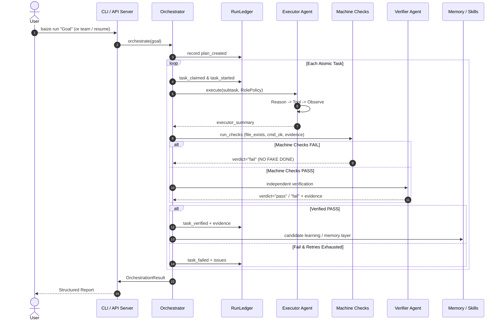

# Baize-Agent Architecture Overview

## 1. System Philosophy (Pi + Hermes + Unix)

Baize-Agent is an autonomous agent engineering runtime built on three pillars:
1. **Zero Runtime Dependencies**: 100% pure Python standard library (no PyYAML, no requests, no external vector DBs).
2. **Deterministic Governance & Verification (NO FAKE DONE)**: Progress is recorded in append-only JSONL ledgers with machine checks; claims without verified evidence are strictly rejected.
3. **Progressive Disclosure & Thin Layers**: Modular subpackages with progressive discovery and swappable components.

---

## 2. Modular Package Structure

```text
baize/                              # 72 modules + __main__.py, flat by design
├── agent.py  agent_rules.py  arch_cache.py  automations.py  autonomy.py  bench.py
│   bench_public.py  blast_radius.py  browser_verify.py  byzantine.py  chaos.py  cli.py
│   component.py  config.py  config_schema.py  context_slicer.py
│   contract.py  dashboard.py  desktop.py  desktop_ui.py  doc_crawler.py
│   docker_sandbox.py  doctor.py  gate.py  graph.py  hierarchical_map.py  hooks.py
│   intelligence_radar.py  intent_router.py  interactive_detector.py  invariants_anchor.py
│   llm.py  logging_setup.py  manifest.py  mcp.py  memory.py  modes.py
│   mutation.py  observability.py  orchestrator.py  plugin.py  powershell.py
│   proc.py  prompt_cache.py  rag.py  ralph.py  recon.py  repl.py
│   repo_map.py  run_ledger.py  safe_exec.py  sandbox.py  serve.py
│   session_viewer.py  sessions.py  setup_wizard.py  skill_harvester.py
│   skill_index.py  skill_runner.py  skills_catalog.py  subagent.py
│   swarm.py  symbol_graph.py  system1.py  team.py  team_memory.py  test_impact.py  tool_market.py
│   tool_sdk.py  tools.py  ui.py  vector.py
│
├── core/
│   └── snapshot.py                 # neuro-symbolic state checkpoint & restore
├── knowledge/
│   ├── causal.py                   # AST causal slicing & mutation case generation (cases are not run)
│   └── replay.py                   # time-travel stepping replayer & forking engine
├── orchestration/
│   ├── adversarial.py              # Red/blue review + quorum arbitration over supplied verdicts
│   └── forking.py                  # speculative time-travel branch exploration
├── tooling/
│   └── synthesizer.py              # Darwinian meta-tool synthesis & gene evolution
├── ext/                            # optional extensions (lazily loaded)
│   ├── channels.py                 # conversation adapter interface for chat channels
│   ├── mcp/                        # client.py component.py server.py transport.py
│   └── providers/                  # reserved - currently empty
├── plugins/
│   └── metrics.py                  # feeds observability counters from lifecycle hooks
└── security/                       # package marker only - no modules
```

> This tree is generated from the filesystem by
> `scripts/check_arch_tree.py`, which runs in the `hygiene` gate. An earlier
> revision of this section described a `core/ orchestration/ tooling/
> knowledge/ security/ server/` layout that did not exist: 39 of the 43 files it
> listed were really flat modules directly under `baize/`. The check exists so
> that cannot happen again.

---

## 3. Data Flow & Execution Lifecycle


