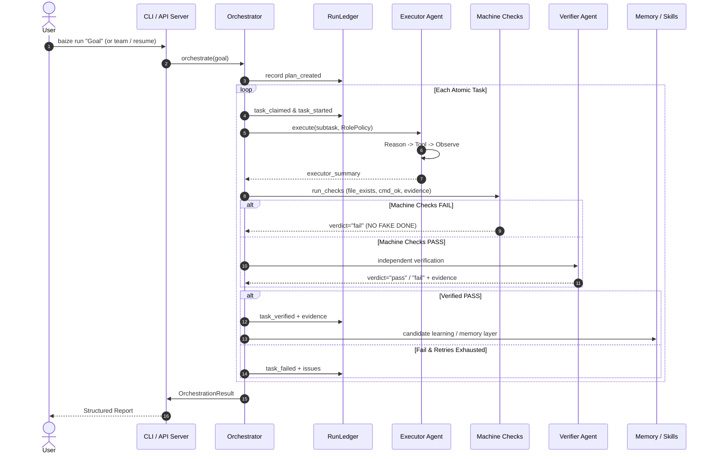

# Baize-Agent Architecture Overview

## 1. System Philosophy (Pi + Hermes + Unix)

Baize-Agent is an autonomous agent engineering runtime built on three pillars:
1. **Zero Runtime Dependencies**: 100% pure Python standard library (no PyYAML, no requests, no external vector DBs).
2. **Deterministic Governance & Verification (NO FAKE DONE)**: Progress is recorded in append-only JSONL ledgers with machine checks; claims without verified evidence are strictly rejected.
3. **Progressive Disclosure & Thin Layers**: Modular subpackages with progressive discovery and swappable components.

---

## 2. Modular Package Structure

```text
baize/
├── core/                   # Kernel & Runtime
│   ├── agent.py            # Autonomous Reason -> Tool -> Observe loop
│   ├── repl.py             # Continuous interactive multi-turn REPL terminal
│   ├── llm.py              # LLM client & multi-vendor adapter
│   ├── config.py           # Configuration loading & path resolution
│   ├── config_schema.py    # Fail-closed config schema validation
│   ├── sessions.py         # Append-only JSONL session persistence
│   ├── autonomy.py         # Permission levels & tool policy
│   ├── modes.py            # Mode bundles (eval, chat, code)
│   ├── component.py        # Micro-kernel component registry
│   ├── observability.py    # Metric counters & error tracking
│   ├── logging_setup.py    # Structured logging with secret redaction
│   └── agent_rules.py      # Rule loading & untrusted prompt boundary
│
├── orchestration/          # Multi-Agent Workflow
│   ├── orchestrator.py     # Director -> Executor -> Verifier closed loop
│   ├── forking.py          # Speculative time-travel multi-branch exploration
│   ├── adversarial.py      # Red-Blue adversarial game & Byzantine judge
│   ├── contract.py         # AtomicTask & ProjectContract schema validation
│   ├── run_ledger.py       # Append-only execution ledger & resume replay
│   ├── team.py             # RolePolicy enforcement & team configuration
│   ├── team_memory.py      # Shared blackboard communication
│   ├── subagent.py         # Scoped sub-agent execution
│   ├── automations.py      # Trigger & cron automation loop (with NL parsing)
│   └── recon.py            # Pre-flight domain & prior-art reconnaissance
│
├── tooling/                # Tools & Skills Ecosystem
│   ├── tools.py            # Tool registry & default tool suite
│   ├── synthesizer.py      # Darwinian Meta-Tool synthesis & evolution
│   ├── skill_harvester.py  # Closed-loop autonomous skill distillation
│   ├── sandbox.py          # Workspace confinement & deny-list patterns
│   ├── tool_sdk.py         # Decorator & SDK for custom tool definitions
│   ├── skill_index.py      # Skill scanning, dedup, and agentskills.io governance
│   ├── skill_runner.py     # Safe sub-process execution of skills
│   └── prompt_cache.py     # Prompt hashing & cache optimization
│
├── knowledge/              # Memory & Retrieval
│   ├── memory.py           # Layered persistence (fact, decision, lesson)
│   ├── rag.py              # TF-IDF semantic RAG context augmentation
│   └── vector.py           # Pure stdlib TF-IDF & reserved embedding interface
│
├── security/               # Governance & Integrity Gates
│   ├── gate.py             # NO FAKE DONE multi-dimensional quality gate
│   ├── hooks.py            # Fail-closed lifecycle hook bus (pre_tool_use)
│   ├── doctor.py           # Local environment & toolchain diagnostics
│   └── manifest.py         # Project manifest schema & status verification
│
├── server/                 # Interfaces & Runtime Services
│   ├── cli.py              # Unified command-line interface
│   ├── serve.py            # Zero-dependency HTTP / REST API server
│   ├── dashboard.py        # Live HTML / Terminal dashboard
│   ├── ui.py               # Interactive CLI streaming UI
│   └── bench.py            # Evaluation & benchmark harnesses
│
└── ext/                    # Optional Extensions (Lazy Loaded)
    ├── channels.py         # External chat channel adapter interface
    ├── providers/          # Non-standard model providers
    ├── mcp/                # Model Context Protocol adapter
    └── plugins/            # Plugin hooks
```

---

## 3. Data Flow & Execution Lifecycle


