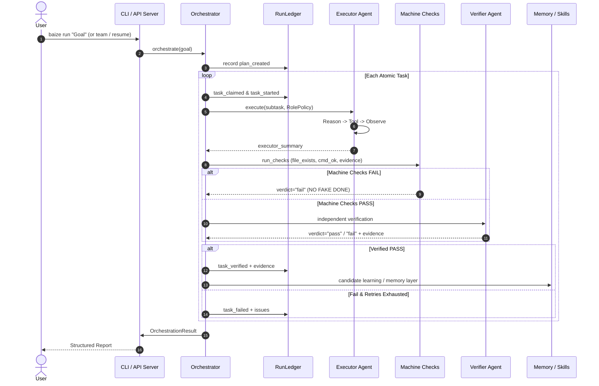

# Baize-Agent Architecture Overview

## 1. System Philosophy (Pi + Hermes + Unix)

Baize-Agent is an autonomous agent engineering runtime built on three pillars:
1. **Zero Runtime Dependencies**: 100% pure Python standard library (no PyYAML, no requests, no external vector DBs).
2. **Deterministic Governance & Verification (NO FAKE DONE)**: Progress is recorded in append-only JSONL ledgers with machine checks; claims without verified evidence are strictly rejected.
3. **Progressive Disclosure & Thin Layers**: Modular subpackages with progressive discovery and swappable components.

---

## 2. Modular Package Structure

```text
baize/                              # 0 flat modules + __main__.py, 8 domain subpackages (53 modules)
├── core/                           # 7 modules: agent loop, LLM client, config, sessions, autonomy
│   ├── agent.py  autonomy.py  component.py  config.py  llm.py  plugin.py  sessions.py
├── orchestration/                  # 7 modules: Director->Executor->Verifier DAG, contracts, hooks, ledger
│   ├── automations.py  contract.py  hooks.py  orchestrator.py  run_ledger.py  system1.py  team.py
├── execution/                      # 6 modules: tools, sandboxes, proc timeouts, PowerShell, Docker, browser
│   ├── browser_verify.py  docker_sandbox.py  powershell.py  proc.py  sandbox.py  tools.py
├── codebase/                       # 6 orthogonal static code intelligence modules
│   ├── arch_cache.py               # incremental mtime/size-keyed SQLite architecture cache
│   ├── impact.py                   # blast-radius analyzer, test-impact matrix & unified change-impact
│   ├── recon.py                    # pre-flight prior-art & skill library reconnaissance
│   ├── repo_map.py                 # flat + L0/L1/L2 hierarchical repo maps & AST context slicer
│   ├── symbol_graph.py             # AST/regex symbol graph, PageRank, canonical SKIP_DIRS/SUPPORTED_EXTS
│   └── workspace_search.py         # zero-dependency workspace grep & glob search
├── knowledge/                      # 6 modules: layered memory, graph, RAG/TF-IDF, skills & runner
│   ├── doc_crawler.py  graph.py  memory.py  rag.py  skill_runner.py  skills.py
├── governance/                     # 5 modules: NO FAKE DONE gate, bench, doctor, mutation, observability
│   ├── bench.py  doctor.py  gate.py  mutation.py  observability.py
├── interfaces/                     # 9 modules: CLI, REPL, HTTP/SSE server, desktop, terminal/web UI
│   ├── cli.py  desktop.py  repl.py  serve.py  ui.py
│   └── server/                     # decomposed HTTP server subpackage
│       ├── routes_get.py           # GET routes (/health, /api/workspace/search, /api/perf/profile, etc.)
│       ├── routes_post.py          # POST dispatch & handlers
│       ├── security.py             # fail-closed auth, CORS allowlist, path guards
│       └── streaming.py            # real-time SSE streaming for /run/stream
└── ext/                            # 7 modules: optional extensions (lazily loaded, fail-closed)
    ├── channels.py                 # conversation adapter interface for chat channels
    ├── mcp/                        # unified Model Context Protocol client/server/dispatcher
    │   ├── client.py  component.py  dispatcher.py  server.py  transport.py
    ├── plugins/
    │   └── metrics.py              # feeds observability counters from lifecycle hooks
    └── providers/                  # reserved - currently empty
```

> This tree is generated from the filesystem by
> `scripts/gates/check_arch_tree.py`, which runs in the `hygiene` gate. An earlier
> revision of this section described a `core/ orchestration/ tooling/
> knowledge/ security/ server/` layout that did not exist: 39 of the 43 files it
> listed were really flat modules directly under `baize/`. The check exists so
> that cannot happen again.

---

## 3. Data Flow & Execution Lifecycle


```mermaid
sequenceDiagram
    autonumber
    actor User
    participant CLI as CLI / API Server
    participant Orch as Orchestrator
    participant Ledger as RunLedger
    participant Exec as Executor Agent
    participant Gate as Machine Checks
    participant Verif as Verifier Agent
    participant Mem as Memory / Skills

    User->>CLI: baize run "Goal" (or team / resume)
    CLI->>Orch: orchestrate(goal)
    Orch->>Ledger: record plan_created
    loop Each Atomic Task
        Orch->>Ledger: task_claimed & task_started
        Orch->>Exec: execute(subtask, RolePolicy)
        Exec->>Exec: Reason -> Tool -> Observe
        Exec-->>Orch: executor_summary
        Orch->>Gate: run_checks (file_exists, cmd_ok, evidence)
        alt Machine Checks FAIL
            Gate-->>Orch: verdict="fail" (NO FAKE DONE)
        else Machine Checks PASS
            Orch->>Verif: independent verification
            Verif-->>Orch: verdict="pass" / "fail" + evidence
        end
        alt Verified PASS
            Orch->>Ledger: task_verified + evidence
            Orch->>Mem: candidate learning / memory layer
        else Fail & Retries Exhausted
            Orch->>Ledger: task_failed + issues
        end
    end
    Orch->>CLI: OrchestrationResult
    CLI-->>User: Structured Report
```
